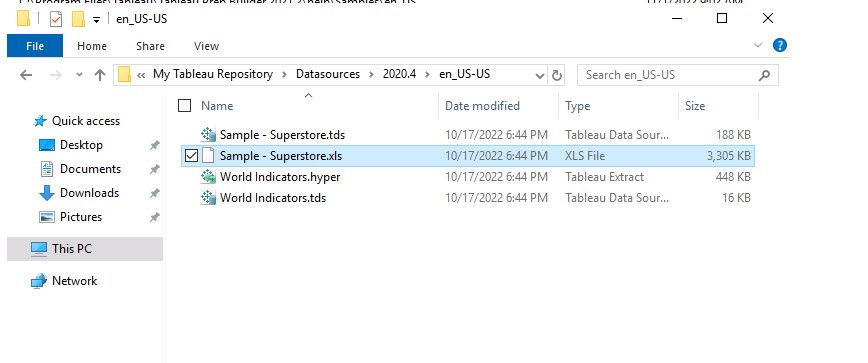

Lab 1: Introduction: Visual Analytics with Tableau 
==================================================

Overview

In this lab, you will learn about **Visual Analytics** and why it is
important to visualize your data. You will connect to data using Tableau
Desktop and familiarize yourself with the Tableau workspace.

Introduction to Tableau Desktop 
===============================

Let\'s dive deeper into the
Tableau Desktop, its interface, and its functionality. So, once you have
downloaded and installed the product, you will be able to use the
products to connect to your data and start building your visualizations.

The landing page of Tableau Desktop is shown in the following
screenshot:

Figure 1.7: A screenshot of the Tableau Desktop landing page

Review the following list for explanations of the highlighted sections
in the screenshot:

1.  **Connect**: The list of data sources you can connect to. You can
    connect to data residing on Tableau Server (the
    `Search for Data` option); to flat files, such as Excel
    and CSVs (the `To a File` option); or to databases (the
    `To a Server` option). Tableau has native in-built
    connectors for a lot of the data sources, which makes the
    interaction with data from these data sources seamless. The list is
    quite extensive, and it keeps on growing. Note though that while
    Tableau Desktop provides an extensive list of data connectors,
    Tableau Public only allows you to connect to flat files (the
    `To a File` option). Refer to the following screenshot to
    see the `More…` option of Tableau Desktop 2020.1 version:

1.  **Saved Data Sources**: While the top section allows you to connect
    to raw data sources, the `Saved Data Sources` option lets
    you connect to data sources that have been previously worked on
    and/or modified and then saved for later use.
2.  **Open**: This section shows the thumbnails of the recently accessed
    Tableau files. This section is blank to begin with, but as you
    create and save new workbooks, it will keep on updating and will
    display the thumbnails of the most recently opened workbooks. This
    section can also be used to pin your favorite workbooks.
3.  **Sample Workbooks**: This section shows some of the sample work
    already done in Tableau. Selecting any of the thumbnails here will
    open the relevant Tableau workbook. A quick point to note here is
    that a \"workbook\" in Tableau is a file that consists of multiple
    worksheets and/or dashboards and/or storyboards.
4.  **Discover**: This section contains some shortcut links to the
    training videos and resources on the Tableau website.
5.  Now that you are familiar with the landing page of Tableau, let\'s
    move on and see how to connect to data in the following exercise.

Exercise 1.01: Connecting to a Data Source 
------------------------------------------

In this exercise, you will connect to a data source for the first time,
which is the very first step when analyzing data in Tableau.

There are many types of data sources that you can connect to, but for
the purposes of this exercise, you will work with an Excel file---in
this case, *Sample-Superstore.xls*, which comes in-built with Tableau
and contains sales and profit data for a company.

Perform the following steps to complete the exercise:

1.  Select the `Microsoft Excel` option from the
    `To a File` option under `Connect` on the
    left-hand side of the landing page. You should see the
    following screen:

Figure 1.9: A screenshot showing the Connect to Microsoft Excel option

1.  Once you have selected this option, it will ask you to browse the
    Excel file that you wish to connect to. To do this, connect to
    `Sample-Superstore.xls`, which can be found in
    *Documents\>My Tableau Repository\>Datasources*, or can also be
    downloaded from the GitHub repository for this lab, at
    <https://github.com/fenago/tableau-advanced>. Refer to the following screenshot:

This data is the sample dataset that comes along with the product. Once
you have downloaded and installed Tableau Desktop, you will notice the
`My Tableau Repository` folder being created under your
`Documents` folder. This is where you will find this sample
dataset.

1.  Once you have connected to this data source, you will see the *data
    connection page* of Tableau Desktop, as shown in the following
    screenshot. Review the following notes to better understand what
    you\'re looking at:

-   **Section 1**: This highlights the *data source* that you have
    connected to. This is the `Sample - Superstore.xls` file
    that you just established a connection with. One point to note here
    is that just because you have established a connection to this Excel
    file does not mean that you have connected to the data.
-   **Section 2**: These are the tables/worksheets in your
    `Sample - Superstore.xls` file, which is where the actual
    data resides. The `Orders` table contains the list of all
    transactions from this retail superstore and contains data at an
    order level. This order level contains details of the day, product,
    and customer levels. Refer to the following figure to take a glance
    at the `Orders` table:

-   The `People` table contains just two columns:
    `Region` and `Person`. The `Person`
    column is the list of managers for each `Region`. Refer to
    the following screenshot to take a glance at the `People`
    table:

The `Returns` table contains the list of all the
transactions/orders that were returned. So, again, only two columns:
`Returned` and `Order ID`. Refer to the following
screenshot to take a glance at the `Returns` table:

-   **Section 3**: This is the list of *Named Ranges* that were created
    on the aforementioned tables/ worksheets (that is,
    `Orders`, `People`, and `Returns`) of
    the `Sample - Superstore.xls` data source. *Named Ranges*
    are a feature in *Microsoft Excel*, and Tableau gives you the option
    of reading data from these predefined *Named Ranges*. To understand
    more about these *Named Ranges in Excel*, please refer to the
    following link:
    <https://support.microsoft.com/en-us/office/define-and-use-names-in-formulas-4d0f13ac-53b7-422e-afd2-abd7ff379c64?ui=en-us&rs=en-us&ad=us>.

1.  So, at this point, you have made a connection to the
    `Sample - Superstore.xls` file; however, you are yet to
    establish a connection to the data to be able to read it in Tableau
    for your analysis. To do so, drag the `Orders` worksheet
    from the left-hand side list and drop it into the top blank section,
    which reads `Drag sheets here`. (If you are working with a
    version later than 2020.1, this may instead read
    `Drag tables here`.) Please note that you need to use the
    `Orders` worksheet and not the `Orders` named
    range since the data in the named range could be limited compared to
    the data in the `Orders` worksheet. Refer to the following
    screenshot:

1.  Once you drag and drop the `Orders` worksheet into the
    `Drag sheets here` section, you will see the view update
    for you, as shown in the following screenshot:

The preceding figure shows the view after fetching the
`Orders` worksheet into the `Drag sheets here`
section. Review the highlighted sections in the screenshot and the
corresponding notes below to understand more.

-   **Section 1**: This is the *preview section* where you get to see a
    quick preview (about 1,000 rows) of your `Orders` data.
    This is where you can quickly take stock of your data and make sure
    you have all the necessary columns to work with.
-   **Section 2**: This is the `Connection` option. It has two
    options to choose from, `Live` and `Extract`. A
    `Live` connection is the option that you use when you want
    to connect to data in real time. This means that basically any
    changes at the data end will be reflected in Tableau. However, a
    quick point to note here is that the `Live` connection
    option relies on the data sources to process all the queries, and
    this could lead to performance issues in Tableau if the backend data
    source is a slow-performing data source. The `Extract`
    connection, on the other hand, is a snapshot of your data stored in
    a Tableau propriety format called `Tableau Data Extract`,
    which uses the file extension `.hyper`. Since the
    `.hyper` file only has a snapshot of the data, it will
    have to be refreshed if you need to see and use the updated data.
-   **Section 3**: This is the `Filters` option, which is used
    to limit the amount of data that is read and used in Tableau. This
    works for both the `Live` and `Extract` options
    mentioned earlier.

Now that you understand the *data connection page* of Tableau, you can
finally start using Tableau to analyze and visualize your data.

1.  Connect `Live` to your `Orders` data from
    `Sample - Superstore.xls`. Refer to the following
    screenshot:

1.  Now, the final step for fetching the data for your analysis is to
    click on `Sheet1`, and from there, select
    `Go to Worksheet`. With this, you will have read the data
    into Tableau Desktop and will now be able to start using it. Refer
    to the following screenshot:

The preceding screenshot shows the *Tableau workspace*. This is the
space in which you will create your visualizations going forward. Let\'s
quickly go through the highlighted sections in the screenshot to
understand the workspace in more detail.

-   **Section 1**: This is the *workbook name*. As mentioned previously,
    a *workbook* in Tableau is a file that consists of multiple
    worksheets and/or dashboards and/or storyboards. By default, it is
    named `Book1` (as shown in the image). However, you can
    assign any new name you like when you save the workbook.
-   **Section 2**: This is the *toolbar section*, and this consists of
    various options that help you explore the various features and
    functionalities available in Tableau.
-   **Section 3**: This is the *side bar* area, which contains the
    `Data` pane and the `Analytics` pane. The
    `Data` pane shows the details of the fields coming from
    the data, which are classified as either `Dimensions` or
    `Measures`. The `Analytics` pane, on the other
    hand, shows the various analyses, such as constant line, average
    line, median with quartiles, totals, trend line, forecast line, and
    clusters, that can be performed on the view that you create. To
    begin with, the `Analytics` pane is disabled or grayed out
    and will only start appearing when you create a view or visual.
-   **Section 4**: This is the `Dimensions` and
    `Measures` section, which technically is part of the
    `Data` pane (and, if you are working with a version of
    Tableau later than 2020.1, it may not appear in the view).
    `Dimensions` are all the fields from the data that are
    categorical, descriptive, or qualitative in nature, such as
    `Customer Name`, `Product Name`,
    `Order ID`, and `Region`. These, when fetched in
    the view, will result in each data member of that field being
    displayed in the view. `Measures`, on the other hand, are
    fields from the data that are quantitative in nature and can be
    aggregated as either sum, average, minimum, maximum, standard
    deviation, variance, and so on. These, when fetched in the view,
    will result in aggregated values being displayed. Examples of
    `Measures` are fields such as `Sales`,
    `Profit`, and `Quantity`, which will be
    aggregated for the purpose of your analysis. Refer to the following
    screenshot for more clarity:

-   **Section 5**: This is the `Sheet` tab. Here you get the
    option to create either a new worksheet, dashboard, or storyboard.
-   **Section 6**: These are the various *cards and shelves* available
    for use in Tableau. Here you can see various shelves such as the
    `Columns` shelf, `Rows` shelf, `Pages`
    shelf, and `Filters` shelf, along with the
    `Marks` card, which contains shelves such as the
    `Color` shelf, `Size` shelf, `Text`
    shelf, `Detail` shelf, and the `Tooltip` shelf.
    These shelves are used to change the appearance and details of your
    view.
-   **Section 7**: This is the `View` section. This is where
    you will create your visualizations. It can be referred to as the
    canvas for creating your views and visualizations.

Now that you are familiar with the workspace of Tableau, you can create
your first visualization. To create your views or visualizations, you
can either try the **manual drag and drop** approach or the **automated
approach** of using the `Show Me` button. Let\'s explore both
of these options.

You will begin with the *manual drag and drop* approach and then explore
the *automated approach* using the `Show Me` button in the
following exercise.

Exercise 1.02: Creating a Comparison Chart Using Manual Drag and Drop 
---------------------------------------------------------------------

The aim of this exercise is to create a chart to determine which ship
mode is better in terms of `Sales` by `Region` using
the manual drag and drop method. In this case, you will create one
stacked bar chart using the `Ship Mode`, `Region`,
and `Sales` fields from the `Orders` data from
`Sample - Superstore.xlsx` and another by manually dragging
the fields from the `Data` pane and dropping them into the
necessary shelves.

Perform the following steps to complete this exercise:

1.  Drag the `Sales` field from the `Measures`
    section in the `Data` pane and drop it onto the
    `Columns` shelf. This will create a horizontal bar.
2.  Drag the `Region` field from the `Dimensions`
    section from the `Data` pane and drop it onto the
    `Rows` shelf. This will create a horizontal bar chart with
    labels for regions and bars showing the sum of `Sales`.

Figure 1.20: A screenshot showing the stacked bar chart created using
the manual drag and drop method

1.  Finally, to include the ship mode, drag the `Ship Mode`
    field from the `Dimensions` section in the
    `Data` pane and drop it onto the `Color` shelf
    available under the `Marks` card. This will update your
    view to show a stacked bar chart with ship modes as colors, as in
    the following screenshot:

In this exercise, you created a stacked bar chart to show which ship
mode is better in terms of `Sales` across `Regions`
using the *manual drag and drop* method. As you can see in the preceding
screenshot, the `Standard Class` ship mode seems to be
performing best by comparison to other modes.

In the following exercise, you will create another sales comparison
chart---but this time with the `Show Me` button.

Exercise 1.03: Creating a Comparison Chart Using the Automated Show Me Button Method 
------------------------------------------------------------------------------------

The aim of this exercise is to create a chart to determine which
`Ship Mode` is better in terms of `Sales` by
`Region` using the automated method via the
`Show Me` button. Just like the previous exercise, you will
create one stacked bar chart using the `Ship Mode`,
`Region`, and `Sales` field from the
`Orders` data of `Sample-Superstore.xlsx` and
another using the `Show Me` button. You will then compare the
resulting charts to determine which mode helps generate the highest
sales.

In a new worksheet, perform the following steps to complete the
exercise:

1.  Press and hold the **CTRL** key on your keyboard and select the
    `Region` and `Ship Mode` fields from the
    `Dimensions` section and the `Sales` field from
    the `Measures` pane.

    Note

    You will need to keep the **CRTL** key pressed while doing *multiple
    selections*. Furthermore, if you are on an Apple device, use the
    **Command** key instead. Refer to the following link to find the
    list of equivalent macOS commands and keyboard shortcuts for both
    Windows and macOS:
    <https://help.tableau.com/current/pro/desktop/en-us/shortcut.htm>.

2.  Once you have selected the necessary fields, click on the
    `Show Me` button, which can be seen in the *extreme
    top-right corner* of your Tableau workbook. Refer to the following
    screenshot:

Figure 1.22: A screenshot showing the Show Me button

Once you have clicked on the `Show Me` button, you will see
the list of visualizations that are possible with your current selection
of fields, that is, *two dimensions* (`Region` and
`Ship Mode`) and *one measure* (`Sales`). Further,
you will also see that the horizontal bar chart is highlighted. The
highlighted chart (this is highlighted by Tableau in version 2020.1 with
an orangish-brown rectangular border in the following screenshot) is the
result of the in-built recommendation engine that is based on the best
practices of data visualization.

Figure 1.23: A screenshot showing the possible charts and the Show Me
button

You now have two options: you can either go ahead with the chart
recommended by Tableau, which will create a horizontal bar chart (which
is not the aim here), or select some other chart that is available and
enabled in the `Show Me` button (ideally a stacked bar chart
like the one that you created in the previous exercise). So, select the
chart right next to the recommended one (the one that is highlighted
using a black dotted circular border in the preceding screenshot). This
is the stacked bar chart option, which is exactly what you wanted.

However, when you go ahead with this option, you see two things that are
different from the output that you created in the previous exercise.
Firstly, it is a vertically stacked bar chart and not a horizontal one,
and, secondly, you have `Region` in the `Color`
shelf instead of `Ship Mode`. Refer to the
following screenshot:

Figure 1.24: A screenshot showing the output of the stacked bar chart
option from the Show Me button

Now, neither of these things are technically wrong, but they are not
what you wanted in this case, and so you will need to change them.

1.  Firstly, change the orientation of your stacked bar chart from
    vertical to horizontal by clicking on the swap button in the
    toolbar, as shown in the following screenshot:

Figure 1.25: A screenshot showing the Swap Rows and Columns button

1.  Next, interchange/swap your `Region` and
    `Ship Mode` fields so that you have `Ship Mode`
    in the `Color` shelf instead of `Region`.

To do this, press **CTRL** and select `Region` from the
`Color` shelf as well as `Ship Mode` from the
`Rows` shelf. Make sure the pills for these selected fields
are now darker in color as the dark color indicates that the selection
of these fields is retained.

1.  Now, click on the dropdown of either the `Region` field or
    the `Ship Mode` field and choose the `Swap`
    option, as shown in the following screenshot:

Figure 1.26: A screenshot showing the Swap option of the CTRL
multiselect and drop-down method

This produces the following output:

Figure 1.27: A screenshot showing the stacked bar chart created using
the Swap options

In this exercise, you created a stacked bar chart to show which
`Ship Mode` is better in terms of `Sales` by
`Regions` using the *manual drag and drop* method. As you can
see in the preceding screenshot, the `Standard Class` ship
mode seems to generate more sales compared to the other ship modes.

Data Visualization Using Tableau Desktop 
========================================

In an earlier section, you familiarized yourself with the workspace of
Tableau and learned how to create a visualization using the *manual drag
and drop method* as well as the *automated* `Show Me`
*button.* During the course of this course and across various labs,
you will get into more details of this workspace and learn about some
more of the options available in the toolbar as well as the other
shelves.

Now that you have some fundamental knowledge of how to create a
visualization using the aforementioned methods, you will now explore
some concepts of data visualization and how to use these in Tableau
Desktop.

Ideally, when you present your analysis and insights, you want your end
user to be able to quickly consume the information that you have
presented and make better decisions more quickly. One way to achieve
this objective is to present the information in the right format. Each
chart, graph, or visualization has a specific purpose, and it is
particularly important to choose the appropriate chart for answering a
specific goal or a business question.

Now, to be able to choose the appropriate chart, you first need to look
at the data and answer the question \"What is it that you need to do
with your data?\".

To help you make your decision, consider the following:

-   Do you wish to **compare** values?
-   Do you wish to look at the **composition** of your data?
-   Do you wish to understand the **distribution** of your data?
-   Do you wish to find and understand the **relationships** between the
    various variables of your dataset?

Once you have addressed these points and determined what you wish to do
with your data, you will also need to decide on the following:

-   How many variables do you need to look at at any given point in
    time?
-   Do you wish to trend the data?

With the help of this list, you will be able to figure out which chart
is the most appropriate one to answer your business questions. To
elaborate on this point, begin by first categorizing your charts into
four sections---namely, charts that help you either compare, determine
the composition, show the distribution of your data, or else the ones
that help you find relationships in your data.

Comparison, composition, distribution, and relationships are often
referred to as the four pillars of data visualization and are described
in greater detail here:

1.  **Comparison**: When analyzing your data, a common (if not the most
    common) use case would be to compare your data. Comparison is often
    done between two or more values. Some examples of comparison would
    be sales revenue in different regions, how the performance of a
    particular sales representative compared to their colleagues, the
    profitability of different products, and so on.

Typically, you will see comparison being done across *categorical data*,
that is, *data members of a dimension* (for example, comparison across
regions wherein `Region` is a dimension, and `East`,
`West`, `North`, and `South` are the data
members of that dimension), but it can also be done across *quantitative
data*, that is, *across measures* (for example, sales versus profit or
actual sales versus budget sales).

Another type of comparison that is very common is a comparison over a
period of time (for example, evaluating your monthly sales performance
or which months are better for your business and whether there are any
seasonal trends that you need to look out for).

So, based on the preceding information, you will further break down
*comparison* as *comparison across dimensional items or categorical data
(for example, region-wise sales)*, *comparison over time*, and
*comparison across measures* or quantifiable data (for example, sales
versus quota).

The following list outlines the typical charts that should be used for
each type of *comparison*:

**Comparison across dimensional items:**

-   Bar chart
-   Packed bubble chart
-   Word cloud

**Comparison over time:**

-   Bar chart
-   Line chart

**Comparison across measures:**

-   Bullet chart
-   Bar chart

1.  **Composition**: Another common use case when analyzing your data is
    to find out what ratio or proportion each data member contributes to
    the whole. So basically, out of the total value, what is the
    contribution of each data member? This is typically referred to as a
    part to whole composition and it helps us understand how each
    individual part makes up the whole of something. For example, out of
    the total sales, which category is contributing the most? Or what is
    the breakdown of your total sales by region? And so on.

Typically, you end up showing a static snapshot of the composition of
your data (for example, your market share along with the market share of
your competitors at a given point in time), or you may also want to
trend this information over a period of time (for example, how is your
and your competitor\'s market share changing over a period of time).
Both these perspectives are important and can provide some very valuable
insights regarding your performance.

So, based on this information, you will further break down *composition*
as *composition (snapshot/static)* and *composition over time*.

The following list outlines the typical charts that should be used for
each type of *composition*:

**Composition (snapshot/static):**

-   Pie chart
-   Stacked bar chart
-   Treemap

**Composition over time:**

-   Stacked bar chart
-   Area chart

1.  **Distribution**: Finding the *distribution* of your data is
    important when you want to find *patterns, trends, clusters, and
    outliers or anomalies* in your data---for example, if you want to
    understand how employees are performing during the annual appraisal
    cycle (that is, which employees or how many employees are below par,
    which or how many employees meet expectations, and which or how many
    employees exceed expectations). Another example of distribution
    would be evaluating students\' performance in an exam or determining
    the defect frequency in your manufacturing process.

So, based on this information, you will further break down distribution
as *distribution for a single measure*, and *distribution across two
measures*.

The following list outlines the typical charts that should be used for
each type of *distribution*:

**Distribution for a single measure:**

-   Box and whisker plot
-   Histogram

**Distribution across two measures:**

-   Scatter plot

1.  **Relationships**: Finding and understanding relationships,
    dependency, correlations, or cause and effect relationships between
    different variables of your data is another method of data analysis.
    When analyzing your data, it is important to ascertain whether there
    is any dependency between variables of your data (does one variable
    have any effect on another variable and if so, whether it is a
    positive or negative effect, such as the impact of marketing
    expenditure on sales profit or the increase or decrease in warm
    clothing sales depending on temperature). So, based on this
    information, you will further break down *relationship* as the
    *relationship between two measures* and the *relationship between
    multiple measures*.

The following list outlines the typical charts that should be used for
each type of *relationship*:

-   Relationships between two measures: scatter plot
-   Relationships between multiple measures: scatter plot with size and
    color

Now that you understand these concepts of **Comparison**,
**Composition**, **Distribution**, and **Relationships**, and which
charts to choose for each of these scenarios, you will also try to see
how to create these in Tableau. All these abovementioned scenarios and
charts are explained in more detail in the upcoming labs.

Apart from the aforementioned use cases or scenarios, you may also want
to explore the *geographic* aspect of your data (that is, if you have
any geographical information in your data). This could mean having data
at a country level, state level, city level, or even postal code level.
Creating geographic maps to show this geographic data is another way of
exploring and visualizing your data since visualizing geographic data on
a map can help us highlight certain events or occurrences across
geographies and possibly unearth some hidden spatial patterns and or
perform proximity analysis.

Note

For more information on choosing the right chart, see the following
article:
<https://www.tableau.com/learn/whitepapers/which-chart-or-graph-is-right-for-you>.

Saving and Sharing Your Work 
============================

Another important point to discuss when working with Tableau is how to
save your files and share them with others. As you know, Tableau is an
interactive tool that allows users to filter, drill down, and slice and
dice data using the features that are provided within the tool. Now,
when it comes to saving and sharing your work with others, some people
may want their end users to have the flexibility to play with the report
and use the interactivity that is provided, while others may simply want
end users to have a static snapshot of information that doesn\'t provide
any sort of interactivity. Further, some may want to share the entire
dashboard with their end users, while others may only want to share a
single visualization.

All these scenarios can be handled in Tableau. The following list will
go through these options in detail, breaking them into two parts: static
snapshots and interactivity versions:

*Static snapshots*: The following is the list of options to choose from
when you want to save and share a static snapshot of your work:

1.  **Saving as an Image**: When saving your work as an image, you can
    either save just a single worksheet or an entire dashboard as either
    a PNG, JPEG, BMP, or EMF image. To do so, use either the
    `Worksheet > Copy > Image` option from the toolbar or the
    `Worksheet > Export > Image` option from the toolbar.
    Refer to the following screenshots:

Figure 1.28: A screenshot showing the Worksheet \> Copy \> Image option
from the toolbar menu

Figure 1.29: A screenshot showing the Worksheet \> Export \> Image
option from the toolbar menu

The `Copy > Image` option allows you to copy the individual
view as an image and then paste it into another application if desired,
whereas the `Export > Image` option lets you directly export
the view as an image rather than doing a copy and paste operation.

The preceding screenshots show the options of either *copying* or
*exporting* just a single worksheet (that is, a single visualization).
However, if you wish to save the entire dashboard as an image, then you
will use the `Dashboard > Copy Image` or
`Dashboard > Export Image` option in the toolbar. Refer to the
following screenshot:

Figure 1.30: A screenshot showing the option of saving the entire
dashboard as an image

1.  **Saving as Data**: When saving the data that you have used to
    generate a view, you can either save the data as a `.csv`
    file by copying and pasting the data into a `.csv` file or
    export the data as a Microsoft Access file, using either the
    `Worksheet > Copy > Data` option or the
    `Worksheet > Export > Data` option from the toolbar menu.
    Refer to the following screenshots:

Figure 1.31: A screenshot showing the Worksheet \> Copy \> Data option

Figure 1.32: A screenshot showing the Worksheet \> Export \> Data option

1.  **Saving as Crosstab**: Another way of saving the data that is used
    for building your view is to have it as crosstab Excel output.
    Earlier, in **Saving as Data**, the options were to save it as
    `.csv` or as `.mdb` files, which is the
    Microsoft Access format. However, when you want to have the data
    stored as an Excel output, you will either have to use the
    `Worksheet > Copy > Crosstab` option or the
    `Worksheet > Export > Crosstab to Excel` option from the
    toolbar menu. Refer to the following screenshots:

Figure 1.33: A screenshot showing the Worksheet \> Copy \> Crosstab
option

Figure 1.34: A screenshot showing the Worksheet \> Export \> Crosstab to
Excel option

1.  **Export as PowerPoint**: This option allows you to export your work
    into a PowerPoint presentation where the selected sheets are
    converted into a static `PNG` format and exported to
    separate individual slides. To export as PowerPoint, choose the
    `File > Export As PowerPoint` option from the toolbar
    menu. Refer to the following screenshot:

Figure 1.35: A screenshot showing the File \> Export as PowerPoint
option

1.  **Print as PDF**: This option allows you to export your work into a
    PDF file. You can have a single or multiple selected worksheets, or
    the entire Tableau workbook saved as a PDF output. To export the
    view as a PDF document, choose the `File > Print to PDF`
    option from the toolbar menu. Refer to the following screenshot:

Figure 1.36: A screenshot showing the File \> Print to PDF option

Exercise 1.04: Saving Your Work as a Static Snapshot-PowerPoint Export 
----------------------------------------------------------------------

In the previous section, you explored different options for choosing a
static output of your work. In this exercise, you will export or save
your work as a PowerPoint export. For this, you will continue using the
stacked bar chart of `Ship Mode`, `Region`, and
`Sales` that was created in the previous exercise. This
exercise will help you see how you can save your analyses as interactive
versions and publish these works to different platforms---something
you\'ll need to do fairly often as a Tableau developer.

You will continue working with the Sample Superstore dataset for this
exercise.

The steps to accomplish this are as follows:

1.  Make sure that you have the stacked bar chart that you created
    earlier handy. If not, then please start by first re-creating the
    stacked bar chart by following the steps mentioned in the earlier
    exercise, *Exercise 1.03*, *Creating a Comparison Chart Using the
    Automated Show Me Button Method*.
2.  Once you have the stacked bar chart ready, click on the
    `File` option in the toolbar and select the
    `Export As PowerPoint` option. Refer to the
    following screenshot:

Figure 1.37: A screenshot showing the File \> Export as PowerPoint
option

1.  Go with the default options in the pop-up window and then click on
    the `Export` button and save the file to your desired
    location. Finally, name the file
    `My PowerPoint Export.pptx`. Refer to the following
    screenshot:

Figure 1.38: A screenshot showing the PowerPoint export

This will save your output as a `.pptx` file, which can later
be opened in the Microsoft PowerPoint app.

*Interactive versions*: The following is the list of options to choose
from when you want to save and share interactive versions of your work:

1.  **Save the file as** `.twb` **or** `.twbx`: In
    order to save your views as interactive views, you will need to save
    your Tableau files in the following formats.

`.TWB`: This is the file extension used to save a file as a
*Tableau workbook*, which is a proprietary file format. `.twb`
is the default file extension when you try to save any of your Tableau
workbooks. These `.twb` files are kind of work-in-progress
files that constantly require access to data and, since these require
constant connectivity to data, it will not be possible to open the file
unless you have Tableau Desktop and access to data that is used for
creating this `.twb` file. So, if you wish to share this
`.twb` file with anyone, you need to make sure they have
access to the data; and if not, then the data source file will have to
be made available to them. To save the file as `.twb`, choose
the `File > Save As` option from the toolbar menu.

This will open a new window that allows you to save the file. Make sure
to choose the `Tableau Workbook (.twb)` option. Refer to the
following screenshot:

Figure 1.39: A screenshot showing the File \> Save As \> Tableau
Workbook (.twb) option

`TWBX`: This is the file extension used to save the file as a
*Tableau packaged workbook*, which contains the views as well as the
copy of the data used for creating those views. Since the copy of the
data is bundled along with the views that have been created, it allows
the end user to access and interact with the file even when they don\'t
have direct access to the raw data that is being used for analysis.

Further, since the copy of data is bundled along with the views, the
data that is seen in the file is not the actual live data but a static
snapshot of that data at a given point in time, which can be refreshed
as and when required.

To save the file as `.twbx`, choose the
`File > Save As` option from the toolbar menu. This will open
a new window that allows you to save the file. Make sure to choose the
`Tableau Packaged Workbook (.twbx)` option. Refer to the
following screenshot:

Figure 1.40: A screenshot showing the File \> Save As \> Tableau
Packaged Workbook (.twbx) option

To save the file as `Tableau Packaged Workbook (.twbx)`, you
can even choose the `File > Export As Packaged Workbook`
option from the toolbar menu. Refer to the following screenshot:

1.  **Publish to Server**: This option allows you to publish your work
    on either Tableau Server or Tableau Online. You need to have
    permission to publish to Tableau Server, and when a file is
    published on Tableau Server, the end user will need to have
    permission to either view it or interact with it, or even modify it.
    So, in short, Tableau Server and Tableau Online are permission-based
    applications. To see how to publish to a Tableau server, choose the
    `Server > Publish Workbook` option from the toolbar menu.
    Refer to the following screenshot:

1.  **Publish to Tableau Public**: This option allows you to publish
    your work to the Tableau Public server, which can be viewed and
    accessed by anybody. You do not need any special permissions to
    publish to the Tableau Public server. To see how to publish to the
    Tableau Public server, choose the
    `Server > Tableau Public` option from the toolbar menu.
    Refer to the following screenshot:

In the following exercise, you will learn how to save your work in a
packaged Tableau workbook.

Exercise 1.05: Saving Your Work as a Tableau Interactive File--Tableau Packaged Workbook 
----------------------------------------------------------------------------------------

In the previous section, you saw different options when it comes to
choosing an interactive version of your work. The aim of this exercise
is to export or save your work as a Tableau Packaged Workbook
(`.twbx`). For this, you will continue using the stacked bar
chart of `Ship Mode`, `Region`, and
`Sales` that was created in the previous exercise.

Complete the following steps:

1.  Make sure that you have the stacked bar chart that you created
    earlier handy. If you don\'t have it handy, then first recreate the
    stacked bar chart by following the steps mentioned in *Exercise
    1.03*, *Creating a Comparison Chart Using the Automated Show Me
    Button Method*.
2.  Once you have the stacked bar chart ready, click on the
    `File` option in the toolbar and select the
    `Export Packaged Workbook` option. Refer to the
    following screenshot:

1.  Save the file to your desired location and name it
    `My Tableau Packaged Workbook.twbx`. Refer to the
    following screenshot:

Figure 1.45: A screenshot showing the PowerPoint export

This will save your output as a `.twbx` file, which can later
be opened in Tableau Reader or Tableau Desktop itself.

In the next section, you will practice your new skills by completing an
activity using everything that you have learned in this lab.

Activity 1.01: Identifying and Creating the Appropriate Chart to Find Outliers in Your Data 
-------------------------------------------------------------------------------------------

In this activity, you will identify and create the appropriate chart to
find outliers in your data. The dataset being used has two
measures---namely, `Profit` and `Marketing`.
`Marketing` refers to the money being spent on marketing
efforts, while `Profit` is the profit that you are making. You
need to compare `Marketing` and `Profit` across
different products and across different markets (so, two dimensions and
two measures).

The outliers to be identified are as follows:

1.  High marketing and low profit
2.  Low marketing and high profit

You will use the `CoffeeChain Query` table from the
`Sample-Coffee Chain.mdb` dataset. The data can be downloaded
from the GitHub repository of this course, at <https://github.com/fenago/tableau-advanced>.

As the name suggests, the dataset contains information pertaining to a
fictional chain of coffee shops.

Perform the following steps to complete this activity:

1.  Select the *Sample-Coffee Chain.mdb* data using the *Microsoft
    Access* option in the data connection window of Tableau.

2.  Use the *CoffeeChain Query table* from the *Sample-Coffee Chain.mdb*
    data.

3.  Identify which chart would be the most appropriate to find your
    *outliers* in your data when looking at *two measures,* (that is,
    `Profit` and `Marketing`) across *two
    dimensions* (that is, `Product` and `Market`).
    The outliers that you are looking for are *high marketing and low
    profit* and *low marketing and high profit*. (Hint: Refer to the
    section that discussed the four pillars of data visualization and
    choose the chart that will help you find outliers.)

4.  After identifying which chart would be the most appropriate, create
    that chart using the *automated* `Show Me` *button
    method*.

5.  *Export* the view that you have created as a *PowerPoint* image.

6.  Finally, *save* the workbook as a *Tableau Packaged Workbook
    (*`.twbx`*)* on your desktop and give the file the
    following name: `My first Tableau view`.

Summary 
=======

In this lab, you learned the definition and importance of visual
analytics and data visualization. You were presented with several points
for evaluation when choosing a data visualization tool and explored
Tableau\'s product suite. Having identified Tableau Desktop as the best
choice of platform for analyzing and visualizing your data, you looked
at how to utilize it to connect to data and familiarized yourself with
the Tableau Desktop workspace. You also considered various scenarios for
data visualization and identified which charts to use for the given task
and learned how to save and share your work with others.

