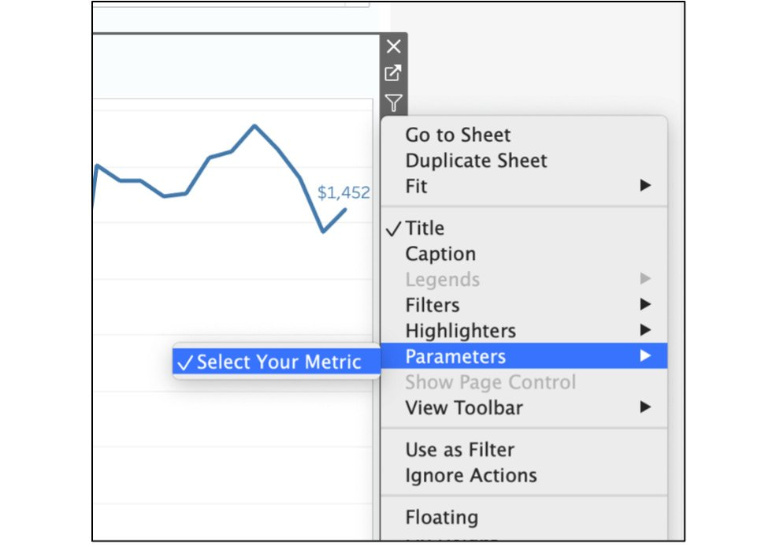
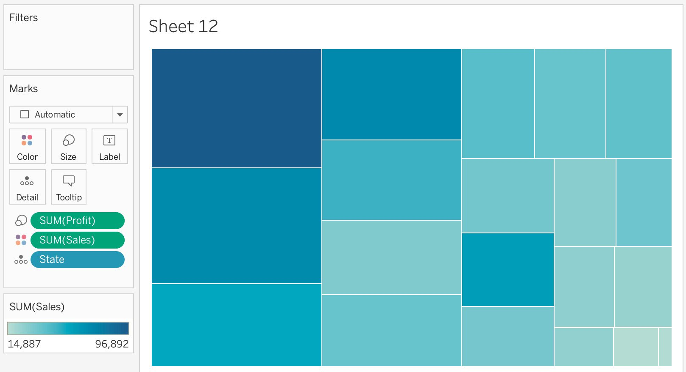

Lab 10: Dashboards and Storyboards 
=================================

Overview

This lab will teach you the processes for building Tableau
dashboards and storyboards. You will learn about tools such as tiled
versus floating objects, branding elements, and filter actions, as well
as adding web pages to the dashboards. By the end of this lab, you
will be able to use these objects/elements to create highly interactive
dashboards, communicate results, and create stories, providing important
insights to end users. These are essential tools for every Tableau
analyst and designer.

Exercise 10.01: Text Formatting -- Workbook versus Worksheet 
------------------------------------------------------------

In this exercise, you will review different text formatting options that
Tableau offers by using the Sample -- Coffee Chain dataset and exploring
the formatting pane.

Here is the data download link: <https://github.com/fenago/tableau-advanced>.

1.  Open Tableau and load Sample -- Coffee Chain data into your Tableau
    instance.
2.  Format at both a workbook level as well as at the level of
    individual elements. Navigate to `Format | Workbook` in
    the menu bar. Here is what you should get:

Figure 10.7: Format workbook options

This allows you to set global options for the workbook that also apply
to your dashboard styling, making it a nice way to establish a
consistent visual look.

1.  Note that it is possible to override these options on any individual
    sheet or text object by selecting the `Format` menu
    command. Format an individual worksheet, which is a two-step process
    -- first, right-click in your blank work area and select the
    `Format` option. This will open a tab to the left of the
    workspace, which is the second step for editing `Font`,
    `Alignment`, `Shading`, `Borders`, and
    `Lines` at the `Sheet`, `Row`, and
    `Column` levels.

Figure 10.8: Object formatting options

These are the text formatting options at Workbook (complete
report/dashboard) as well as Worksheet (individual sheet) level in
Tableau. While this exercise was very limited in scope, it should have
allowed you to gain some basic familiarity with text formatting before
progressing to more complex elements in later sections, including
Tableau interactions and objects you will use for your dashboard
interaction.

Most dashboards require some level of interaction on the user end.
Filters are a common means provided for user interaction, but you can
also design using actions, tooltips, and highlighting to make a
dashboard come alive. Tableau provides dashboard designers with multiple
tools such as tooltips, actions, parameters, and more; the challenge
lies in making them fit seamlessly so that they enhance the user
experience. Here is a brief summary of these tools:

-   Filters allow users to easily reduce or customize data displayed
    within a dashboard.
-   Parameters often work like filters but can be customized by the
    dashboard designer to limit or direct user interaction.
-   Actions are set up at the dashboard level to apply rules based on
    when and where a user clicks on an element in the dashboard.
-   Legends can be used to provide context and allow users to highlight
    specific data elements.
-   Highlighters may be used to show linked data elements across
    multiple charts or tables.

You want to keep these tools as unobtrusive as possible, leaving the
primary canvas space available for the important content. Therefore, you
will usually place them on the right side of a dashboard page, or even
hide them on a sliding panel so you can maximize display space. You have
covered these previous labs, and this lab, you will use the same
interactive elements in dashboards.

Dashboard Objects 
-----------------

Objects are Tableau elements used to build a dashboard and are typically
found at the lower left of the dashboard window. You may consider them
to be modular pieces that can be combined in endless ways to create a
dashboard. Some will be used as containers for previously created
Tableau worksheets, while others contain external or newly created
content. Most can be used together to build a custom experience for the
user. With objects, you can completely customize each dashboard you
build.

Now let\'s consider each object type in detail.

### Vertical Objects 

`Vertical` objects are frequently used containers designed to
display one or more Tableau worksheets within a dashboard. They may be
used as a standalone container within a tiled framework, or they may
reside inside an existing vertical or horizontal container. In other
words, they can be nested multiple times within a single dashboard,
although there are practical limits to this approach, as we\'ll see
soon. Vertical objects can also be used as floating containers, where
the onscreen positioning is specified by the designer.

Use vertical objects to assist in laying out your dashboard from top to
bottom; you can then easily add charts, maps, and other worksheet types
inside each vertical container.

Figure 10.9: Selecting the vertical object

Vertical objects are likely to be the most used object type on many
dashboards given their versatility, and their ability to nest multiple
containers within a single master object. Our example dashboard uses
vertical objects to contain most of our chart content. In most cases,
our vertical containers will have a fixed set of coordinates (x, y,
width, and height) based on their position within the dashboard, but you
can use them as floating containers with a set of coordinates that allow
the container to float outside of the dashboard structure. To set the
floating option, right-click inside a vertical object and select the
`Floating` menu option.

Figure 10.10: Creating a floating object

This will create a small window where you use the `Layout` tab
to adjust the coordinates.

Figure 10.11: Positioning a floating object

Once the `x`, `y`, `w`, and `h`
values have been set, the container will reside in that position,
regardless of the positioning of the other non-floating objects. Be
careful in how you use floating objects so that they do not interfere
with the data display in your dashboard.

### Horizontal Objects 

`Horizontal` objects are frequently used containers designed
to display one or more Tableau worksheets within a dashboard. They may
be used as a standalone container within a tiled framework, or they may
reside inside an existing vertical or horizontal container. As with
vertical objects, they can also be used as a floating container, where
the onscreen positioning is specified by the designer.

You often use horizontal containers to position dashboard elements from
left to right within the dashboard. A typical use case might be to
display three separate charts side by side inside of an existing
vertical container. When used together, vertical and horizontal objects
can help us to design dashboards that are symmetrical and balanced from
top to bottom and left to right.

To add a Horizontal object, select the `Horizontal` icon from
the `Objects` tab and drag it to the appropriate location in
your dashboard.

Figure 10.12: Selecting the horizontal object

Horizontal containers are used in much the same way as verticals and can
also be nested multiple times. You can think of vertical containers
being useful for laying out the north-south flow of the dashboards, with
horizontals used for the east-west layout. Most complex dashboards will
have both types in operation.

### Text Objects 

Text objects are used primarily for fixed titles and Tableau workbook
metadata such as the workbook name or sheet name. Text objects may also
use parameters to create flexible titles or text within a dashboard. For
example, a date parameter could be used to display the date range
selected by a dashboard user.

To add a `Text` object to a dashboard, you again use the
`Objects` tab, this time selecting the `Text` icon
and dragging it to a specific location within the dashboard.

Figure 10.13: Selecting the text object

When a text container is dragged to a dashboard canvas, you will see the
following (we\'ve added some sample text here):

Figure 10.14: Viewing the text window

As you can see, the text can be fully styled by selecting a specific
font, font size, style, and alignment from the menu bar in the text
object window. These qualities make text objects more powerful than they
first appear, as you can use them to customize our dashboards with
additional notation or titles that are not bound to specific charts or
other dashboard elements.

### Image Objects 

Image objects can be used to display nearly any popular image format
within a dashboard. This is an easy way to insert logos, marketing
materials, or other relevant visual content. Both local and web-based
images can be inserted anywhere on a dashboard.

To add an image to a dashboard, go to the `Objects` tab and
drag the `Image` icon to a spot in the dashboard.

Figure 10.15: Selecting the image object

When an image container is dragged to a dashboard canvas, you will see
the following:

Figure 10.16: Editing an image object

You may select a local image file by clicking the `Choose`
button, or you can use a URL address to provide an image to the
dashboard. In either case, it is possible to both fit and center the
image inside the container to ensure it works well with the look and
feel of the dashboard. Images can be used to display corporate logos,
marketing slogans, or other relevant visuals.

### Web Page Objects 

A web page object makes it very easy to display web content y entering a
URL address. This can be useful for displaying external content such as
a landing page for a product or marketing campaign side by side with
metrics from the page.

Once again, you navigate to the `Objects` tab to select the
`Web Page` option, which can then be dropped inside the
dashboard container.

Figure 10.17: Selecting the web page object

When a web page container is dragged to a dashboard canvas, you will see
the following:

Figure 10.18: The URL window for a web object

Simply enter the URL link and your dashboard will have an embedded web
page. This feature should be used with care, given the limited available
space on a dashboard.

### Blank Objects 

Blank objects are used to create spacing within a dashboard, either
between objects or around the margins. They prove highly useful for
creating a dashboard where the individual elements can \"breathe\" due
to the empty space surrounding them. This often has a positive impact on
the readability of a dashboard. Blank objects are also useful for
centering legends and helping to align margins between the
chart elements.

To add a blank object, navigate to the `Objects`
menu and drag the `Blank` icon to the
dashboard container, typically placing it between charts or around the
edges of the dashboard to improve spacing and readability.

Figure 10.19: Selecting the blank object

In many cases, blank objects will have a fixed minimum width or height,
depending on where they are inserted. Tableau defaults to 32 px, and
this is the normal minimum whenever you drag an object onto the canvas,
which turns out to be a nice size for providing space between elements
on a dashboard. There are instances where you have full control over
their width or height, depending on how they are used inside or between
other objects. Blanks can be a bit tricky to use, so be patient and
recognize the benefit they add to the appearance of your dashboard.

### Navigation Objects 

The navigation/button (Tableau 2020.3 and older) object is a recent
addition to Tableau and can be used to facilitate easy navigation from
the dashboard to another sheet or dashboard within the same workbook, or
even to an external resource. Text or images may be used, allowing for a
customizable experience using a logo or tagline. Note that this feature
was first available in Tableau 2018.3; earlier versions will not have
the `Button` object. You can find the Navigation/Button object
icon on the `Objects` tab; drag it to your chosen location in
the dashboard.

Figure 10.20: Selecting the button object

When a button container is dragged to a dashboard canvas, you will
initially see a large arrow, but after selecting the
`Edit Button` option, here\'s what appears:

Figure 10.21: Editing a Button object

This option can be a great way to customize a dashboard using carefully
selected imagery and can also display a helpful tooltip to guide the
dashboard user. You can also change the button image to add more design
elements to your dashboard.

### Extension Object 

Extension objects are used to increase the functionality of a dashboard
with third-party applications developed for Tableau. Note that many of
these extensions will incur an additional cost based on the number of
users and the duration of the license.

Figure 10.22: Selecting the extension object

You won\'t cover extensions in detail here, but they are worth exploring
to find functionality that may prove beneficial for your dashboard. Many
help integrate Tableau with data science functionality, while others
extend Tableau data display options, enable geospatial integration, or
allow custom scripting. More information can be found here:
<https://help.tableau.com/current/pro/desktop/en-us/dashboard_extensions.htm>.

### Using Floating Objects 

Before moving on, we\'ll briefly revisit the floating option for
objects. In most cases, you will opt for the default tiled selection,
but there are some use cases where floating containers make sense. Here
are two potential use cases:

-   Perhaps you wish to overlay some content in a specific location on
    the dashboard. While this can often be done using the traditional
    tiled approach, a floating container gives us complete positioning
    flexibility. You can set the x and y locations and specify the exact
    width and height of the object. This can also be useful for button
    objects, as you can place them discreetly in small sections of
    unused display space.
-   You can also use floating containers (vertical or horizontal
    floating objects) to embed charts that can be controlled by a user
    through a parameter. This is useful in cases where you have more
    charts than a dashboard can reasonably hold. You can display the
    primary charts in a tiled format, and then leave some space for
    displaying a single chart based on a user selection. Each chart will
    have the same x-y coordinates and width and height attributes, so
    they are essentially stacked. However, only one can be displayed at
    any time, based on a parameter.

Take some time to explore the floating option, even though you might
only use it sparingly. It has been valuable for each of the use cases
above and many other such use cases.

Exercise 10.02: KPIs and Metrics View 
-------------------------------------

You are the supply chain analyst of a coffee chain company, and you are
required to build a high-level dashboard for the lead executive who
wants to get a holistic view of sales, profit, and expenses by market
and state, as well as understand the trends over the last 2 years.

You will now create three Scorecard worksheets, one line chart for each
metric in a view, as well as a Profit by State geographical view. You
will also add parameter metrics swapping, which you learned in the
previous lab, and use Filter Dashboard actions to filter the
dashboard based on the state selected from the map view.

**Worksheet 1-3: Total Sales and Other KPIs Worksheet View**:

1.  Open Tableau and load `Sample – Coffee Chain` data into
    your Tableau instance.
2.  Create a new worksheet once the data has been loaded. Drag
    `Sales` to the `Text` marks card, as shown:

Figure 10.23: Dragging a measure to the Marks card

1.  Now that the total sale is shown as text, format the text to make it
    look more like the scorecard you want. Right-click on
    `SUM(Sales)` under the `Marks` card and click on
    `FORMAT`, as shown:

Figure 10.24: Formatting the measure

1.  Change the font size to 28, the text format to bold, and use the
    color of your choice. The following screenshot will show what this
    would look like if you had opted for green:

Figure 10.25: Changing font sizes and color

1.  Add a `$` currency sign to your KPI as you are talking
    about `Total Sales` in dollars. Right-click on
    `SUM(Sales)` under the `Marks` card to format
    the table and, in the format box, click on `Currency`
    `(Custom)` to add a \$ sign, as shown:

Figure 10.26: Adding a \'\$\' sign to the number

1.  Update the title from `Sheet 1` to `Total Sales`
    by double-clicking on the title, as shown here:

Figure 10.27: Formatting title

1.  Since you will be creating a couple more similar worksheets, rename
    the worksheet to a more descriptive name, such as
    `Sales KPI` or something similar.
2.  Duplicate the same worksheet and follow the same preceding steps to
    create Expenses KPI and Profit KPI worksheets, as shown here:

Figure 10.28: How to duplicate a sheet

1.  The Profit KPI and Expenses KPI worksheets should look like the
    following screenshots:

Figure 10.29: Two other scorecard worksheets

In this exercise, you created Scorecard-driven KPI designs and
individually formatted the KPIs to reflect the overall formatting of the
dashboard you are in the process of creating (*Figure 10.3*). In the
next section, you will create a couple of worksheets, including maps and
a dynamic measure-switching worksheet with parameters.

Exercise 10.03: Map and Parameter Worksheet Views 
-------------------------------------------------

In this exercise, you will continue with the preceding example and
create a couple more worksheets, including map view and parameter metric
selection view worksheets.

**Worksheet 4: Map Worksheet View**:

1.  Continuing from the previous exercise, now that you have created the
    KPI view, create a couple more granular worksheets. One of these
    will involve creating a map view by states and color them by total
    profits, while the second worksheet will utilize parameters to give
    end users the ability to select their own metric view from the
    options given in the `Parameter` dropdown. Open Tableau
    and load the `Sample – Coffee Chain` dataset if you closed
    the workbook previously.
2.  Create a new sheet and double-click on `State` to create a
    map.
3.  If the following view is not created automatically, select the
    `Marks` dropdown and switch `Automatic` to
    `Map`:

Figure 10.30: Converting the geo dimensions to a map

Note

For *Step 4*, your default view for maps may not be United States if you
are not from the United States. To change the default country to United
States, go to `Map` under `Menus` and click on
`Edit Locations` and change your country to
`United States`.

1.  Drag `Profit` to the `Color` marks card and
    `State` to the `Label` marks card, as shown
    here:

Figure 10.31: Filling the map by SUM(Profit)

**Worksheet 5: Parameter Metric Selection Worksheet**:

In the previous lab, you created a similar parameter metric
selection worksheet. You are going to create a similar worksheet here,
wherein you will give end users the ability to select the metric the
lead executive wants to view in the line chart/trend chart.

1.  Create a parameter by right-clicking on the data pane and selecting
    `Create Parameter`, name it
    `Select Your Metric`, and keep the data type as
    `String` and `Allowable values` as
    `List`, as shown here:

Figure 10.32: Creating the Select Your Metric parameter

1.  To use the `Parameter selection` dropdown, use this
    parameter in a calculated field using an `IF ELSE` or
    `CASE WHEN` statement. Here, you\'ll use the
    `CASE WHEN` calculated field to display appropriate
    measures depending on the parameter that will be selected by your
    dashboard user from the
    `[Parameters].[Select Your Metric]` parameter you created
    previously. Now, create a calculated field by right-clicking on the
    data pane and using the following formula, where you are creating a
    `LOGICAL CASE` statement that, when `Sales` is
    selected as the parameter, will show `SUM(Sales)`, then do
    the same for `Profit` and `Marketing`.

Figure 10.33: The Select Your Metric calculated field

1.  Now, use these calculated fields and parameters in your new
    worksheet. Create a new worksheet and drag `MONTH(Date)`
    to the `Columns` shelf and the
    `AGG(Select Your Metric`) calculated field to the
    `Rows` shelf, as shown here:

Figure 10.34: Adding date and select your metric calculated fields to
the view

1.  If your date dimension is a blue pill or a discrete dimension,
    right-click on the dimension and select `Continuous` from
    the dropdown.

Figure 10.35: Changing the date to a continuous date

1.  Next, show your parameter in the worksheet. For that, right-click on
    the `Select Your Metric` parameter in the data pane and
    click on `Show Parameter` as follows:

Figure 10.36: Show parameter

1.  To make the worksheet more descriptive, use dynamic titles.
    Double-click on `Title` and either click on the
    `Insert` dropdown on the right and select
    `Parameters.Select Your Metric` or type the exact text, as
    shown here:

Figure 10.37: Inserting a parameter value into the title to make a
dynamic title

1.  Finally, add the `Select Your Metric` calculated field
    under `Label`. Click on the `Label` marks card
    and show `Select Your Metric` under `Line Ends`,
    as shown here:

Figure 10.38: Showing labels only on line ends

The following screenshot shows what your final parameter metric
selection sheet should look like:

Figure 10.39: Trend analysis according to the metric selected

1.  In your final dashboard, you also have a `Market` filter
    on your dashboard. Add that as a filter to this view and apply it to
    all worksheets using this data source, as shown here:

Figure 10.40: Applying the filter to all worksheets using this data
source

This just about wraps up this section of creating individual worksheets.
In the following exercise, you will start adding these worksheets to
your Dashboard view, including additional elements to the dashboard,
such as interactivity with the `Select to Filter State`
dashboard action, dropdowns to filter the view, and adding your own
branding elements.

Exercise 10.04: Putting It All Together: Dashboarding 
-----------------------------------------------------

In previous exercises, you created all the required worksheets that you
wanted for your dashboard. Now it\'s time to put all of them on the same
canvas called `Dashboard` and format it accordingly.

Perform the following steps to complete this exercise:

1.  Create the dashboard by clicking on the second icon at the bottom or
    navigating to `Dashboard` at the top menu bar and
    selecting `New Dashboard` as follows:

Figure 10.41: Creating a new dashboard

1.  To create a dashboard, first select the size of the
    canvas/dashboard. It\'s recommended that you have a canvas with a
    width of at least 1000 and a height of 800 as most laptops and
    desktops are at least that size. Select
    `Desktop Browser 1000X800` as the canvas size but feel
    free to select the size that best suits your laptop/desktop.

Figure 10.42: Choosing your dashboard size

Stick with tiled objects for the majority of the dashboard, unless you
are in a situation where you need to add an object on top of another
object or maintain a specific position for an object, which is not
possible with Tiled objects. However, using tiled objects/canvases does
allow you to control a lot of your objects and floating objects adapt to
your screen size.

But before you start adding your worksheet to the view, it would be
useful to start with a `Vertical` floating object overlayed by
a `Blank` tiled object as it makes it relatively easy to place
objects later, and the `Blank` objects also give you the
buffer to place objects on the dashboard without moving other objects or
messing up the dashboard altogether.

1.  Drag a `Vertical` floating object to the canvas first,
    then change the position of the `Vertical` object to be
    `0 on X axis` and `0 on Y axis` and change the
    width and height to the size of the canvas. Also, add a thick border
    so that when you add a tiled `Blank` object on top of the
    `Vertical` object, you can differentiate between these
    objects, as well as adding a light green background to create the
    white and green contrast.

Figure 10.43: Formatting the vertical object, including position and
size changes

Note

Vertical and horizontal objects are not required to create a dashboard,
although they will make it much easier to build more detailed views. If
you don\'t specify vertical and horizontal tabs in your design, Tableau
will automatically arrange items in a Tiled hierarchy, unless you
specify the object as floating.

1.  Click on the `Tiles` section now and drag a
    `Blank` object to the view and add a thin line border as
    well as an outer padding of `15` to create spacing
    between objects.

Figure 10.44: Adding padding for differentiation

1.  Now that the base is created, create your *Header and Branding*
    section. Your header is split into two sections: `Title`
    and `Logo`. To create these two sections, drag a tiled
    `Horizontal` object to the top of the view, add a border,
    place a `Text` object to the left of this newly created
    horizontal section, and name your dashboard
    `Coffee Chain Sales Analysis`, as shown in the
    following screenshot:

Figure 10.45: Adding a custom title to the dashboard

1.  Next, to add a logo to your view, use a tiled `Image`
    object, place it to the right of the `Title` object, and
    select your desired logo, as shown here:

Figure 10.46: Adding a custom logo as a branding element

1.  If the logo you\'ve added is too big, you can double-click the
    double line at the top (see arrow). Select the parent layout
    containers and resize the window from the bottom.

Figure 10.47: Double-clicking on the double line selects the parent
container

1.  Now that the header section is ready, drag your Scorecards/KPI
    worksheets onto the view. But before that, you need to divide/create
    two sections for scorecards and charts later. Drag a tiled
    `Vertical` object right below the header section to create
    two sections for your use case.

    Note

    You have added red borders for descriptive and visibility purposes
    only. You will delete the border before finalizing the dashboard.

Figure 10.48: Scorecard section creation

1.  First, drag the Sales KPI scorecard to the section, and then add the
    Profit KPI and Expenses KPI scorecards to the right, as shown here:

Figure 10.49: Adding scorecards to the view

1.  But there is an issue with the scorecards above; there is too much
    whitespace remaining on the right. To fix that, select the parent
    container by double-clicking the double line, clicking on the
    `Options` dropdown, and selecting
    `Distribute Contents Evenly`.

Figure 10.50: How to distribute contents evenly

1.  There is still a lot more whitespace left in each of the scorecards,
    as seen in *Figure 10.50*. To fix that, click on the individual
    worksheet dropdown again and select `Fit` -\>
    `Entire view`, as shown here:

Figure 10.51: Fitting the worksheet to the entire view of the object

1.  Lastly, for this scorecard section, add a thin border line to help
    us differentiate between the KPI sheets, as shown here.
2.  Repeat *Step 10*, *Step 11*, and *Step 12* for the other two KPI
    sheets too, and this should be the result. Remove the bold red
    border from the parent layout container as the purpose of the border
    was served.

Figure 10.52: Header plus the scorecard view added to the dashboard

1.  Next, add your `Map` view as well as a
    `Trends analysis` view to the dashboard by dragging the
    `Map View` worksheet from *Exercise 10.03* first and then
    dragging the `Parameter Metric Selection Sheet` sheet to
    the right of the map view. The result should look as follows:

Figure 10.53: Adding another worksheet plus filters

1.  If you are not seeing any of the `Profit` color legends
    nor the `Select Your Parameter` parameter and
    `Market` filter, here is how to add them to the view:

Click on the `Options` dropdown of the
`Sales by Month` worksheet and select `Filter` -\>
`Market`.

Figure 10.54: Manually adding filters to the dashboard

Add the `Parameter` dropdown by clicking on the
`Options` dropdown of the `Sales by Month` worksheet
and selecting `Parameter` -\> `Select Your Metric`.

Figure 10.55: An example dashboard using education data

You don\'t require the Profit legend as part of the dashboard, so you
can remove/delete that if it\'s already part of your dashboard.

1.  If necessary, keep the filters/parameters as they are but move them
    to better positions for quick visibility as well as easier access.

Drag `Select Your Metric` on top of the
`Sales By Month` worksheet and resize the parameter/worksheet
as required.

Figure 10.56: Dashboard without an action added

Drag the `Market` filter to the right of the
`Total Expenses` worksheet to place it to the right. Next, add
a thin green line border to the `Market` filter to match the
formatting of other worksheets in that section.

1.  Add a filter action to your map so that whenever your stakeholders
    click on a state on the map, all the other elements of the dashboard
    also get filtered. Navigate to the menu bar and click on
    `Dashboard` -\> `Actions` or press *CMD* +
    *Shift* + *D* for Mac or *Ctrl* + *Shift* + *D* for Windows, as
    shown here:

Figure 10.57: Adding action to the dashboard

1.  Add a `Filter` action by clicking on
    `Add Action` -\> `Filter`.

Figure 10.58: Selecting a filter action for the dashboard

1.  Select your source sheet, which in this case is the `Map`
    worksheet, and run the action on `Select`. For
    `Target Sheets`, select all the worksheets and, from the
    `Clearing the selection will` option, choose
    `Show all values`, as you can see in the following
    screenshot:

Figure 10.59: Selecting the filter action configuration

1.  The final step is to add `State` as a field under
    `Target Filters`. For this, click on
    `Selected Fields` -\> `Add Filter` and select
    `State` as the dimension to filter on, as shown, then
    click `OK`.

Figure 10.60: Selecting the fields in both the source and target sheets

This should be the final configuration for
`State Filter Action`.

Figure 10.61: Final State Filter Action configuration

1.  Test all the interactive elements of the dashboard. The following is
    a view of `West Market`, with `Profit` for
    `Select Your Metric` and `California` as the
    state:

Figure 10.62: Final coffee chain sales analysis dashboard

That should conclude your first dashboard using Tableau. You added
advanced interactivity to your view, including swapping metrics, using
`State` action filters, and also used `Color`,
`Size`, and `Branding` elements in our dashboard.
Using the above view, you can infer that the total sales in California
were \$96,892, while \$31,785 of those were profits. You can also easily
identify the profit trend from the line chart, as shown above on the
right.

Creating Storyboards 
====================

Storyboards differ from dashboards in a few different ways, but
especially in one critical aspect -- a dashboard is designed to display
results for key organizational metrics (or similar measures), while a
storyboard is designed to tell a pre-defined story. For example, a
business user will use a dashboard to track a range of key metrics; the
same user might use a storyboard to create a story based on very
specific information found in the metrics (for example, showing how a
single customer has grown over multiple periods, and a storyboard can
help split those periods into multiple views).

To create a new story, you click on the `New Story` button on
the menu at the bottom of the workspace. Selecting this button will give
us a blank canvas with room for a single worksheet or dashboard. The
next step is to drag a worksheet onto the canvas space; any related
filters, parameters, and legends will automatically accompany the sheet.
As with dashboards, you can adjust the screen size of the story and add
text elements to accompany our chart. Storyboard text elements are
designed to float on top of a chart; they can be used to add context to
the displayed data.

One similarity between dashboards and storyboards is that both are built
using existing worksheets, so you don\'t require a lot of additional
effort to create a new storyboard. You simply need to find a story
within the data, plan the sequence of storyboard slides, and add a title
and text that walks the user through the story. Here\'s a very simple
example where you have used a single chart with a different parameter
selection for each tab in the story:

Figure 10.63: An example storyboard

Stories can be simple or complex, employing a single chart with changing
filters or using many charts, maps, and summary worksheets to walk the
user through something of interest. We\'ll use the next exercise to
build the simple storyboard you see above.

Exercise 10.05: Creating a Simple Storyboard 
--------------------------------------------

You have created a dashboard previously. Now the manager wants to add
another worksheet in a new page instead of adding more to the dashboard
you built. In this exercise, you will create a treemap of states
according to sales and profit and tell a story using the dashboard as
well as the new Treemap worksheet:

1.  Open the previously created dashboard again.
2.  Create a new worksheet and drag `State` to detail under
    the `Marks` card. If longitude and latitude have been
    added to the `Column` shelf, remove them from the shelves.
3.  Add `Profit` to `Size` and `Sales` to
    `Color`, as shown here:

Figure 10.64: Treemap using Sales and Profit

1.  Add more visual cues to the report, including `State` and
    `Profit` on the label, and update the title to
    `Sales/Profit by States`.

Figure 10.65: Adding a label to the treemap

1.  You have one dashboard and one worksheet for your storyboard. Click
    on the `New Story` icon on the bottom toolbar. Rename it
    to `Coffee Sales by States` to update your story title.
2.  Drag the `Coffee Sales Analysis Dashboard` (or the
    \"dashboard name\" you created previously) to the storyboard canvas.
    You should see this:

Figure 10.66: Adding a dashboard to the story point

1.  The major difference between a storyboard and dashboard is that a
    storyboard can include multiple dashboards as well as reports in one
    view, and you can add captions for step-by-step insights into what
    the dashboard story is all about. The `Add a caption`
    option allows you to add interesting insights or story points to the
    dashboard. Click on `Add a caption` and write
    `Total Coffee Sales, Profit, and Expense by Market, which also allows you to view the trend of each of the metrics separately`,
    and also hide the `Story` title.

Figure 10.67: Adding a custom caption to the story point

1.  Add another story point to the view by clicking on the
    `Blank` story point in the `Story` section.
    

    

Figure 10.68: Adding a new story point to the view

1.  Drag `Sales Profit by States` (or the second dashboard you
    created earlier in the exercise) to the new story point and update
    the caption to read
    `Tree map of Profit and Sales by State with the ability to filter by Market that the state is in`.

Figure 10.69: Final storyboard with the second story point with a custom
caption

You have now completed a very simple storyboard and should be able to
see the possibilities for more advanced stories. As you have seen in
this basic example, storyboards can be very effective in walking a user
through a focused narrative.

Let\'s finish this lab by taking what you have learned and employing
it to build a complete dashboard.

Activity 10.01: Building a Complete Dashboard 
---------------------------------------------

In this activity, you are an analyst working for the European Union
looking to build a dashboard showcasing the 2014 versus 2015 growth in
passengers across all European airports and also enable stakeholders to
interact with the data.

You will create multiple scorecards and branding elements, as well as
add a `Top N European Airports` parameters view to your
dashboard. The final output should look as follows:

Note

You can find the dataset for this activity at the following link:
<https://github.com/fenago/tableau-advanced>.

Figure 10.70: Final expected output using European airports data

The following steps will help you to complete this activity:

1.  Open a new Tableau instance and load the European Airports 2015 data
    in the view.
2.  Create three scorecard/KPI metrics:
    `Total 2014 Passengers`,
    `Total 2015 Passengers`, and
    `Passengers Growth/Decline`.
3.  For `Total 2014 Passengers`, put
    `2014 Passengers` on the `Text` marks card and
    format the text as well as the title, as shown in the output. Do the
    same for `Total 2015 Passengers`.
4.  For the `Passengers Growth/Decline` scorecard, create a
    new calculated field by using the following formula:

Figure 10.71: The passenger growth/decline calculated field

1.  Using the `Passenger Growth/Decline` field, create a
    similar scorecard to the one you created for
    `2014 Passengers`.
2.  Create a new worksheet and rename the worksheet
    `Top N Airports by 2014`.
3.  Create a `Top N Parameter`, name your parameter
    `Top N`, select `Integer` as the data type,
    `10` for the current value, and then click `OK`.
4.  Add `Airport Name` to the rows, and
    `2014 Passengers` and `2015 Passengers` to the
    `Columns` shelf, convert the two axes into a dual axis,
    and then synchronize the axis.
5.  Under the `Marks` card, change one of the axes to the
    `Circle mark` type to create a `Bullet Chart`
    view that you want as your output.
6.  To add the `Top N` parameter to the view, drag the name of
    the airport to `Filters`. Click on `Top` and
    filter the field by `Fields`. Then, select the parameter
    from the dropdown and add `2014 Passengers` as the field
    before clicking `OK`.

Figure 10.72: Adding a top N filter

1.  Right-click on the `Top N` parameter in the data pane and
    click `Show Parameter`.
2.  Add a couple of descriptive elements to the dual axis, drag
    `Passenger Growth/Decline` and `Country` to the
    Tooltip, and confirm whether `2014 Passengers`
    (`2015 Passengers`) are already part of the tooltip. If
    not, drag them to the `Tooltip` marks card as well.
3.  Create a new dashboard and drag a `Vertical` tiled object.
    Start at the top with branding and work your way through the bottom.
4.  Header: Drag a `Horizontal` tiled object, drag
    `Text`, and then call your dashboard
    `European Airports Growth`.
5.  Next, download a hand airplane or an airline logo online and drag
    that using the `Image` tiled object to the right of the
    title of the dashboard.
6.  Add another `Vertical` tiled object below the header and
    drag all three scorecards.
7.  Next, drag another `Vertical` tiled object below the
    scorecards and put the `Top N Airports by 2014` worksheet
    in that section.
8.  Align/realign the legends and parameters as per your requirements.
9.  Your final output should look like this:

Summary 
=======

This lab covered the design and development of dashboards and
storyboards, two essential tools for Tableau designers and users.
Dashboards continue to be a critical component of the Tableau
experience, with thousands of companies and organizations using them to
communicate insights to executives, managers, and analysts.

In our first `Coffee Chain Sales Analysis` dashboard, you used
concepts learned previously to create the
`Selecting Your Metric` parameter, learned how to divide your
dashboard into sections, saw some tips and tricks for best placing the
objects, and considered when to use tiled versus floating objects. You
also formatted your dashboards and added your custom branding elements
to the dashboard. Later, you walked through the creation of a storyboard
and how that differs from a dashboard, and when to use a storyboard
versus a dashboard. Finally, you concluded the lab by walking
through another unique dashboard using `European Airports`
data and again used some of the advanced concepts that you have learned
throughout the course, including the dual axis lollypop chart, the
`Top N` filter using parameters, along with formatting the
dashboard using best practices.
