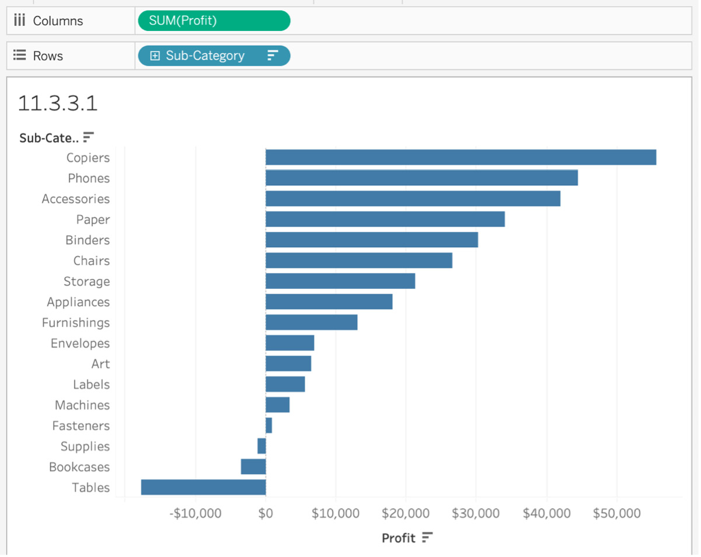
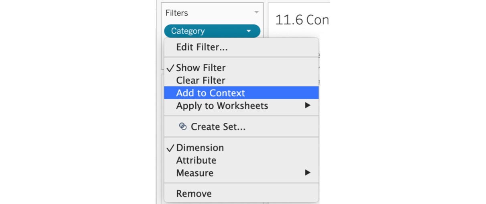
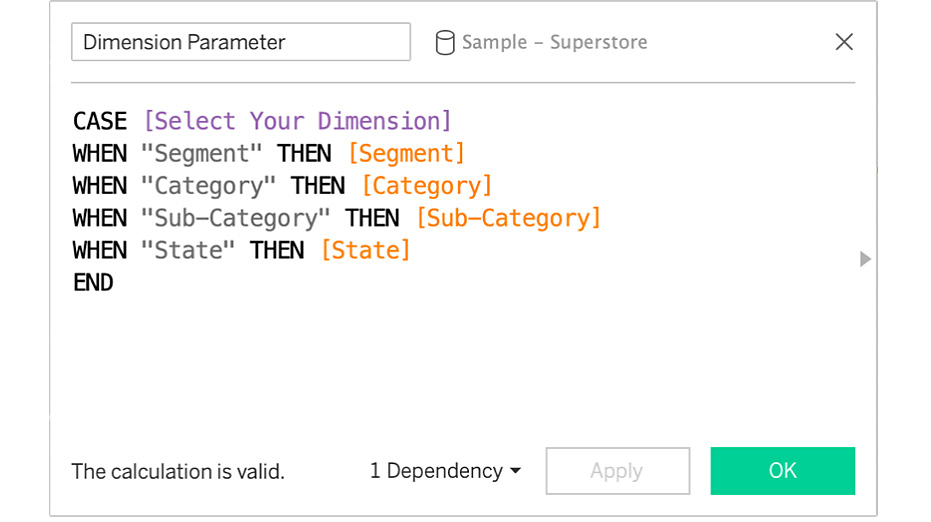

Lab 11: Tableau Interactivity: Part 1 
=====================================


Overview

This lab will dive deep into the order of operations, filters, and
sets and parameters in Tableau. We will also work through exercises on
using groups and hierarchies in our views. Some of these features of
Tableau give end users the ability to control the view. Finally, we will
be discussing an activity that will utilize context filters, parameters,
and sets on the World Indicator dataset to reinforce the skills you will
gain in this lab. By the end of this lab, you will have gained
the skills to create interactive reports, which give end users more
control to slice and dice the data in the report.


Grouping Data 
=============


The grouping of data is useful when you want to simplify or stack
multiple dimension rows/members into one bigger bucket. For example, say
you are working on a report on the population of countries in the world,
and the standard data does not contain a custom grouping of all the
South Asian countries. When you decide to create a custom grouping of
all the South Asian countries by grouping countries such as India,
Pakistan, Nepal, Sri Lanka, and so on, you will notice that a new
dimension is added in your `Data` pane:


Figure 11.1: Sub-category group in the Sample - Superstore dataset

As is often the case with Tableau features, you can achieve the same
results in multiple ways. You can use either of the following methods to
create a group:

-   Create a group from the worksheet view.
-   Create a group from the `Data` pane.

You\'ll practice the both of these options in the following exercise.


Exercise 11.01: Creating Groups 
-------------------------------

You are a retail analyst of XYZ group tasked to group multiple
sub-categories so that it is easier for a sub-category manager to report
on their KPIs of sales:

1.  Open the `Sample - Superstore` dataset in your Tableau
    instance.
2.  Create a bar chart of `Sales` across `Category`
    and `Sub-Category` as shown here:


Figure 11.2: Sales by Subcategory view

**Creating a Group from the Worksheet View:**

1.  Press *Ctrl* and select or press *Command*. Select the sub-category
    to select multiple `Sub-category` members in the view.
    Then, either right-click to group them or click on the group icon in
    the toolbar or within the tooltip as shown here:


Figure 11.3: Adding groups

1.  As you can see, a new
    `Labels, Paper, Storage, and Supplies` sub-category
    grouping is created. You can also rename the sub-category grouping
    by right-clicking and changing the alias name to be more
    descriptive, such as *Desk Stationery* if you desire.


Figure 11.4: Naming groups

**Creating a Group from the Data Pane**

In the previous steps, you used the worksheet view to create a group.
Now you\'ll create a separate group via the `Data` pane:

1.  Create a new worksheet as you did in the steps above.
2.  Create a bar chart of `Sales` across `Category`
    and `Sub-Category` as shown here:


Figure 11.5: Adding groups from the data pane

1.  Right-click on the `Sub-Category` dimension in the
    `Data` pane and hover over `Create`. Click on
    `Group...` from the sub-menu as shown in the
    following screenshot:


Figure 11.6: Creating a group from the Data pane

1.  In the group pop-up window, change the field name to something more
    descriptive: `Papers Sub-Category(group)`.
2.  Hold *Ctrl* or *Command* and multi-select the sub-categories that
    you want to group. In this case, group all paper related items in
    one group and click on the `Group` button:


Figure 11.7: Adding members to the group Paper Sub-Category

1.  Rename the selected items in the window to `Paper Items`
    for easier readability, as shown in the following screenshot. You
    can add or remove the items by dragging them in and out of the
    groups at your convenience.


Figure 11.8: Editing a group

1.  To check if your group is working the way you expect, drag the newly
    created group dimension `Paper Sub-Category(group)` to the
    `Rows` shelf and remove the `Category` as well
    as the `Sub-Category` dimensions from the view. You\'ll
    notice the group that you created in the previous step:


Figure 11.9 The groups sub-category

In this exercise, you explored two ways of creating groups: via the
worksheet view and the `Data` pane. With your completion of
this task, sub-category managers now have a way of looking at their KPIs
for multiple grouped sub-categories.

Note

If you want to edit the grouping now or in the future, right-click on
the new group dimension that was created (the dimension with the *clip*
icon) in the `Data` pane and click on `Edit Group`.
In the `Edit Group` popup, you can drag and drop to remove
members or add new members to the group.


Hierarchies 
===========


Hierarchies are not specific to Tableau. As such, you have almost
certainly used them previously, whether consciously or unconsciously. In
a data context, when the relevant data is arranged logically based on
its level of detail, it is called a **hierarchy**. In our
`Sample - Superstore` dataset, you have already used
hierarchies many times, including the `Location` hierarchy,
which contains `Country/Region`, `State`,
`City`, and `Postal Code`; the `Product`
hierarchy consists of `Category`, `Sub-Category`,
`Manufacturer`, and `Product Name`. Hierarchies
grant you a comprehensive look into your data. For example, if you add
the `State` dimension to your view, because of the hierarchies
that were pre-created in your data, you can switch from state to city by
clicking on the `+` icon in your shelf or go a level up by
clicking the `-` sign as shown here:


Figure 11.10: Default hierarchies

Take a look at how hierarchies can be created through the following
short exercise.


Exercise 11.02: Creating Hierarchies 
------------------------------------

As an e-commerce analyst of emzon.com, the product catalog manager wants
to add `Segment` to the `Product` hierarchy. You
will have to initially remove the original `Product` hierarchy
and later create a new `Product` hierarchy by combining one of
the existing ones.

Note

If you load the default `Sample - Superstore` dataset provided
by Tableau in Tableau Desktop, you may notice that some fields are
missing or new fields have been added. That is expected as Tableau
constantly updates data files as per the requirements. If you want to
avoid confusion, download the dataset from the official GitHub
repository for this lab, available here: <https://github.com/fenago/tableau-advanced>.

1.  Open the `Sample - Superstore` dataset in your Tableau
    instance, if it is not already open.
2.  Follow *Step 2* and *Step 3* below only if your version of data has
    a `Product` hierarchy inbuilt. If not, proceed to step 4
    directly. Assuming in your `Data` pane you find a
    `Decision Tree` icon(as shown below) attached to
    `Product` dimension, the decision tree signifies that the
    dimension is a hierarchy and can be drilled down in your view.


Figure 11.11: The hierarchy icon

1.  Navigate to the `Product` dimension in your
    `Dimensions` data pane and right-click the
    `Product` dimension. Then click on
    `Remove Hierarchy`:


Figure 11.12: Removing the hierarchy

As soon as you remove the hierarchy, the `Decision Tree` icon
is also removed and all the dimensions that were part of the hierarchy
subsequently become their own dimensions. You will also be unable to
drill them down as they are no longer logically arranged.

1.  To re-construct the hierarchy that we just removed, multi-select
    dimensions by pressing *Ctrl* and selecting (for Windows) or
    *Command* and selecting (for Mac) all the dimensions that were a
    part of the product hierarchy. In this case, this will be
    `Category`, `Sub-Category`,
    `Manufacturer`, `Product name`,
    and `Segment`.
2.  After selecting all the dimensions mentioned, right-click on any of
    the selected dimensions, hover over `Hierarchy`, click on
    `Create Hierarchy…`, and name the hierarchy
    `Product` as shown here:


Figure 11.13: Creating a new hierarchy

Ideally, the order of multi-select in the previous steps should have
allowed Tableau to select the level of your hierarchies. Unfortunately,
Tableau levels them alphabetically, which is not the level you want:


Figure 11.14: The newly created hierarchy

1.  Before you create a hierarchy, you should have a good idea of the
    logical leveling of the hierarchy. In this case, these were
    `Category` \| `Sub-Category` \|
    `Manufacturer` \| `Product name` \|
    `Segment`. Drag your dimensions above or below depending
    on the level. For example, `Sub-Category` is below
    `Segment`, so drag `Sub-Category` above
    `Product Name` and `Manufacturer`:


Figure 11.15: Dragging dimensions to change their logical order

1.  Check if the hierarchy is working as expected. Drag the
    `Product` hierarchy to the `Rows` shelf and
    double-click on `Sales` to create a `Sales`
    report by `Product` hierarchy.


Figure 11.16: Final hierarchy

Like groups, hierarchies can be useful when you can logically arrange
relevant data points based on their level of detail or granularity. You
just removed as well as re-created a `Product` hierarchy in
this exercise.


Filters: The Heart and Soul of Tableau 
======================================


If you want to differentiate yourself from a casual Tableau developer,
understanding the order of operations and the order in which Tableau
manipulates and filters data is critical. In other words, to be a true
expert in Tableau, you need to be able to determine when and where data
was filtered and pinpoint the reason when the view doesn\'t produce the
data you expect.

Think of the order of operations as the query pipeline. The order in
which Tableau filters data is critical and Tableau follows a sequential
order, as shown in the following chart.


Figure 11.17: Tableau table of operations

When you create business dashboards in Tableau, you will have multiple
filters, table calculations, and calculated fields to work with. As is
the case with most programs, execution follows a set order/operation
priority. The order of operations is just that. In the chart above,
`Extract Filters` has the highest priority, followed by
`Data Source Filters` and `Context Filters`, and
`Trend Lines, Reference Lines` has the lowest priority. In the
following sub-sections, we will try to explain most of the filters with
an exercise to demonstrate the importance of this.


Data Source and Extract Filters 
-------------------------------

Data Source and Extract filters are the first in the order of operations
in Tableau and take place before you create your first view or when you
are loading your data into the Tableau instance. This type of filtering
is useful when you don\'t want to load all the data from your
server/source file into the Tableau instance. See this in practice in
the following exercise.


Exercise 11.03: Filtering Data Using Extract/Data Source Filters 
----------------------------------------------------------------

As an analyst, you want to load only a sub-region of data into your
Tableau worksheet to lower the load on the dashboard and limit the
amount of data being downloaded into the worksheet. Create a view of
`Sales` by `State` for the `East` region
only.

1.  Open the `Sample - Superstore` dataset in your Tableau
    instance if you don\'t have it open already.
2.  Before creating a sample view, double-click on
    `Data Source` at the bottom-left of your screen.


Figure 11.18: Data pane view

1.  To import data for the `East` region only for your view,
    add that as a `Data Source Filter` here. On the
    `Data Source` page, click on `Add` in the
    `Filters` section at the top right of the view.


Figure 11.19: Data Source view

1.  In the `Edit Data Source Filters` window, click the
    `Add…` button, select `Region`, and click
    `OK`. Just select `East` from the list and click
    the `OK` button. Click the `OK` button again to
    close the dialog box:


Figure 11.20: Adding data source filters

1.  To confirm the working of the filters, create a new worksheet and
    review `Sales` by `State` from your data:


Figure 11.21: Data after adding a data source filter

You might not notice the difference in speed when loading any of the
dimensions in your view because the data is not at gigabyte or terabyte
scale. If you were working with large-scale data, utilizing data source
filtering is one way to improve the speed and efficiency of your work.

When the data source you are importing contains more data than your
report/dashboard requires, you can utilize data source filters to
improve the efficiency and reduce the load on Tableau views. In this
exercise, your goal was to improve the performance of your dashboard,
and by using data source filters, you were able to limit the amount of
data being loaded in the worksheet.


Filters Using Views 
-------------------

These types of filters resemble how you group dimensions using views. In
this type of filtering, you manually select one or multiple data points
in the view to include or exclude from the view. In the following
exercise, you\'ll perform these simple steps to create a filter in this
way.


Exercise 11.04: Creating Filters from the View 
----------------------------------------------

As an analyst, you have been given completely new data, and as part of
the dashboard designing process, you want to do some **Exploratory Data
Analysis** (**EDA**). Creating filters using the view can be a great way
of filtering data as you see the data in the worksheet.

Perform the following steps to complete this exercise:

1.  Open the `Sample - Superstore` dataset in your Tableau
    instance if you have not already done so.
2.  Create a bar chart of `Sales` by `State`. Drag
    and drop `State` to the `Rows` shelf and
    `Sales` to the `Columns` shelf. You should end
    up with the following view:


Figure 11.22: Sales by State view

1.  Manually select your states/data points to include/exclude from your
    view. Click and drag a region to exclude the top five states by
    sales as shown here:


Figure 11.23: Dragging multiple data points to create a filter

1.  If you hover your mouse over the selected region for a couple of
    seconds, a tooltip option pops up. From here, select
    `Keep Only` or `Exclude` for the selected
    states. You exclude these states, so click on `Exclude`:


Figure 11.24: Include/exclude data points from the view

A `State` dimension filter will be added to the
`Filters` shelf. In the next sub-section, you are going to
dive deep into how to best use the `Filters` shelf, so hold on
to your questions at the moment. Here is the final output:


Figure 11.25: Final output after creating the filter from the view

In this exercise, you practiced manually selecting or dragging and
selecting a subset of the view to include/exclude from the view.
Creating filters using the view can be incredibly helpful when you
initially conduct EDA, which is what all analysts start with when
creating a new dashboard. Next, we will dive deep into how to best
utilize the `Filters` shelf.


Creating Filters Using the Filters Shelf 
----------------------------------------

In previous sections, we looked at filtering data either at the data
source level or using views, but the right way to utilize filters in
Tableau is via the `Filters` shelf. In this section, we will
discuss how to use the `Filters` shelf for filtering
dimensions, measures, as well as dates. But first, we will dive deep
into the options of the `Filter` dialog box, which opens up
when you drag any of the mentioned data types.


### Dimension Filters Using the Filters Shelf 

Dimensions in Tableau are essentially categorical data. When filtering a
dimension, you either include or exclude some part of this data from the
view. The following dialog box opens up whenever you drag a dimension to
the `Filters` shelf:


Figure 11.26: Dragging a dimension to the Filters shelf

The box has four tabs, as follows:

-   **General**: You use this tab when to manually select the
    categorical data to include or exclude from the view. For example,
    if you wanted to filter `Sub-Category` on
    `Supplies` and `Tables`, you could manually
    select only two sub-categories to include, as shown below:


Figure 11.27: Filters shelf General tab

-   **Wildcard**: The `Wildcard` tab is used to match a
    pattern of text to use the filter on. Say you had a column with
    thousands of URLs, which may or may not contain the term
    `football` in the URL. It would be quite tiring to use the
    `General` tab to manually select all the URLs that contain
    the term `football`, but using `Wildcard`, you
    can match the value by stating that the dimension either contains,
    starts with, ends with, or exactly matches the term
    `football` for your URL dimensions.


Figure 11.28: Filters shelf Wildcard tab

-   **Condition**: In the `Condition` tab, you define rules or
    criteria for filtering the data. For example, you could also use the
    `Condition` tab to filter on those sub-categories that
    reported losses in your data. To do that, select
    `By field`, and in the dropdown, select `Profit`
    with `Sum` as aggregation and `< 0` as
    shown below:


Figure 11.29: Filters shelf Condition tab

-   **Top**: Use the `Top` tab in the `Filter` box
    when you want to compute the `Top` or `Bottom` N
    members of the view depending on the measure you want to filter the
    view on. In this example, you know that the `Bottom` three
    sub-categories are the rows with losses, so you can create a
    `Bottom` filter using these details, as shown here:


Figure 11.30: Filters shelf Top view

Next, you will utilize the `Filter` dialog box in an exercise.


Exercise 11.05: Dimension Filters Using the Filters Shelf 
---------------------------------------------------------

The portfolio manager has been tasked with identifying a list of all
sub-categories that are not making profit. You are tasked with creating
a dynamic filter via the `Filters` shelf.

Perform the following steps to complete this exercise:

1.  Open the Sample - Superstore dataset in your Tableau instance if you
    don\'t have it open already.
2.  Create a `Profit` by `Sub-Category` bar chart
    and drag and drop `Sub-Category` to the `Rows`
    shelf and `Profit` to `Columns`. You should
    get the following view:





Figure 11.31: Profit by Sub-Category view

Note that there are three sub-cat egories (`Supplies`,
`Bookcases`, and `Tables`) where the superstore made
a loss. You want to include them in your view and exclude all other
sub-categories. You can obviously manually select the sub-categories
from the view itself, but go ahead and use the `Filters` shelf
here, as instructed in the next step.

1.  Drag and drop `Sub-Category` from the `Data`
    pane to the `Filters` shelf and a
    `Filters [Sub-Category]` dialog box opens up.


Figure 11.32: Only profitable sub-categories

1.  In the dialog box, click on the `Condition` tab, select
    `By Field`, and filter on all sub-categories with
    `[Profit] <0`. You will get a list of all the
    sub-categories that are making losses for the business. Click on
    `OK` to filter the data.
2.  You should get the following view showing a list of all
    sub-categories that are making losses:


Figure 11.33: Only loss-making sub-categories

In your career as a data analyst, you will likely find yourself using
the `Filters` shelf day in and day out as part of your job,
making this an essential skill to have under your belt. In this
exercise, you explored all the options Tableau has to offer in the
`Filters` shelf for dimensions.


### Measure Filters Using the Filters Shelf 

Measures are quantitative data, which means, unlike dimensions,
filtering on measures involves selecting a range of numbers that you
want to include/exclude from your view. Whenever you drag a
`Measure` onto the `Filters` shelf, the
`Filter` dialog box offers you four options to filter the
`Measure` on. The following list will define these options in
greater detail:

-   **The Measure Filter Dialog Box**:


Figure 11.34: Range of values in the Filter window

-   **Range of values**: In `Range of values`, you specify the
    range of values you want to filter on. In this use case, you only
    want profitable sub-categories, so your range will be from zero to
    the maximum as shown in the next screenshot *(Figure 11.35)*.
-   **At least**: In `At least`, you specify the minimum value
    and all values greater or equal to the minimum value will be
    included in your view. This can usually be used when you don\'t have
    control over what the maximum for the column/data could be, and it
    is difficult to predict. In this use case, your minimum will be zero
    because you want only profitable sub-categories as shown here:


Figure 11.35: At least filter window

-   **At most**: `At most` is the opposite of
    `At least` and is used when you want to include all values
    that are less than or equal to the maximum specified. This can
    usually be used when you don\'t have control over the minimum but
    know the maximum value that you want to be included in your view,
    which is exactly opposite to that of the `At least` tab.
    You cannot use `At most` for this use case identifying
    profitable sub-categories because all the negative values will also
    be included in the view, and you don\'t have control over them if
    you use `At most`.
-   **Special**: As the name suggests, this filter is only used when you
    want to include either null values, non values, or all values. This
    tab is rarely used, but depending on the data, it may be required.


Exercise 11.06: Measuring Filters Using the Filters Shelf 
---------------------------------------------------------

The portfolio manager liked the work you did creating a view of
loss-making sub-categories. Now he wants you to create a similar view,
but instead of loss-making sub-categories, he wants a profit-making view
this time. You will utilize `Profit` as a filter to create the
view in the following steps:

1.  Open the `Sample - Superstore` dataset in your Tableau
    instance if you have not already done so.
2.  Create a `Profit` by `Sub-Category` bar chart,
    and drag and drop `Sub-Category` to the `Rows`
    shelf and `Profit` to `Columns`. You should be
    at the following view:


Figure 11.36: Profit by Sub-Category view

1.  Drag `Profit` from the `Data` pane to the
    `Filters` shelf. The following dialog box opens up:


Figure 11.37: Measure Filter Field options

1.  In the `Filter Field [Profit]` dialog box, select the
    aggregation for your measures. In this case, select `Sum`
    as you want to look at the sum of the profit.
2.  `Range of values`, as well as `At least`, can be
    used for identifying profitable sub-categories. For this exercise,
    use `Range of values` to filter on profitable
    subcategories.


Figure 11.38: Range of values for Measure

1.  Regardless of `Profit` option you decided to use, your
    final output should resemble the following:


Figure 11.39: Measure filter final output

In this exercise, you utilized the `Measure` data type as a
filter for the first time and explored all Tableau\'s corresponding
options for this in detail. You used `Profit` to filter on
only profitable sub-categories.

In the next section, you will explore date filters using the
`Filters` shelf.


### Date Filters Using the Filters Shelf 

Dates are neither qualitative data nor quantitative data out of the box.
We can filter dates either by `Relative Date`,
`Range of Dates`, or filtering by discrete dates. Let\'s
explore each one of the options and how they differ from each other, and
in the exercise after the explanation, walk through a specific use case.

When you drag a `Date` dimension such as
`Order Date` in your `Sample - Superstore` dataset,
you are presented with the following window:


Figure 11.40: Date filter modal window

-   **Filtering by relative dates**: If you choose to filter by a
    relative date, in the subsequent window, you can define the relative
    time-frame of your date and the dates will be filtered depending on
    the date on which the view was opened. Say you want to show only the
    last 12 months of data. In the `Relative Dates` dialog
    box, select `Months`, click on `Last`, and enter
    `12` months as shown here:


Figure 11.41: Filter by Relative dates

Relative dates are defined from the date the view was opened. If the
data source only has dates till December 2019 and you are opening this
in July 2020, the view will only include dates from August 2019 to the
maximum date that is present in the data, which in this case is December
2019. Hence you will only see five months\' worth of data. To change
that, you can check `Anchor relative to` at the bottom left
and enter the date as December 31, 2019, as shown here.


Figure 11.42: Filter by Relative dates with an anchor date

-   **Filtering by range of dates**: You use this filter when you want
    your dates to have a fixed range. In this use case, you want 12
    months of data relative to December 2019, so your range will be
    January 2019 to December 2019 as shown here:


Figure 11.43: Filter by Range of dates

-   **Filtering by discrete dates**: In the
    `Filter Field [Order Date]` dialog box, if you select
    discrete date values, you will filter on the entire date levels. For
    example, if you filter the discrete date on `Months` and
    select `January`, you will filter on `January`
    irrespective of the year. If you want to filter on a month and a
    year, select `Month / Year` from the
    `Filter Field` dialog box.


Figure 11.44: Filter by discrete dates


Figure 11.45: Filter by discrete month

In the following exercise, you will use the `Date` dialog box
and create a time-series view to showcase the use of the
`Date` filter.


Exercise 11.07: Creating Date Filters Using the Filters Shelf 
-------------------------------------------------------------

You are asked to create a time-series view of the sales of the last 12
months relative to the last updated date of the data. You will be using
the `Sample - Superstore` dataset again in this exercise and
utilizing relative dates, as well as anchoring relative to the options
covered in the preceding section.

Perform the following steps to complete this exercise:

1.  Open the `Sample - Superstore` dataset in your Tableau
    instance if you have not already done so.
2.  Create a line chart of `Sales` by continuous
    `Month(Order Date)` as shown here:


Figure 11.46: Time-series view after filtering on the last 12 months

You want the line chart to only show the last 12 months of data, so you
will be using the `Filters` shelf to select only the last 12
months of data.

1.  Drag and drop `Order Date` to the `Filters`
    shelf. In the `Filter Field [Order Date]` dialog box,
    filter the dates either by `Relative Date`,
    `Range of Dates`, or filtering by discrete dates.


Figure 11.47: Date filter window

1.  For this exercise, you will filter by `Relative Date`
    since you want your view to be dynamically updated in the future
    too, to only show the last 12 months of data. Click on
    `Relative Date` in the preceding dialog box and on the
    next screen select `Months` and enter `12`.


Figure 11.48: Relative dates date filter

This was discussed this in the `Note` section above. Since the
`Sample – Superstore` dataset only has data till December
2019, and considering this course was written in July 2020, you will see
only six checkmarks.

1.  To change that, make use of **Anchor relative to** and enter the
    date as December 31, 2019, as shown here:


Figure 11.49: Relative dates with an anchor date

You achieved your goal of displaying the last 12 months\' trends from
the last date in the data using `Relative dates` with
`Anchor relative` to December 2019. Here is what the final
output should look like `(Month(Order Date)` has been added as
a label in the `Marks` shelf for readability):


Figure 11.50: Time series to show the last 12 months relative to the
anchor date

In this section, you were reviewed in relative detail the options that
available for date filters and how to make the best use of them, and
also how to make the best use of `Anchor relative to` and when
to use it.

In the next section, we will look at how you can give the end user of
your report/dashboard the ability to filter the report as per their
requirements.


Quick Filters 
-------------

Thus far, you have been using filters on your data as a developer
without giving end users the ability to filter on a view. One of the
many reasons why Tableau is a beloved tool across the developer as well
as the end user community is because it allows even end users to control
the flow of data in a view. This reduces the back-and-forth with
developers because the end user can use the filters to change the data
and get the insights they desire. This type of end user filter control
is achieved with quick filters.

There are multiple ways of showing your quick filters. The major
differences between them are as follows:


Figure 11.51: Quick filter types

Each quick filter has a specific purpose and is widely used across
pretty much every dashboard you will ever build. In the following
exercise, you\'ll explore a specific example and review the exact steps
to add quick filters to your view.


Exercise 11.8: Creating Quick Filters 
-------------------------------------

Create a simple view of `Sales` by `State` and use
`Region` as a quick filter, as regional managers will use the
dashboard to filter on their specific dashboard. Use the
`Sample - Superstore` dataset once again to complete this
exercise.

Perform the following steps:

1.  Open the `Sample - Superstore` dataset in your Tableau
    instance if you don\'t have it open already.

You are going to create a cross table of `Sales` by
`State` and use `Region` as a quick filter, but
first you need to build the view.

1.  Drag and drop `State` to the `Rows` shelf and,
    next, double-click on `Sales` to create the table of
    `Sales` by `State`. We will now add
    `Region` as a filter in our `Filters` shelf by
    selecting all values:


Figure 11.52: Sales by State view

1.  Click the down-arrow or simply right-click the `Region`
    dimension in your `Filters` shelf and select
    `Show Filter`:


Figure 11.53: Show Filter step

1.  Drag the `Region` quick filter from the right-hand side to
    the left-hand side just below the `Marks` shelf for ease
    of use. Tableau automatically created
    `Multiple Values (list)` as a quick filter. If you hover
    over and click on the arrow in the `Region` quick filter
    as shown here, you get the following options:


Figure 11.54: Quick filter type options

1.  As a recap of all the quick filter types in Tableau, review the
    following:


Figure 11.55: Quick filter types (review)

1.  In this use case, you want your end users to control the region that
    they want to view so that they are able to view one region or all
    regions at once. To do this, select `Single Value (list)`,
    change the quick filter type from `Multiple Values (list)`
    to `Single Value (list)`, keeping
    `Show "All" Value` from the `Customize` option
    checkmarked as shown here:


Figure 11.56: Quick filter Customize option

1.  Select `East` for `Region` in our quick filter
    and the final output should resemble the following view:


Figure 11.57: Final output after adding a quick filter

Quick filters are why Tableau is such a powerful tool even for end
users. In this section, you have learned the major differences between
the types of quick filters and the best use cases for them. You then
created `Sales` by `State` and used
`Region` as a quick filter.


Applying Filters across Multiple Sheets/Multiple Data Sources or an Entire Data Source 
--------------------------------------------------------------------------------------

When you add a filter to your view, it only applies to your current
view. But there will be times when you want to apply the same filter
across multiple selected, using the same or a related data source if
there is a relationship between primary and secondary data. This section
will examine the difference between each of these options and when to
use them.


Figure 11.58: Apply to Worksheets options

-   Applying a filter to `Only This Worksheet`: Here the
    filter(s) added to the worksheet is only applied to the worksheet to
    which the filter was added.
-   Applying a filter to `Selected Worksheets...`: If you want
    your filters to be applied across multiple worksheets or even all of
    your worksheets, this option comes in handy. In the previous
    section, you created the `Region` filter. Say you want to
    use the same filter across a couple of other worksheets that are
    part of the Tableau workbook. You can do that as shown here:


Figure 11.59: Apply a filter to the selected worksheets

-   Applying a filter to `All Using This Data Source`: If you
    want to filter all worksheets that use the same
    `Sample - Superstore` dataset using the `Region`
    dimension, use this option. You can achieve the same result by
    selecting all worksheets in the `Selected Worksheets`
    option if the workbook only contains one data source.
-   Applying a filter to `All Using Related Data Sources`:
    Choose this option when you want to use the filter from the current
    worksheet across multiple data sources. This feature was released in
    2016, and when Tableau announced this feature release, the company
    mentioned that it was one of the most asked for features of all
    time.

This option only works when you create a relationship between a current
or primary data source and a secondary data source. You do that by
navigating to `Data` in the menu bar, then clicking on
`Edit Relationships`. If Tableau does not automatically create
some relationships between the data sources, you can create a custom
relationship depending on the use case.

`Custom Relationship` comes in handy when the names of the
common columns across the data sources don\'t match. Once you are able
to create the relationship, you can select
`All using Related Data Sources` for its magic to work. This
option comes in handy when you are data blending, which was discussed in
previous labs.


Context Filters 
---------------

When you add multiple filters into your Tableau view, each of these
filters is calculated independently of the others. So, if you have two
quick filters such as `Category` and `Sub-Category`
in your view, when you select/deselect a filter, Tableau uses all of its
data to show you the view.

If you want to limit the calculation across the whole data source and
improve the performance of your report/dashboard (more on this in the
exercise that follows), you\'ll want to use context filters. These help
Tableau understand the context of the data and limit the amount of data
filtering/loading that happens whenever you change a filter in your
view.

In the Tableau order of operations, `Context Filters` has
third priority. So when you set a filter as a context filter, you are
essentially creating *one* independent filter and all other filters that
are not context filters become dependent filters. This is because those
other quick filters will process only the data that is first passed
through the context filter.


Figure 11.60: Tableau order of operations

An example of this in practice is detailed below.


Exercise 11.09: Creating and Using Context Filters 
--------------------------------------------------

In this exercise, you will create and use context filters in an example
use case with the `Sample – Superstore` dataset to see why
mastering the Tableau order of operations is so beneficial.

1.  Open the `Sample - Superstore` dataset in your Tableau
    instance if you don\'t have it open already.
2.  Create a `Sales` by `Sub-Category` bar chart
    view, sort it descending by `Sales`, and add
    `Category` to the `Filters` shelf and show it as
    a quick filter. You should have the following view:


Figure 11.61: Sales by Sub-Category view

1.  To show only the top five sub-categories by sales, add the
    sub-category in the `Filters` shelf, and using the
    `Top` tab, filter on the top five sub-categories by
    `Sum` of `Sales` as shown here:
    

    

Figure 11.62: Top N filter view

1.  Note that all the top five sub-categories in the view. However, if
    you start de-selecting some of the `Category` quick
    filters, you will notice that only some of the top five
    sub-categories remain in the view.


Figure 11.63: Need for context filters

The reason this happens (as you can see in the following figure) is that
top N gets filtered first in Tableau operations before dimension
filtering is applied to the view. Therefore, when you use the top N
filter, Tableau has already calculated the top N for the dimension in
the view; and when you use a secondary dimension for filtering, it gets
filtered on the top N data and not the whole dataset.


Figure 11.64: Sectional view of the Tableau order of operations

1.  Use context filters to counter this since, in the order of
    operations, these are executed before top N filters, as seen in the
    preceding figure.

    Note

    Major benefits of context filters are as follows:

    **Performance Improvements**: When working on a large-scale dataset
    and using a lot of filters, it is recommended that you limit the
    number of calculations required in the view. When you use context
    filters, Tableau creates a `TEMP` table with the context
    and subsequent filters in the order of operations after the context
    filter references the `TEMP` table for calculating. Say
    you have a Customer Order database with 100 million rows, and you
    want to only look at customers in California, which is 18 million
    rows. By using a context filter on `State`, you are
    limiting the querying of your whole dataset so that only a subset of
    the California data will be used for calculating all subsequent
    filters. This is extremely useful.

    **Top N Filters**: As discussed above, if your view has top N
    filters, utilizing a context filter is highly recommended so that
    the filter works in the desired way of showing all the top N
    irrespective of the secondary filter selected!

2.  To fix this issue, change your `Category` filter type to a
    context filter by right-clicking on `Category` and
    selecting `Add to Context` as shown here:





Figure 11.65: How to add a filter to context

1.  If your filter in the `Filters` shelf turns into a gray
    dimension, the filter is being used as a context filter. Verify that
    the context filter is working as expected:


Figure 11.66: View after making Category a context dependent filter

As expected, after using `Category` as a context filter, the
changes in `Category` quick filters are appropriately
reflected in the view. `Category` becomes the dependent
filter, where the top five sub-categories\' filters become the
independent filters that process the data that is passed through the
context filter. It is now showing the top five sub-categories while
using `Category` in context.

In this exercise, you explored why context filters are important and how
the order of operations dictates how data is presented in the view. The
context filter in this exercise was `Category`, which became
the dependent variable, and the top N sub-category became the
independent variable in our case.


Sets 
====


Sets are custom-created fields used to define a subset of data based on
pre-defined conditions or rules.

Think of sets as custom segments that are always binary: a data point is
either in or out of the segment depending on whether the data point
meets the criteria defined. Sets are created on dimensions, though your
conditions can include measures if required. Sets can either be static
or dynamic, and you can also combine multiple sets into one set in
Tableau, which can be pretty useful, as you will learn from the
following exercises. A set is identified in the `Data` pane by
the field with a *Venn diagram* icon as shown here:


Figure 11.67: Venn diagram icon


Static Sets 
-----------

As mentioned in the preceding section, sets can be either dynamic or
static. In static sets, you define the set rules and create a fixed
subset of the data, where the members of the set are not updated if the
underlying data is updated with new data. For example, you create a Top
City set manually, selecting New York, San Francisco, Mumbai, and
London. The set members won\'t be changed even when new data is added or
deleted. It\'s a static set. Dynamic sets can help counter this, but you
will learn about dynamic sets in later exercises.


Exercise 11.10: Creating Static Sets 
------------------------------------

In this exercise, you will create a view of the
`Sample - Superstore` dataset where all products that contain
`Envelope` as part of their name are grouped together as
`In` while everything else is grouped as `Out`.

Perform the following steps:

1.  Open the `Sample - Superstore` dataset in your Tableau
    instance if you don\'t have it open already.
2.  Create a view of `Sales` and `Profit` by
    `Product Name`. Drag and drop `Product Name` to
    `Rows` and double-click `Sales` and
    `Profit` to get the following view:


Figure 11.68: Profit and Sales by Product Name

1.  Navigate to `Product Name` in the `Data` pane
    and right-click on it. Click `Create` \|
    `Set...` as shown here:


Figure 11.69: How to create a set

In the `Create Set` dialog box, you will notice there are
three tabs (`General`, `Condition`, and
`Top`), which are pretty similar to those of filters if you
remember from the previous section.

1.  Create a set for any product that has `Envelope` as part
    of its `Product Name`. Select the
    `Select From List` radio button, search for
    `Envelope`, and press the `All` button to select
    the list of all the products that contain `Envelope` as
    part of their name. Then, name your set
    `Envelope Product Set`, as shown below:

    Note

    The text search is not case-sensitive and, when you search text, it
    will search across the complete string and not find an exact match.
    Here, you searched for `Envelope` but your selected list
    also contains products with `Envelopes` in the name.


Figure 11.70: Manually adding members to the set

Before you click on the `OK` button, look at the
`Summary` section in the `Create Set` dialog box and
note that your set contains 48 out of 1,850 values. As mentioned
previously, this way of manually selecting items for set creation is
static, where the set members won\'t get updated if new records/rows are
added to the data at a later date. You will see how to overcome this
limitation in the next exercise.

1.  Save the set by clicking on the `OK` button.
2.  Check whether the set is working as desired. Drag
    `Envelope Product Set` to the `Rows` shelf.
    Consider the `In`/`Out` set here. If a product
    name meets the criteria that you set, that product will be
    `In` the set; and if the product does not meet the
    requirements, that product will be `Out`.


Figure 11.71: In/Out set view

1.  Instead of `In`/`Out`, display the actual
    product name by right-clicking on `Envelope Product Set`
    and selecting `Show Members in Set`:


Figure 11.72: How to show members in a set

In this exercise, you encounterd sets for the first time and observed
how static sets are used on dashboards. You also learned to show/hide
members from a set and what the `Summary` tab in the
`Create Set` dialog box means.

The next section will review dynamic sets and how they can overcome the
shortcomings of static ones.


Dynamic Sets 
------------

In this section, you will learn why dynamic sets are preferred over
static sets. You\'ll also practice using the two remaining tabs from the
`Create Set` dialog box you encountered in the previous
section. Dynamic sets use logic to dynamically update the members of the
set, which means when the data changes, the set will be re-computed and
the `In`/`Out` members can be added/deleted
depending on the computation.


Exercise 11.11: Creating Dynamic Sets 
-------------------------------------

Though previous sets that you created were good, but the product manager
responsible for all `Envelope` products has asked you to
create a dynamic view of the groupings as he wants to update the
`In`/`Out` groups whenever a new product name is
added or deleted. You will be using the same view that you created in
the previous exercise and extending that view to add dynamic sets.

Perform the following steps:

1.  Open the `Sample - Superstore` dataset in your Tableau
    instance if you have not already done so.
2.  Create a view of `Sales` and `Profit` by
    `Product Name`. Drag and drop `Product Name` to
    `Rows` and double-click `Sales` and
    `Profit` to get the following view:


Figure 11.73: Profit and Sales by Product Name

1.  Navigate to `Product Name` in the `Data` pane
    and right-click on it. Click on `Create` \|
    `Set...`.
2.  Expand your previous set criteria. You want the top five profitable
    envelope product names that had more than \$100 in sales. For this,
    use both the `Condition` and the `Top` tabs.
    Create the condition for at least \$100 of sales first, as shown
    here:


Figure 11.74: Conditional set definition

1.  Add the criteria of top five profitable `Envelope`
    products in the `Top` tab, as shown here:


Figure 11.75: Dynamic set definition

1.  You have not yet filtered for `Envelope` as you did for
    your static set, but if you use the same `General` tab to
    filter the `Envelope` products, your set won\'t be updated
    when new data is added. To ensure your future data is considered for
    the set, use the `Condition` tab and write a calculated
    formula to do this dynamically. Then, de-select `By field`
    and use `By formula` and write the following formula:
    
    ```
    MIN(CONTAINS([Product Name],"envelope")) AND SUM([Sales])>=100Copy
    ```
    


Figure 11.76: Formula-based conditional set

Note

You had to use `MIN` for `Product Name` because you
cannot mix aggregate and non-aggregate in the calculated field without
using aggregation for a non-aggregate dimension, as explained in
previous labs.

1.  Before you do the spot check and saving the set, review the
    `Summary` section of the dialog box:


Figure 11.77: Summary box of sets

In the `Summary` section, your selection says `0`
because you have not manually selected anything. `Condition`
is the formula you used in your `Condition` tab, and
`Limit` is the criteria in the `Top` tab.

1.  Drag both sets you created in the last two exercises to your
    `Rows` shelf: You have the top five rows by profit in
    `Top 5 Profitable Envelope Product`, as seen. These five
    products are also part of the static set because these product names
    include `Envelope`.


Figure 11.78: Final output for dynamic sets

With this exercise, you are now able to create a non-static set that can
update the set members depending on the changes made to the dataset or
when new data is added or deleted from the set. Dynamic sets are usually
preferred over static sets because they allow you to ensure new data is
populated in sets in the future when you are not actively working on the
dashboard.


Adding Members to the Set 
-------------------------

In both the previous sections, you created sets from scratch. In this
section, we will address those cases in which you want to add more
conditions to your set definition to add new members or delete them.
Adding members to the set is more often done when stakeholders want to
update the condition of the underlying set or the developer wants to
experiment with complicated conditional logic.

The following exercise will guide through how to complete this task.


Exercise 11.12: Adding Members to the Set 
-----------------------------------------

For the `Envelope Product Set` you created in the previous
section, the product manager wants you to add a specific product to the
set since they cannot add that product `IN` the set from their
view and that product is not part of the top N sales or profit. As the
dashboard developer, you are tasked with adding that specific product to
the set.

Perform the following steps:

1.  You will be reusing the view that you created in the previous
    exercise, but to demonstrate the workings of adding members to the
    set, remove `Envelope Product Set` from the view. Your
    view should now look as follows:


Figure 11.79: Adding members to the set

1.  To add members to the set, select the product name/row of data that
    you want to include in your view, and left-click the row to get the
    following:


Figure 11.80: Include/exclude members from the set

1.  Click on the *Venn diagram* icon in the options panel and select
    `Add to Top 5 Profitable Envelop Product (Sample – Superstore)`
    as shown in the following screenshot:


Figure 11.81: Adding the product to the set

1.  As soon as you do that, the row
    `3M Polarizing Task Lamp with Clamp Arm, Light Gray` is
    moved from the `Out` set to the `In` set as
    shown here:


Figure 11.82: The product was added to the set

1.  You would follow a similar process if you want to remove a data row
    from the set. Instead of adding, remove from the set options as
    shown here:


Figure 11.83: Removing a member from the set

Adding members to a set is pretty straightforward and can be incredibly
helpful when you want to manually update the member set without editing
the actual definition of the set.


Combined Sets 
-------------

You have now created both static and dynamic sets. Individually, these
sets work well, but you can also extend Tableau functionality by
combining multiple sets to create a combined set. Using combined sets,
you can perform additional analysis and compare and contrast multiple
sets. When you create a combined set, you create an altogether new set
that contains a combination of either all members from both sets, some
members that exist in both sets, or a member from one specific set.

Complete the following exercise to see this in practice.


Exercise 11.13: How to Create Combined Sets 
-------------------------------------------

Your regional manager wants you to create a view of states that are both
in `Top 20 States by Profits` as well as
`Top 20 States by Sales`. You will utilize combined sets for
this, which will be created from two individual sets you\'ll make first:
`Top 20 States by Profits` and
`Top 20 States by Sales`.

Perform the following steps to complete this exercise:

1.  Open the `Sample - Superstore` dataset in your Tableau
    instance if you don\'t have it open already.

**Set 1: Top 20 States by Profits**:

1.  Create your first set with `Top 20 [States] by [Profits]`
    as shown here:


Figure 11.84: Creating the set

1.  Name the set `Top 20 States by Profits`, select the
    `Top` tab from the window, and select `By field`
    and `Top 20 by Profit Sum` as shown below:


Figure 11.85: Top N members for the set

**Set 2: Top 20 States by Sales**:

1.  Similarly, create your second set with
    `Top 20 [States] by [Sales]` as shown here:


Figure 11.86: Top N members for the set -2!

1.  Create a view by dragging `State` to the `Rows`
    shelf and adding `Profits` and `Sales` to the
    view as shown here:


Figure 11.87: Profit and Sales by State view

1.  Add both `Top 20 States by Profits` and
    `Top 20 States by Sales` to your view in `Rows`
    as shown here:


Figure 11.88: Two sets view

The goal is to create a combined set from which you can get a list of
all the states that are part of the top 20 by both profits and sales.
For this, you want all `In` members of both of the sets you
just created.

1.  Press *Command* + multi-select both the sets for Mac or *Ctrl* +
    multi-select both the sets for Windows and click on
    `Create Combined Set...`:


Figure 11.89: Creating a combined set

1.  In the `Create Set` modal window, name your new set
    `States of Top 20 Sales and Profits`. You can also change
    the sets that you want to be part of the combined sets from the
    dropdown. There are four options for members in your combined sets,
    which are pretty self-explanatory. You want a list of all the states
    that are part of both the top 20 states by sales as well as profits,
    so use `Shared members in both sets` as shown here:


Figure 11.90: Combined set definition

Previous steps noted that you want your combined sets to contain all
`In` members from both sets. In the following screenshots,
you\'ll observe that the combined set has all the same states as the
intersection of two individual sets.


Figure 11.91: In combined set view


Figure 11.92: States in the top 20 of both profits and sales

The final output will be as follows:


Figure 11.93: Combined Sets final output!

In this final section on sets, you learned how to use combined sets by
walking through an example. The next will explore parameters.


Parameters 
==========


Parameters are like variables/placeholders in Tableau, which give the
end user the ability to control the view or data that is shown as part
of the report. They allow you to customize your view, adding
interactivity as well as flexibility to the workbook. Parameters are
used to replacing a constant value from the view with more
variable/dynamic values, which are controlled by the end user. They can
take any data type: strings, integers, floats, dates, or any varchars.
They can easily be confused with filters but the major difference
between parameters and filters is that, with filters, the data gets
filtered from the view so that it only shows for the filtered values,
whereas with parameters, the variables only act as a reference.
Parameters control the value of the variable created instead of
filtering on the data.

To use parameters in the view, there are four steps that you need to
perform:

1.  Create the parameters based on the requirements.
2.  Show the parameter control to the end user, as we do for
    sets/filters.
3.  Use the parameters either in the calculated field, filters, or
    reference lines.
4.  Use the calculated field, filters, and reference lines in the view.


Exercise 11.14: Standard Parameters 
-----------------------------------

In this exercise, you\'ll create and use standard parameters. To observe
the true essence of Tableau and parameters, you will create a more
advanced view that allows your end users to select the dimensions as
well as the measures that they want to see in the view.

In previous labs, you have given users the ability to filter data,
create groups, and create sets on pre-selected dimensions and measures,
but you have not yet given users the ability to select/change the
dimensions/measures as per their requirements. But there are many
instances when stakeholders want the exact same view with different
measures/dimensions. So, instead of creating 4-6 different views with
different dimensions/measures combinations, letting users choose their
own measures and dimensions is a more efficient way of handling the
request while limiting clutter. This is the final view you are aiming
for:


Figure 11.94: Final output for parameters

Perform the following steps to complete this exercise:

1.  Open the `Sample - Superstore` dataset in your Tableau
    instance if you have not already done so.

In this example, you will create a continuous line graph for the
measure, selected by the end user, by quarter. As mentioned earlier, you
want to give end users the ability to change the measures or dimensions.

1.  There are four steps to using parameters. The first step is to
    *create a parameter*. Do this by either clicking on the arrow in the
    `Dimensions` pane and clicking on
    `Create Parameter...`, as shown in the following
    screenshot, or else right-clicking anywhere in the
    `Parameters` shelf and clicking on
    `Create Parameter...`:


Figure 11.95: Creating a parameter

You will be creating two parameters in this exercise: one for selecting
`Measures` and one for selecting `Dimensions`.

1.  First, create a parameter for selecting `Measures`. In the
    `Edit Parameter` modal window, you have a choice of six
    data types: `Float`, `Integer`,
    `String`, `Boolean`, `Date`, or
    `Date & Time`. Since your parameter contains text, use
    `String` as the data type. For the
    `Allowable values` option, instead of all values, use
    `List` so that you can define the options available to the
    end user selecting the measure.


Figure 11.96: Data type options in parameter creation

When you select `List` for `Allowable values`, you
are presented with `List of values` options. You then have to
define your list, which will be the measure names that your users can
select.

1.  Manually add `Sales`, `Profit`,
    `Discount`, and `Quantity` to
    `List of values`. Your `Create Parameter` window
    should look something like this:


Figure 11.97: Adding measure options for the parameter

1.  Repeat the same steps for `Select Your Dimension`. The
    `Create Parameter` modal window should look something like
    the following:


The next step is to use the created parameter in a calculated field. By
default, parameters don\'t control anything unless you use the parameter
either as part of a calculated field, reference lines, or filters. You
will be using the calculated field to use the parameter, which acts as a
placeholder substitution for dynamically populating the calculated field
with the end user\'s selected measure/dimension.

1.  Create a calculated field now, named `Measure Parameter`.


1.  Use the `CASE` statement so that if the user selects
    `Sales` measures in the parameter, your calculated field
    should show `SUM(Sales)` in the view. If the user selects
    `Profit` measures in the parameter, your calculated field
    should show `SUM(Profit)` in the view and so on. Here is
    the formula for the calculated field:
    
    ```
    CASE [Select Your Measure]
    WHEN "Sales" THEN SUM([Sales])
    WHEN "Profit" THEN SUM([Profit])
    WHEN "Discount" THEN AVG([Discount])
    WHEN "Quantity" THEN SUM([Quantity])
    ENDCopy
    ```
    


1.  Repeat the same step for the `Dimension Parameter`
    calculated field with the following `CASE` statement:
    
    ```
    CASE [Select Your Dimension]
    WHEN "Segment" THEN [Segment]
    WHEN "Category" THEN [Category]
    WHEN "Sub-Category" THEN [Sub-Category]
    WHEN "State" THEN [State]
    ENDCopy
    ```
    





Figure 11.101: Case statement calculated field for Dimension Parameter

1.  The next step is to create a view with calculated fields as well as
    using two of our parameters: Drag `Dimension Parameter` as
    well as `Measure Parameter` to the `Rows` shelf.
    Next, drag `Order Date` to `Columns` and change
    the date dimension to `Continuous` date by quarter. The
    view that you see is pre-selected based on the *current value* that
    you selected when creating the parameter. You had `Sales`
    for the `{Select Your Measure}` parameter and
    `Segment` for the `{Select Your Dimension}`
    parameter. So, your current view is the quarterly trend of
    `Sales` by `Segment`.


Figure 11.102: Parameter view with default parameters selected

1.  The final step is to allow your end users to control the measure as
    well as the dimension in the view. Right-click on the parameter that
    you created and click on `Show Parameter Control`. Repeat
    the step for the other parameter:


Figure 11.103: Show Parameter Control

1.  Add the parameter control to your view, so that the end users have
    the ability to choose the dimension/measure of their choice. Here
    are two views with a different combination of dimensions and
    measures:

**Profit by Category**:


Figure 11.104 Profit by Category parametric view

**Quantity by Segment**:


Figure 11.105: Quantity by Segment parametric view

As an end user, it can be confusing to look at different combinations
because the line graph or graph view does not show which
dimension/measure is part of the view. Though you have the dropdowns, to
make it easier for end users, you can also include the callout in your
title by creating a dynamic title that is updated along with the
dimension in the view. Edit the title by double-clicking on the
worksheet title and that opens up the `Edit Title` window as
shown here:


Figure 11.106: Editing the title

The preceding formula uses dynamic variables. In particular,
`<Parameters.Select Your Dimension>` is dynamic such that,
when you change the parameter from the dropdown in the worksheet, the
title will be automatically updated. You don\'t have to type the exact
variable; you can insert these variables by clicking on
`Insert` in the top right-hand corner of the window as
shown here:


Figure 11.107: Inserting a dynamic variable in the title

Here is the final output that you aimed for:


Figure 11.108: Parameter final view with parameter control

In this exercise, you learned what parameters are and how to use them in
combination with calculated fields to create a dynamic worksheet where
the end users have complete control over which dimension/measures they
want the report view to be part of. The skills imparted in this section
will go a long way toward growing your advanced knowledge and expertise
in Tableau.


Dynamic Parameters 
------------------

Dynamic parameters was one of the most requested features in the Tableau
Community forum, and the Tableau developers shipped the feature in the
Tableau 2020.1 version in February 2020. Prior to Tableau version
2020.1, standard parameters had a specific limitation: When the data was
updated with new entries (specifically dates), the parameters
list/members were not updated. This meant that Tableau authors had to
manually refresh the parameter list every time the data source was
updated, which, depending on the frequency of the updates, could be very
time-consuming. Dynamic parameters overcame that. With these, you can
also allow your parameters to automatically choose the most recent date,
which wasn\'t possible previously. Let\'s explore how this works with
the help of an exercise.


Exercise 11.15: Dynamic Parameters 
----------------------------------

In this exercise, you will be using new dummy data to see what
parameters looked like in previous versions of Tableau (2019.4 or
earlier). You\'ll then follow the steps outlined below to use the new
parameters to automatically update the parameter list as and when the
data source is updated.

Note

A screenshot of the previous version of Tableau has been included;
however, you might not have that option. The goal is to communicate the
point about static versus dynamic parameters, so you don\'t need to have
two versions of Tableau installed. This exercise will stick with Tableau
2020.1 or later versions.

Perform the following steps to complete this exercise:

1.  **Date parameters in Tableau 2019.1**: To create a parameter in an
    earlier version of Tableau, connect the
    `DynamicParameters.csv` file in Tableau. Create a
    parameter, and set `Data type` as `Date` and
    `Allowable values` as `List`, and instead of
    manually adding these dates, use `Add from Field` and the
    `Date` column to pre-populate the list of values as shown
    here:


This method, as discussed previously, is pretty static. If new data is
added with new dates, the parameter won\'t automatically pre-populate
`List of Values` to include the new dates as part of the
updated data source, which was a limitation in previous versions of
Tableau.

1.  **Date Parameters in Tableau 2020.1**: Repeat the step with the same
    dataset but, this time, do so in the Tableau 2020.1 version. Connect
    the `DynamicParameters.csv` file in Tableau, create a
    parameter, and set `Data type` as `Date` and
    `Allowable values` as `List`. Note that, as soon
    as you select `List`, unlike previous versions of Tableau,
    Tableau 2020.1 has two options:
    -   `Fixed`: This is where you can pre-populate the list
        from a field as you did in the previous old date parameter.
    -   `When Workbook Opens`: This is dynamic option wherein
        the list will be pre-populated from the `Date` field,
        but instead of a fixed list, the list will get updated whenever
        new data is updated/added.


1.  In the preceding screenshot, the last date is 5/2/2020. Open the
    `DynamicParameters.csv` spreadsheet in a tool of your
    choice (non-Tableau) and add a new row,
    `Date: 5/3/2020 and Sales: 80`. Save the file as shown
    here:


Figure 11.111: CSV data from DynamicParameters.csv

1.  To check whether the new date was added or not, close your Tableau
    workbook (make sure you save it first, though). Then, re-open the
    workbook and edit `New Date Parameter` to confirm whether
    the new date was appended to the list of values in the parameter. As
    you can see from the following screenshot, May 3, 2020, was
    automatically added to the list of values in the parameter.


In this exercise, you reviewed the major differences between dynamic
parameters and static parameters and saw how dynamic parameters
automatically update the list of allowable values alongside the data
source update.

In the last section of this lab, you will put all you have learned
about Tableau\'s advanced interactivity features into practice with a
real-world scenario.


Activity 11.01: Top N Countries Using Parameters, Sets, and Filters 
-------------------------------------------------------------------

As part of the annual hackathon in the company, each team is required to
utilize the World Indicators dataset to showcase the top 5 countries
according to certain metrics. You decide to show the top N countries by
energy usage and also give end users the ability to change the N from 5
to 10, 15, or 20 for ease of use. You will create an interactive view of
the World Indicators dataset using sets, context filters, and parameters
in this activity.

By the end of this activity, you will have created an interesting view
by utilizing all the major topics covered in this lab, with a
special focus on context filters and end user interactivity.

1.  Connect to the `WorldIndicators.hyper` dataset downloaded
    from the project/course folder in Tableau.
2.  Create a bar chart of `Country/Region` by
    `Energy Usage`.
3.  Create a `Top N Countries` parameter with 5, 10, 15, and
    20 as list values.
4.  Create a set called `Top N by Energy Usage` and use the
    `Top N Countries` parameter for user interactivity.
5.  Drag the `Top N by Energy Usage` set to the
    `Color` `Marks` shelf.
6.  Show `Year[Year]` as a single drop-down filter.
7.  Make sure the `Year` filter updates the list of *top N
    countries* by their energy usage. **Hint**: context filters.
8.  Make the title dynamic, so when the `Top N Countries`
    parameter and the `Year` filter are updated, the title
    should appropriately reflect the changes. For example, if the user
    selects the top 10 countries for the year 2010, the title should be
    *Top 10 countries by their energy usage for the year 2010*.

The final expected output is as follows:


Summary 
=======


This lab considered a number of advanced interactivity features in
Tableau. We looked closely at the order of operations in Tableau, which
is one of the most important concepts to master in Tableau if we want to
create an efficient report for our stakeholders. We also discussed
filters, sets, groups, and hierarchies, covered filters in depth,
explored the difference between dimensions, measures, and date filters,
and practiced using data source filters, which can be a great way to
limit the data being loaded in your view.

Regarding sets, we reviewed static, dynamic, and combined sets, using
the *Envelope* example to demo the concepts. In the section on
parameters, we also defined the difference between static and dynamic
parameters and learned one of the advanced use cases of parameters:
dimension/measure swapping, which you can use to give end users the
ability to choose the dimension/measures that they want to include in
the view.

We wrapped up the lab by working through an activity utilizing the
World Indicators dataset. Here, you created a complex view using sets,
context filters, and parameters, which in a way resembled a real-world
scenario that you might face in your data job.
