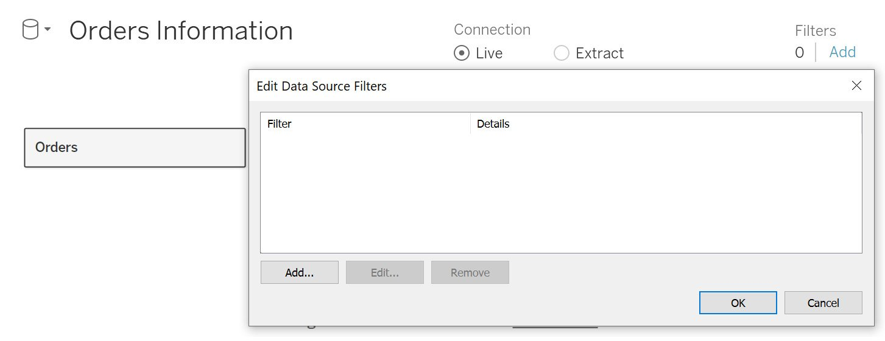
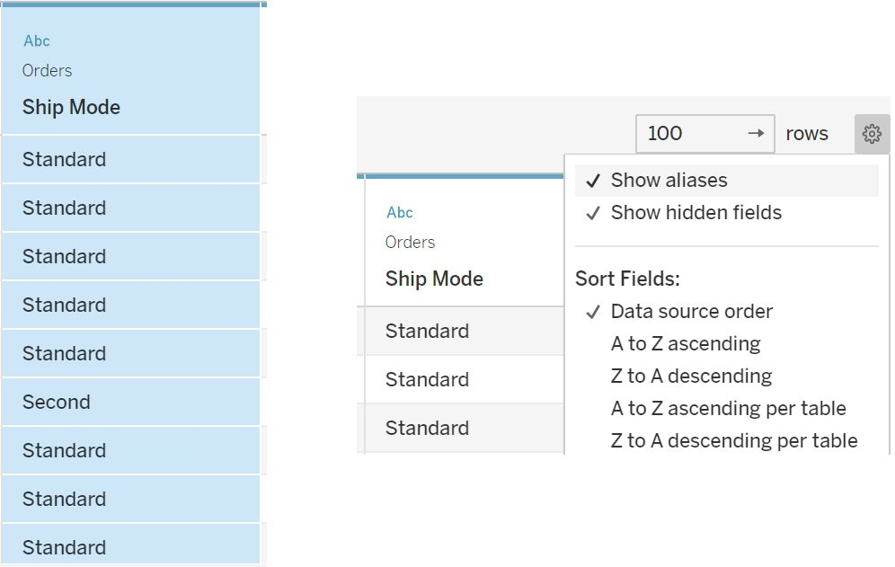
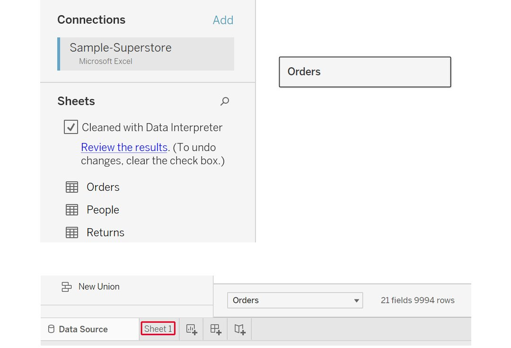
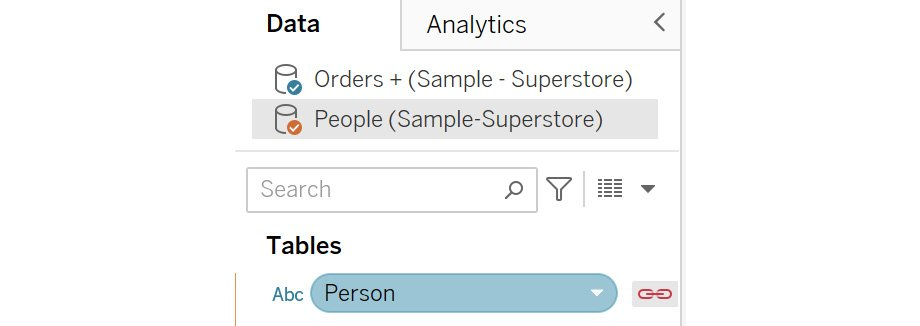
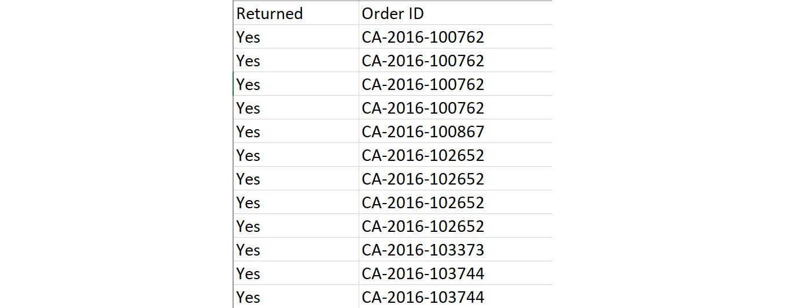

Lab 2: Data Preparation: Using Tableau Desktop 
==============================================

Overview

In this lab, you will learn to use various tools for data
preparation in Tableau Desktop and join different data sources using
various options. This will equip you with the knowledge required to
perform data manipulation activities, data transformation, and data
blending, and provide options to manage various data sources. By the end
of this lab, you will be able to extract and filter data and use
aliases for the clean presentation of data.

Connecting to a Data Source 
===========================

For any visualization, you need to have an underlying data source that
contains all the information you wish to show. This is the first step of
any data visualization task.

The very first thing that you will see when you open Tableau Desktop is
the `Connect` pane. Here, you can connect to a variety of data
sources and perform various tasks related to data handling, which you
will study in this lab. The following figure shows the screen that
comes up when you start Tableau Desktop:

Depending on the version, this screen might look slightly different, but
it should remain this way for the most part: you can observe that you
can connect to multiple file options such as Excel, text, and JSON
files. You can also connect to server-based data sources such as MySQL
and Oracle. `Saved Data Sources` provides sample data sources
that are available with Tableau Desktop.

In the following exercise, you will connect to an Excel file named
`Sample - Superstore`, which is available with Tableau
Desktop. This file contains an `Orders` sheet, which consists
of information for various orders, based on attributes such as order ID,
order category, ship mode, and customer details. It also has a
`Returns` sheet, which consists of orders that were returned.
You will use all of this data to perform various operations throughout
this lab, and visualize the data in Tableau Desktop.

Exercise 2.01: Connecting to an Excel File 
------------------------------------------

In this exercise, you will connect to your very first data source in
Tableau, the `Sample - Superstore` Excel file. This file is
automatically accessible to you if you have installed Tableau as
mentioned in *Lab 1*, *Introduction to Tableau*. It contains three
sheets, comprising order-level information stored in the
`Orders` sheet, customer information stored in the
`People` sheet, and order returns stored in the
`Returns` sheet, and can be quickly downloaded from the GitHub
repository for this lab at <https://github.com/fenago/tableau-advanced>. Make sure to
download this file on your system before proceeding with the exercise.

Perform the following steps to complete this exercise:

1.  Under the `Connect` pane, select the
    `Microsoft Excel` option.

1.  This will open up the file menu where you can select the Excel file
    from the file explorer. Navigate to the location where you have
    saved this file locally and then select to open the
    `Sample-Superstore.xls` file. You will see the following
    screen once the file is loaded:

1.  Hover over the table to get the `View data` option (as
    highlighted in the following figure) and preview the data:

The following figure shows the data preview:

Figure 2.5: View Data window showing the data preview

1.  Now, drag the `Orders` sheet onto the
    `Drag sheets here` area. This is also known as the canvas.
2.  The sheet should now have been imported into Tableau. Preview the
    data, as shown in the following figure:

You have thus connected and imported the data in Tableau.

1.  Hovering over `Sheet 1`, you can see the active
    `Go to Worksheet` option, which means that you can
    navigate to `Sheet 1` and start creating visualizations.

Once the data is imported, you can start the visualization development
by clicking on that option, as you will see later in the course.

In this exercise, you saw how you can connect to an Excel file. Tableau
also allows you to connect to data that is stored on servers. In the
next section, you will learn how this can be done.

Different Types of Joins 
------------------------

Tableau offers four types of joins. You will learn more about these join types in detail in the following
exercises.

Exercise 2.02: Creating an Inner Join Dataset 
---------------------------------------------

As an analyst, you might come across scenarios in which you need to
display the common records between two tables. This exercise aims to
show how to join two different sheets into a single data source in
Tableau.

You will join the `Orders` table with the `People`
table using an inner join. By doing so, you will be able to identify the
customer records present in the `People` table along with the
order information from the `Orders` table, which will help you
to understand customers\' buying preferences.

Perform the following steps to complete this exercise:

1.  Load the `Sample – Superstore` dataset into your Tableau
    instance as you did in *Exercise 2.01*.
2.  Drag the `Orders` table first, followed by the
    `People` table, from the `Sheets` area to the
    `Drag Sheets here` area. Alternatively, to add these
    sheets, you can double-click on them, and they will be added
    automatically to the canvas area. Tableau will auto-join the two
    tables using an inner join, as shown in the following figure:

1.  Click on the `Join` symbol to open the `Join` menu:

Note the various ways to join data. By default, Tableau performs an
inner join on the common field names:

1.  If there are no common names, select the columns manually to enable
    the join. Since you are joining the `Orders` and
    `People` tables, join on `Customer Name` from
    `Orders` and `Person` from `People`.
    First, de-select `Region`, which is auto-selected by
    Tableau. To do this, click on `Region` and select
    `Customer Name` from the dropdown, as you can see in the
    following figure:

Figure 2.17: Changing the join column

Figure 2.18: Final result of the inner join

1.  Repeat the same for the `People` table and select
    `Person` as the joining column. Your joined columns should
    be as follows:

Now it\'s time to validate the results. This can be observed in the data
grid screen in the bottom section.

You can see that you get only `58` rows in the joined dataset.
Here, only the values from the `Orders` table\'s
`Customer Name` column that match with values from the
`People` table\'s `Person` column will be returned
in the final dataset. Since the `Person` table has only four
values, only those values from the `Customer Name` column that
match these four are returned from the `Orders` table.

In this exercise, you used inner join and analyzed the results returned
by using this join type. Next, you will learn about the left join type.

Exercise 2.03: Creating a Left Join Dataset 
-------------------------------------------

In this exercise, you will join the `Orders` table with the
`People` table in a left join. The objective of the left join
is to verify how much customer information is present in the
`People` table. This will help identify and update the
`People` table so that you can expand the customer database,
to drive better sales:

Figure 2.20: Join screen for the Orders and People tables

1.  Repeat the same step from the previous exercise of dragging the
    `Orders` and `People` tables to the canvas. Once
    done, you should see the join options, as follows:
2.  Change the join type to `Left`:

Figure 2.21: Selecting the Left join

1.  Now, in the data preview (as shown in the following figure), scroll
    toward the right side. You will see two columns from the
    `People` table, `Person` and `Region`.
    Use the `Sort` icon to sort the values, as highlighted in
    the following figure:

Figure 2.22: Analyzing the left join results

1.  Scroll down to see what happens if the `Customer` names do
    not match any values in the `Person` column.

Figure 2.23: Nulls in the join result

You will observe that the rows where a match is not found are replaced
by a `null` value, which means the `Person` table
does not contain information for these customers. This means that you
can add this customer information to the `People` table to
improve the data quality.

In this exercise, you learned how to perform a left join and how data is
matched between the two tables. Next, you will learn about the right
join type.

Exercise 2.04: Creating a Right Join Dataset 
--------------------------------------------

In this exercise, you will join the `Orders` table with the
`People` table in a right join. Consider a scenario wherein
the `People` table consists of all the customers who have
previously bought your company\'s products, and you want to fetch a
complete list of the products a customer has bought, using information
from the `Orders` table. This will help you understand the
buying habits of customers based on their past purchases.

The steps to complete this exercise are as follows:

1.  Drag the `Orders` and `People` tables similar to
    how you did in the previous exercises so that you can see the
    following on your screen:

Figure 2.24: Join screen for the Orders and People tables

1.  Select the `Right` join, as shown in the following figure:

Figure 2.25: Selecting the Right join

1.  Now, in the data preview, scroll toward the right side. You will see
    the `Person` and `Region` columns from the
    `People` table. Use the `Sort` icon to sort the
    values, as highlighted in the following figure:

2.  

    

Figure 2.26: Analyzing the right join results

You will observe that the rows from the `People` table contain
information about customers with past orders. This can now help you to
analyze what products a person tends to buy often, and accordingly, you
can suggest similar products to them, for a better-targeted sales
strategy.

In this exercise, you performed a right join on two tables and saw how
to use the right join results to analyze data. Next, you will learn
about a full outer join.

A full outer join would combine the results of both the joining tables
into a single dataset. To do that in Tableau, you can use the join
properties and change the join type to `Full Outer`.

Figure 2.27: Selecting the Full Outer join

The next thing to cover is the union operation. In a union, the new
table will be appended below the previous table in the final dataset.
Usually, unions are used when you want to combine datasets with a common
structure of columns. For example, order information for 2021 can be
combined using a union with the order information for 2020 to get a
unified dataset.

In the next exercise, you will learn how to implement a union in
Tableau.

Exercise 2.05: Creating a Combined Dataset Using Union 
------------------------------------------------------

Consider a scenario related to a large retailer such as Walmart or
Amazon, operating in multiple regions. In such a case, it makes more
sense to store the data at the regional level so that it can contain
products customized to that specific region. If you were to compare how
the different regions perform among each other, you would need to
combine these different data sources into one. This is where the concept
of a union comes into play.

In this exercise, you will use the `Orders` table, which is
split by region. The files for different regions follow a similar column
structure as the `Orders` table but are segregated into
different sheets based on their regions, as you can see from the
following figure:

Figure 2.28: Input data for the Orders table preview stored as different
tabs

You have the data for two regions: `Central` and
`West`. You can implement a union to combine these two regions
into a single dataset, as outlined in the following steps:

1.  Save the files on your local machine. Load the `Union`
    Excel file using the `Connect` option from the location
    where the files are saved, as done for the previous exercises. Once
    the file is imported, you should see the following screen:

Figure 2.29: Orders table for the Central and West regions

1.  Double-click on the `New Union` option to open the
    `Union` popup, as shown in the following figure:

Figure 2.30: New Union popup

1.  Drag the two order tables onto the `Union` popup, as
    follows:

Figure 2.31: Adding tables in a union

1.  Click on `OK` to add the union to the data grid.

You can now preview the data in the bottom section. Tableau will combine
the data from both tables into a single data source.

Figure 2.32: Union data preview

1.  Scroll to the right side of the data preview. You will see two
    additional columns---namely `Sheet` and
    `Table Name`. `Sheet` signifies which Excel file
    sheet this data belongs to and `Table Name` refers to the
    table names in Tableau. This can be used to quickly identify which
    columns come from which sheets and tables.

Figure 2.33: Table identification columns in the union result

In this exercise, you learned how to perform a union of multiple data
sources.

In all the preceding exercises, you joined on only two data sources. It
is possible to add more than two data sources. You will just need to
specify in the join connection how the tables join to each other.

Figure 2.34: Joining with more than two tables

The preceding figure shows an example join on the `Orders`
table with the `People` and `Returns` tables. If
there were a common field between the `Returns` and
`People` tables, you could also join these two tables as per
your requirements.

This completes the various ways you can join multiple tables in Tableau
and concludes the discussion on the various ways to combine data from
multiple sources together. The following sections will deal with
preparing your data for your desired task.

Data Transformation in the Data Pane 
====================================

Once you finish combining the data, you may also need to make some data
adjustments, such as renaming certain columns or limiting the data to
use in your visualizations. These are some common examples of data
transformation.

Data transformations are a key step in preparing data for effective
visualization. In this section, you will learn about some commonly used
ways of transforming data. In particular, you will learn about the
following:

-   Data Interpreter
-   Renaming data sources
-   Live and extract connections
-   Filters
-   Data grid options

The following sections will define these one by one.

Data Interpreter 
----------------

Data Interpreter is an option available within Tableau that extracts
only the actual rows and columns by removing titles, headers, and extra
empty rows from the Excel data source.

You may sometimes add extra rows describing what kind of data the sheet
contains, or some empty columns to improve the readability of the sheet.
Consider the following example. Suppose you add certain comments to your
`Sample - Superstore` file, as follows:

Figure 2.35: Understanding Data Interpreter

From a data visualization point of view, rows 1 to 3 are meaningless as
they don\'t belong to the actual data and are simply headers. Tableau
can automatically remove these rows by using Data Interpreter.

Data Interpreter can be enabled by selecting the
`Use Data Interpreter` option.:

Figure 2.36: Enabling Data Interpreter

Once enabled, Data Interpreter will give you an option,
`Review the results`. Clicking on
`Review the results` will open up an Excel sheet of all the
changes made by Data Interpreter, as can be seen in the following
figure:

Figure 2.37: Reviewing the results of Data Interpreter

Renaming the Data Source 
------------------------

The data source can be renamed on the `Connect` screen just by
clicking on it and entering the name of your choice.

Figure 2.38: Renaming a data source

When working with data sources, you want to quickly identify the tables
you are working with. Renaming tables allows you to give custom names so
that it becomes easier to work with them.

Live and Extract Connections 
----------------------------

This is a very important concept for data visualization in Tableau. This
option decides how the data is connected to the visualizations.

Live connections allow Tableau worksheets to be updated in real time
based on any changes made in the underlying data sources. This may be a
good solution when the data must be updated on a real-time basis, such
as stock market data.

However, when developing the visualizations in a live connection, the
database will be queried for any changes performed in the view related
to the data. This may consume more time.

**Tableau Data Extracts** (**TDEs**), or **extracts**, are a compressed
and optimized way to bring all the source data into Tableau\'s memory.
TDEs improve the efficiency of the data query, which tends to increase
the speed of executions while working with the data in the
visualizations and performing user interactive activities such as
filtering and sorting over the data.

When developing the visualizations in an extract connection, the
database is also extracted into Tableau\'s local memory. Thus, any
visualization development will be much faster compared to a live
connection.

Exercise 2.06: Creating an Extract for Data 
-------------------------------------------

In the preceding exercises, you connected to the data using a live
connection. Now, you will create an extract for it. The following steps
should be performed to create a data extract for the `Orders`
table:

1.  Load the `Sample – Superstore` dataset in your Tableau
    instance as done in the previous exercises.
2.  Drag the `Orders` table to the canvas.
3.  Choose the `Extract` option, as shown in the following
    figure:

Figure 2.39: Creating an extract

1.  Once done, click on `Sheet 1` at the bottom of the page to
    navigate to that sheet.
    

    

Figure 2.40: Navigating to a worksheet

1.  This will open a popup to save the extract locally. Select a
    destination of your choice to save the extract.

Figure 2.41: Extract creation and save

Clicking on `Save` will create the extract and save it at the
specified location. There is also the `Edit` option, which can
be used to edit the properties of the extract. You will study these in
the next section.

1.  Refresh your extracts using the `Edit` or
    `Refresh` option if your data changes, as shown in the
    following figure:

Figure 2.42: Extract Edit and Refresh options

In this exercise, you created an extract using Tableau Desktop.

Extract Properties 
------------------

To access the extract properties, you can click on the `Edit`
option next to `Extract`, as shown in *Figure 2.42*, to open
the following window:

Figure 2.43: Extract edit properties

The following sections will describe this window and its fields in
detail.

### The Data Storage field 

If you have multiple tables, the `Multiple tables` option will
be enabled. For now, since you have a single table, the
`Single table` option is enabled.

### The Filters field 

You can restrict the data in the extract using filters. For example,
suppose you want only the data for the `Central` and
`East` regions; you can easily do that using the
`Add…` option. Select `Region` as the column to
filter and select the `Central` and `East` values to
add them as the filter condition.

Figure 2.44: Adding a filter condition

As shown in the following figure, `Central` and
`East` regions should be selected:

Figure 2.45: Selecting Central and East regions

Figure 2.46: Creating extract filters using the Region column

You will learn more about these filters as you progress through this
lab.

### The Aggregation Field 

You can also change the granularity of the data using this option. If
you have dates in the dataset on a `Day` level, you can roll
them up or aggregate them to a higher level using a different option,
such as `Month` or `Year`. You will learn more about
aggregations later in the course.

Figure 2.47: Transforming the data aggregation level

### The Number of Rows Field 

Using this option, you can choose the number of rows the extract should
contain. `All rows` will include all the rows, `Top`
will include only the specified number of rows, and `Sample`
will contain a sample of specified rows. This is useful when you are
working on a very large dataset, but for development purposes, you just
need a sample of the data.

Figure 2.48: Sample selection using the number of rows

On selecting `All rows`, you will also get an option called
`Incremental refresh`. Instead of refreshing the data every
day, you can use this option to specify which field can be used to
identify new rows so that only the specified section of the data is
refreshed. This option is helpful when you have a very large dataset
that updates at regular intervals wherein the old data does not change.

Consider the case of banking transactions. The bank will never modify
the old data but would keep adding new data to maintain the historic
data. In this case, an incremental refresh would be very helpful during
extract refreshes.

Figure 2.49: Identifying the column for performing refresh

Now that you understand what values to add in these fields, you\'ll
review what factors to determine when choosing the type of connection.

### Which Connection Is Better -- Live or Extract? 

Ideally, in most projects, an extract is the ideal approach, but there
may be a need to showcase live data as in the example you saw before.
The following points should be considered before choosing an extract or
a live connection:

-   **Updated or delayed data**: If you have a requirement for which you
    need the most up-to-date information whenever you view the
    dashboard, you would need a live connection. Otherwise, if you are
    comfortable with some delay in the latest data, an extract is a
    better choice.
-   **Data volume**: If your data volume is very large, it is ideal to
    use a data extract instead of a live connection as it might take a
    lot of time to develop dashboards on live connections.

With these points in mind, you can choose the right type of connection
for your project.

Filters 
-------

This option is similar to the `Extract Filter` property you
learned about before. These filters are also known as data source
filters because they filter data at the source. You will further study
various filters later in the course.

Consider the example of a large retailer such as Amazon, where the data
has a large volume. Suppose you want to analyze the data for a specific
region. In this case, it is not prudent to pull the whole data in
Tableau as it would make the dashboard slower, and also, you would not
have any use for the data other than that for your target region.

For such a case, you can use the `Data Source Filter` option.
This would restrict the data at the source itself and only bring in the
required data based on the filtering criterion specified.

Exercise 2.07: Adding a Region Filter on the Orders Table 
---------------------------------------------------------

Consider that you want to add a `Region` filter on the
`Orders` table, to bring the data for the `Central`
and `East` regions only. You can do so by following these
steps:

1.  Load the `Sample - Superstore` dataset in your Tableau
    instance.
2.  Drag the `Orders` table onto the canvas.
3.  To add a filter, click on the `Filters` \| `Add`
    option to open the popup:

1.  Click on `Add…` to open the columns list. Select
    `Region` as the column:

1.  Select `Central` and `East` as the regions that
    will be kept in the data. Click `OK` to add the filter, as
    follows:

You can similarly add more filters by clicking on the `Add…`
option and repeating the previous steps.

1.  You can also edit and remove the existing filters. To do that,
    select the filter you want to edit or remove and then select the
    required option, as shown in the following figure:

1.  Once you have added the filter, preview the data in the data grid.
    You will observe that you only have data for the `Central`
    and `East` regions, as expected.

In this exercise, you learned how to apply a filter and the various
properties associated with a data source filter. In the next section,
you will learn how to transform data using the data grid.

Data Grid Options 
-----------------

The data grid allows you to preview data. You have been using it so far
just to check the number of rows the data contains, but it also contains
several other options to transform data before you start with the
visualization development. In this section, you will learn about these
options and how to use them to better understand the data
transformations.

**Data preview**: You can use this to preview the data. You can also
select the number of rows to be displayed, by specifying the number in
the box on the right, as can be seen in the following figure:

**Metadata**: Metadata provides information about the source, such as
the table name. Toggling to the metadata view, you can see all the
metadata about the data. You can view the various columns, the table
they come from, and the remote field name.

If you rename a field here, the remote field name will show the original
field name pulled from the data.

Note

In Tableau version 2021.4, the metadata is automatically available
beside the preview, and you will not have to choose between these
options.

The `Sort fields` option will sort the data as per the option
you select. You can try changing these options and observe how the data
preview changes.

Now, consider the following data transformation options.

**Change data type**: Using this option, you can change the data type of
a column. By clicking on the `Abc` icon (see the following
figure), you can select the required data type from the drop-down box
for the column. A common example is the `Customer ID` field
being stored as a number where you might want it to be a string:

**Data transformation**: When you click on the drop-down icon, as shown
in the following figure, you can see the options to transform the data,
such as creating calculated fields on existing columns and creating
groups. All these options are also available after you load the data.
These will be covered in detail later in the course:

The `Rename` option allows you to rename the column. You can
also hide a column if it\'s not required in the data visualization. You
can select the `Show hidden fields` checkbox to view any
hidden columns. Hidden columns are grayed out in the view, as indicated
in the following figure:

Hidden columns cannot be used in the visualization. If you want to use a
column after hiding it, you need to first unhide the column to use it in
the visualization. This can be done by clicking on the dropdown and
selecting the `Unhide` option.

**Aliases**: Aliases are a very effective way to present data in the
visualization with a different name.

Observe the `Ship Mode` column in the data preview. You can
see that the word `Class` is repeated for the different
`Ship Mode` values, and it does not add any value; so you can
exclude this word from all the values. This can be done using the
`Aliases` option, which will help you to display the values as
a different name. To add aliases on the column, click on the dropdown
and select `Aliases…`, as shown in the following figure:

This will open the popup to rename the values. Remove the word
`Class`. Click on `OK` to add it to the data. You
can also clear the aliases using the `Clear Aliases` option.

You can use the `Show aliases` toggle to switch between the
original names and the aliases. Aliases are generally used to rename
null records to blank or columns containing long value names.

All these options are also accessible after you load the data in the
worksheet.

In this view, you learned how to perform data transformations before
pulling the data in the worksheets.

In all the exercises previously, you just joined on two data sources.
But it is also possible to add more than two data sources. You will just
need to specify in the join connection how the tables join to each
other.

This completes the various ways you can join multiple tables in Tableau.

Data Blending 
=============

In data blending, you query the data between the two data sources and
then combine the result at the aggregation level defined in the
worksheet of the primary data source. The primary data source will be
the one from which the first dimension or measure is added in the view.
Also, the results would be similar to a left join since all the records
from the primary data will appear in the worksheet.

Exercise 2.08: Creating a Data Blend Using the Orders and People Tables 
-----------------------------------------------------------------------

In this exercise, you will learn how to create a data blend for the
`Orders` table with the `People` table. The
following steps will help you complete this exercise:

1.  Load the `Sample – Superstore` dataset in your Tableau
    instance.
2.  Connect to the `Orders` table and go to
    `Sheet 1`.

1.  In a data blend, create the linking at the worksheet level and not
    at the data source level. Inside the worksheet, you will be able to
    see the `Orders` table and its columns. Add a new data
    source, as follows (see the highlighted option):

1.  This should lead to the same menu that you get for connecting to a
    data source. Click on `Microsoft Excel`, navigate to the
    location of the `Sample – Superstore.xls` Excel file, and
    click on `Open` to open the `Connect` pane.

1.  Now, drag the `People` table to the canvas and go to
    `Sheet 1` like before:

Now, you will be able to see the two data sources, as follows:

1.  Add a relationship between these data sources to use them. To do
    that, click on `Data` \| `Edit Relationships…`
    to open the popup.

    Note

    If you are using a Tableau version later than 2020.1, this may be
    called `Edit Blend Relationships...` to differentiate
    between relationships made directly in the `Data Source`
    tab.

1.  Based on the field names, the relationship can be set to
    `Automatic` by default. To change it, click on
    `Custom` and add the relationship. Edit the relationship
    to `Customer Name` and `Person`, as highlighted
    in the following figure. Select `Region` and then
    `Edit…` before making the selections in the popup. Click
    `OK` to add the relationship:

Thus, you have successfully blended the two data sources and can
visualize your data in the next exercise.

Exercise 2.09: Visualizing Data Created from a Data Blend 
---------------------------------------------------------

In the previous exercise, you learned how to perform data blending
between two data sources. In this exercise, you will create a
visualization on the blended data to understand the application of a
data blend -- again, you will continue using the `Orders`
table and the `People` table for this purpose. Note that a
blend will only be active if you use the fields from these two data
sources; otherwise, it will remain inactive.

Perform the following steps to complete this exercise:

1.  On the `Orders` data, click and drag
    `Customer Name` to `Rows`.

    Note

    Tableau versions later than 2020.1 may give a warning at this step
    that the field may contain more than 1000 rows. If this is the case,
    select `Add all members` to proceed.

This will now become your primary data source, indicated by the blue
tick on the data source.

1.  Repeat the step for the `People` data source.

This will become your secondary data source, indicated by the orange
tick on the data source. Also, notice the red linking icon that is used
to link the two data sources.

1.  When you filter on `Person` for the four people that you
    have in the `People` data, you will see that you have
    linked these values between these data sources. Click on the
    `Person` column dropdown and then `Filter…`,
    uncheck the `Null` value, and click `OK` to add
    the filter.

You will get the following output, which shows the customer name
matching `Person`:

Activity 2.01: Identifying the Returned Orders 
----------------------------------------------

As an analyst, you may encounter a situation where you would like to
assess business performance by sales. It is therefore important to
understand how many orders are fulfilled and how many are returned. If
certain products are being returned frequently, it is a point of
investigation as it can have serious consequences on the business.

Usually, order information is kept separate from returns information.
Hence, to bring this information together, you need to join the two data
sources.

For this activity, you will use the `Orders` and
`Returns` tables from the `Sample - Superstore`
Excel file. You are already aware of the `Orders` table.

The `Returns` table consists of the `Order ID` and
`Returned` columns. `Order ID` is the ID that would
match with the `Orders` table. The `Returned` column
indicates `Yes` for the order ID.

Figure 2.78: Returns sheet columns

The objective is to identify the returned orders after combining them
with the main `Orders` table so that you may determine which
orders were both fulfilled and returned.

The steps are as follows:

1.  Open the `Sample - Superstore` dataset in your Tableau
    instance.
2.  Rename the data source to `Activity 1`.
3.  Drag the `Orders` table onto the canvas.
4.  Repeat the same steps for the `Returns` table.
5.  You need to bring all the `Orders` and `Returns`
    table values into the combined dataset. Can you identify the correct
    join based on the requirement? Remember that for an order to be
    returned, it should always be completed first. What can be
    interpreted if you change the join types to left, right, or full
    outer in this case?
6.  Identify how many products were returned from the data grid. (An
    order can have multiple products clubbed in it.)

**Final Output Expected:**

In this activity, you strengthened your knowledge of various joins and
their outputs. You also learned how to interpret the results by changing
the join types.

Activity 2.02: Preparing Data for Visualization 
-----------------------------------------------

Now that you have joined the data, the next step is to make sure that
the data is ready for visualization. This involves performing data
transformation activities such as cleaning the data by removing the null
values. You may also be required to rename certain columns or add
aliases, split the columns, and so on.

In this activity, you will perform some data transformation steps based
on the left join output of the previous activity.

This activity will help you to strengthen the concepts of data
transformation in Tableau. This is a very important process in any
Tableau project. Hence, it becomes crucial that you are well experienced
in doing these in Tableau.

The objective of this activity is to transform the data into a cleaned
form for visualization. You need to first create an extract for this
data source. Then you need to display the data only for the
`Furniture` and `Office Supplies` categories. Is
there a way to do this using the extract properties? You will also clean
up the final data by changing any nulls to blanks. Let\'s also remove
repeated terms such as `Class` from the `Ship Mode`
column.

Once done, your data should be ready for visualization.

Continuing from Activity 2.01, the following steps will help you
complete this activity:

1.  Open the `Sample - Superstore` dataset in your Tableau
    instance.
2.  Create a data extract for this data.
3.  Add a filter on the data to pull the `Furniture` and
    `Office Supplies` categories. Check the row count.
4.  Transform the data by aliasing a few columns.
5.  Alias the null values from the columns of the `Returns`
    table to blanks.
6.  Remove the word `Class` from the `Ship Mode`
    column.

Once completed, you should get the following output:

**Final Output Expected**:

In this activity, you learned how to extract the data. You also added
filters for the `Category` column to just pull the selected
categories. Many times, you will work on projects that require the data
to be segregated at the beginning, such as regional data. These filters
help you to achieve exactly this. You also transformed the data using
aliases, making it much cleaner by removing repeated words and nulls.

Summary 
=======

In this lab, you learned how to connect to various data sources,
which is the foremost step in data analysis in Tableau. Next, you
learned about the various join options that Tableau provides and data
transformation options to optimize the data for the final visualization.
Joining tables is one of the most common requirements in practical data
analysis. For instance, if you have two tables for employee details and
department details, to find the number of employees per department, you
would use a join key to get the required information.

You also learned about some advanced data joining options of blending
and custom SQL. The key takeaway from this lab is how to connect
data most efficiently based on the requirements and also how to
transform the data so that it becomes more suitable for the
visualization activity. The next lab continues with the topic of
data preparation in Tableau Prep.
