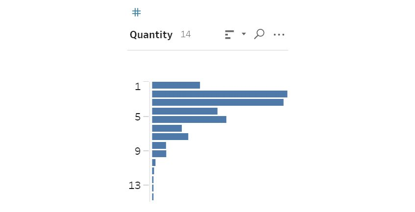
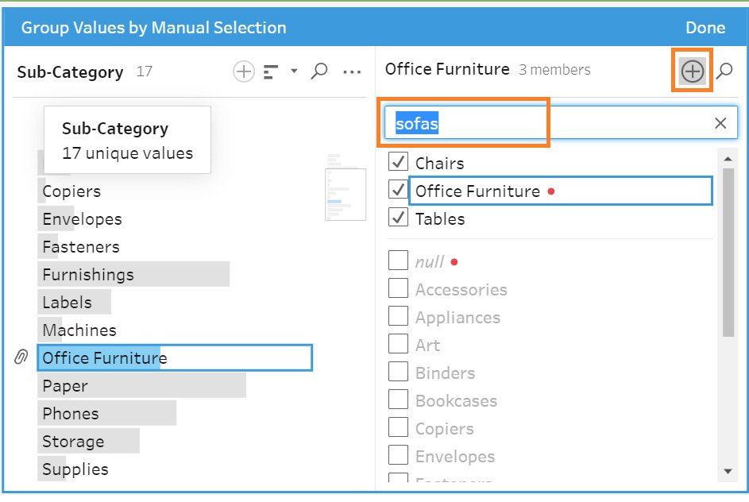
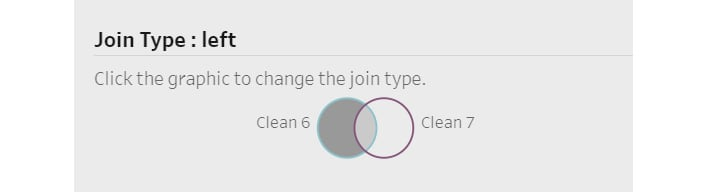

Lab 3: Data Preparation: Using Tableau Prep 
===========================================


Overview

In this lab, you will learn some advanced data preparation methods
in Tableau Prep. You will learn how to use various Tableau Prep options
to clean datasets, join different data sources using various options,
and perform data manipulation activities such as pivots, grouping, and
aggregations. By the end of this lab, you will be able to export a
cleaned data source to develop visualizations in Tableau.


Prep Interface 
==============


In this section, you will look at the options available in Tableau Prep
for data transformation.Navigate to your desktop
and click on the Tableau Prep icon to open it.

When you open Prep for the first time, it will look like this:


The `Connections `tab (top-left corner), shows all data
sources that can be connected in the prep. This is similar to the
`Connect` pane in Tableau Desktop. (*Lab 2, Data
Preparation Using Tableau Desktop*.)


Throughout this lab, you will be working with file-based connections
such as Excel spreadsheets and CSVs. First, let\'s look briefly at the
other options available on the start screen (as shown in *Figure 3.1*):


In the preceding figure, you can see the following elements:

-   `Open a Flow`: This opens a workflow that has already been
    created. A workflow, or flow, is a series of data transformation
    activities that you perform on the input data in Prep. You will
    learn about creating different flows in the upcoming sections.
-   `Connect to Data`: This opens the `Connections`
    menu, where you connect to data, as shown earlier.
-   `Recent Flows`: All previous flows can be viewed here. You
    can toggle between card view or list view using the controls on the
    right side.

Other than these options, you also have `Sample Flows`
provided by Tableau, and the `Discover` menu, where you can
check out Prep-related content updates on the Tableau website.

There are also other `File`, `Edit`,
`Flow`, and `Server` menu options at the top. The
`File` and `Edit` options should be
self-explanatory. The `Flow` menu can be used to run the flow,
and the `Server` menu has the option to sign in and publish
the flow on Tableau Server.

Now that you have learned about the various options, it\'s time to add
some data in the flow.


Adding Data in the Flow 
=======================


As seen in *Lab 2*, *Data Preparation using Tableau Desktop*, the
first step of any data preparation activity is to add the data into your
workflow. To do that in Prep, click on `Connections` and
select the data source. In the following exercise, you will connect to
file-based data sources, but the process is similar for server-based
data sources.


Exercise 3.01: Connecting to an Excel File 
------------------------------------------

In this exercise, you will connect with your very first data source in
Prep. Follow these steps to complete the exercise:

1.  After installing Tableau Prep Builder, find the files in the
    following location on your computer:
    -   Windows
        
        ```
        C:\Program Files\Tableau\Tableau Prep Builder <version>\help\Samples\en_US\Superstore Files
        ```
        
2.  Click on `Connections` and select the
    `Microsoft Excel` option.
3.  This will open the menu from which you can select the Excel file.
    Navigate to the aforementioned location and open the
    `Orders_East.xlsx` file.


You will get the following screen once the Excel file has loaded:


Figure 3.5: Data input properties

There are a lot of tabs and options on this screen. These will be
covered in the upcoming sections.

1.  Click the `+` icon (*Figure 3.6*) to see the steps that
    can be applied to this input data step:


Figure 3.6: Adding steps to a workflow

Now it\'s time to add an output step. To do so, click on `+`
and select `Output`. An output tab will open, and you can
preview the data.


Figure 3.7: Output step properties in the workflow

Here, you learned how to connect to an Excel file. Next, you will learn
about bringing multiple inputs into the flow.


Exercise 3.02: Connecting with Multiple Data Sources 
----------------------------------------------------

Ideally, in a business project, data should be stored in separate
sources. Thus, it is important to know how to connect to multiple data
sources. In this exercise, you will try to add another data source to
your existing flow.

You will be connecting the `Orders_South` data, as follows:

1.  Continuing from the last step of the previous exercise, click on
    `+` and select the `Text file` option. This is
    because the required data is stored as a CSV file, which is a type
    of text file.


Figure 3.8: Connecting to a CSV file

1.  Now, navigate to the `Order_South` folder under
    `Superstore Files`. Select
    `orders_south_2018.csv` and click on `Open` to
    bring the file into Prep.


Figure 3.9: Data explorer window to view input files

You should get the following screen:


Figure 3.10: Adding multiple files to the workflow

The following steps will walk you through the various tabs in the
`Input` pane shown in *Figure 3.10*:


Figure 3.11: CSV input properties

1.  The `Setting` tab is mostly related to the connection
    details of the data source, and might vary depending on the data
    source connection. You will find options here to edit connection
    details, select text options, decide which field separators to use,
    and more.
2.  You also have options such as `Text Qualifier`,
    `Character Set`, and `Locale`. Prep is smart
    enough to recognize these configurations but, if required,
    configurations can be changed as per requirements. Finally, there is
    an option for `Incremental Refresh`. This is similar to
    Tableau Desktop, and can be used to load new data based on certain
    columns rather than pulling all data every time the flow runs.
3.  Select the `Multiple File` tab to get the option to add
    multiple files together.


Figure 3.12: Options to input multiple files

1.  Now, change the selection to `Wildcard union`. Suppose you
    want to get all the `orders_south` files from the folder.
    You can simply search it by a pattern (`*south*`) and get
    all the files you want to find (*Figure 3.13*).


Figure 3.13: Wildcard search for multiple file input

You can search for files like this in the folders (or subfolders) as
well. You can also include or exclude files that match a pattern. By
including an asterisk (`*`) you can selectively ignore all
characters before and after a keyword.

1.  Click on `Apply`, and all these sheets will be included in
    the flow. Prep also includes a new column, `File Paths`,
    which indicates the locations this data is coming from.


Figure 3.14: Identification of input file source using File Paths

1.  Next, select the `Data Sample` tab. Here, you get the
    option to sample the input data, which is especially useful if the
    data is vast. Ideally, when working with a very large dataset, it is
    better to work with a sample to save time while developing the
    workflow, as the workflow will run faster if there are
    fewer records.


Figure 3.15: Sampling the input data

By hovering over the information icon, you can check how Prep samples
the data.

1.  Select the `Changes` tab. Any changes made to the data
    will be tracked here. A simple example is unchecking certain column
    names in the data. For example, if you uncheck the `Sales`
    and `Quantity` columns, these are immediately added to the
    `Changes` tab. The changes are also indicated by the
    annotations (small icons) in the `Changes` column, and on
    the data input icon as well. (Figure 3.16.)


Figure 3.16: Tracking changes in the workflow

In this section, you learned how to connect multiple data sources in a
workflow and their configuration properties. Next, you will learn how to
profile data in Prep.


Data Source Profile 
===================


Until now, you have only connected to different data sources. But your
main objective is to understand the data better. This can be done by
observing the data distribution, the data types of various columns, the
values that a column contains, and so on.

A data source profile gives you an understanding of the underlying data
by allowing you to observe the data distribution and frequency, along
with the various data types for the fields. This helps you make
appropriate changes to the data to fulfill the requirements in the flow.
Some common options include checking the data distribution frequency,
the number of unique records, and the associations among various
columns. You will first learn about some commonly used profiling steps,
and then apply them in an exercise.

Data source profiling can be performed using a clean step. A clean step
can be added by hovering over the `+` icon next to the data
source and selecting `Clean Step`, as follows:


Figure 3.17: Adding a clean step in the workflow

Now, a clean step has been added to the workflow, which will open a new
window for its connected input dataset. In this window, you can profile
your data.


Figure 3.18: Clean step properties

The preceding screenshot shows the data profile pane. Each column will
give a slightly different representation, depending on the data type.

For example, a string data type will give a distribution of the
frequency with which it has occurred. If you observe the
`Customer Name` column (as shown in the following screenshot)
you will observe the number of orders placed by a customer. This is
because the view is based on the customer order frequency.


Figure 3.19: Observing Customer Name value frequencies

For a numeric column type, the profile would just give a histogram
indicating the distribution of the values. Observe the
`Quantity` column, which is a number. The data profile
provides a histogram that can help you understand the range of the
quantities sold.





Figure 3.20: Data profile for a numeric column

Now that you have learned about the concept of data profiling, it\'s
time for an exercise, to practice using the data profile of the
`Orders` dataset.


Exercise 3.03: Data Profile for the Orders\_South Dataset 
---------------------------------------------------------

In this exercise, you will learn how to better understand data using the
data profile options in Prep.In the previous workflow, you connected to
the `Order_South` dataset . This is a continuation of that
exercise.

1.  Perform the following steps:
2.  Once the data is connected in Prep, click the `+` icon and
    then select `Clean Step`:


Figure 3.21: Adding a clean step

1.  Click on the clean step to open up the details, as follows:


Figure 3.22: Data profile for Orders\_South data source

1.  Hover over the `Product ID` column to see the unique
    values it contains. You also have the option to change the data
    type, and sort, search, and perform a cleaning operation on it.
    Additionally, you also get a composition of the data using a
    histogram, as shown in the following screenshot:


Figure 3.23: Observing the frequency of the values in the Product ID
column

1.  Select any value. Note that all associated rows are now highlighted.
    For example, if you select the state of Florida, you will see how
    the data is connected across the other columns. You will also
    observe that its profit trend is on the lower side, which indicates
    Florida is a low-selling state.


Figure 3.24: Associations across multiple columns in the data profile

Using data profiling like this, you can quickly see trends in data using
the data distributions, which allows us to quickly spot and remove
anomalies such as negative quantities sold.. These options will be
covered in detail in the next section.


Data Preparation Using Clean, Groups, and Split 
===============================================


Cleaning is a very important part of data preparation, because having
the right data leads to proper and efficient data analysis.

For example, imagine the sales amount for an order in a dataset is
blank, but an order is processed anyway. This cannot be right, and
requires some action. The order in question should either not be
included, or the sales amount should be replaced with an average.

Another example would be the same customer having multiple names, or
more than one customer ID. You may need to combine the names into one to
correctly analyze information. All such tasks can be done using data
cleaning. Prep provides a variety of options to clean data. In this
section, you will learn about them.

Refer to the `Orders_South` dataset workflow that was created
earlier:


Figure 3.25: Orders\_South workflow

Right-click on the `Clean 1` step to open the additional
properties, as shown in the following screenshot:


Figure 3.26: Step customization option properties

Here, you can perform operations such as renaming, adding a description
and editing the color of the step, as explained in the following points:

-   `Rename`: Double-click or *Ctrl* + *click* (if you are
    using Mac) on the field name. This opens a text entry box. Here, you
    can add a name of your choice to this step.


Figure 3.27: Rename the clean step in the workflow

-   `Add Description`: Descriptions clarify the purpose of a
    step. This is especially useful if the workflow is being used by
    multiple people. To add a description, right-click on the step and
    select the `Add Description` option.


Figure 3.28: Adding a description to the clean step in the workflow

After you have added a description, the text appears under the step as
follows:


Figure 3.29: Toggling the description for the clean step in the workflow

You can choose to show or hide the description by clicking on the
highlighted icon in the preceding figure. After you have added the
description, you can also edit or delete it. To do that, right-click on
the step again and you will see the `Edit Description` and
`Delete Description` options (*Figure 3.30*):


Figure 3.30: Description editing and deleting options for the clean step
in the workflow

-   `Edit Color` will change the color of the step. This is
    useful for visual identification in various steps of the flow.

You will now focus on the bottom pane. This is also known as the profile
pane, which you saw earlier. Here, you will find the
`Filter Values` and `Create Calculated Field`
options. You will notice that Prep also gives recommendations related to
the data. You can toggle between the three views using the view options.


Figure 3.31: Recommendations for data cleaning in the workflow

-   `Change Data Type` changes the column\'s type to another
    data type. The following images shows the different data types in
    Prep:


Figure 3.32: Changing the column data type

Currently, the column has the `Number (decimal)` data type
selected. If required, you can select `String` to change the
column\'s data type accordingly.

`Number (decimal)` and `Number (whole)` are numeric
data types. `Date & Time` is used for columns consisting of
date or time values. A `String` data type is used for columns
consisting of character values. You also have `Data Role`.
This is applicable to string data types, and further defines the type of
string values a column contains.

Often, you will need to change the column data type for correct
representation. For example, if a postal code is saved as a numeric data
type, then it is not the correct representation. Although postal codes
are numbers, their true representation is in the form of a
`String,` with a `Geographic` role. You will now
learn how to change the data types based on the following examples in
Prep. Refer to the recommendations provided:


Figure 3.33: Changing the column data type using recommendations

As you can see, `State` is saved as a `String,` but
no data role is assigned to it. To assign a data role to
`State`, click on the `State` column, then change
`Data Role` to `Geographic` --
`State / Province`, as shown in the following screenshot:


Figure 3.34: Changing the column data role

You can do the same for other columns as well, that is, for
`City`, `Postal Code`, and `Country`. All
the changes that we perform will be tracked on the `Changes`
tab.


Figure 3.35: Applying the recommendations to the other columns

At any time, if you want to reverse a change, you can select it by
hovering over the change and selecting the `Remove` option, as
follows:


Figure 3.36: Reversing a change in the workflow

This is how the result looks after changing the data type and roles of
these columns:


Figure 3.37: How the columns look before the changes


Figure 3.38: Columns after the changes are made

These changes help to create the right type of visualization to draw
useful insights -- for example, if these were simple string types, you
would not be able to create geographical visualizations such as maps.
This would restrict your visualization abilities to draw certain
insights, such as which cities or which postal codes order most products
or how they compare with other cities.


Additional Clean Steps 
----------------------

In the previous section, you learned how to add a clean step, and how to
track changes using various options related to the clean step. You also
saw how to change the data types and data roles. In this section, you
will learn about some additional cleaning steps that are available at
the individual column level. You will continue working in the same data
profile pane.

To access additional cleaning steps, hover over individual columns and
click on the `…` icon to see the additional options, as
follows:


Figure 3.39: More cleaning options

Before proceeding, it is important to note that certain columns might
have some unavailable options due to the different data types. For
example, for `Country`, `View State – Summary` is
disabled. However, it is available for the `Profit` column, as
the following screenshot shows:


Figure 3.40: Available options based on column data type

With that in mind, it\'s time to learn more about the additional options
you can use to clean your data.


Cleaning Steps at the Column Level 
----------------------------------

In this section, you will learn about adding the filter and calculation
options on the input data source. You will continue from where you left
off, after changing the data roles.

Filter: The filter option allows you to select a subset of the data from
the dataset. This option limits the data being pulled into the workflow.
Quite often, it is useful to limit your analysis to specific subsets of
the data to analyze it further. We can achieve this using the filter
options. For example, you might wish to identify the `State`
with the highest orders. This can be easily done by sorting the
`State` column as follows:


Figure 3.41: Sorting the State column


Exercise 3.04: Applying a Filter in a Clean Step 
------------------------------------------------

In this exercise, you will learn how to apply a filter in the clean
step. You can see in *Figure 3.41* that Florida has the highest number
of orders. You can now filter the data to show only the orders for
`Florida`.

Follow these steps to complete this exercise:

1.  Click on `…` and select `Filter` --
    `Selected Values`.


Figure 3.42: Different filter types

1.  Select `Florida` from the list and click on
    `Done` to filter the data:


Figure 3.43: Selected Values filter properties

There are also other ways to filter the data using
`Calculation...`, `Null Values`, and
`Wildcard Match`:


Figure 3.44: More ways to filter the data

1.  `Null Values` filters the nulls in the data, while
    `Wildcard Match` filters based on a keyword.


Figure 3.45: Calculation filter properties

As the name suggests, the `Calculation…` filter filters the
data based on certain calculation conditions.

1.  Now, create a calculation to check which month had the highest
    orders. To do that, click on the `…` icon on the
    `Order Date` column, then find
    `Create Calculated Field` and
    `Custom Calculation`:


Figure 3.46: Creating a calculation in the workflow

1.  This will open the calculation editor. Type the following expression
    in the editor and rename the calculation
    `Order_Date_Month`:
    
    ```
    Month([Order Date])Copy
    ```
    


Figure 3.47: Calculation editor properties

1.  Sort the months and observe that the highest sales are in November,
    followed by June:


Figure 3.48: New column added using calculations

Note

Given timing and version variance, your calculation may result in a
different month for highest sales. The step instruction to sort will be
the same regardless.

Based on the conditions you specify, you can create calculations in a
similar manner for filters. You will learn about calculations in more
detail later as you progress through the course.


Exercise 3.05: Cleaning a Column in the Workflow 
------------------------------------------------

In the previous section, you learned how to filter data using various
conditions. You also learned how to add calculations to this data
source. In this exercise, you will learn about the `Clean`
option.

The `Clean` option provides string operations that can be used
to clean the column. Examples include removing punctuation marks or junk
characters, making the character uppercase or lowercase, removing
numbers from the strings, and more. The following steps must be executed
to clean a column:

1.  Continue with the same workflow from the previous section. Observe
    the `Product Name` column. It contains a lot of junk
    characters, such as `#` and `'`. You can remove
    these characters, as they are not very useful for analysis.


Figure 3.49: Product Name preview with junk characters

1.  To access the `Clean` option, click on the `…`
    icon. The `Clean` option will provide a variety of
    functions to clean the data, as you can see in the next screenshot:


Figure 3.50: Various clean methods

1.  Now, use the `Remove Punctuation` option for
    `Product Name`, as follows:


Figure 3.51: Using the Remove Punctuation option to clean the Product
Name column

You will get a clean column without the junk characters:


Figure 3.52: Cleaned Product Name column

There are also a few other options, such as removing numbers or
characters, changing the casing, and removing spaces in the values.
These options are self-explanatory and can be used as and when the
project requires.


Grouping Values 
---------------

To group values means to combine two or more values into a single
combined value so that they are represented as one value or group. This
is generally used when the data contains spelling errors that result in
the same value appearing in different forms.

Think back to our customer with multiple names being represented by
different customer IDs. This data issue can be resolved using group
values. We can combine the multiple customer names into one customer
using group values.

Like the `Clean` option, the `Group Values` option
can be accessed by hovering over a column and clicking the `…`
icon, as follows:


Figure 3.53: Various Group Values methods

You will learn how to use this option in a workflow in the next
exercise.


Exercise 3.06: Grouping Values into a Group 
-------------------------------------------

In this exercise, you will group the `Sub-Category` values
`Chairs` and `Tables` into a group using the
`Manual Selection` option. Follow these steps to complete
this exercise:

1.  Click the dropdown on the `Sub-Category` column, then
    select `Group Values` and `Manual Selection`:


Figure 3.54: Group values using the Manual Selection method

1.  Towards the left of the window, select the `Chairs` value,
    which should add a member group, also called `Chairs`, to
    the right. By default, the group will have the same name as the
    first member, which in this case is `Chairs`.


Figure 3.55: Adding members to a group

1.  To rename the group to `Office Furniture`, double-click on
    `Chairs` and type in the new name, as shown in the
    following figure:


Figure 3.56: Renaming a group

Now the new group name should be visible as follows:


Figure 3.57: Updated group name

1.  Now you can add more members to the group using the right column.
    Add `Tables` to this group by selecting that value:


Figure 3.58: Adding additional members to the group

1.  You can also add values that are not currently in the data but will
    be added in the future. To do that, click on the `+` icon
    and add the value in the textbox. You will see a red dot next to the
    value, indicating that it does not currently exist in the data. Note
    that this value should match the future expected value, or else it
    might not get automatically added to the group.





Figure 3.59: Adding future values to the group


Figure 3.60: Adding future available members to the group

1.  Next, click on `Done` to add the group. The new group will
    be added, indicated by a paperclip icon (*Figure 3.61*).


Figure 3.61: The grouped value replaces individual values in the
Sub-Category column

This is an example of manual grouping. Another way to group data, is by
using built-in algorithms that enable us to do this automatically using
pronunciation, common characters, or spelling. A common example is the
same phrase written in different ways, such as \"Tableau Prep\" and
\"Prep Tableau.\" These essentially mean the same thing but are written
differently. Prep provides built-in algorithms that can identify such
values and group them automatically.


Splitting Values 
----------------

This option allows us to split column values into multiple sub-values.
This can be useful in scenarios where multiple values are stored as a
single value based on a delimiter such as , or \|. Sometimes, to
optimize data storage, multiple values may be stored as a combined
column.

Consider the next example of `Product ID`, which contains a
combination of `Category`, `Sub-Category`, and the
actual `Product ID` fields:


Figure 3.62: Combined column value example


Exercise 3.07: Splitting Columns 
--------------------------------

Imagine that due to storage size restrictions, you maintain a highly
optimized database and make sure it does not consist of duplicate data.
You only have the `Product ID` column available. , To obtain
the `Category` and `Sub-Category` columns, you might
split the `Product ID`` `column using the
`Split Values` option. The following steps will help you
complete this exercise:

1.  The `Split Values` option can be accessed by clicking on
    the `…` icon and selecting `Split Values`. There
    are two options available: `Automatic Split` and
    `Custom Split`.


Figure 3.63: Various Split Values methods

1.  `Automatic Split` can be applied when you need to split
    the entire column into multiple parts using a delimiter. If you
    require `Product ID` to be split into three parts, you can
    use this option. Select `Automatic Split` on this column
    and view the results:


Figure 3.64: Applying automatic split on the Product ID column

You can see in the next screenshot that `Product ID` is now
split into three parts using the hyphen (`-`) separator:


Figure 3.65: Result of an automatic split on the Product ID column

1.  Now, suppose you want to have another column consisting of just
    `Product Category`. This is the first part of the
    `Product ID` column. Apply the `Custom Split` on
    `Product ID` to fetch the first part, which is the
    category. Use *Ctrl* + *Z* if you are using a PC (it\'s *Cmmd* + Z
    on a Mac) to revert to the original column and then apply
    `Custom Split`, as follows:


Figure 3.66: Applying Custom Split on the Product ID column

1.  Enter the separator (`-`) along with the split number
    required, as follows:


Figure 3.67: Custom Split properties

You will now see a new column that consists of the product category, as
follows:


Figure 3.68: Custom split results on the Product ID column

This concludes the discussion on all the clean operations that you can
perform on your data. You learned the various ways to clean the data
using group, clean, and split. Next, you will learn about data
transformation steps such as aggregation, pivot, join, and union.


Aggregation, Pivot, Join, and Union 
===================================


You will often encounter certain scenarios where the data might need to
be adjusted to suit the visualization requirements. For example, if you
are analyzing the monthly sales for your company, you don\'t need the
data for every single day. In this case, you need to aggregate data to
the monthly level. This also reduces the amount of data being used for
analysis.

Another example, is when the data for all the past years is stored as
standalone files, and the current year is stored as a separate file. All
the files have a similar column structure. If you were to analyze all
the data together, you may need to perform a union transformation to
combine all these separate files into a single file.

Such data transformations can be done in Prep. You will now learn about
how to do them.


Aggregations 
------------

Aggregations help to change the granularity of data. Granularity, in
this context, means the level at which the data is available. For
example, consider two files. One file consists of customer information
such as customer ID, customer name, address, and joining date. The other
table consists of transactional information that the customer has made,
such as the number of orders of a particular product. The exercise
explores this option in detail.


Exercise 3.08: Identifying High-Value Customers Based on Purchases 
------------------------------------------------------------------

Suppose your task is to identify high-value customers based on their
purchases. To do that, you need to first roll up the transactions file
to sum the value of all purchases for each customer ID and then join it
with the customer information table. In this exercise, you will connect
with the `Orders_South` data and aggregate the
`Profit` values in the `Category` and
`Ship Mode` columns:

1.  You will continue with the same workflow. Click on the `+`
    icon and select `Aggregate`:


Figure 3.69: Adding an Aggregate step to the workflow

1.  This will add an `Aggregate` step to the workflow. Click
    on it, and select the grouped fields and the aggregated fields. You
    will see the following on your screen:


Figure 3.70: The Aggregate step added to the workflow

The dimensions or text columns indicated by the `Abc` icon or
date columns will act as the `Grouped Fields`, while the
measures or numerical columns indicated by `#` will be the
`Aggregated Fields`. You can only group text or date columns
with numerical columns to form an aggregation.


Figure 3.71: Aggregate step properties

1.  Change the aggregation type by clicking on the field as follows:


Figure 3.72: Various aggregation methods

1.  Aggregate the data based on sales, grouped per `Category`.
    Since `Category` is a dimension, it will be under
    `Grouped Fields,` and `Profit` will be under the
    aggregated fields (since it is a measure). Double-click on
    `Category` to add it under `Grouped Fields` and,
    similarly, double-click on `Profit` to add it under
    `Aggregated Fields`:


Figure 3.73: Adding grouped and aggregated fields

1.  Now the data is grouped by the various `Category` values
    and `Profit`. To add another dimension to the group, you
    can double-click and add it to the grouped field section. Now, add
    `Ship Mode` to `Grouped Fields`:


Figure 3.74: Multiple grouped fields aggregation results

1.  In addition to cleaning, the clean step also allows you to preview
    our data. Now add a clean step to this aggregation and preview the
    data. Toggle to display the data grid using the option highlighted
    in this screenshot:
    

    

Figure 3.75: Full data preview based on the results of the aggregation
step

You have aggregated the data at the `Category` and
`Ship Mode` level based on the `Profit` values. In
this section, you learned how to aggregate data based on the different
levels of granularity. Next, you will learn how to pivot data.


Pivoting Data 
-------------

Sometimes, data is stored in a wide manner as opposed to the tall manner
required in Tableau. A wider manner indicates that the data is stored in
a horizontal format. An example is the item category and the units sold
for various years in Figure 3.76. Here, the data for a category is
stored in multiple year columns, indicating a wide format.


Figure 3.76: Wide format

Data in tall format indicates a vertical spread. This means that the
different values for an item category would be stored in the same
`Category` column. As indicated in Figure 3.77, all the years
are in a single `Year` column and all the units sold values
are in a `Units Sold` column:


Figure 3.77: Tall format

To use data for visualization, Tableau needs the tall format. In this
case, you might have to pivot the data to be used in Tableau. You can do
that using the pivot step available in Prep, as the next exercise shows.


Exercise 3.09: Using a Pivot for Data 
-------------------------------------

In this exercise, you will connect to
`ConsumerPriceIndices_E_All_Data.csv` and add a pivot on this
data. Follow these steps to complete this exercise:

Note

Before proceeding with the exercise, make sure to download the CSV file
from the GitHub repository for this lab. You can find the data file
at <https://github.com/fenago/tableau-advanced>.

1.  Connect to the `ConsumerPriceIndices_E_All_Data.csv` data
    source:


Figure 3.78: Data in CustomerPriceIndices\_E\_All\_Data

As you can see, the country data is stored for the different years in
different columns (column `H` to column `X`). This
is an example of wide format. To use this data for visualization and
analysis, you need to convert it into tall format.

1.  Click on `Add Connection` -- `Text File`.
    Navigate to the `WorldIndicators Files` folder, where you
    can find this file. Click on `Open` to add it to the flow.

This will add the data to the flow. You can preview the data by adding a
clean step. Once it has been added, click on `Clean 4` to open
the data grid.


Figure 3.79: Adding a clean step

You will observe that the various year values are stored in different
columns rather than different rows, as you saw in the Excel data preview
in *Figure 3.78*. Also, the null values are the blank records where
there is no data present:


Figure 3.80: Data preview for year values stored horizontally

1.  Make sure it is similar to the `Months` column values
    (that is, in a single column):


Figure 3.81: Tall format representation by the Months column

1.  Do that by clicking on `+` and adding a `Pivot`
    step:


Figure 3.82: Pivot step properties

1.  Next, drag the fields that you want to pivot, that is, all the year
    fields. Do that by selecting all the year columns. Use *Ctrl* +
    click to multi-select and drag them to the
    `Pivoted Fields` area:


Figure 3.83: Adding columns to pivot

1.  Rename these new columns. If you wanted to add one more pivoted
    field, you can do it by clicking on the `+` icon and
    adding another pivot to your data.


Figure 3.84: Adding additional columns to the pivot table

1.  Now, add a clean step to this pivot, and preview the data. Scroll
    down the data preview window and observe the different values:


Figure 3.85: Data preview after completing the pivot transformation

You have pivoted data stored as years in various columns to years in a
single column. Now you can compare the values for different years to
understand the patterns -- You will learn about this in further detail
in the next labs. Next, you will learn how to join and union the
data.


### Joining and Union of Data 

Joining and union of data is similar to that in Tableau Desktop, with
some additional features that help to analyze the join results.

Joining is a way to combine two or more tables into a single table based
on certain common fields. The result of this combination contains more
columns than the original table, hence it gets extended horizontally.
Tableau Prep supports the following join types:


Figure 3.86: Types of joins

You will now take a closer look at joins with the next examples.


Exercise 3.10: Joining Two Data Sources 
---------------------------------------

In this exercise, you will join the `Orders_Central` table
with the `Return_reason_new` table to analyze the order
returns. Both the data sources are present in the
`Superstore Files` folder:


Figure 3.87: Input file locations

Follow these steps to complete this exercise:

1.  Add the `Orders_Central.csv` data source using
    `Connect` -- `Text File` and select this file.
    Repeat the same for the `Returns` data. Use
    `Connect` -- `Microsoft Excel` and select the
    `return reasons_new` file.
2.  After adding clean steps for both data sources, you can observe that
    the `Order ID` column can be used as a common field to
    join these two data sources.


Figure 3.88: Finding the join column

1.  Add a join step after the clean step for `Order_Central`
    as follows:


Figure 3.89: Adding a join step in the workflow

1.  To do a join, select the step by clicking on it and dropping it on
    the `Join` icon. Select the `Clean 7` step and
    drag it on the `Join` step. When this is brought next to
    the `Join` icon, three options will pop up:
    `Add`, `Union`, and `Join`. Drop the
    `Clean 7` step on the `Add` option. Dropping it
    on the join will add another join step in the flow. You will study
    the `Union` option in the next section.


Figure 3.90: Join option preview

1.  After adding the join, click on the `Join 1` window to
    open the properties:


Figure 3.91: Analyzing the join results

1.  As you can see in the settings, the default join is based on the
    `Row ID` column. This needs to be changed to
    `Order ID`. To change the join clause, click on the
    `Row ID` column to open a popup with the different columns
    and select `Order ID`:


Figure 3.92: Changing the join clause

Once this is done, the workflow will reflect the join based on the
`Order ID` column between the `Clean 6` and
`Clean 7` steps:


Figure 3.93: Join values preview based on changing the join clause

On your screen, you will see that some values are shown in red on the
right-hand side. The red values are the ones that were not joined, and
the black ones are the ones that were joined.

1.  The default join is the inner join, but clicking on the various
    shaded areas of the join icon can change the join type. There are
    multiple join types, which will be discussed in detail after this
    example. Select the blank area of `clean 6` to change the
    join type to left, as follows:





Figure 3.94: Changing the join type

In the `Summary of Join Results`, you can see additional
information, such as how many records are included and excluded, along
with the matched/unmatched records. Based on the join condition, these
values will change. You can see that there are `2,341` orders
that have been returned, as indicated by the `Join Results`:


Figure 3.95: Analyzing the join results

1.  Hover over the bars for more information in the tooltip:


Figure 3.96: More details on hovering over the result bars

Finally, you have `Join Clause Recommendations`, which is a
list of matching column names that can be used as potential joining
clauses.


Figure 3.97: Join Clause Recommendations

1.  As always, add a clean step to preview the joined data:


Figure 3.98: Data preview for the join results

You have now joined the `Returns` table with the
`Orders_Central` table. You have brought in the records from
`Orders_Central` and only the matching records from
`return reasons_new`. This join has shown the number of orders
that were returned. You can further analyze the returns based upon the
customer names, product categories and products, and investigate the
reasons for the returns.


Union 
-----

A union is a way to combine multiple tables with similar column
structures into a single table. Contrary to a join, in a union, you need
to add the data rows vertically. A union is performed when instead of
joining, you just want to append the data below another data that has
similar columns. A very common example of union is when you have two
tables containing similar columns but maintained separately to represent
different years. For example, you may want to combine order information
for multiple years into a consolidated dataset.

Consider the following tables. Here, the union of A and B results in a
single table that contains values from both tables:


Figure 3.99: Union of two tables


Exercise 3.11: Union of Tables 
------------------------------

In this exercise, you will connect the `Orders_Central` data
with `Orders_East` to unite these tables into a single table.
Both tables consist of similar columns consisting of order-level
information, as shown in the following screenshot:


Figure 3.100: Data preview for Orders\_Central


Figure 3.101: Data preview for Orders\_East

You can see that both files have similar columns. The goal here is to
combine these tables to get a single unified data file. Follow these
steps to union these data sources:

1.  Access both data files from the `Superstore Files` folder:


Figure 3.102: File location for the input files

You already have the data source `Orders_Central.csv` in the
flow from the previous example.

1.  Add the `Orders_East` data. Use `Connect` --
    `Microsoft Excel` and select this file. The flow should
    look like this after adding that step:


Figure 3.103: Workflow after file the input step

1.  Observe that the majority of the column names are the same, which
    means that you can unite these data sources. The ones that do not
    match are highlighted in both tables, as shown in the following
    screenshot:


Figure 3.104: Columns not matching in the two datasets

1.  Drag the clean step from `Orders_East` over the clean step
    of `Orders_Central` and onto the union step:


Figure 3.105: Adding a union in the workflow

1.  A new union step will be added with the two data sources indicated
    by the colored columns:


Figure 3.106: Analyzing the union results

You can see that there are 13 mismatched fields.

1.  Certain columns, such as `Discounts`
    (`Orders_Central`) and `Discount`
    (`Orders_East`), refer to the same column. Similarly,
    `Product` (`Orders_Central`) and
    `Product Name` (`Orders_East`) are the same
    columns. Merge them into a single column, as follows.


Figure 3.107: Identifying similar columns

1.  Select `Discount` first and then hover over the
    `Discounts` column and click the `+` icon. This
    will merge the two columns into one:


Figure 3.108: Merging different Discount columns into a single column

1.  Select `Product Name`. Prep highlights the other column
    with the matching word, suggesting a possible match. Now, repeat the
    same step for `Product` as well.


Figure 3.109: Merging different Product Name columns into a single
column

1.  The `Region` column is not found in
    `Orders_East`, so that can be excluded from the union
    result. To do this, hover over the `Union Results` section
    and remove the `Region` column, as highlighted in the
    following screenshot:


Figure 3.110: Excluding a column from union results

Further cleaning can be done by combining `Order Date`,
`Order Year`, `Order Month`, `Order Day`,
and `Ship Date` using the clean step.


Figure 3.111: Mismatched columns that can be merged using the clean
operations

1.  Once done, add a clean step to the union to preview the data. You
    can see that Prep has added a column named `Table Names`
    to indicate which table the data comes from:


Figure 3.112: Union workflow results

In this section, you learned how to use the union step to combine data
from two sources. Once combined, the resulting data source can be used
for performing comparative analysis through visualizations. You also saw
how to merge mismatched column names. Next, you will learn about the
script step. Note that this is not used very often as it is a very
advanced step in which complex statistical programs are required to run
on the input using R or Python scripts. Therefore, this will be a purely
theoretical discussion.


Script Step 
-----------

A script allows you to run external programs written in R or Python.
Sometimes, complex statistical computations on the data that cannot be
done using Prep might be required. Hence, Prep allows you to integrate
these programs into the workflow using the script step.

Before adding the script, you need to establish the connection for R or
Python programs using Rserve or TabPy. You can do so using the
`Help` menu and the `Settings and Performance`
option by going to `Help` --
`Setting and Performance` --
`Manage Analytics Extension Connection`:


Figure 3.113: Script window properties

Now you can add the server details for R or Python. Once this is done,
you can add the script step in the flow. This will open the following
window:


Figure 3.114: Script connection settings

Here, you can add the program file and specify which function needs to
run on the data. For further details, you can click the
`Learn more` link.


Flow and Data Exports 
=====================


Once you have finished creating a workflow, you need to export the data
or share the workflow so that it can be used in data analysis and
visualization in Tableau Desktop. You will learn about the following
exporting options in this section:

-   Flow saving options
-   Data export options

Flow saving options: The workflow can be saved in two formats:
`.tflx` and `.tfl`. If you are working by yourself
and have all the data in your system, you can save the flow in the
Tableau Prep Builder flow (`.tfl`) file format. If you want to
share the flow along with the data used in it, use the `.tflx`
format, which will combine or package all underlying local files used in
the flow, such as the Excel, text, or Tableau extract file, into a
single flow file to be shared. Note that only local files can be
packaged into a flow. Data from database connections isn\'t included.

To save a flow, click on the `File` menu, go to
`Save As`, and select the format required.


Figure 3.115: Saving a workflow

The next exercise looks at data export options in detail.


Exercise 3.12: Exporting Data 
-----------------------------

Once you have completed the data transformation steps in Prep, the last
thing to do is to export this data so that it can be used to develop
visualizations. The `Output` step allows you to export the
data in multiple formats. In this exercise, you will export the data
using the `Output` step.

1.  Continuing from the previous example, add an `Output` step
    to the `Union` step by clicking on the `+` and
    then selecting `Output`:


Figure 3.116: Adding an output step

Once this is done, you will see the following window:


1.  Save the output in various formats, as the following screenshot
    shows:


Here, you will be saving it as the `File` format.


1.  Select `File` and then select the folder to save to. Enter
    the output name and set the output type to CSV. You will also see
    another option, `.hyper` format, which can be used in
    Tableau Desktop as an extract.


Figure 3.120: CSV file format for saving output

1.  Click on `Run Flow` and save the output.


Figure 3.121: Running the flow

1.  Once done, navigate to the folder location and check the file:


Figure 3.122: Workflow output preview

1.  When the output type is CSV, the `Full refresh` option
    that you can see in *Figure 3.122* will overwrite the output file
    when the flow is run again. If the `.hyper` output format
    is selected, you can choose to append the new data to the existing
    extract as well.


Figure 3.123: Adding new output to existing saved output

Now that you have learned about the different ways to transform data,
it\'s time to get some hands-on practice on some project-based
scenarios.


Activity 3.01: Finding the Month with the Highest Orders 
--------------------------------------------------------

As a store manager, you will have come across situations in which you
would like to assess your store\'s performance by its sales. Hence, it
is important to analyze patterns in the sales of the products. Further,
you can also identify the products that sell more compared to other
products, and this analysis can help to further increase their sales.
Additionally, you want to know if there is a pattern in how the products
sell in different months. If a pattern exists, then it can be analyzed
and used to design strong marketing strategies to boost the store\'s
sales and revenue.

Usually, the order information is kept separate from the product
information. This is to keep the data optimized.

Note

The data that you will use in this activity is stored in
`Activity File.xlsx`. The `Orders` sheet contains
the `Order ID` and the `Product` categories. You can
download the Excel file from the GitHub repository for this lab at
<https://github.com/fenago/tableau-advanced>.


Figure 3.124: Orders sheet preview

As you can see, the `Order ID` column is a combination of the
ID, month, and year of each order. `Product Category` is an ID
column. Further details about this can be found in the
`Product Category` sheet:


To complete this activity successfully, you need to apply your knowledge
of splits, joins, and cleaning to identify important sales trends.
Specifically, you need to answer the following questions:

Which month and year combination has the highest orders?

Which product category has the highest orders?


Activity 3.02: Data Transformation 
----------------------------------

Now you know about the trends for various products, it would be useful
to analyze customer information to better understand customer behavior
towards each product. With the results of this analysis, you can design
customized offers and coupons that can enhance a customer\'s shopping
experience. This will also help create brand affinity with the
customers, which can eventually lead to an increase in sales. In this
activity, you will combine customer information with the previous
workflow to get a unified view of orders, products, and customers. You
will continue using the same Excel sheet from the previous activity to
complete this one.

The customer order information is stored in the
`CustomerOrders` sheet, as shown in the following screenshot:


Figure 3.126: CustomerOrders sheet preview

You can see that the data is stored in a wide format, that is, it is
spread horizontally across different years for each customer. You will
need to pivot this data to use it in the workflow.

Next, you must join this information with the `CustomerNames`
sheet, which looks like the following:


Figure 3.127: CustomerNames sheet preview

In this activity, your goal is to identify the top five high-value
customers, based on the number of orders.

You also need to export this data so that you can analyze it better
using visualizations in Tableau Desktop.


Summary 
=======


In this lab, you learned how to connect to various data sources.
After connecting to the data, you learned how to analyze it using data
profiling. Then, you learned to clean the data using various methods,
such as filtering, creating calculations, groups, and splits. Cleaning
data is a prerequisite for effective data analysis, and you will be
using these methods throughout the remainder of this course.

Once you cleaned the data, you looked at ways to group data using
aggregation, and then learned to transform it with pivots. You also
combined multiple data sources using the join and union options.
Finally, you learned about how to save, share, and export your workflow
and the data.

