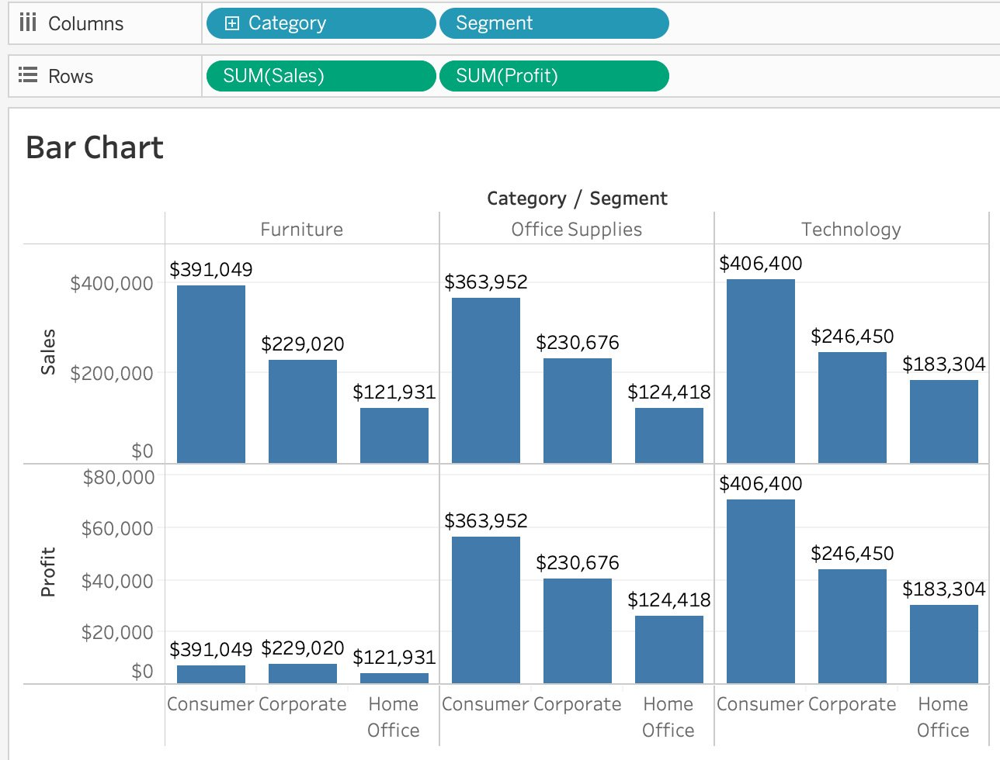
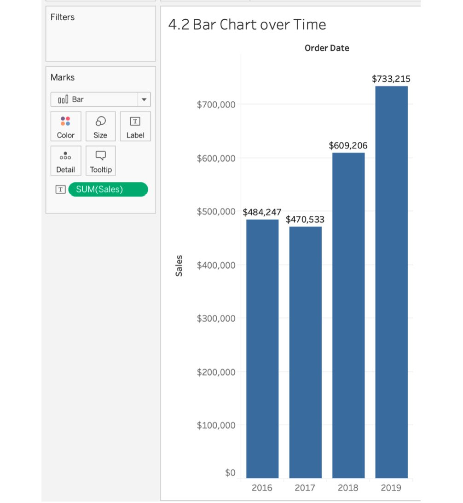
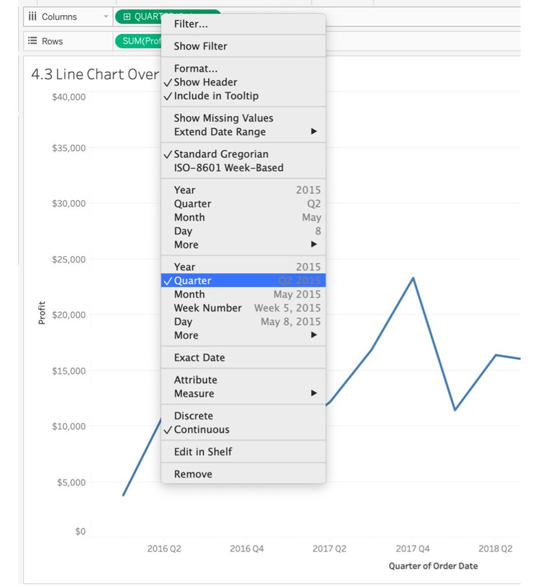
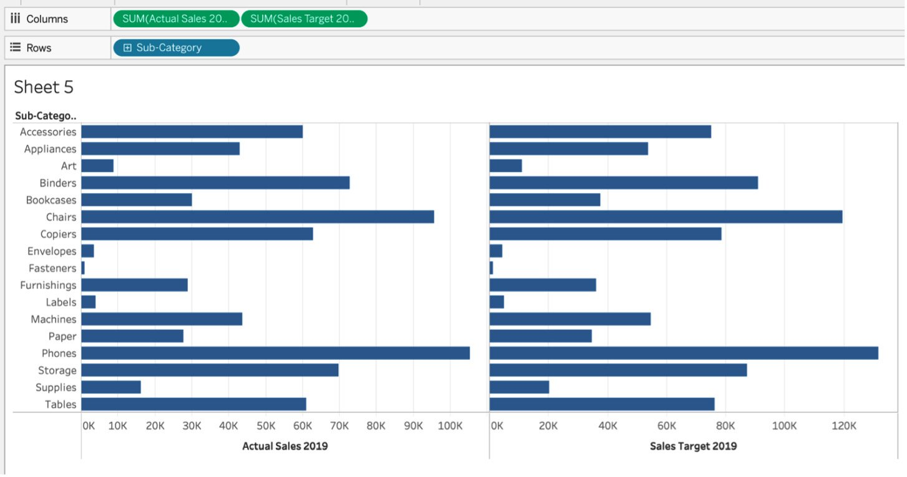
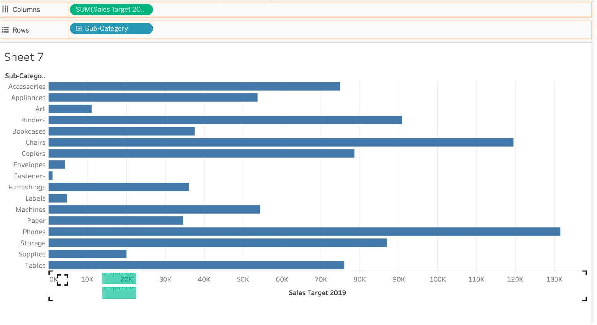
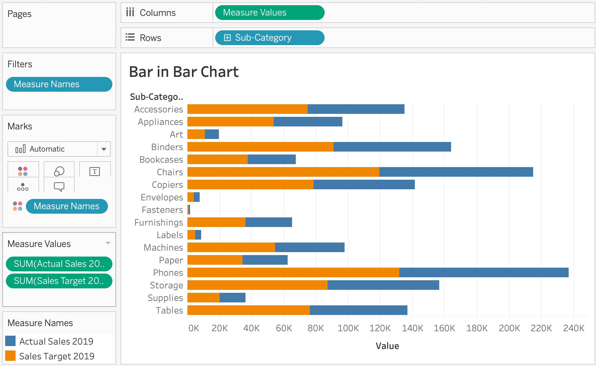
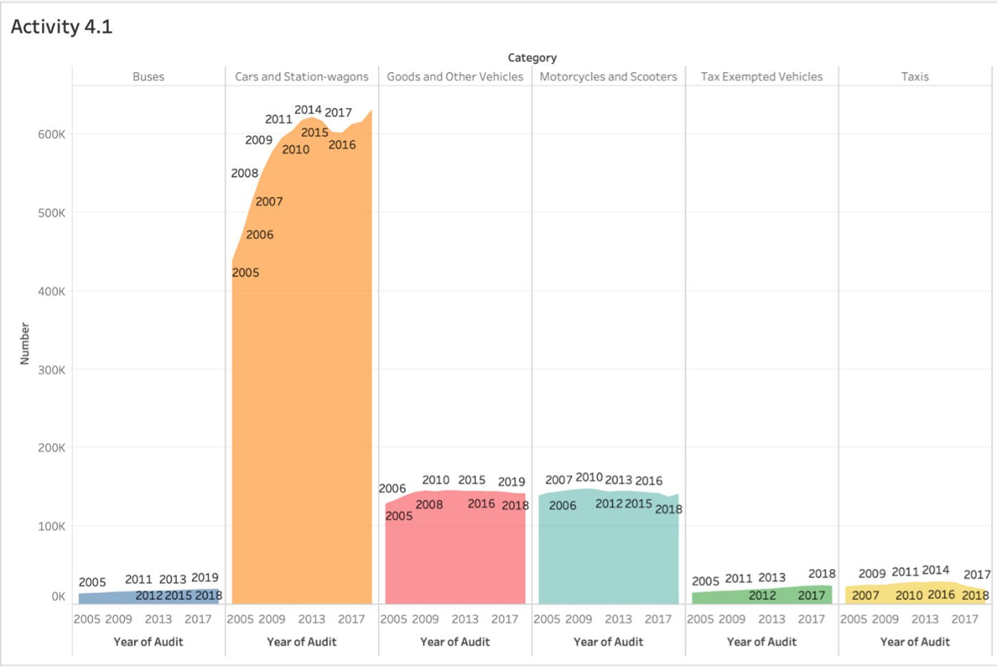

Lab 4: Data Exploration: Comparison and Composition 
===================================================


Overview

In this lab, you will create your first chart in Tableau and work
through some basic and intermediate charts, such as tree maps,
bar-in-bar charts, and stacked area charts. You will learn how to choose
the optimal chart for a given scenario, look at the best ways to create
a trend report, and explore comparisons across measures (using
bar-in-bar and bullet charts). Then, in this lab\'s final activity,
you will put all you\'ve learned into practice by analyzing data from
Singapore\'s vehicle population audits over the past decade. By the end
of this lab, you will be familiar with working with bar charts, area
charts, and `Marks` cards, which are used to add contextual
detail to charts and views.


Note

Exercises in this lab will use the sample `Superstore`
dataset, which comes pre-loaded into each Tableau Desktop installation.
Our version of Tableau Desktop contains another
`Sample – Superstore` dataset, which has data till 2019;
Tableau recently updated the data file to also include 2020 data, which
you will have if you are using the latest version of Tableau Desktop.
So, if your metrics/charts are not exactly the same as ours, do not
worry. Our goal is to teach you the skills to develop these charts,
reports, and dashboards instead of having you replicate our
exact charts.


Exercise 4.01: Creating Bar Charts 
----------------------------------

As a business analyst for your organization, one of the stakeholders has
asked you to create a report displaying the total sales and profits
across categories and segments using bar charts. You will be using the
`Sample – Superstore` dataset to visualize the data.

Dataset: `Superstore`

Dataset download link: <https://github.com/fenago/tableau-advanced>.

Note

In Tableau, **continuous** fields are **green**, and when they\'re
**discrete**, they\'re **blue**.

The following steps will help you complete this exercise:

1.  Load the `Orders` table from the sample
    `Superstore` dataset in your Tableau instance.
2.  Click on the `Show Me` panel in the top-right corner and
    hover over the bar chart. You will observe that it says
    `For horizontal bars try 0 or more Dimensions` \|
    `1 or more Measures`.


Figure 4.1: Bar chart in the Show Me panel

In this exercise, you will begin with no dimensions and only one
measure, before moving on to adding dimensions to your view.

1.  Drag `Sales` to `Rows` (for a vertical bar
    chart) or `Columns` (for a horizontal bar chart).


Figure 4.2: Changing the aggregation

When you drag Sales to the Columns/Rows shelf, the default aggregation
changes to SUM(Sales).

1.  Click on the `SUM(Sales)` capsule in the
    `Columns`/`Rows` shelf and change the
    aggregation from `SUM(Sales)` to any other aggregation
    average.


Figure 4.3: Bar chart for the sales figure

In the preceding screenshot, note that the total sales figure is around
`$2.3M` for the whole store, which is the least granular
metric in our sample Superstore dataset. Next, you will change the
granularity of your bar chart.

1.  To do that, add a dimension to your view. Add a `Category`
    dimension to our `Columns` shelf. When you add the
    `Category` dimension to the view, you get three bars to
    represent each category. Thus, you\'ve just changed your granularity
    from the sum of sales for all the data to the sum of sales for
    each category.

For better readability, also add `Sales` from the
`Measures` data pane to the `Label Marks` card. As
we can see, `SUM`(`Sales`) is now divided by
category:


Figure 4.4: Sales by category

The preceding chart uses one dimension and one measure, so we can see
that the total sales of Furniture, Office Supplies, and Technology are
`$742,000`, `$719,000`, and `$836,000`,
respectively. However, what if we want to study the total sales for each
of these categories in more detail? We can make it more granular by
adding more dimensions or measures. Let\'s explore our options in the
next step.

1.  Drag `Segment` to the `Columns` shelf.

You will notice that the sales by category are now divided into sales by
segment and category. We just added another level of granularity to our
view:


Figure 4.5: Sales by category and segment

In the preceding figure, you can see that even though
`Technology` had the highest sales, the `Corporate`
and `Home Office` segments of all three categories are not so
performing well and will require attention. As the total sales of the
categories are now bifurcated, it gives you more visibility as to how
many sales you have in each of the segments (that is,
`Consumer`, `Corporate`, and
`Home Office`). Now that you know the sales values in greater
detail, you can also find out the amount of profit gained in each of the
categories and segments.

1.  Add another measure, `Profit`, to the `Rows`
    shelf. As soon as you drop the measure onto the `Columns`
    shelf, you can see that a new row was added for profits:





Figure 4.6: Sales and profits by category and segment

As you can see, there is very little profit gained from
`Furniture` and a huge amount of profit from
`Technology`. This will help in making great business
decisions as we now know that investing more in `Technology`
and `Office Supplies` is more profitable.

When you create a bar chart one way, either horizontally or vertically,
you will on occasion find that your dashboard design or storyboard
design (a storyboard is where you use multiple visualizations/dashboards
to convey a story) would be more aesthetically pleasing if the alignment
was different---say, vertical instead of horizontal. There are multiple
ways to change the alignment; the manual method is demonstrated in the
next step.

1.  Drag both the `Columns` dimensions to the `Rows`
    shelf and vice versa. Alternatively, Tableau makes it easy to swap
    things around by giving us a `Swap` button in our tool
    menu.

The final output is as follows:


Figure 4.7: Horizontally aligned bars

In this exercise, we explored how adding more granularity to our views
can help add more context and data to our views without over cluttering.

This wraps up this section on bar charts for one or more dimensional
items. Next, we will explore comparisons over time by using bar charts
and line charts.


Exploring Comparisons over Time 
===============================


As an analyst, one of the most common requests that stakeholders will
have is about comparing certain KPIs/metrics over time (for example,
revenue quarter on quarter). In this section of the course, you will use
date dimensions to create charts with which you can compare your KPIs
over a certain time period. You will use date dimensions to compare
metrics using a bar chart first and then move on to using line charts
for KPI comparison.


Exercise 4.02: Creating Bar Charts for Data over Time 
-----------------------------------------------------

Imagine you are a business analyst who is asked to provide a report
about the total sales of your organization in different segments,
namely, `Consumer`, `Corporate`, and
`Home Office`, over a period of time. Use the sample
`Superstore` dataset provided by Tableau to visualize the
chart and display the output.

Perform the following steps to complete the exercise:

1.  Load the the `Orders` table from the sample
    `Superstore` dataset in your Tableau instance.
2.  Drag `Sales` to your `Rows` shelf.
3.  Add `Order Date` to the `Columns` shelf. Tableau
    will automatically create a line chart (which will be covered in
    detail in the next exercise).


Figure 4.8: Bar chart over time as a line chart

The preceding figure shows the sales of the products on a yearly basis
in the form of a line chart. To change the marks from line chart to bar
chart, click first on the dropdown in the Marks shelf, then Bar as shown
in the preceding figure. The view can be read as sales by year.

1.  For readability, add `Label` to `Bars` by
    dragging `Sales` from the measures `Data` pane
    to the label in the `Marks` card:





Figure 4.9: Sales by year (bar chart over time)

As you can see, by adding the labels, you have the exact sales values
earned in the respective years. But you still don\'t know the value of
sales earned over time for each of the segments. You will have to change
the granularity of the view from sales by year to sales by year by
segment.

1.  To achieve that, drag `Segment` to the `Columns`
    shelf.

The view can change a lot depending on where you place your
`Segment` on the `Columns` shelf. If you place
`Segment` after `Order Date`, your view will read as
sales by year by segment with the following view:


Figure 4.10: Bar chart over time by segment

From the preceding figure, it is clear that there has been progressive
growth over the years, and you can also see the exact sales values for
the segments. Although you got the data that you wanted, it is also
important to present it in a formulated way. It will be more useful and
understandable if you have the data for `Consumer` over the
years together and the data for `Corporate` and
`Home Office` together.

1.  To do this, place `Segment` before `Order Date`.
    Your view will read as sales by segment by year with the following
    view:


Figure 4.11: Sales by year by segment

In *Figure 4.10*, you had sales by year by segment, whereas in *Figure
4.11*, you have sales by segment by year. This allows any stakeholder to
take a quick peek at the sales trend for each of your segments. As you
can see, `Corporate` saw considerable growth from 2017 to
2018, which was not easily understandable from the previous screenshot.

In this exercise, you reviewed bar charts over time and practiced adding
more granularity and dimensionality to your data. Next, you will review
comparisons over time using line charts.


Line Charts 
-----------

Line charts are another set of charts that are versatile, easy on the
eye, universally understood. These have been used since the 18th century
when William Playfair created them. They represent multiple data points
connected with each other through a single line, usually signifying the
trend of the data. In Tableau, you require at least one date, one
measure, and zero or more dimensions to create a line chart.


Difference between Discrete Dates and Continuous Dates 
------------------------------------------------------

In the upcoming exercises, when you right-click the `Date`
dimension in the view, you\'ll notice you have two options for selecting
the quarter. The one at the top is the discrete date, where you will
have discrete dates by year/quarter/month/day. If you observe the
following screenshot, instead of 2016 Q2 to 2016 Q3 ..... 2019 Q1 data
points, you just have four data points---one for each discrete quarter.
Essentially, discrete dates are unique dates in the view. So, when you
select discrete quarters, the view will only contain unique quarters
without considering the year as part of the date.


Figure 4.12: Discrete dates

The main difference between continuous dates and discrete dates is that
continuous dates will give you more granular dates. So, instead of just
Q1, Q2, Q3, and Q4, continuous dates will also factor in the year that
the quarter/month/day is associated with. In most cases, you will want
to use continuous dates because stakeholders often want to look at their
metrics by month/quarter across multiple years.





Figure 4.13: Continuous dates


Exercise 4.03: Creating Line Charts over Time 
---------------------------------------------

As an analyst, the category manager of your company would like you to
create a chart so that they can look at the total profit across all the
categories since 2016. They do not have a favorite chart type, but they
do prefer a minimal look for their charts. In this exercise, you will
tackle this stakeholder request as you go step by step in detail on how
to make the best use of line charts and how adding color or changing the
level of detail in the view adds incredible value to your charts.

Perform the following steps to complete the exercise:

1.  Load the `Orders` table from the sample
    `Superstore` dataset in your Tableau instance, if you
    haven\'t already.
2.  Similar to the steps for the bar chart, drag one of the measures to
    the `Rows` shelf. In this exercise, drag
    `Profit` to the `Rows` shelf.
3.  Next, add `Order Date` to the `Columns` shelf.
    As soon as you add the `Date Time` dimension to your view,
    Tableau automatically creates a line chart (which you also saw
    previously in your bar chart view).


Figure 4.14: Simple line chart over time

In the chart, you have plotted profit by year and connected those points
using a line. The profit grew from `$50,000` in
`2016` to almost `$100,000` in `2019`.

That is a basic line chart for you, but as previously mentioned, the
goal is to learn more than just the basics of Tableau. So, let\'s
explore some of the options for more context or details for your line
chart.

1.  Add a `Profit` label to your line chart by dragging
    `Profit` from the `data` pane to
    `Label` `Marks` card in your view.
2.  To have the line chart show your sales by quarter instead of by year
    so it is more granular and helps decision-making for your
    stakeholders, click on the `+` sign or click the arrow on
    the dimension in your `YEAR(Order Date)` dimension on the
    `Columns` shelf and change the granularity from
    `YEAR(Order Date)` to `QUARTER(Order Date)`.
3.  To make your view even more granular, add `Segment` to
    your `Color` or `Detail` `Marks`
    shelf. Your data will be split by segment with a corresponding color
    for each segment, as observed here:


Figure 4.15: Line chart by segment

In the preceding figure, you can see that the profit for the
`Consumer` segment has grown at a higher rate when compared to
other segments. The line chart clearly illustrates the trend by segment
across multiple years.

This wraps up our coverage of line charts. This section discussed line
charts over time, the difference between discrete dates and continuous
dates, and how you can add more color or contextual details to your line
charts.


Exploring Comparison across Measures 
====================================


Bullet charts are a type of bar chart that allow you to add target/goal
comparisons to your charts/views. As much as bar charts are useful, more
often than not when you are presenting data using bar charts, you will
hear questions such as \"*How does this compare to this KPI/metric?*\"
and \"*So, what should we do with this data?*\" because bar charts fail
to add the additional context that stakeholders are looking for. This is
where bullet charts shine as they add the required comparisons to
goals/targets/thresholds. Think of bullet charts as bar charts with
historical context or a baseline for comparison.

Say you are working on a project for which you are presenting sales
figures for your SaaS products as bar charts. The first question you
receive from your stakeholders might be \"*How does this compare to our
previous quarter\'s/year\'s results? Did we do well or underperform?*\"
If you had shown the same data with bullet charts, you could have also
added a point of comparison for the period you want to compare your
sales figures to. Here is a sample bullet chart:


Figure 4.16: Sample bullet chart

In the following exercise, you will create a bullet chart that tackles
that problem and learn about the impact that bullet charts can have on
your reports/presentations.


Exercise 4.04: Creating a Bullet Chart 
--------------------------------------

You receive another request from the category manager: they now want to
look at how each of the sub-categories trends toward the sales target
for 2019. As an analyst, your job is to create a view with actual sales
for each sub-category for 2019 while showcasing the target sales (the
black vertical lines in the following sample bullet chart) for 2019.


Figure 4.17: Sample bullet chart

Note

How to create a bullet chart using the `Show Me` panel could
be studied here, but the course wouldn\'t do you justice if it didn\'t
show you how to create a bullet chart using calculated fields, where you
compare the sales of 2019 to the target sales of 2019 (which is a
calculated field). We have not discussed calculated fields yet in the
course, but we will be discussing them in depth in *Lab 6*,
*Exploration: Exploring Geographical Data*; for now, we will just try to
explain each step of this exercise in as much detail as possible.

Perform the following steps to complete this exercise:

1.  Load the `Orders` table from the sample
    `Superstore` dataset in your Tableau instance if you
    haven\'t already.

Think of calculated fields as formulas that you can use to manipulate a
field, create a subset of data, or extract information from
rows/columns. In the following calculated fields, you will be creating
two fields: `Sales Target 2019` and
`Actual Sales 2019`.

1.  **Sales Target 2019**: You are creating a dummy sales target for
    2019 so you need a target field that can be used for comparing the
    actual to the target. Your `Sales Target 2019` field will
    be 125% of the 2018 sales figures. To create a calculated field
    using your `Sales` measures and `Order Date`,
    first, navigate to the `Order Date` dimension and
    right-click on it. Click on `Create` \|
    `Calculated Field...`:


Figure 4.18 Creating a calculated field

1.  Rename the field from \"`Calculation1`\" to
    \"`Sales Target 2019`\". In the calculated field window,
    type the following formula:
    
    ```
    If YEAR([Order Date]) = 2019 THEN [Sales]*1.25 ENDCopy
    ```
    

The formula is read as follows: if the year of order date is
`2019`, make the target sales `125%` of the
`2019` sales figures.


Figure 4.19: Creating a Sales Target 2019 field

1.  Repeat the same steps for the `Actual Sales in 2019`
    calculated field with the following formula:
    
    ```
    If YEAR([Order Date]) = 2019 THEN [Sales] ENDCopy
    ```
    


Figure 4.20: Creating an Actual Sales Target 2019 field

1.  Drag `Sub-category` to the `Rows` shelf.

The next steps will demonstrate both the `Show Me` and
`non-Show Me` methods. You\'ll start with the
`Show Me` panel method.

1.  Drag the `Actual Sales in 2019` and
    `Sales Target in 2019` calculated fields to the
    `Column` shelf:





Figure 4.21: Side-by-side bar charts for actual versus target sales

In the previous figure, you have two charts: `Actual Sales` in
`2019` and `Sales Target` in `2019` by
sub-category. If you observe closely, you can see that Actual Sales 2019
for `Accessories` is `60,000` whereas
`Sales Target 2019` is `75,000`, which is
`125%` of `Actual Sales 2019`. In the next step, you
will convert these two bar charts into a bullet chart.

1.  Navigate to the `Show Me` panel and click on
    `Bullet Chart`.

As soon as you click on `Bullet Chart`, you will notice
multiple bars with a black reference line that has been added to each
bar. The reference line is the target/goal line that adds the additional
context:


Figure 4.22: Bullet chart

You just created a bullet chart where the bars represent the sales
targets in 2019 and the reference lines are the actual sales. But
ideally, you want your sales targets in 2019 to be reference lines
because that is the target that you want your sub-categories to aim for.
You\'ll make those changes next.

1.  If your bullet chart has `Sales Target in 2019` as bars
    instead of the target line, you can right-click on the `x`
    axis and click on `Swap Reference Lines` (this may be
    `Swap Reference Line Fields` in later Tableau versions) to
    change your reference lines to target sales instead of actual sales:


Figure 4.23: Swapping the reference lines

1.  For the other method where the `Show Me` panel is not
    used, create a new sheet and drag `Sub-Category` to
    `Columns`, `Actual Sales 2019` to
    `Columns`, and `Sales Target in 2019` to the
    `Details` `Marks` card.
2.  Right-click on the `x` axis and click
    `Add Reference Lines`. In the `Line` tab, click
    on the `Per Cell` radio button. In the `Value`
    dropdown, select `SUM(Sales Target in 2019)` and aggregate
    it as `SUM` in the dropdown right next to the
    `Value` dropdown. Change the `Label` dropdown
    from `Computation` to `None`.


Figure 4.24: Editing the reference lines

After making the preceding changes, the final output of the bullet chart
will be as follows:


Figure 4.25: Bullet chart

In the preceding screenshot, the reference lines are now the sales
targets for 2019, as opposed to the initial bullet chart where they were
`Actual Sales 2019`, which was actually confusing. You want
your stakeholders to understand how far off the target each of the
sub-categories is.

In this exercise, you were able to create bullet charts using the
`Show Me` panel as well as by manually adding reference lines
to your view. We also briefly touched on calculated fields, which we
will cover further in *Lab 7: Data Analysis: Creating and Using
Calculations* and *Lab 8: Data Analysis: Creating and Using Table
Calculations.*


Bar-in-Bar Charts 
-----------------

Similar to bullet charts, this type of chart is used when you want to
compare two measures or two values in the same row/column. Essentially,
it adds the comparison/goal/target context that every stakeholder is
looking for in your report. It works pretty much like a bullet chart,
the main difference being that instead of reference lines as comparison
points, you will have another secondary bar embedded within your primary
bar.

Think of a scenario similar to that of the bullet chart (for example,
the US presidential election of 2019). As the electoral college votes
were being counted, the Democrat and Republican vote counts were racing
toward the target seat amount of 269. As the hours passed and more votes
were counted, the actual number was updated and grew even closer to the
target number of 269. That is a good example of where a bar-in-bar
chart, such as the following, can be used.


Figure 4.26: Sample bar-in-bar chart


Exercise 4.05: Creating a Bar-in-Bar Chart 
------------------------------------------

The previous view that you created for tracking actual sales versus
target sales had a reference point in the view that, without additional
helpful text and explanation, would have been confusing for
stakeholders. The category manager has asked you to make the actuals
versus targets comparison simpler. As an analyst, after researching
potential chart ideas, you identify the bar-in-bar chart as a great
chart for a simpler view. You will be re-creating the bullet chart view
with same dimensions and measures but will be utilizing a bar-in-bar
chart. You will be using the same `Superstore` dataset for the
analysis.

Perform the following steps to complete the exercise:

1.  Load the `Orders` table from the sample
    `Superstore` dataset if it\'s not already open in your
    Tableau instance.[ ]{.Annotation-reference}
2.  Drag `Sub-category` to the `Rows` shelf and
    `Sales Target 2019` to the `Columns` shelf.
3.  Drag `Actual Sales 2019` to the view and hover over the
    `Sales Target 2019` axis until you get two green stack
    bars highlighted in the axis, and then drop
    `Actual Sales 2019` on the `Sales Target 2019`
    axis as shown here:





Figure 4.27: Sales by sub-category bar chart

In the preceding screenshot, you just plotted sales by sub-category, and
in the next step, you will color-split these bars into actual versus
target so that you can achieve your desired bar-in-bar result.

1.  Drag `Measure Names` from the `Rows` shelf to
    the `Color` `Marks` card on the left. As soon as
    you do that, the two measures will be distinguished by different
    colors and will be stacked on top of each other:





Figure 4.28: Sales by actual versus target 2019

By adding `Measure Values` to `Columns` and adding
`Actual Sales 2019` and `Sales Target 2019` to the
`Measure Values` `Marks` card, you will see you were
able to stack two bars on top of each other, with the orange bar being
`Sales Target 2019` and the blue bar being
`Actual Sales 2019`.

1.  You\'ll also notice that both the measures are stacked on top of
    each other rather than starting at zero. Essentially, the
    `Actual Sales 2019` bar starts where
    `Sales Target 2019` ends, which is not how you want your
    data to be presented. To change that, navigate to
    `Analysis` in the menu, select `Stack Marks`,
    then choose `Off`.


Figure 4.29: Turning off Stack Marks

1.  As much as the current view looks good, you also want to
    differentiate `Actual Sales 2019` and
    `Sales Target 2019` by size too. Do this by dragging
    `Measure Names` from the `Dimensions` data pane
    and dropping it on the `Size` `Marks` card, as
    shown here:


Figure 4.30: Un-stacked bar chart

The preceding screenshot shows that `Measure Names` was added
from the dimension pane to the `Size` `Marks` card.

1.  If you want, you can swap the measure that is in the foreground. The
    current view is good as `Actual Sales 2019` is in the
    foreground and is racing toward `Sales Target 2019`, but
    if you want to change this, just swap the measures in the
    `Measure Values` card and play with the size, color, or
    width of the bar:


Figure 4.31: Bar-in-bar chart

In the preceding figure, the blue bar is `Actual Sales 2019`,
which is racing toward `Target Sales 2019`, which is the
orange bar. For example, the `Bookcases` sub-category has
actual sales of `30,000` in `2019` and is racing
toward the sales target of approximately `33,000`.

You could have also achieved the same bar-in-bar chart using dual axis,
but we will be covering that in the next lab. Here, we went with a
standard approach and learned how to utilize `Measure Names`
and `Measure Values`, which play an important role in Tableau
report/dashboard building.


Exploring Composition Snapshots -- Stacked Bar Charts 
=====================================================


A stacked bar chart is nothing but a bar chart with an extra level of
detail embedded in the bars, where each bar represents distinct
dimensions/values. Stacked bar charts come in handy when you want to
compare the whole to a segment of the dimensions/value, which are
essentially smaller segments of the same bar. Think of the revenue
generated by a car company: as an analyst, you want to show the revenue
split by car/product type in a single bar graph without using too much
space. By color-coding the bar chart with the car type, you can create a
single graph with lots of contextual detail.

Think of stacked bar charts as showing **totals against parts**:


Figure 4.32: Sample stacked bar chart

Try your hand at creating a stacked bar chart with the next exercise.


Exercise 4.06: Creating a Stacked Bar Chart 
-------------------------------------------

In this new request from your direct manager, they want to look at sales
by sub-category in bar chart format, where the sales sub-categories are
segments by color. Essentially, the manager expects a stacked bar for
each sub-category, split into segments. You will continue to utilize the
`Superstore` dataset for this exercise.

Follow these steps to complete this exercise:

1.  Load the `Orders` table from the sample
    `Superstore` dataset if it\'s not already open in your
    Tableau instance.
2.  Drag one of the measures to the `Rows` shelf. This
    exercise uses `Sales`, but you can use any of the measures
    in your own projects.
3.  Drag `Sub-Category` to the `Columns` shelf, and
    now you shall have a simple bar chart for sales by sub-category:


Figure 4.33: Stacked bar chart -- sales by sub-category bar chart

1.  To convert this bar chart into a stacked bar chart, select one of
    the dimensions (either `YEAR[Order Date]` or
    `Segment`) and drag it to the `Color`
    `Marks` card as shown here:


Figure 4.34: Stacked bar -- sales by sub-category and segment

You have now essentially converted your simple bar chart into a stacked
bar chart as you have color-coded or stacked multiple bars on top of
each other by segment. `Chairs` and `Phones` were
the highest-grossing sub-categories, but it is not clear which of those
segments contributed more; so, next, you will add more elements to your
stacked bar chart for readability.

1.  Add `SUM(Sales)` as a label for your bars. Drag
    `Sales` from the `Measures` data pane to the
    `Label` `Marks` card:


Figure 4.35: Stacked bar -- sales by sub-category and segment

1.  You might notice that the `Sales` label is taking a lot of
    space in our bars. The reason it is taking so much space is that the
    unit of `Sales` is tens, but considering that most of your
    sales are greater than 1,000, you can change the unit from tens to
    thousands so it is easier to read and saves you some real estate.
2.  To change the unit for the `Sales` figures, navigate to
    `SUM(Sales)` in the `Marks` card. Right-click
    and select `Format`.


Figure 4.36: Formatting Sales

1.  In the default section of the dialog box, click on the
    `Numbers` dropdown, select `Numbers(Custom)`,
    and change `Display Units` from `None` to
    `Thousands(K)`:


Figure 4.37: Formatting Sales

The stacked bar chart will now look as follows:


Figure 4.38: Final stacked bar chart

Note

In the preceding figures, you might notice that the smaller bars have no
information embedded inside them. This is a limitation of Tableau. When
you hover over the smaller bars, Tableau will display the information
you need.

In this exercise, you looked at how to create a stacked bar graph. This
is probably one of the easiest charts to build in Tableau, but it is an
incredibly useful choice when you want to answer questions about parts
against the total.


Exploring Composition Snapshots -- Pie Charts 
=============================================


Although pie charts are quite often used, in the author\'s personal
experience and the opinion of industry leaders in the field of data
visualization, they are best avoided in reports/dashboards because it
gets difficult to draw insights accurately from them. Pie charts often
confuse even the best in the business. Notice how it is easy to trick
people with the following pie chart (tricking people is not what we as
data analysts/visualizers are supposed to do):


Figure 4.39: Sample pie chart

The goal of the pie chart is to display market penetration levels for
brands A, B, and C. A simple visual inspection may cause one to believe
that Brand A and C have equal market penetration, but in reality the
difference between them could be several millions of dollars due to a
couple of percentage points\' difference. Therefore, it is recommended
not to use pie charts. That said, if there is no way to avoid using
them, keep in mind the following rule of thumb: if your pie chart has
more than six labels, you are better off creating either a bar chart or
a stacked bar chart.


Exercise 4.07: Creating a Pie Chart 
-----------------------------------

The VP of the company is going to be presenting in a board meeting
today, and they are looking for your help to create a simple pie chart
showing sales by segment. In this exercise, you will create your first
pie chart and fulfill the requirement as requested by the VP. You will
continue to use the `Superstore` dataset.

The following steps will help you complete this exercise:

1.  Load the `Orders` table from the sample
    `Superstore` dataset if it\'s not already open in your
    Tableau instance.
2.  Drag `Sales` to the `Rows` shelf and
    `Segment` to the `Columns` shelf, which creates
    your standard bar chart:


Figure 4.40: Pie chart -- step 1

1.  To convert the bar chart to a pie chart, open the
    `Show Me` panel and click on the pie chart icon:


Figure 4.41: Adding a pie chart using the Show Me panel

When you convert the bar chart to a pie chart, the pie chart might be
too small to read.

1.  To increase the size of the pie, on a Mac, you can press *Command* +
    *Shift* + *B* to increase or *Command* + *B* to decrease the size of
    the chart. On Windows, press *Ctrl* + *Shift* + *B* to increase the
    size of the chart and *Ctrl* + *B* to decrease the size of the
    chart. Another way to increase or decrease the size of the chart is
    by using the `Size` tab in our `Marks` card:


Figure 4.42: Increasing the size of the pie

1.  To add labels to the chart, drag `Segment` as well as
    `Sales` to your `Label` `Marks` card.
    Increase the size of our label to 15 or higher. You can also change
    the units of the `SUM(Sales)` figure to thousands or
    millions as discussed in the previous exercise:


Figure 4.43: Adding the \$ prefix

The final output after making the changes will be as follows:


Figure 4.44: Final pie chart

In the preceding screenshot, you were able to show sales by segment in a
pie chart. Although they have their drawbacks, pie charts can be really
useful when the number of labels does not exceed 5-7 and the useable
space on the screen is very limited.


Treemaps 
--------

Like pie charts and stacked bar charts, treemaps help you answer
parts-of-the-whole types of questions, but the main difference is that
treemaps and bar-in-bar charts show hierarchical relationships using
rectangles. Using `Marks` card elements such as
`Color` and `Size`, you can better analyze the data.
When a rectangle is bigger or has a more concentrated color, it
represents the highest value of the dimension in the view. Treemaps
allow you to quickly measure contributions to the whole. Like pie
charts, treemaps are not always the best choice, but depending on the
analysis needed, treemaps can use contextual labels for better
readability; they are also one of those chart types where you can plot
hundreds of data points in a view.

Think of a case where the VP of delivery operations has requested a
presentation on the total deliveries to each state as well as whether
deliveries in those states were on time or not. Using treemaps, you can
compare the delivery activity for each of the states, where the number
of deliveries is communicated by the size of the rectangle for each
state and the proportion of deliveries that were delayed is shown by
color:


Figure 4.45: Sample treemap


Exercise 4.08: Creating Treemaps 
--------------------------------

As an analyst, you want to create a view of profitable versus
non-profitable states by category without using a cross-table in your
view. For this exercise, you will use the `Superstore`
dataset. You are required to color-code the states based on their
profitability and sort the states in descending order based on total
sales. The reason you are using treemaps for this is that you can use
both size and color to convey information without sacrificing anything.

Perform the following steps to complete the exercise:

1.  Open the sample `Superstore` dataset if it\'s not already
    open in your Tableau instance.
2.  For this exercise, you have two measures: `Sales` and
    `Profit Ratio`. You will use `Sales` for sizing
    and `Profit Ratio` for coloring the treemap. Drag the
    primary measure (in this case, `Sales`) to the
    `Size` `Marks` card and the secondary metric,
    `Profit Ratio`, to the `Color` `Marks`
    card:


Figure 4.46: Adding Sales to the treemap

Note

If you are using a version of Tableau later than 2020.1, you may need to
choose `Profit` rather than `Profit Ratio` for this
step.

1.  Drag `State` to your `Detail` `Marks`
    card as it will make your data more granular and represent the
    states with sizes and colors.

When you add `State` to the `Detail`
`Marks` card (in Tableau version 2020.1), you will see that
`Country`/`Region` is automatically added as
`State` is part of the hierarchy. Remove
`Country`/`Region` from the `Detail`
`Marks` card because it is not adding any value or detail to
your view. While you are at it, drag `State` as a label:


Figure 4.47: Color coding by profit ratio

In the preceding figure, you have represented sales and profit ratios by
states. California and New York have the largest number of sales (larger
rectangles means more sales), but states such as Michigan have higher
profit ratios (darker blue means higher profits).

1.  You could potentially stop the analysis/charting here, and this
    would be your treemap representing sales by each state and their
    profit ratios. However, in this case, you\'ll add another layer of
    detail to your view. Drag `Category` to the
    `Rows` shelf, and in the toolbar, change the view from
    `Standard` to `Entire View`, as shown in the
    following screenshot:


Figure 4.48: Treemap by category

You are just about finished, but the color range that you have used in
the chart is a bit confusing because the stakeholders just want to know
whether a state was profitable or not. They neither need nor want to
know the exact profit or loss ratio for each of the states. You can add
those exact `Profit ratio` details in a tooltip later.

1.  Navigate to the `Marks` card and click on the
    `Color` tab. Check the `Stepped color` checkbox
    and enter its value as `2` steps.

    Note

    If you are using a version of Tableau later than 2020.1, you will
    need to select `Edit Colors` to find the
    `Stepped color` option.

2.  Next, select the palette you want and click on
    `<< Advanced`. Check the `Center` checkbox and
    enter its value as `0` (green represents a profitable
    state):


Figure 4.49: Treemap by category and state with red/green color coding

The final output is as follows:


Figure 4.50: Treemap by category and state with red/green color coding

The main difference between this view of the treemap (*Figure 4.50*) and
the default treemap you created in the previous step (*Figure 4.48*) is
that in the latest treemap, instead of color-coding your profit ratio
with gradient colors, you color-coded loss as red and profit as green,
so it\'s easier for stakeholders to quickly view the most profitable and
least profitable states.

If you look, you can see that California is the highest-selling state
across all categories, and if you want to know the profit ratio of the
state, all you have to do is hover over any of the states.


Exploring Compositions for Trended Data 
=======================================


Area Charts 
-----------

Area charts are among the most visually pleasing charts available and
are used pretty frequently for reporting cadence. Area charts are
essentially combinations of line charts and bar charts in that they show
the relationships between the proportions of the total.

Think of a use-case wherein the branch manager of an electronics company
wants to look at the total quantity sold in each television category by
the series that they belong to. You can fulfill this requirement by
using a stacked bar chart, but with an area chart, you can also add time
trends, which is what you will explore in this exercise here.


Figure 4.51: Sample Area Charts

Note: Word of caution for area charts

When you use an area chart as a stacked area chart, it can easily be
misinterpreted---especially if you use stacked area charts for
percentages. For example, say you are creating an email marketing report
where you have conversion rates for different campaigns. Campaign 1 had
a click-through rate (CTR) of 3%, campaign 2 had a 7% CTR, and campaign
3 had a 6% CTR for a particular month. The true CTR for that month was
5.3%, but using a stacked area chart, the CTR for all campaigns may show
up as 16%, which is factually incorrect. Just be aware of the caveats
here.


Exercise 4.09: Creating an Area Chart 
-------------------------------------

The director of financial operations reaches out to you, looking to
understand how the sales for each sub-category trends across each month.
The director wants to know whether they sell more in July or August. As
an analyst, your job is to create a color-coded area chart showing sales
by month of the year and how sales trend across the year. You will
continue to utilize the `Superstore` dataset for this
exercise. You will also explore continuous as well as discrete area
charts in this exercise, utilizing `Order Date`,
`Sub-Category`, and `Sales`.

Perform the following steps:

1.  Open the sample `Superstore` dataset if it\'s not already
    open in your Tableau instance.
2.  Drag `Order Date` to the `Columns` shelf and
    change the granularity from year to month by clicking the arrow on
    the `Order Date` capsule and selecting continuous
    `Month` (you will first create a continuous stacked area
    chart).


Figure 4.52: Continuous month selection

1.  Drag `Sales` to the `Rows` shelf. As soon as you
    drop it onto the `Rows` shelf, a line chart is created.
2.  Drag `Sub-Category` from data pane onto
    `Color Marks` card to and then change the
    `Marks` type from `Automatic` to
    `Area` using the dropdown:


Figure 4.53: Area chart

The preceding chart represents the continuous stacked area chart. If you
don\'t want the areas to be stacked on top of each other, you can turn
off stacking.

1.  Navigate to `Analysis` in the menu and click on
    `Stack Marks` \| `Off. `Similarly, you follow
    the same steps to turn the stack marks back on:


Figure 4.54: Turn Stack Marks off

The only reason that someone would want to turn off
`Stack Marks` in an area chart is if they want to look at
individual trends for the dimension in question (in this case,
Sub-Category). The limitation of an unstacked area chart is that it
carries a risk of hidden data points because what the background area
represents is not clear:


Figure 4.55: Area chart

1.  To change the area chart to be discrete, change the type of
    `Order Date` from `Continuous` to
    `Discrete`:


Figure 4.56: Discrete dates selection

With discrete charts, instead of `Month` for each year, now
you only show discrete months without considering the year in the view.
The view is a less granular view compared to that of the continuous
stacked area chart. You will change the axis tick marks from \$50,000 to
\$25,000 increments.

1.  To change the axis tick marks, right-click on the `Sales`
    axis and click on `Edit Axis…`.


Figure 4.57: Editing the axis

1.  In `Edit Axis [Sales]`, click on `Tick Marks`
    (this may be `Major Tick Marks` in later versions) and
    select `Fixed`, then set `Tick interval` to
    `25000`, as shown here:


Figure 4.58: Setting Major Tick Marks

The final output is as follows:


Figure 4.59: Final stacked area chart

In the preceding screenshot, each of the sub-categories is stacked on
top of each other, while the sales trends are shown across months. From
the given chart, you can easily make out that November is the
highest-grossing month for the `Superstore` dataset.

In this exercise, you learned when and when not to use area charts,
looked at stacked versus non-stacked area charts, and studied the best
use cases for continuous and discrete area charts.


Activity 4.01: Visualizing the Growth of Passenger Cars in Singapore 
--------------------------------------------------------------------

Recently, the Singapore government appointed a new head of vehicle
inspection. This newly created department will analyze vehicle sales
over the past few decades, study growth/trends, and create policies and
rules to further help the government reduce emissions. As part of the
initial onboarding, the head of vehicle inspection has asked to look at
sales trends for each vehicle category, including buses, taxis, cars,
and goods vehicles. They expect an analyst to create a single view
showcasing the trends for sales of these vehicle categories. As an
analyst, considering that the head of vehicle inspection expects to see
trends across multiple categories and years, you decide to use an area
chart with color coding for easier readability.

In this activity, you will be showcasing the skills that you have
learned in this lab by creating multiple charts. You will be using
the `SG_Annual_Vehicle_Population` data, which can be
downloaded from <https://github.com/fenago/tableau-advanced>.

Perform the following steps to complete this activity:

1.  Import and open the data that was downloaded.
2.  Drag `Category` to the `Columns` shelf and
    `Number` to the `Rows` shelf.
3.  Drag `Year` to the `Columns` shelf.
4.  Drag and drop `Category` to the `Color`
    `Marks` card.
5.  Drag and drop `Year` to the `Label`
    `Marks` card.
6.  Change the `Axis` title to just `Year of Audit`.
7.  Edit the axis to change `Major Tick Marks` to
    `Fixed` and set the intervals to `1`.
8.  Change the title of the worksheet to `Activity 4.1`.

The expected output is as follows:





Summary 
=======

In this lab, you created your first
charts in Tableau, starting with bar charts, which are used for
comparisons across dimensions, followed by line charts to show
comparisons over time. You also looked at how bullet charts and
bar-in-bar charts differ and the best use cases for them when exploring
comparisons across measures.

You further composed snapshots, working through three major chart types:
stacked bar charts, pie charts, and treemaps. When exploring treemaps,
instead of using a standard treemap, you added an extra layer by
utilizing multiple measures where the primary measure,
`Sales`, was used for the size of the rectangle and a
secondary measure, `Profit ratio`, was used for profit/loss
using two different colors.


In the next lab, we will take a step forward and work through dual
axis, histograms, box and whisker plots, and scatter plots, as well as
discussing some statistics related to reference lines and when to use
different reference line models. Consider the next lab as covering
advanced charting in Tableau.
