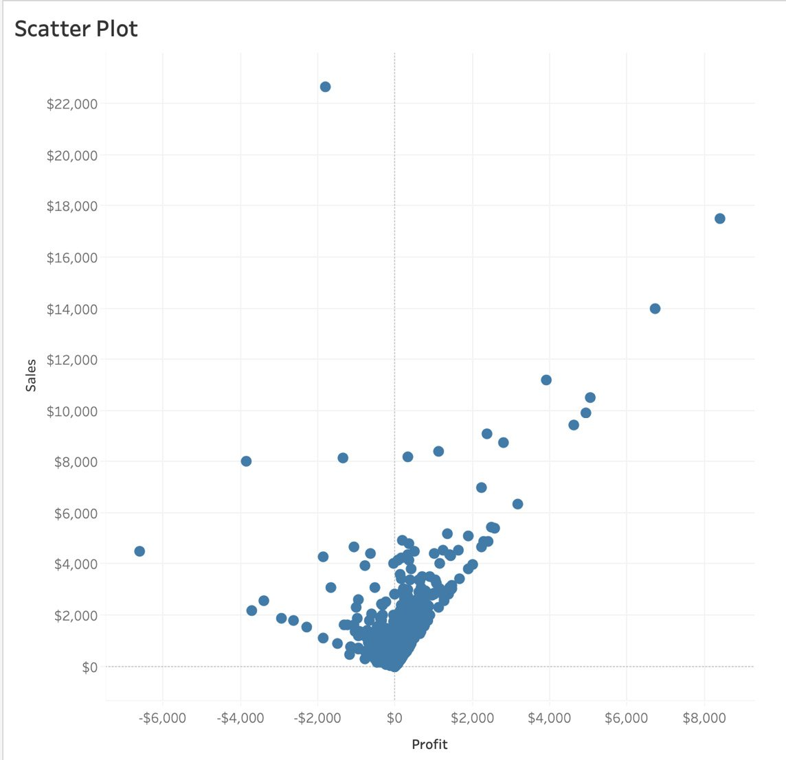
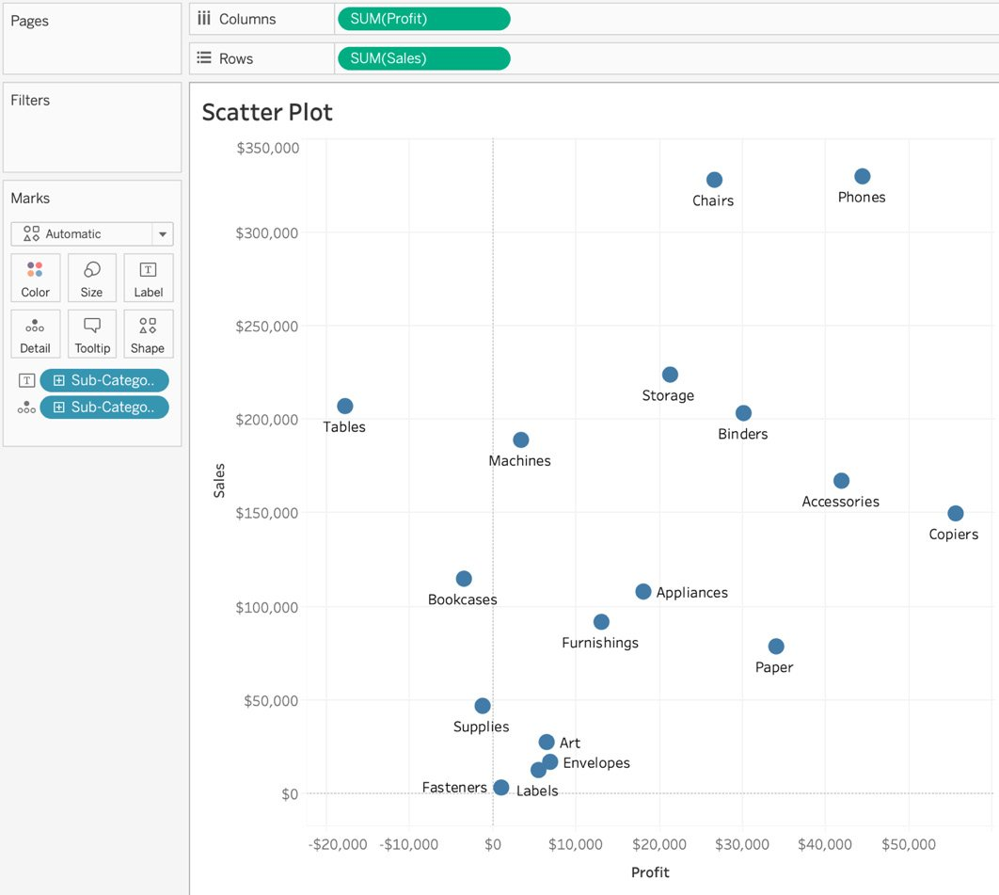
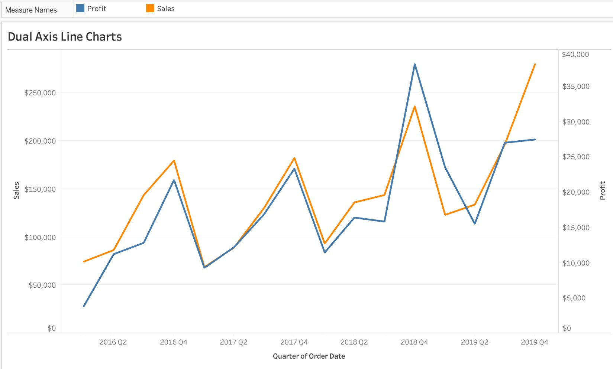

Lab 5: Data Exploration: Distributions and Relationships 
=======================================================

Overview

This lab builds on the basic charts you created in *Lab 4*,
*Exploring Comparison and Composition*. You will also cover the advanced
topics of trend and reference lines, and will see some examples of where
they are frequently used. By the end of this lab, you will be able
to create charts for distributions, show relationships across data
points, and create advanced chart types such as **Dual Axis** and
**Quadrant** charts.

Exploring Distribution for a Single Measure 
===========================================

Distribution charts such as histograms and box plots are used to show
the distribution of continuous and numerical quantitative data. However,
bar charts, as discussed in the previous lab, are used when plotting
discrete and categorical data. In these sections, you will focus on
discrete and categorical chart types.

Creating a Histogram 
--------------------

A histogram represents frequency distribution. It shows the distribution
of values and can help identify any outliers. Histograms take your
continuous measures and splits the range of measurements. They are
placed into buckets known as bins. Each bin is essentially a bar in a
histogram representing the count of that range of values falling within
that bin.

Now work through this Exercise 5.01 and see in practice how to create a
histogram.

Exercise 5.01: Creating a Histogram 
-----------------------------------

As an analyst of an e-commerce store, your manager is looking to better
understand the size of each order by asking you to create a chart that
shows the count of orders by the quantity of orders. One of the better
ways to represent frequency distribution is using histograms. In this
exercise, you will use the `Sample – Superstore` dataset to
create a view of `Counts of Orders by Quantity` distribution
and in the process, learn the exact steps to create a histogram in
Tableau.

Note

You can find the `Sample - Superstore` dataset at the
following link:
<https://community.tableau.com/s/question/0D54T00000CWeX8SAL/sample-superstore-sales-excelxls?language=en_US>.

Alternatively, you can also find the dataset in our GitHub repository
here: <https://github.com/fenago/tableau-advanced>.

**Dataset Description**: The `Sample – Superstore` dataset is
a dataset that comes loaded with Tableau Desktop by default. The dataset
represents a fictional store that contains dimensions of orders such as
`Order Dates`, `Ship Date`, `Country`,
`Product Category`/`Sub-category`/`Manufacturer`/`Name`,
`Segment`, and `Customer Name`, as well as measures
such as `Discount`, `Profit`, `Quantity`,
and `Sales` numbers.

Perform the following steps to complete this exercise:

1.  Load the `Orders` table from
    `Sample – Superstore` dataset in your Tableau instance.
    

    
As mentioned, a histogram is used for continuous and numerical data, so
in this case, you have `Discount`, `Profit`,
`Quantity`, and `Sales`. In this example, you will
use `Quantity` to create the histogram.

1.  Double-click on `Quantity` or drag the
    `Quantity` measure to the `Rows` shelf. By
    default, Tableau selects horizontal bars as the preferred chart
    method, as seen here:

As you see, there are only two chart options for the
`Quantity` measure available in the `Show Me` panel.

1.  Select `Histogram` and you will get with the following
    view:

As you see, Tableau has now created a Quantity (bin) dimension in the
Data pane and has automatically decided the best bin size for the data.
In your current view, it is unclear whether the first bin ends at
`1.5` or `2.0`.

1.  For better readability, edit the bin sizes to be integers.
    Right-click on `Quantity (bin)` in the `Data`
    pane and select `Edit...`:

In the Edit Bins \[Quantity\] window, the bin size is `1.77`
for this dataset, which is less than `2`, making it unclear
where our first bin ended.

1.  Change the bin size to an integer value (in this case, to
    `1` for readability). This will show your end user how
    many orders included only one item in the invoice, two items, and so
    on:

Next, you will make some formatting changes. As you can see, the x axis
starts from zero and ends at one bin past the maximum bin. Edit this to
start the x axis from one and go up to the maximum bin size so that you
have one continuous axis.

1.  To edit the axis, right-click on the *x* axis and click on
    `Edit Axis`. Next, select `Fixed` range from the
    `Edit Axis` window, enter `1` for
    `Fixed start` and keep `Fixed end` as it is, as
    shown here:

1.  Make one final edit by using *Ctrl* + drag (for Windows) or
    *Option* + drag (for Mac) the `CNT(Quantity)` pill from
    the `Rows` shelf to the `Label` shelf to add a
    label to individual bins. Finally, rename the sheet title to
    `Quantity Histogram` as shown here:

You have learned how to use frequency distribution to create histograms,
and have answered the following question: *How many sales/orders
included one item, two items, and so on*?

In the preceding screenshot, the histogram represents the count of
orders with one item, two items, and so on. There are `1,230`
orders with `5` items and `572` orders with
`6` items.

Next, you will learn about the importance of **Box and Whisker**
(**B&W**) plots and when to use them in your charts.

Exercise 5.02: Creating a Box and Whisker Plot without the Show Me Panel 
------------------------------------------------------------------------

Like a histogram, a B&W plot is part of the `Show Me` pane in
Tableau, but in this case, you will learn how to create box plots using
reference lines.

Perform the following steps to complete this exercise:

1.  Load the `Orders` table from
    `Sample – Superstore` dataset in your Tableau instance.
2.  Create a bar chart with one dimension and one measure (bar charts
    were discussed in *Lab 4: Data Exploration: Comparison and
    Composition*). Select `Profit` as the measure and the
    product `Segment` as the dimension (looking at
    `Profit` by `Segment`).
3.  Drag `Segment` to the `Columns` shelf and
    `Profit` to the `Rows` shelf as shown in the
    following screenshot:

1.  Add the distribution dimension to the `Detail`
    `Marks` card. In this case, you are looking at
    `Profit` distributed by `Segment`, by year of
    order. Now, add *year of order* to the `Detail` card.

    Note

    *Ctrl* + drag (for Windows) or *Option* + drag (for Mac) the
    `Order` date to open the `Drop Field` window,
    which will allow you to select `YEAR(Order Date)` on the
    `Marks` card).

Once you add `YEAR(Order Date)` to your
`Detail Marks` card, a stacked bar chart is created, where
each stack represents the year of the order date.

1.  Convert this stacked bar chart into a dot plot for your B&W plots by
    changing the mark type from `Automatic` to
    `Circle` (from the `Marks` shelf):

If you don't convert the mark type to a dot plot, you won't be able to
see the B&W plots as shown in the following figure:

1.  Now, to create the B&W plot, right-click the `y` axis and
    choose `Add Reference Line`:

1.  In the `Add Reference Line, Band, or Box` dialog box,
    select `Box Plot`. You can play with the options, maybe
    changing the fill color, style, or the weight of the borders and
    whiskers:

IQR, as mentioned previously, stands for interquartile range, which is
all the data points between the first and third quartiles. In the
`Box` Plot dialog option box,
`Data within 1.5 times the IQR` essentially means we are
asking Tableau to make all data points on the plot fit within 1.5 times
the IQR. Any data point outside the range will be considered an outlier.
You will explore this concept with your actual plot in the following
figure:

The middle line in the box plot, the intersection of light and dark
gray, is the median. If you look across the view, you can quickly
compare the medians of all the product segments irrespective of how big
or small the median is. The upper whisker is 50% higher than the IQR and
the lower whisker is 50% lower than the IQR. If data points are outside
the box and whisker, those data points are considered outliers and this
chart allows you to quickly identify them, which isn't so
straightforward in histograms.

Next, you will see how to create a box plot using the
`Show Me` panel, a more straightforward method.

Exercise 5.03: Box Plot Using the Show Me Panel 
-----------------------------------------------

In this exercise, you will create a box plot from the
`Show me `panel. You will be continuing on from where you left
off in the previous exercise, but you may use a new sheet.

Perform the following steps to complete the exercise:

1.  Drag `Segment` into `Columns` and
    `Profit` into `Rows`. This helps create the
    bar chart.
2.  Drag the `YEAR (Order Date)` dimension onto the
    `Marks` shelf, which you want to use as your distribution
    dimension. In this example, use `YEAR (Order Date)` as
    shown here:

1.  Click on the `Show Me` panel (as shown in the previous
    step), and click on `Box and Whisker Plots`:

Relationship and Distribution with Multiple Measures 
====================================================

In this part of the lab, you will explore how to best represent two
measures in the same view and how these charts can help build the
relationship between two or more measures. You will initially look at
scatter plots. Once you cover the distribution part of these
multiple-measure charts, you will move on to the relationship between
these measures by discussing dual axis charts and their uses.

Creating a Scatter Plot 
-----------------------

You will now create a scatter plot in Tableau. When doing this, one
measure becomes the `x` axis and the second measure becomes
the `y` axis. By default, when you plot two measures in your
view, Tableau aggregates these measures to a single dot in the view. You
then have to manually de-aggregate (make the more granular) the measure
to create the scatter plot (as shown in the following screenshot).

Here is the final version of the scatter plot, which you will create
with two measures and two dimensions:

The following Exercise 5.04 will outline the steps to this in detail.

Exercise 5.04: Creating a Scatter Plot 
--------------------------------------

The manager of your store requests a report looking at total sales
versus profit for each sub-category sold in the store. The chart must
identify each sub-category, using color to represent the overarching
category each subcategory belongs to. You will be using the
`Sample – Superstore` dataset to fulfill the request.

Perform the following steps to complete the exercise:

1.  Load the `Orders` table from
    `Sample – Superstore` dataset in your Tableau instance (if
    its not already open in your Tableau instance).
2.  Select two measures for plotting data points. For this exercise,
    these are `Sales` and `Profit`.
3.  Drag `Profit` to the `Columns` shelf and
    `Sales` to the `Rows` shelf:

As soon as you drag the second measure to the `Rows` shelf,
you get a plot with only one dot in the view. By default, Tableau
aggregates all measures whenever they are dragged from the
`Data` pane to the shelf. The point here represents the
intersection of `Sales` versus Profits for all records in the
dataset. You have to specify the level of detail for the plot by
de-aggregating the measures.

1.  Next, you will de-aggregate the measures to break down your
    aggregate data point into multiple points. You do that by selecting
    `Analysis` from the menu bar at the top and de-selecting
    `Aggregate Measures`:

This changes the level of detail of the plot from one point for all the
records in the dataset to one point for each record in the dataset.

1.  Double-click the title to revise it, and your `Sales`
    versus `Profit` scatter plot is ready:

Figure 5.25: De-aggregated scatter plot of Sales versus Profit

In *Figure 5.25*, you see that after de-aggregation there is one point
for every order in the dataset, rather than just one mark/point. The
view represents every order in the dataset, and the sales and profit of
each order ID.

1.  Reselect `Aggregate Measures`. Change the level of detail
    to `Sub-Category`, so there is one dot for each
    `Sub-Category` in the data. Do this by dragging
    `Sub-Category` from the `Data` pane to the
    `Detail` `Marks` card. Next, drag
    `Sub-Category` to the `Label` `Marks`
    card so it is easier to understand the plot:

In *Figure 5.25*, you see that when the level of detail is changed from
each order ID to each sub-category, the number of scatter points in the
view reduces. There is now one mark representing each sub-category.

1.  To add another dimension to the view, add `Category` to
    the `Color` `Marks` shelf, which allow you to
    identify the sub-category quickly. These category colors also act as
    highlighters. The final output is as follows:

*Figure 5.27* clearly shows that the `Tables` sub-category
brought in roughly \$200K in sales, but was a loss-making sub-category,
since `Tables` sales shows a loss of about \$20K.
`Copiers` on the other hand, shows sales of \$150K and profits
over \$50K.

Considering how easy it is to observe these insights, scatter plots can
be an incredible tool for plotting two measures against one and other.
By adding more visual elements, it can transform into a powerful visual
chart that is easily understandable as well as reasonably easy to
create.

This wraps up scatter plots with two measures and two dimensions. Next,
you will explore trend lines, and the options we have available in
Tableau.

In the next exercise, you will explore trend lines using scatter plots.

Exercise 5.05: Trend Lines with Scatter Plots 
---------------------------------------------

You will create scatter plots (as before), and will later add trend
lines to your charts You will be using the
`Sample – Superstore` dataset, and by the end of the exercise,
you will have a good grasp of the different types of trend line that
Tableau has available.

Perform the following steps to complete this exercise:

1.  From the `Superstore` sample dataset, drag
    `Profit` to the `Columns` shelf in the view.
2.  Drag `Sales` to the `Rows` shelf. Tableau
    automatically aggregates (sums) the measures as a default setting.
    To change the level of detail in the view or to de-aggregate the
    view, navigate to `Analysis` \|
    `Untick Aggregate Measures`.
3.  To make these trend lines clearer, add `Order Date` to
    `Color`. Also, format the opacity of the `Color`
    `Marks` to `70%` to make it easier to read.

There are three different methods to add trend lines in our views
illustrated below:

1.  **Method 1 -- Using the menu bar**: Navigate to `Analysis`
    \| `Trend Lines` \| `Show Trend Lines`:

1.  **Method 2 -- Using the pane of the view**: Right-click on an empty
    area or any of the circular `Marks` and navigate to
    ` Trend Lines` \| `Show Trend Lines`:

1.  **Method 3 -- Using the Analytics pane**: If you have not yet
    explored Tableau's second pane in addition to the `Data`
    pane, it's about time. Navigate to the `Analytics` pane
    and drag a trend line into the view. Select any of the trend line
    options available to you.

    Note

    Depending on your Tableau version, you will either get four or five
    trend line options. Users with Tableau instances older than Tableau
    10.5 won't be able to see the `Power` trend line. This
    course uses Tableau version 2020.X---hence, the `Power`
    trend line is available.

The final output is as follows:

In this exercise, you learned ways to add a trend line to the view.
Next, you will explore each trend line in greater detail.

Trend Lines and Types 
---------------------

As previously covered, trend lines help to show the overall trend in the
view. They can also be used to predict the continuation of a trend in
data. Additionally, they help to identify the correlation between two
variables by analyzing the underlying trend.

You will now explore each of the five trend lines that Tableau has to
offer, how they differ from each other, and when to use them.

### Linear Trend Lines 

When estimating the linear relationship between independent as well as
dependent variables (for example, the exchange rate between US dollars
and others currencies), linear trend lines are the best-fit lines.
Linear trend lines help to estimate variables that are steadily
increasing or decreasing. The formula for a linear trend line is
as follows:

Here, `Y` is the dependent variable, `x` is the
independent variable, which affects the dependent variable.
`m` is the slope of the trend line, and `c` is the
constant (`y`-intercept).

In a linear model, it is assumed that as one of the variables increases,
the rate of increase/decrease for the second variable will
increase/decrease at a constant rate too. More often, the variables will
fall close to the trend line plotted by the model. The following figure
shows an example of a linear trend line:

### Polynomial Trend Lines 

Polynomial, as the word suggests, means *multiple items*, and is best
when there are a lot of fluctuations in your data. For example, it might
be used when analyzing the gains and losses of stocks over a large
dataset. The degree/order of a polynomial trend line is useful for
determining the number of fluctuations or hills/bends in our data. The
formula for a polynomial trend line is as follows:

Here, *Y* is the dependent variable, *x* is the independent variable,
which affects the dependent variable; *m* is the slope at a point, and
*c* is the constant.

The following figure shows an example of a scatter plot with a
polynomial trend line:

Figure 5.36: Polynomial trend line showcase

### Polynomial Degree of Freedom 

In the following screenshot, the degree of freedom for the polynomial
trend line is `3`, which means that, after analyzing the
dataset, Tableau decided that the data should have three bends/hills
depending on the fluctuations. A degree of `3` usually has
either one or two hills and/or valleys. If you want the data to be more
precise and sensitive to fluctuations, you can increase the degree of
freedom to the maximum value of 8. Go ahead and play with it.

### Logarithmic Trend Lines 

If variables increase/decrease quickly and the rate later flattens out,
the best-fit lines are logarithmic trend lines. An example of a
logarithmic trend line is inflation rate, where the inflation rate can
increase/decrease quickly and eventually flatten as the economy starts
to stabilize. Another example is the rate of learning for a novice
versus an expert. When a novice starts learning a topic, the rate of
learning is Very fast but as they master the topic, the rate of learning
flattens out. Like a linear trend line, a logarithmic trend line can use
both negative and positive values.

Here, `Y` is the dependent variable, `ln(X)` is the
log base, which affects the dependent variable; `m` is the
slope, and `c` is the constant. The following figure shows a
scatter plot with a logarithmic trend line:

Note

The opacity is reduced and some of the data is filtered to make it
more readable.

### Exponential Trend Lines 

The exponential trend line is the best-fit line that is most useful when
the rate of the rise/fall of data is steep. The rate of spread of a
virus is exponential, as an example from nature: COVID-19. The formula
for an exponential trend line is as follows:

Here, *Y* is the dependent variable, *X* is the independent variable,
which affects the dependent variable; *m* is the slope of the line, and
*e* is the mathematical constant. The following plot shows the execution
of an exponential trend line:

### Power Trend Lines 

A power trend line is usually a curved line that is best utilized when
the dataset contains measures that increase at a specific rate. Think
about the rate of interest every year, the rate of water flow from a dam
every minute, or the acceleration of a train or car. Although the trend
line looks like a linear trend line, it is not linear, but curved. The
formula for a power trend line is as follows:

Here, `Y` is the dependent variable, `X` is the
independent variable, which affects the dependent variable, and
`m1` and `m2` are the slope. The following figure
shows a scatter plot with a power trend line:

This wraps up the types of trend lines in Tableau. Next, you will
explore the reliability of trend lines and the significance of R-squared
values and p-values.

The Reliability of Trend Lines 
------------------------------

For each of the trend lines, you have a tooltip that includes the trend
line formula, the R-squared value, and the p-value. For example, in a
power trend line, `Profit`, which is the dependent variable,
is related to the independent variable of `Sales` as seen in
the following formula:

The way to read the formula is that for every unit increase in *Sales*,
*Profit* will be calculated by multiplying *Sales* by the *power* of
*1.158* by *0.5591*.

Advanced Charts 
===============

In previous exercises, you have explored distributions and relationships
across single as well as multiple measures, which allows you to answer
essential business questions relatively well. But Tableau offers
advanced chart types, which can help answer complicated questions such
as *What are the trends of profit with regard to sales by year?* You can
easily answer this question by utilizing a dual axis chart.

In this section, you will explore the following chart types:

-   Quadrant charts
-   Combination charts
-   Lollipop charts
-   Pareto charts

This is certainly not an exhaustive list of the advanced charting
available in Tableau; there are other interesting chart types such as
donut charts, sparkline charts, Sankey diagrams, and waffle charts. But
the charts above are some of the essential ones that are most frequently
used in business dashboards, and are generally well received by end
users.

Quadrant Charts 
---------------

Quadrant charts are just scatter plots divided into four grids instead
of two sections. In the scatter plots created previously (*Exercise
5.04*, *Creating a Scatter Plot*), you compared sales versus profits,
but it was difficult to identify outliers, or marks that had high profit
and high sales, or low profit and high sales.

Quadrant charts can help . In this section, you will create a quadrant
chart, as you can see in the following figure:

Before creating your quadrant chart, it is important to talk about
reference lines and the options available.

Reference Lines 
---------------

Reference lines do what their name suggests, adding a reference to our
view. You can add reference lines either as constants or with calculated
values of the axis. When you add a reference line with a computed value,
the line is dynamic and adjusts depending on the specific field that the
line is dependent on.

Apart from reference lines, you can also add confidence intervals to
lines.

In the preceding screenshot, the reference line added in the view
represents the average sales each quarter across the dataset. Adding
reference lines helps to create a reference point where the reference
point can be compared with the overall view.

### Understanding Reference Lines 

To better understand the importance of reference lines, you will now
create a sample view of sales by year and explore the types of reference
lines available in Tableau:

-   **Entire Table Reference Line**: The scope of this type of reference
    line is the entire table.
-   **Per Pane Reference Line**: This type of reference line is added to
    each sub-section of the view.
-   **Per Cell Reference Line**: With this reference line type, you add
    a reference line for each individual cell in the view.

The steps to this are as follows:

1.  Assuming you have the `Sample – Superstore` dataset open
    in Tableau instance, add `YEAR(Order Date)`, then drag
    `Category` (*Ctrl* + drag for Windows or *Option* + drag
    for Mac) to the `Columns` shelf.
2.  Drag `Sales` to the `Rows` shelf and, to add
    color to the view, drag `YEAR(Order Date)` to the
    `Color Marks` card:

1.  Navigate to the `Analytics` pane and select and drag
    `Reference Lines` to the view. As you do so, you get three
    options: `Table`, `Pane`, and `Cell`.
    These are the scope of the reference lines that you have to select
    for the view.
2.  **Entire Table Reference Line**: The scope of the reference line in
    the entire table. In this case, you are adding a reference line for
    Average Sales for the entire table.

1.  **Per Pane Reference Line**: In this type of reference line, the
    reference line is added to each category and the average or any
    other computation is calculated as required by each category.

1.  **Per Cell Reference Line**: This is likely the least used reference
    line, because, in this case, it just adds a reference line for sales
    by category for each of the years in the view, which as you can see
    in the following figure is just a reference line at the top of the
    bar chart.

1.  In the preceding screenshots, you might have noticed that the
    reference line has the `Average Sales` label at the start
    of the line. You can add that either while adding the reference line
    to the view or by editing after adding the reference line to the
    view. Right-click `Reference Lines` \|
    `Edit Reference Lines`. Navigate to `Label` and
    select `Custom` from the dropdown. Type your label name
    with `<Value>` (in this case, `Avg: <Value>`):

If you want to change the scope of your reference line, you can edit it
from the `Edit Reference Line, Band, or Box` window that you
saw in the previous step. You can also change the value of your measure
to be count, sum, min, max, or some other aggregation as per your need.

Exercise 5.06: Creating Quadrant Charts 
---------------------------------------

In this exercise, you will analyze store data to find both overall
profit across all orders, as well as profit ratio. A reference point
should be present in the view that allows anyone to quickly understand
higher profit and higher profit ratio orders, as well as lower profit
and higher loss-making orders.

The best chart to fulfill these requirements is the quadrant chart,
because it allows for scatter plot-creation with vertical and horizontal
reference lines, which will help create a reference point with regard to
profit versus profit ratio.

You will be using the `Sample – Superstore` dataset. By the
end of the exercise, you should be able to understand the different
types of reference lines available in Tableau.

Perform the followings steps to complete the exercise:

1.  Open the `Sample – Superstore` dataset in your Tableau
    instance.

2.  Create a scatter plot of profit versus profit ratio. Drag
    `Profit` to the `Columns` shelf and
    `Profit Ratio` to the `Rows` shelf. De-aggregate
    the measures by navigating to `Analysis` and unchecking
    `Aggregate Measures`.

    Note

    If Profit Ratio is unavailable for you, use `Sales`
    instead.

3.  Drag `YEAR(Order Date)` (*Ctrl* + drag for Windows and
    *Option* + drag for Mac) to the `Color` `Marks`
    shelf:

As you can see, you have plotted all orders on the x-y axis where the
`x axis` is `Profit` and the `y axis` is
`Profit Ratio`. You also color-coded the orders by year.

1.  To add quadrants, add reference lines to the view. Since a quadrant
    contains two lines intersecting in the middle, you will be adding
    two reference lines---one for `Average Profit,` and one
    for `Average Profit Ratio`.
2.  Navigate to the `Analytics` pane, and drag
    `Reference Lines` to the view. First, you will create a
    reference line for `Profit`, which in this case is the
    vertical reference line. Right-click the reference line to edit the
    `Label` text and value as discussed in the *Understanding
    Reference Lines* section. You have added
    `Average Profit: <Value>` as the `Label`
    `Marks` card for the vertical line.
3.  Repeat the steps for a horizontal reference line, which in this
    case, is the average horizontal reference line for
    `Profit Ratio`:

In the preceding figure, you added two reference lines with aggregation
set to Average. The *horizontal reference line* represents
`Average Profit Ratio` across `Orders` and the
*vertical reference line* represents `Average Profit` across
`Orders`.

1.  To make it easier for an audience, you can annotate the quadrants by
    right-clicking in the view and adding annotation text as shown in
    the following figure:

This wraps up this section on quadrant charts. You have now explored
reference lines in combination with scatter plots and have also added
annotations to the view, which is a great contextual tool for charts.
Next, you will explore dual axis charts.

Combination Charts -- Dual axis Charts 
--------------------------------------

Combination charts (otherwise known as dual axis charts or combo charts)
are one of the most popular chart types due to their flexibility and the
value they add to storytelling. Dual axis chart types are essentially
two charts merged into one with a shared axis. For example, a date
dimension could be the `x` axis and you could have two
separate `y` axes on the same chart representing two different
measures. An example of a dual axis chart for our `Superstore`
dataset would be the trends of profit with regard to sales by year.
Here, `Year` will be the `Date` dimension
(`x` axis) and Sales and Profit will be the `y`
axis. You will create a dual axis chart with similar mark types as part
of the section.

As you can see in the preceding figure, there are two line charts in the
same view. The blue line represents `Profit` by
`Quarter` and the orange line represents `Sales`
by `Quarter`.

Exercise 5.07: Creating Dual axis Charts 
----------------------------------------

Now, you will create a view of sales versus profits, and will also show
the trends of both these business-critical metrics in the view. The view
has to be by quarter. You will be using the
`Sample – Superstore` dataset to create the view.

Perform the following steps to complete this exercise:

1.  Open the `Sample – Superstore` dataset in your Tableau
    instance.
2.  Drag `QUARTER(Order Date)` to the `Columns`
    shelf and click the arrow on `QUARTER(Order Date)` in the
    `Columns` shelf and change the level of detail for the
    dimension to `Continuous` (you can also press *Ctrl* +
    drag for Windows or *Option* + drag for Mac to select
    `Continuous`):

1.  Add `Profit` as well as `Sales` to the
    `Rows` shelf. Create two bar charts as shown in the
    following figure. Add `QUARTER(Order Date)` as
    `Label` for better representation:

1.  On the `Marks` shelf, there are three sections:
    `All`, `SUM(Profit)`, and
    `SUM(Sales)`. Having individual measures as
    `Marks` cards allows you to control each of these measures
    separately. On the `All` marks card (if applicable in your
    Tableau instance), change the `Marks` type from
    `Bar` to `Line`. The output is shown in the
    following screenshot:

1.  The most important step is to right-click or click on the down arrow
    for either of the two measures (`Profit` or
    `Sales`) in the `Rows` shelf and tick to select
    `Dual Axis`.

1.  There are now two separate measures, `Profit` and
    `Sales`, sharing `Order Date` as a common *x*
    axis and two measure values as the *y* axis:

If you observe closely, the two axes have different `Marks`,
with the `Profi`t axis ranging from `$0-$40,000`,
and `Sales` ranging from `$0-$250,000`. The chart
portrays the completely wrong picture, because the two line charts have
different axis ranges and could lead to incorrect insights.

1.  To fix the asynchronous axes, right-click either of the axes and
    select `Synchronize Axis`, this will fix the issue and
    should now have two axes with the same ranges:

The final output will be as follows:

Figure 5.62: Synchronized dual axis chart

You have now created your first dual axis chart. The title or axes
labels can be changed as per your requirements. In the preceding
screenshot, after synchronizing the axes, you see that for
`2016 Q4`, `Sales` were in the range of
`$150-200K`, whereas `Profit` was in the range of
`$0-50K`. If you had not synchronized the axes, it would have
been difficult to understand what the sales or profit was for each of
the line charts.

As you have observed, dual axis charts such as scatter plots can be
*incredibly powerful charts to convey information in the most succinct,
contextual way.* In *Figure 5.62*, you can see sales versus profit
growth over the years, and can analyze the trend while doing so.

This brings to close the main body of the lab. You will now complete
some activities to build on what you have learned.

Activity 5.01: Creating Scatter Plots 
-------------------------------------

Imagine you work as an e-commerce analyst and your manager has asked you
to create a view of `Sales` versus `Profit Ratio`.
(Use `Profit`, if `Profit Ratio` is unavailable for
you.) They want to see the metric broken down by `Segment` and
`Year`. You will use scatter plots to achieve this, and will
fulfill the requirements using the `Sample – Superstore`
dataset.

**The following steps will help you complete this activity:**

1.  Open the `Sample – Superstore` dataset in Tableau
    instance.
2.  Double-click or drag `Profit Ratio` to the
    `Columns` shelf.
3.  Repeat the last step for the `Sales` to `Rows`
    shelf.
4.  De-aggregate the measure by navigating to `Analysis` and
    unselecting the aggregate measures.
5.  Add `Category` to the `Color Marks` card and
    `Segment` to the `Shape Marks` card.
6.  Next, add `Segment` to `Filters` and show it in
    your view.
7.  Repeat the same step for `YEAR(Order Date)`, by dragging
    `Order Date` to the `Filter` shelf.
8.  Change both the filters shown in the view to
    `Single Value (List)` by clicking or right-clicking on the
    top-right arrow.
9.  Double-click on `View Title` to change the title of the
    worksheet to `Scatter Plot by Segment and Year`.
10. Change the opacity of your color to `70%` for better
    readability.
11. You should have the following filters.

The final output will be as follows:

In this activity, you strengthened your knowledge of scatter plots and
formatting options.

As a chart reading exercise, consider the circular (`Consumer`
segment), red (`Technology` category) mark type at the top
right of the chart. As you see, this particular point (order) has a high
sales figure, and a high profit ratio for 2019. An observing category
manager, will see such outliers, and can now take steps to replicate
this success across the board.

Activity 5.02: Dual axis Chart with Asynchronous Axes 
-----------------------------------------------------

This activity continues on from the last. After fulfilling the initial
scatter plot requirements, you are now tasked with creating a dual axis
chart, that shows how `Discounts` affect `Sales`
month by month. Essentially, you are asked to create a view of sales
versus discounts by month using a dual axis chart with an asynchronous
dual axis.

**The following steps will help you complete this activity:**

1.  Open the `Sample – Superstore` dataset in your Tableau
    instance.
2.  Create the initial bar chart showing
    `Sales by Order Date by Month (Continuous)`.
3.  Change the chart type from `Line` to `Bar` from
    the `Marks` card.
4.  Drag `Discount` to the `Column` shelf.
5.  Create a dual axis by right-clicking on any of the measures in the
    `Column` shelf.
6.  Change the mark type of `Discount` from `Bar` to
    `Line` from the `Marks` shelf.
7.  Don't synchronize your axes, because if you do, the
    `Discount` axis will have a range of 0-120,000%, which in
    reality does not exist.
8.  Format the chart by adding the `Discount` label for
    `Discount`, and edit the color of the Discount line chart
    to blue, or any color you prefer.

The final expected output is as follows:

In this activity, you created a dual axis chart with different marks
types for the measures, and explored why synchronizing the axes is not
always a good idea, as it can lead to extrapolating or under-reporting
the actual numbers.

The way to read the preceding dual axis chart is, say, for
`April 2016`, the average discount was `11%` and
`Total Sales` that month were `$28,295`.

Similarly, for the month of `December 2018`, you should notice
that the average discount was `14%` while
`Total Sales` that month were `$96,999`. If you sync
your dual axes, the average discount percentage would probably be in the
thousands, as seen in *Figure 5.73*.

Summary 
=======

In this lab, you explored distribution with one-measure histograms,
box and whisker plots, and multiple-measure scatter plots. You also saw
in detail the types of trend lines available in Tableau, why they are
used, and which trend lines are most appropriate for given situations.
Then, you learned how to check whether a trend line created by Tableau
is reliable, and touched on the R-squared value and p-value. Finally,
you explored advanced chart types, where we interacted with dual axis
and quadrant charts. Finally, you completed some activities on dual axis
charts with asynchronous axes, as well as scatter plots with filters and
shapes.

You are now at the stage where you can start to answer data questions
using all the different types of you have created. You can start adding
readability elements , and you can also create advanced visualizations
if the view requires you to answer multiple questions at once (such as
profit versus sales trend by quarter on a dual axis chart).

In the next lab, you will move away from standard data and on to
geographical data, where you will dive deeper into maps and the
formatting options available.
