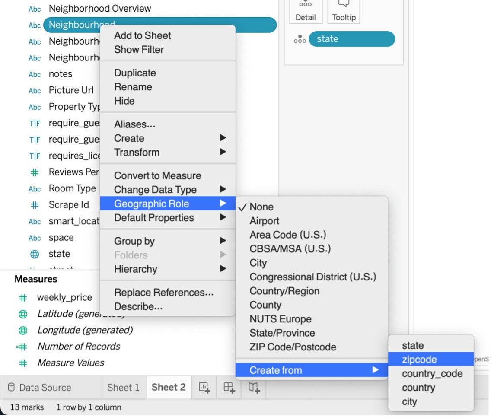
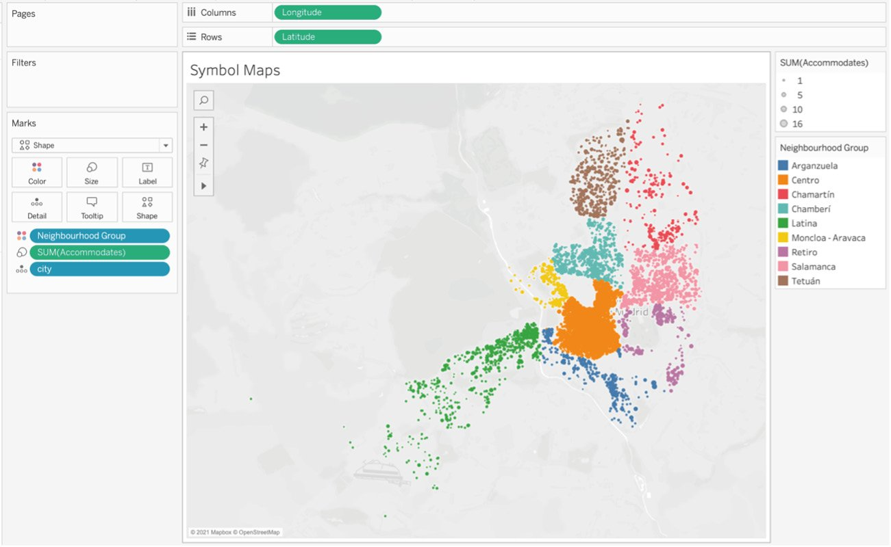
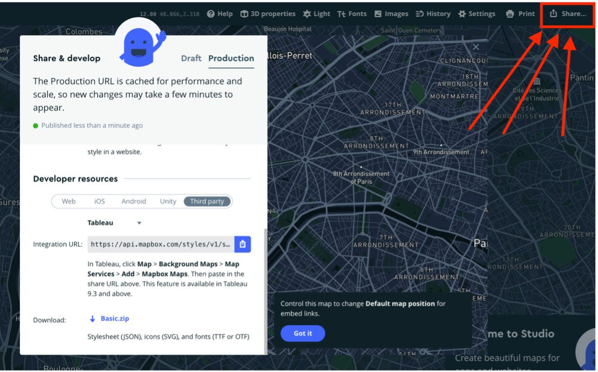

Lab 6: Data Exploration: Exploring Geographical Data 
===================================================

Overview

This lab reviews the geographic capabilities available within
Tableau. Tableau provides an extensive set of options for working with
location-based source data, which can help you design solutions using
either point or polygon location data. By the end of this lab, you
will be able to effectively use geographic data in Tableau to perform
sophisticated location-based analyses. You will gain a greater
understanding of how to import multiple data formats and use your data
to create polished, interactive maps. These skills will be developed
through a series of exercises followed by an activity wherein you will
create your own geographic workbook from start to finish.

Downloading the Data Source from GitHub 
---------------------------------------

The *Lab 6: Data Exploration: Exploring Geographical Data* GitHub
data source folder can be found at the following URL:
<https://github.com/fenago/tableau-advanced>.

-   **NYC Zoning Data**: ESRI which stands for Environmental Systems
    Research Institute, is an organization which has supported in
    design, development as well as implementation of geographic based
    information management systems since 1969. In our data folder \"New
    York City Zoning\" folder, contains ESRI format spatial files which
    is a combination of .shp, .shx, .dbf, and .prj file formats. To
    connect to these spatial files, all the above files as well as .zip
    files should be included in the same folder.

City of New York data source link:
<https://data.cityofnewyork.us/City-Government/Zoning-GIS-Data-Shapefile/kdig-pewd>.

-   **Madrid Airbnb data source**: InsideAirBnB.com was created by
    Murray Cox for his project on Airbnb and the dataset contains
    multiple files including listing details, reviews, as well as
    neighborhood details.

InsideAirBnB data source link:
<http://insideairbnb.com/get-the-data.html>.

-   **SF buyout data**: This file is obtained from the City of San
    Francisco\'s public data repo, which contains a shapefile (.shp) of
    all the buyout agreements of the City of San Francisco from 2015.
    You will use this data source in the activity section.

SFGov.org data source link:
<https://data.sfgov.org/Housing-and-Buildings/Buyout-Agreements/wmam-7g8d/data>.

Exercise 6.01: Downloading the Source Data 
------------------------------------------

In this exercise, you will download and import a geospatial data source
that can be used for filled (choropleth) maps.

Perform the following steps to complete this exercise:

1.  Open a browser and navigate to the `lab06` GitHub
    repository: <https://github.com/fenago/tableau-advanced>.

Figure 6.1: New York City zoning shapefile

1.  Click on the `NYC Zoning Data `folder and download the ZIP
    file. Extract the ZIP file to the location of your choice:

Figure 6.2: New York City data download formats

1.  Locate and extract the shapefile you just downloaded.
2.  Open a new Tableau workbook.
3.  Add a new data source by selecting `Data` \|
    `New Data Source`:

Figure 6.3: Adding New Data

1.  Select `Spatial file` from the `Connect` menu:

Figure 6.4: Selecting the Spatial file option

1.  Open the downloaded file and import the `.shp` file into
    Tableau. When you add the .shp(spatial) file from the
    `NYC Zoning Data` folder, Tableau processes all the files
    in that folder including rest of four file formats and creates a
    polygon map of the data. ESRI files in Tableau gets processed when
    all the files are combined into one shape file and loaded onto
    Tableau:

Figure 6.5: Importing the data source

1.  Click on `Sheet 1` to create your first sheet.
2.  Find the `Geometry` measure and drag it to the
    `Detail` card:

Figure 6.6: Adding the Geometry measure to the Detail card

Tableau will automatically create a map using the shapefile information,
as shown here:

Figure 6.7: The default Tableau map output

The preceding screenshot shows a shapefile version of New York City and
completes the goal of loading spatial data files into Tableau.

In this exercise, you downloaded the data source from
<https://www1.nyc.gov/> and imported a shapefile to display zoning
districts for New York City. You can now view the information related to
each of the polygon shapes in the file. In the next section, you will
learn how to import non-spatial geographic data sources and join them
for analysis later in the lab.

Importing Non-Spatial Geographic Data Sources 
=============================================

Many geographic data sources are not specifically spatial sources but
are instead found in spreadsheet or database formats as part of a larger
dataset. These datasets will typically contain non-geographic data, such
as customer information, time-period details, and assorted metrics.
Geographic features such as country, state, and city will often also be
included, making it possible to create maps displaying many
data attributes.

Tableau makes it easy to create maps from these sources, although you
may need to assist in the process, as you\'ll see shortly. Since many
Tableau data sources will not reside in spatial formats, it is essential
to make sure you can use general data sources to display geographic
information at the appropriate level of detail.

Importing these sources is no different than the process for any general
type of Tableau data. The only difference here is that you require one
or more geographic fields to help you put your data in a map format. In
the following section, you\'ll work through a quick exercise where you
will import a non-spatial source.

Your first data source will be a detailed listing of Airbnb properties
in Madrid. This file will contain information about the host, property
location, ratings, reviews, and other property details.

Exercise 6.02: Importing a Non-Spatial Data Source 
--------------------------------------------------

In this exercise, you will import the detailed listings text file, which
has already been downloaded. By the end of this exercise, you will have
a Tableau data source with several attributes that can be used for
mapping properties in a Tableau worksheet. If you have not already
downloaded the `listings_detailed.csv` file, you can find it
here: <https://github.com/fenago/tableau-advanced>.

The steps to achieving this are as follows:

1.  Select `Data` \| `New Data Source` from the top
    menu:

Figure 6.8: Creating a new data source

1.  Select the `Text file` option:

Figure 6.9: Selecting the Text file option

1.  Locate your downloaded file. It will be a `.zip` file
    probably, so extract the file in a folder and that folder should
    contain multiple files. To import the file
    (`listings_detailed.csv`), locate
    `listings_detailed.csv` and click the `Open`
    button:

Figure 6.10: Adding the text file data source

1.  For the purposes of efficient data performance, create an extract of
    this data instead of live data so that when you are developing your
    visualization, your data operations will be quick. Select the
    `Extract` radio button under `Connection` at the
    top right of the data pane and then click `Update Now`.
    This will populate your window with a subset of data:

Figure 6.11: Selecting the Extract option

1.  Rename the data source `bnb listings` and save your
    extract when prompted:

Figure 6.12: Renaming the data source

1.  Select a sheet and let the extract run. You will now see all your
    data dimensions and measures, along with a blank workspace:

Figure 6.13: Viewing the workspace after creating the extract

In the previous exercise, you imported spatial data, and in this
exercise, you\'ve imported a non-spatial data source containing several
geographic fields that will help you to create informative maps using
the location of thousands of Airbnb properties. Next up are
relationships between spatial and non-spatial data.

Data Relationships 
------------------

One Tableau feature you can use for geographic data (or indeed any data
type) is joins, which allows you to create relationships at the data
source level. Tableau has always permitted joins between multiple data
sources added separately, but this was often useful only for smaller
datasets where a simple join was sufficient. Using data relationships at
the data source level takes a more robust approach, allowing multiple
types of joins as well as unions of source datasets. This approach also
leads to much better performance, especially when creating an extract.

Creating joins at the data source level allows connecting data from
multiple sources (text, Excel, database, and so on), making it simple to
combine data using a single key field within a join. This can be
especially useful when different parts of an organization (that is,
marketing versus finance) use different information systems, or when you
require a simple lookup table to provide intuitive definitions that are
not included in your source database information.

Exercise 6.03: Joining Two Data Sources 
---------------------------------------

In the following exercise, you will join two data sources to create
additional possibilities for your analysis. The first (primary) source
is the `listings_detailed.csv` file, and your secondary file
is a simple neighborhoods file that will provide neighborhood names and
was part of the data source you downloaded in the previous exercise.
Keep in mind this exercise is for illustration purposes only. You can do
much more with data joins, assuming your secondary file has additional
fields. This topic will be covered in the subsequent labs.

Creating your data join consists of a few simple steps:

1.  Add a new data source or edit the existing source to be the
    `listings_detailed.csv` file if it\'s already been
    created:

Figure 6.14: Adding the listings file to the data window

1.  Add the primary data source to the window (if it\'s not already
    there) by dragging it from the `Connections` tab.
2.  Drag the secondary source (the neighborhoods file) to the data
    source window from the `Connections` tab.
3.  Create a join between the two sources using the
    `Neighbourhood` field from each data source in the
    drop-down menu for each source. Then, select the `Inner`
    join option. Your window should look like this:

Figure 6.15: Creating a table join between two data sources

1.  Update the extract by selecting the `Update Now` button.

Your final output should be the following:

Figure 6.16: Creating a table join between two data sources

You will now have the new field(s) available from the secondary source.
As mentioned previously, this is a very simple example, but you could
also use the secondary source as a reference table to provide additional
information about a neighborhood, such as the number of bars,
restaurants, or tourist attractions. There are many other possibilities;
all that is needed is a common field to create a join. In the next
section, you will explore how to edit locations and their aliases and
create custom geographies.

Managing Location Data 
======================

The key to producing maps and other meaningful geographic analyses is to
have the necessary location elements (country, state, city, and so on)
and to make sure they are classified correctly in Tableau. In many
instances, Tableau will correctly identify these roles, making your job
simple. In other cases, you will need to tell Tableau the correct role.
This is often the case when your source field names do not correspond to
the standard naming conventions used by Tableau. There may also be cases
where Tableau incorrectly assumes that a non-geographic field represents
location data based on the field name of the dimension, or where a value
cannot be automatically identified.

This section will explore the various ways in which geographic data can
be created and maintained in Tableau using three primary
approaches---assigning roles, editing locations, and building custom
geographic levels.

Assigning Geographic Roles 
--------------------------

Tableau is quite adept at interpreting geographic levels based on source
data naming conventions. For example, if you have a source field named
`city`, then Tableau will assume you want to use this field to
identify cities on a map. This may not always be the case---a field
named `city neighborhood` may identify a different geographic
level. In these instances, Tableau will require your guidance to match
source fields to the correct geographic levels. Being familiar with your
data sources will make this task simple.

Have a look at the following imported listings data to see how Tableau
handled the data, and whether you need to make any modifications. You
can easily locate the fields Tableau has determined are geographic by
looking for a globe icon. In this dataset, you can see dimensions for
city, country, country code, state, and ZIP code---each with a globe
icon. Check to make sure each has the correct geographic role, starting
with `city`:

Figure 6.17: Associating geographic roles to data source fields

The `city` dimension has been correctly associated with a city
geographic level. This is expected based on the naming convention; it
might have required a manual linkage if the dimension were named
`host city` or some other variation. You can then go through
the same process and note that each dimension has been correctly
identified with its geographic role. Also note that both the country and
country code are associated with the `Country/Region` role;
either field can be used to identify the country
level on a map.

In a case where the geographic association has not been made or is
incorrectly associated, you will need to inform Tableau of the correct
category. This will often occur when a field name is unclear---for
example, if `country` had been named `CTRY` in your
source data, it is quite likely you would need to tell Tableau that this
field is in fact referring to one or more countries. To make this
correction, you simply select the `Geographic Role` \|
`Country/Region` option for this dimension and assign the
proper value.

Note

*Figure 6.18* shows 13 unknown values below. Please note, however, that
you may get different unknown values as the data gets updated
constantly.

Editing Locations 
-----------------

There will be times when Tableau is unable to recognize geographic data,
often due to misspellings in the source data. This will result in null
values when you attempt to map your data, leaving users with an
incomplete picture of the information. Fortunately, you can provide more
information on these values to help get them mapped correctly. See what
happens when you attempt to map the state dimension:

Figure 6.18: Mapping the state dimension

Notice that in the bottom right of the preceding screenshot, there is a
message that tells you that you have 13 unknown values. Tableau is not
recognizing the states provided in your dataset. To find out what\'s
happening, click on the `13 unknown` button, which opens a
`Special Values` window:

Figure 6.19: Editing locations to update unknown values

You then select the `Edit Locations...` option to open a
window where you can begin the matching process. When this window opens,
you quickly see the issue: your default `Country/Region` is
set according to your location (the `United States` in this
example), not `Spain`.

Figure 6.20: Identifying unrecognized geographic values

This is easily rectified by finding `Spain` in the drop-down
list and setting it as your default. When you apply this change, you see
that many of the entries have been automatically updated, especially any
with Madrid as part of their name

Figure 6.21: Updating unrecognized values using the Edit Locations
window

There are others that have not been automatically updated, perhaps as a
result of dirty data. You can now investigate these entries to determine
the extent of the issue. Since you know that your dataset is entirely
composed of Madrid properties, it is probably safe to update the
remaining entries to the same `Comunidad de Madrid` entry. For
each `Unrecognized` state in the `Edit Locations`
window, simply double-click `Unrecognized` and select the
`Comunidad de Madrid` entry from the drop-down list to make
the manual updates.

Building Custom Geographies 
---------------------------

In many cases, you will want to create custom geographic levels that are
not already defined in your data source. This can be done quite easily
in Tableau by specifying how you want the new level to be created, using
an existing geographic attribute. You can also create custom geographies
using calculated fields. Let\'s look at a single example for each
approach.

### Creating a New Geography Using an Existing Role 

In some cases, you will create new geographic levels based on a level
that already exists in the source data. This might be related to sales
territories, neighborhoods, or some other aggregation where you don\'t
have a formally defined geographic level in place. Let\'s look at an
example using the Madrid dataset ZIP codes and neighborhoods.

You already have the ZIP code (postal code) data in the data source
file, and you have neighborhood data as well, although only in text
form. Your goal is to create geographic neighborhood definitions you can
show on a map. To do this, right-click the `Neighbourhood`
dimension and select `Geographic Role` \|
`Create from` \| `zipcode`. This tells Tableau to
build a geography at the neighborhood level using existing ZIP code
data. Here is a view of the menu selections:

Figure 6.22: Creating a geographic role

You can see from the `Data` pane that Tableau does this by
creating a hierarchy wherein `Neighbourhood` is the top level
and `zipcode` is the lower level:

Figure 6.23: Building a custom geography level

What will this look like on a map? To display your new level, drag the
`Neighbourhood` field from the hierarchy to the
`Detail` mark, drag `Neighbourhood` to the
`Label` marks card, and add `SUM(Number of Records)`
to the `Color` mark, and then select the `Map`
option from the `Show Me` menu, yielding this display:

Figure 6.24: Mapping the newly created neighborhood polygons

You can see from the map that you again have an unknown issue with 66
values you were not able to associate with a neighborhood. This is most
likely due to something in the source data---perhaps missing values in
the `Neighbourhood` dimension or dirty ZIP code data. This
sort of issue can frequently occur when there is not a strict standard
for data entry; it is up to the Tableau designer to determine whether
the issue is significant or minor and act accordingly.

### Creating a New Geography Using Groups 

A second method for building a new geographic level is to create a
calculated field, again using an existing geographic level as the base.
You could do this again with a calculation based on ZIP codes (perhaps
the first three or four digits), yielding an aggregate level similar to
the neighborhood example. This assumes that the ZIP codes are assigned
in a manner where this method makes sense.

Another possibility is to create a group in which you assign a name to
each of your aggregate clusters, which can then be mapped accordingly.
In the following example, a set of neighborhood clusters using the
`Group` function have been created:

Figure 6.25: Creating groups based on neighborhood names

To create groups, follow these simple steps:

1.  Highlight one or more individual neighborhood values.
2.  Click on the `Group` button.
3.  Name the group by editing the default Tableau group name.
4.  Repeat *Step 1* to *Step 3* for each additional group.
5.  Click the `OK` button to save all groups.

Now you can add these clusters to a map by dragging the
`Neighbourhood Clusters` dimension to the `Detail`
mark; you can continue to use the `SUM(Number of Records)`
measures for coloring purposes. Here\'s the result:

Figure 6.26: Mapping the neighborhood clusters

Note that there are 12 unknown entries; these can be addressed as
detailed previously by clicking on the message and using the
`Edit Locations` screen to update the entries.

Grouping geographic areas in this manner can help aggregate your data to
meaningful levels for analysis, especially if you are familiar with the
geographic attributes in your source data. In the next exercise, you
will practice these concepts using the Airbnb dataset that you have been
using.

Exercise 6.04: Building Custom Geographies 
------------------------------------------

In this exercise, you will create custom geographies using both the
existing role and group approaches. This will provide additional mapping
options using these aggregate dimensions, starting with the role
approach.

Perform the following steps to complete this exercise:

1.  Open a new or existing Tableau workbook.
2.  Import the listings and neighborhood files if you have not already
    done so.
3.  Make sure you have a data source with the
    `listings_detailed` and `neighbourhoods` files
    joined. If not, create this relationship by joining them on the
    `Neighbourhood` field.

Figure 6.27: Joining two files as a single data source

1.  Create an extract by selecting the `Extract` radio button.
    Save the extract and open a worksheet.
2.  Create a geographic role for `Neighbourhood` by selecting
    the dimension and creating a role based on `zipcode`.

Figure 6.28: Assigning a custom geographic role

1.  Right-click on the `Neighbourhood` dimension and select
    the `Create` \| `Group...` menu item:

Figure 6.29: Creating a group from an existing field

1.  Select the entries from `Acacias` through
    `Atocha` and click the `Group` button. Name this
    `Cluster 1`. Then, select some more entries through
    `Gaztambide` and click the `Group` button. Check
    the `Include 'Other'` checkbox:

Figure 6.30: Results after creating groups from the Neighbourhood
dimension

1.  Click the `OK` button. You will now see a
    `[Neighbourhood Clusters] Group` dimension.

Figure 6.31: The Neighbourhood Clusters group as a new dimension

In this exercise, you created two new geographic fields using a pair of
approaches. You can now use these dimensions to create filled maps,
which is what you will be exploring in the next section, using a couple
of options displayed in the `Show Me` menu.

Creating Maps in Tableau 
========================

Tableau provides two distinct map options in the
`Show Me` menu---one for symbol maps and a second for
choropleth maps. If your data has simple latitude/longitude values
corresponding to a postal code centroid, such as a store location (or
even a city), then your mapping will be focused on the symbol map
option. If, however, your data has more detailed data based on a
shapefile or GeoJSON data source, you can then use the choropleth option
to create filled maps based on the polygons in the data source. In some
cases, you will have access to both types of source data and will be
able to create a dual-axis map, which will be explored later in this
section. The following is a simple comparison of the two types, with
choropleth (filled) on the left and symbol on the right:

Figure 6.32: A choropleth (filled) map and a symbol map

Geocoding 
---------

Geocoding is the process of assigning geographic
attributes to a data field that may not be automatically recognized as a
traditional geospatial field. In these cases, you need to assign values
that correspond to these dimensions so maps can be created. This section
will examine how this can be handled in Tableau.

In many cases, you will be presented with geographic attributes that
Tableau will be unable to recognize without some guidance. Street
addresses are a common example of this; unlike country, state, or even
city, street addresses are too often duplicated across multiple
geographies, making them very difficult to locate correctly on a map.
Fortunately, Tableau enables custom geocoding, where you can use two
distinct methods to provide more precise information. In both cases, you
start with a `.csv` file.

The first case is where you wish to use existing geographic definitions
and simply extend them to include new members. For example, if you need
to add a new country, state, or county to your maps that is not
recognized by Tableau, you can provide this information using a
`.csv` file. You simply select the `Map` \|
`Geocoding` \| `Import Custom Geocoding` menu option
and direct Tableau to your directory where the `.csv` file has
been created. The data field names must match the existing Tableau field
names (`Country`, `State`, and so on) and should
include latitude and longitude information so Tableau knows where to
locate the new entries on a map.

The second type of custom geocoding involves information that may be
specific to an organization (such as a regional sales hierarchy), or
that may reference non-traditional point data such as lightning strikes
or volcanic eruptions. In these cases, you create specific names for the
new items, and then add a new field name that can be used in Tableau.
For example, the field name might be called
`Lightning Strikes` if you are attempting to map those events.
Once again, latitude and longitude data must be included, as well as
other appropriate geographic levels, such as `Country` and
`State`.

Adding this custom geocoded information extends the mapping capabilities
of Tableau beyond traditional boundaries and definitions.

Note

The steps to create the map shown in *Figure 6.33* are explained in
*Exercise 6.05*.

Symbol Maps 
-----------

Symbol maps represent all maps where location data
is provided in a point-based latitude and longitude format. Latitude
represents the north-south location of a data point, while longitude
provides the east-west location. Using these two measures in Tableau
allows you to pinpoint the precise location of stores, offices, parks,
museums, and many other entities with specific locations. These points
may represent a central location within a large geographic entity (such
as a park) or may have a higher precision level, depending on how
detailed your source data is. For example, a latitude value of
`45.37187` will be more precise than the same value rounded
to `45.37`.

Symbol maps are quite simple yet very powerful in their ability to tell
stories based on geographically positioned data. Let\'s explore the
process for building effective symbol maps in Tableau. Everything starts
with latitude and longitude measures, which may be included in your
source data or can be calculated by Tableau for recognized attributes
such as country, state, and county. As an example, using your Madrid
locations data, here is a simple view based on the latitude and
longitude data in the source file. You can select any point to see the
supporting geographic coordinates:

Figure 6.33: Details of a data point in a symbol map

Each point in the map is positioned based on latitude and longitude, as
seen in the tooltip for the map. You can use additional map layers to
provide more context, but for now, this is a good starting point.

### Adding Data to Symbol Maps 

While placing location points on a map can be
informative, more often you will also wish to add data measures to those
points---perhaps revenue for a store location or the number of visitors
to a tourist attraction as two simple examples. This is easily done in
Tableau using colors, sizes, or shapes to identify one or more features
of a geographic point. You first need to determine which data fields
will be most meaningful to display; this will allow you to build logic
to display specific information based on user interaction.

When you add a measure to a symbol map, there are two commonly used
approaches to display this data; the first is the use of colors or
shapes, and the second is the use of the sizing of symbols. If you are
adding dimensional information to the display, you will usually opt for
colors or shapes to represent these categories. In some cases, both
shapes and colors can be used to provide additional detail to the map
viewer. If you are adding measures to your symbol display, sizing will
often be the preferred approach, since it will help in identifying
numerical differences across locations. Using colors or shapes is not as
effective with measures, although either one could be used in tandem
with size. In the following sections, you will see examples for each of
these options.

### Coloring a Symbol Map 

Colors can be used to provide insight into both
categorical dimensions and numeric measures. This will give users a nice
visual cue to help them see geographic-related patterns in the
information. When using colors, it is important to recall that the human
visual system has a limited range with respect to viewing colors; you
typically would like to keep this to less than 10 distinct colors or
shades. The Color Brewer website at
[https://colorbrewer2.org](https://colorbrewer2.org/) provides color
palettes ranging from 3 to 12 distinct shades for mapping. Some users
will be able to distinguish additional distinct colors, but it is best
to err on the low side and minimize the number of map colors. You can
also decide on colors based on your data distributions and find that you
may need as few as 3 or as many as 9 or 10 colors to tell the story
correctly.

Here, you can see an example of coloring using neighborhood groups in
which you have nine colors:

Notice how easily each neighborhood group is seen when you use distinct
colors. Using a color palette with distinctly different colors is very
helpful in this case, whereas a single color with shaded gradations
would be more difficult to interpret. This same approach can be applied
when you have distinct categories such as political districts or postal
codes. On the other hand, if you wanted to see the percentage of voters
voting for a political party or candidate, the best approach is to use
shades of a single color to reflect percentages ranging from the minimum
to maximum levels (perhaps 10% to 70% as an example).

To color the map, you perform the following steps:

1.  Drag the coloring field (`Neighbourhood Group` in this
    case) to the `Color` card.
2.  Select the `Color` card to edit colors if needed.
3.  Choose an opacity level for optimal display; less than 100% opacity
    is recommended, especially when there are overlapping symbols on a
    map. This will improve data visibility.

### Sizing a Symbol Map 

Individual points may also be sized based on values
in the data, typically based on a single measure. For example, you may
choose to display points sized based on revenue for each store location.
Stores with higher revenue will have a larger dot (or another symbol)
corresponding to their revenue relative to locations with lower values.
This can be an effective approach, given that size differences are one
of the more easily detected visual cues.

In the Madrid example, the dots are sized based on the number of
bedrooms for each lodging. You can keep the colors already created so
that your map will become even more informative for the viewer.

To do this, follow these steps:

1.  Drag the `Bedrooms` dimension to the `Size` card
    in the `Marks` area of your worksheet.
2.  Click on the `Size` card and adjust the symbol size using
    the slider tool.

Zoom in so you can see the effect more clearly:

Figure 6.35: Sizing map symbols using the Bedrooms dimension

You now have points with anywhere from `0` to `8`
bedrooms, with the differences quite noticeable at this zoom level. It
may take a bit of work to distinguish between `6` and
`7` or `3` and `4`; this is where tooltips
can provide further clarity. You can easily adjust the size of your
marks by selecting the `Size` card and dragging the bar to the
left or right.

### Using Shapes in a Symbol Map 

Let\'s continue exploring using the Madrid data.
You have already used color and size to make your map more informative;
now you can add shapes to provide one more level of detail to the map.
At this point, you may wish to be careful by not adding too many shapes
to the display, so a simple category is in order. Use the
`Instant Bookable` field since it contains just two values.

To create this map, follow these steps:

1.  Simply drag the `Instant Bookable` dimension to the
    `Shape` card.
2.  Select the shapes you wish to display for each value by clicking on
    the `Shape` card and assigning a shape value to each data
    category.

Here is the result:

Figure 6.36: Using shapes to show the Instant Bookable value

Now you have a map that provides a wealth of information to the user,
including neighborhood group, number of bedrooms, and whether a property
is instantly bookable. To provide even more insight, you can customize
tooltips so that users learn more about a property as they hover over a
point.

### Adding Map Tooltips 

Providing informational tooltips is a great
finishing touch that helps users navigate maps and the underlying
information they contain. While map labels can be helpful, there is a
point at which they become visual noise that obscures the meaningful
information contained in the map. This is where tooltips become
especially useful as they can hold a lot of information without getting
in the way of the map display.

Let\'s walk through a quick example of building a simple yet informative
tooltip in your map. You\'ve already seen tooltips in their simplest
version, but they are capable of so much more, as you\'re about to see.

To add additional fields to a tooltip, simply drag dimensions or
measures to the `Tooltip` card in the `Marks` pane.
This will make these fields accessible even if they don\'t wind up being
used in your text. Tableau, by default, will provide a functional
tooltip containing information associated with the map, as seen in
Figure 6.37 With just a little effort and the use of contrasting font
colors, tooltips can become much more powerful. You can drag the
`Host Name`, `Host Response Rate`,
`Zipcode`, and `Summary` dimensions to the
`Tooltip` card and continue to use the existing
`Neighbourhood Group` and `Bedrooms` dimensions to
tell a small story about the property, as seen in *Figure 6.38*.

Figure 6.37: Customizing tooltips to tell a detailed story

As you can see, tooltips are a great way to include helpful information
without the need to clutter a map with too much detail.

### Navigating Symbol Maps 

Tableau provides some simple tools for navigating
maps. In the upper-left area of the `Map` window is a small
toolbar with the following features:

-   Search creates the ability to locate elements in a map.
-   Zoom in is very useful for navigating a densely populated map.
-   Zoom out can be used to display an entire map and provide
    surrounding context.
-   Reset map will set the map to a fixed display size.
-   Zoom area is an extension of zoom in that allows you to select a
    specific part of the map to zoom in on.
-   Pan provides the ability to move the map up and down or side to
    side.
-   The three selection tools (rectangle, radius, and lasso) enable
    highlighting elements within a selected portion of the map.

These tools make it easy to move the map within the map window, enlarge
or shrink the data points, fix the display size (using reset map), and
create custom selections using the three selection tools. Map data can
also be filtered by using the map legends, as you\'ll see in the next
section.

### Filtering Symbol Maps 

In an earlier section, you learned about the
challenge of differentiating between places with three or four bedrooms,
since the symbols are nearly the same size. This presents an issue for a
user who may require four bedrooms but cannot easily see the difference
based on symbol size. To address this, the user can simply click on the
`4` in the `Bedrooms` legend and select the
`Keep Only` option. Tableau will automatically add a filter to
the `Filters` pane reflecting this selection.

The same can be done using the `Color` legend you have for
`Neighbourhood Group`. With colors, you can click on one or
more options and the data will be highlighted. In this case, both the
`Centro` and `Chamberi` neighborhood groups have
been selected, yielding this result:

Figure 6.38: Filtering a map by selecting legend values

You could also select the `Keep Only` option and Tableau will
add a filter reflecting your choice.

The shapes filter works like the size filter, allowing users to select
the `Keep Only` option to set up a filter. Alternatively,
users can choose the `Exclude` option if they wish to remove
some locations from the map.

While these are very useful options, users can go one step further and
build new groups and sets using map data. We\'ll visit those options in
the next section.

### Creating Groups and Sets from Symbol Map Data 

One of the useful functions in Tableau mapping is the ability to create
groups and sets based on a selection of points in a map. This is
important because you won\'t always be aware of patterns until seeing
them on a map. You can then grab a collection of data points using
rectangular, radial, or lasso selections and create a group or set
immediately. This is a powerful feature that allows users to take
advantage of patterns revealed on a map to create meaningful
aggregations of data.

Consider the following example using your previously created symbol map.
Using the map toolbar, select the rectangular selection tool and
highlight an area of points with it. (Notice the different colors for
all the points in your selection area.)

Figure 6.39: Selected points are displayed in a different color

You then create a group for the selected points by using the
`Group Members` icon:

Figure 6.40: Creating a group dimension using the Group Members icon

Tableau has now created a group in the `Dimensions` pane that
can be used in your analysis. This is a more intuitive, faster means to
create groups rather than doing it manually using the group function.

The steps to do this are as follows:

1.  Select the rectangular selection tool from the map toolbar.

Figure 6.41: Selecting the rectangular selection tool

1.  Highlight the area you wish to select within the map.
2.  Hover over any of the selected data symbols.
3.  Select the `Group Members` icon, as shown previously.
4.  You can inspect your results to verify the group has been created:

Figure 6.42: Viewing the values in the newly created group

This example illustrates another way you can use geographic data and
maps to expand your analysis capabilities. You will now practice these
concepts around the symbol map, including grouping locations and
coloring them according to their groups.

Exercise 6.05: Building a Symbol Map 
------------------------------------

In this exercise, you will create a symbol map
using data from the Madrid listings data. This will help provide insight
into listing patterns across the city.

Perform the following steps to complete this exercise:

1.  Import the `Madrid listings` dataset if you have not
    already done so.
2.  Create a data source by joining multiple files as shown in previous
    sections/exercises.
3.  Add a new Tableau worksheet.
4.  Drag the `Longitude` measure to the `Rows` shelf
    and the `Latitude` measure to the `Columns`
    shelf. (Use these rather than the generated values provided by
    Tableau.) Change both `Longitude` and `Latitude`
    to `Dimension`:

Figure 6.43: Setting Latitude values to Dimension

1.  Drag the `City` dimension to the `Detail` card
    and the `SUM(Number of Records)` measure to the
    `Size` card and adjust the symbol size to better display
    all points. If for some reason you don\'t get a Map, click on \"Show
    Me\" card and manually select `Symbol Maps` from.

Figure 6.44: Adjusting the Size card for displaying symbols on the map

1.  Replace `SUM(Number of Records)` with the
    `Accommodates` measure on the `Size` card:

Figure 6.45: Using the Accommodates dimension to size points on the map

1.  Drag the `Neighbourhood Group` dimension to the
    `Color` card and call this worksheet
    `Madrid Accommodates Map`. You will be using the same
    worksheet later in the lab in *Exercise 6.07: Creating a
    Dual-Axis Map*:

Figure 6.46: Coloring the map using the Neighbourhood Group dimension

It is now easy to identify the density of listings in the Centro
neighborhood (displayed as the orange cluster in the lower half of the
screenshot). Each of the surrounding neighborhoods has fewer listings
scattered across the map due to their greater distance from the primary
tourist attractions found in Centro.

In this exercise, you created a symbol map that details listing patterns
across the city of Madrid. This map can form the basis for additional
insights using multiple measures, parameters, and filters. In the
upcoming section, you will review the second type of map that Tableau
supports, which is choropleth maps, which you briefly learned about at
the start of the lab.

Choropleth (Filled) Maps 
------------------------

Choropleth maps differ from symbol maps in one
important respect: locations are now based on shapes (polygons, lines,
or points) rather than on a single point using latitude/longitude
coordinates. These maps will typically use officially defined geographic
designations (country, state, city) as the basis for analysis, with
colors as the primary method for displaying measures since size and
shape are already defined. Filled maps may also be used with symbol maps
to provide multiple levels of geographic analysis.

Note

For `Avg Area` measure creation mentioned in the topic below,
if you are using any further version of Tableau than 2020.1, the field
`Number of Records` does not exist. For creating
`Avg Area` measure, you can explicitly create
`Number of Records` on your own. Please refer to this link for
more information:
<https://tarsolutions.co.uk/blog/number-of-records-missing-in-tableau/>.

### Coloring a Choropleth Map 

As previously noted, colors will generally be the
method used to display measure differences in a filled map. Distinct
color sets are used when comparing dimension (categorical) values, while
shaded palettes are the best approach for displaying measures.

Let\'s look at these two cases, first using a dimension, followed by a
measure example. Both examples will use the previously downloaded
`New York City zoning data`. For the dimension example, no new
fields are needed; you simply drag the `Geometry` measure to
the `Detail` card, allowing Tableau to use the shapefile
polygon data, and then drag the `zonedist` dimension to the
`Color` card. The result looks like this:

Figure 6.47: New York City zoning map colored by detailed zonedist
values

Note that you have many detailed zoning types. These could probably be
aggregated to present a similar map without unnecessary detail. To do
this, you\'ll create a simple grouped field from the
`zonedist` values, with very high-level groups in which zones
starting with `C` are commercial zones, `M` are
manufacturing zones, and `R` are residential zones; the others
are self-explanatory. Let\'s revisit the map and drag the
`zonedist (group)` dimension to the `Color` card.
Here\'s your new map:

Figure 6.48: New York City zoning map colored by grouped zonedist values

Now you can see the more evident patterns between residential,
commercial, and manufacturing areas, which were previously masked by the
many subtypes within each designation.

You can use the same data to create a filled map based on measures,
although you\'ll need to do a little work to create some new measures.
Some datasets may have useful measures included (income, population
density, and so on) but that isn\'t the case here. You\'ll create two
measures you can use on the map (`Avg Area` and
`Zone Counts`) using the following formulas.

The `Avg Area` measure can be created using the following
steps:

1.  Right-click in the `Data` panel and select
    `Create Calculated Field`.
2.  Enter the `SUM([Shape Area])/SUM([Number of Records])`
    formula.
3.  Name the calculation `Avg Area` and click the
    `OK` button to close the window.

Zone Counts can be created in a similar manner:

1.  Right-click in the `Data` panel and select
    `Create Calculated Field`.
2.  Enter the `COUNT([Zonedist])` formula.
3.  Name the calculation `Zone Counts` and click the
    `OK` button to close the window.

You can now create a filled map using either of these measures as the
color. Drag `zonedist` on the `Detail` card and
`Zone Counts` to the `Color` card to update the map,
like this:

Figure 6.49: New York City zoning map colored by zone counts

You now see each zone colored by the frequency of occurrence (notice the
highest count is represented by the darkest color). This is the type of
color scheme to use when you have a continuous measure displayed on a
map, as opposed to the dimension map where you used distinct colors.
When numbers are below zero or an average value, a two-color scheme is
useful to show low versus high values (red to blue, for example).
Tableau has many native color palettes to choose from, making it easy to
create compelling maps.

### Navigating a Choropleth Map 

You can use the same map tools discussed in the
symbol map section when navigating a map:

-   Search creates the ability to locate elements in a map.
-   Zoom in is very useful for navigating a densely populated map.
-   Zoom out can be used to display an entire map and provide
    surrounding context.
-   Reset map will set the map to a fixed display size.
-   Zoom area is an extension of zoom in that allows you to select a
    specific part of the map to zoom in on.
-   Pan provides the ability to move the map up and down or side to
    side.
-   Three selection tools (rectangle, radius, and lasso) enable
    highlighting elements within a selected portion of the map.

### Filtering a Choropleth Map 

You can also use the same filtering tools discussed
in the section on filtering a symbol map, including the ability to
create groups and sets using the selection tools. Note that when
selecting areas on a filled map, you do not need to select an entire
area to include it in your group or set. If you need more precision,
then click on each desired area to build new groups or sets. Now, you
will execute the following steps to build your own choropleth maps.

Exercise 6.06: Building a Choropleth Map 
----------------------------------------

In this exercise, you will create and populate a
filled map using the New York City zoning shapefile you downloaded in
*Exercise 6.01*:

1.  Open your existing Tableau workbook or create a new workbook.
2.  If you have not already done so, import the data source from
    <https://data.cityofnewyork.us/City-Government/Zoning-GIS-Data-Shapefile/kdig-pewd>.
3.  Add the data source by navigating to the `Data` \|
    `New Data Source` menu:

Figure 6.50: Adding a new data source

1.  Select the `Spatial file` option:

Figure 6.51: Connecting to a spatial file

1.  Locate your downloaded file and select it. A sample of the data will
    appear in the import window:

Figure 6.52: Viewing the spatial file attributes

1.  Add a new worksheet and make sure it uses the spatial data source:

Figure 6.53: A worksheet with dimensions and measures from the spatial
file

1.  Drag the `Geometry` measure to the `Detail`
    card. Tableau will add `Latitude` and
    `Longitude` fields and create a map:

Figure 6.54: Adding the Geometry measure to the Detail card

1.  Drag the `zonedist` dimension to the `Color`
    card:

Figure 6.55: Coloring the map using the zonedist dimension

1.  Create a `zonedist (group)` dimension by summarizing all
    R, C, and M zones into `RESIDENTIAL`,
    `COMMERCIAL`, and `MANUFACTURING` groups. Click
    `OK` to save the group as a dimension.

Figure 6.56: Creating a zonedist (group) dimension

1.  Drag the `zonedist (group)` dimension to the
    `Color` card:

Figure 6.57: Coloring the map using zonedist (group)

In this exercise, you added a spatial data source and used the
`Geometry` field to populate a map. You also learned how to
color the map using both an existing and a newly created dimension. In
the following subsection, you will gain an understanding of how to use
dual-axis maps and when are they used.

Dual-Axis Maps 
--------------

Tableau allows you to create dual-axis maps so that
you can overlay point data on a polygon map or simply use the second
axis to display the data in a new way. This type of map could be used
when you wish to overlay two data variables with different purposes for
each, or even from distinct data sources. For instance, you could
overlay a dataset based on geographic boundaries (states) with one using
symbol data (latitude/longitude addresses), or you can simply create
additional information from a single set of data points, as the
following example will illustrate. In this example, you will use the
second axis to create a density map to show areas within Madrid with the
highest concentrations of Airbnb properties.

To do this, you start with an existing symbol map like the one built
earlier in this lab. All you need to do to create a dual-axis map is
to drag the `Latitude` measure to the `Columns`
shelf, placing it to the right of the existing
`Latitude` measure.

Figure 6.58: Adding a second Latitude dimension

Tableau will create a second map by default; you need to use the
drop-down menu from the new `Latitude` measure and select the
`Dual Axis` option. You also need to tell Tableau to treat
your new measure as a dimension by selecting the `Dimension`
option from the same menu.

Figure 6.59: Setting up a Dual Axis map

Once you have the second axis specified, you can move to the
`Marks` area, where a `Latitude (2)` entry has been
added. In this case, you would choose the `Density` option for
the display type and adjust the intensity and opacity levels to your
preference. This will give you a map that retains the original elements
from the map while adding the density markers.

The `Density` option will now display areas with a higher
concentration of properties as blurred colors. The Centro neighborhood
in the middle of the map will be especially dense at this zoom level. As
you zoom in, the individual properties will gradually be revealed. In
this section, you revisited a dual-axis chart but in map form. Now you
will grasp these concepts in a better way by executing the next
exercise.

Exercise 6.07: Creating a Dual-Axis Map 
---------------------------------------

In this exercise, you will create a dual-axis map,
using symbols for the base map and then adding a second axis that uses
the density markers. You will use the Madrid Airbnb data source as you
have in previous exercises.

Perform the following steps to complete this exercise:

1.  Open the `Madrid Accommodates Map` worksheet that you
    created in *Exercise 6.05*.

Figure 6.60: Symbol map colored by Neighbourhood Group

1.  Drag the `Latitude` measure to the `Rows` shelf,
    next to the existing `Latitude` measure:

Figure 6.61: Adding a dual axis using two Latitude measures

1.  Set the new `Latitude` measure as a continuous dimension
    and check the `Dual Axis` item to combine the elements
    into a single map:

Figure 6.62: Selecting the Dual Axis option

1.  In the `Latitude (2)` `Marks` area, choose the
    `Density` option:

Figure 6.63: Selecting a Density symbol

1.  Adjust the `Density` settings by clicking on the
    `Color` card:

Figure 6.64: Adjusting the Density coloring

1.  View the map to see the impact of the `Density` symbols:

Figure 6.65: The completed dual-axis map with symbols and density

In this exercise, you created a dual-axis map using circle symbols on
the first axis and density symbols on the second axis. You learned how
to use them together to create a more complete map. The second level of
density details that you added will now display areas with a higher
concentration of properties as blurred colors. The Centro neighborhood
in the middle of the map will be especially dense at this zoom level.
These extra details on maps help end users/stakeholders to observe the
map with extra context in one view instead of switching the view
multiple times. In the next section, you will review what map
enhancement options Tableau provides and how to best add/use them in
your maps.

Map Enhancements 
----------------

Tableau has multiple features you can use to
upgrade your maps and make them effective for
users. Some of these are native while others can be added quite easily.
In this section, you will cover some simple ways to improve on the base
maps used in Tableau.

### Setting Map Options 

Map options are simple selections that can be
chosen to determine how a user can interact with a map. To set these
options, select the `Map` \| `Map Options` menu
item, which will open a small window:

Figure 6.66: Map Options menu items

These options allow users to navigate the map using pan (to shift your
map from side to side or up and down) and zoom, allow users to perform
searches, and allow the functionality provided by the toolbar (radial
selections, and so on). If you want your map to remain fixed with a
single size and location, disable these capabilities.

### Using Existing Layers 

Default Tableau background maps provide numerous
map layers that can easily be selected and deselected by users depending
on their preferences. Map layers help you to add extra details such as
highways, borders, terrains, coastlines, and county borders where these
layers add minute details to the maps. To change the default map layer,
click on `Map` \| `Map Layers` from the menu.
Tableau offers the following layer options:

Figure 6.67: Map Layers menu options

These layers can be used to customize the appearance of a map. For
example, in the Madrid listing example, if you select
`Streets, Highways, Routes` as well as
`Zip Code Labels`, you will notice how extra details are added
to the map, as shown in the following screenshot:

Figure 6.68: Map Layers menu options with added layers

Although aligning with data visualization best practices, you would
generally try to minimize the number and visibility of these layers to
not distract users from the map data. Using just enough layers to
provide context is a smart approach.

In addition, more than 20 demographic layers are available as overlays
for US-based data, which essentially allows you to add a data mask layer
depending on the demographic you choose from the dropdown. But as
mentioned previously, seldom do you have to use these extra layers in
your maps because, more often than not, these layers confuse
stakeholders rather than help them.

Layers are very easy to add or remove in Tableau, so it is wise to spend
some time with the many options until your map is visually pleasing. As
with most charts, less is often more on a map; make sure the focus is on
the data and not on the map layers.

### Adding Mapbox Background Maps 

You do have options beyond the standard Tableau
background maps. One of these is to embed Mapbox background maps in
Tableau---an approach that enables the creation of uniquely styled maps.
Mapbox is a popular map creation platform enabling users to customize
maps for use in many applications. Tableau added Mapbox integration back
in Tableau 9.2, so the ability to use Mapbox background maps is not new
but should nonetheless be explored if you wish to feature maps beyond
the native Tableau versions. You will need to create a free Mapbox
account at <https://www.mapbox.com/> to build these maps.

To export a Mapbox map for use in Tableau, navigate to Mapbox Studio,
<https://studio.mapbox.com/>, and then simply create your own style by
clicking on `New Styles` and choosing an option under
`Choose a template` as well as `Choose a variation`
from the popup:

Figure 6.69: Choosing a template and variation for Mapbox

Then, select the `Share…` icon at the top right of the map and
view the `Third party` options to find the `Tableau`
dialog:

Figure 6.70: Exporting a Mapbox background map to Tableau

This provides you with a link to be used in Tableau as a background map
style to provide a customized background to set your maps apart from the
standard Tableau options. The link can be copied to the clipboard and
then added as a background map. In Tableau Desktop, create a new sheet
and select the `Map` \| `Background Maps` \|
`Manage Maps` menu item, which will open a
`Map Services` window. Clicking the `Add` button
gives you two options: `WMS Servers…` (Web Map Server, similar
to Mapbox) and `Mapbox Maps…`. Click on the `Mapbox`
option and you will see a dialog screen:

Figure 6.71: Adding a Mapbox map using the Mapbox URL

Here, you can add a style name of your choice, and then copy your Mapbox
link to the URL text box. The remaining information will be
automatically updated based on the URL link, and your background map
will be ready to go. Multiple maps can be added using this same process,
which will give you many options beyond the native Tableau map
backgrounds. Now, use this Mapbox map style for your Madrid worksheet.
Click on `Maps` \| `Background Maps` \|
`Default Galaxy Style (or your style name)`. Here\'s a look at
your data with a new background map:

Figure 6.72: A custom Mapbox map of Madrid

If you open the `Map` \| `Map Layers` card, you will
see the available layers from the selected Mapbox map. Note that each
map style will have its own set of options. Here is what you have with
your style:

Figure 6.73: Selecting Map Layers for the Mapbox map

Using these checkboxes makes it simple to customize a map to work best
with your existing point data. You can also use the `Washout`
slider to add some level of transparency to the display.

As you have seen, Mapbox background maps can be used to add visual
interest to your worksheets and dashboards and can be customized in
Mapbox using an almost endless combination of colors and styling. To
assimilate what you read in this section, you will now go through an
exercise to add Mapbox and understand how to use it in Tableau.

Exercise 6.08: Adding Mapbox Background Maps 
--------------------------------------------

In this exercise, you will practice adding Mapbox
data to the New York zoning data and apply a new Mapbox style for the
GIS data that you have previously used.

Perform the following steps to complete this exercise:

1.  Load the `New York City zone shapefile` if you have not
    already loaded the data into Tableau Desktop.
2.  Drag `Geometry` to the `Detail` marks card and a
    `New York City map` will be created, which you have also
    seen previously.

Figure 6.74: New York City zoning data map

Note

You can create an account with <https://studio.mapbox.com/> and can
continue to work on the exercise for free. Please make sure that you
fill in the necessary credentials.

1.  Now, go to
    [https://studio.mapbox.com/](https://studio.mapbox.com/%20) and sign
    in/sign up if you have previously not done so.
2.  Click on the `New style` button at
    <https://studio.mapbox.com/>.

Figure 6.75: Creating a new style in Mapbox

1.  Next, select the style you want to use. For the purposes of this
    exercise, select the `Streets` template as the style.
    Click on the `Customize Streets` button to create your own
    Mapbox style.

Figure 6.76: Choosing styles on Mapbox

1.  On the new page that was loaded, click on the `Share`
    button in the top right-hand corner, scroll down the popup and click
    on `Third party`, then select `Tableau` from the
    dropdown, as shown, and copy the integration URL:

Figure 6.77: Selecting Tableau as the third-party service in Mapbox

1.  In your Tableau Desktop instance, click on `Map` \|
    `Background Maps` \| `Manage Maps`, and in the
    popup, click on `Add…` and select
    `Mapbox Maps…`, as shown in the following screenshot:

Figure 6.78: Adding new Mapbox maps to Tableau

1.  Name your map style appropriately and paste your integration URL in
    the `Url` field. Other fields should autoload, as shown in
    the following screenshot. Click OK:

Figure 6.79: Adding a new Mapbox style

The New York City zoning map should have autoloaded the new Mapbox style
with a lot more details than Tableau default map options, as shown in
the following output:

Figure 6.80: NYC Mapbox loaded in the new Mapbox style

As you can see, the Mapbox background map, when zoomed in, provides a
lot more extra detail, including the city line and street names.

In this exercise, you practiced adding Mapbox to your Tableau maps with
new styles with a shapefile, while previously, before the exercise, you
only worked with ZIP code data. With Mapbox, you were able to add a lot
more minute details to the maps, such as streets, neighborhoods,
important attractions, coastlines, and highways. These newly added
details have enhanced the map for end users.

This wraps up the theoretical aspects of this lab. Next, you will go
through a new set of data and a final activity to test the knowledge you
have gained throughout the course of this lab and the previous
exercise by attempting to create useful and powerful maps.

Activity 6.01: Creating a Location Analysis Using Dual Axis and Background Maps 
-------------------------------------------------------------------------------

As a data developer for a San Francisco City
Department, you are asked to create a report/visualization that will
showcase the hotspots of house buyout agreements in the city from a high
level and gather contextual information about the house, its
neighborhood, its actual address, its buyout date, and its total number
of tenants, as well as the buyout amounts for the houses. Stakeholders
also want to be able to filter the map data points by buyout dates. You
will be using the SF Buyout Agreement data provided in the GitHub link
or by downloading the `.shp` file from the following link:
<https://github.com/fenago/tableau-advanced>.

Perform the following steps to complete this activity:

1.  Locate the `SF Buyout Data.shp` file that you downloaded
    from GitHub and add that as a data source in Tableau.
2.  Create a new worksheet named `SF Buyout Map`.
3.  Add `Buyout Date` as a filter. Only include non-null
    values by selecting relative dates. Show the `Buyout Date`
    filter.
4.  Before proceeding to the next steps, edit the title to
    `SF Buyout Map` and rename some of the column names for
    easier understanding. The mappings are as follows:
    -   `Case Number` -- `Case Number`
    -   `Date Pre B` -- `Pre Buyout Disclosure Date`
    -   `Date Buyou` -- `Buyout Date`
    -   `Buyout Amo` -- `Buyout Amount`
    -   `Number of` -- `Tenants`
    -   `Analysis N` -- `Neighbourhood`
5.  Drag `Geometry` onto the `Detail` card.
6.  Duplicate the `Latitude(generated)` column and create a
    dual axis.
7.  Under the first `Latitude(generated)` marks card, change
    `Marks Type` to `Density`.
8.  Add `SUM(Tenants)` to the `Color` marks card and
    add `Case Number` to the `Detail` marks card.
9.  For the second `Latitude`, change `Marks type`
    to the `Circle` symbol.
10. Add `Neighbourhood` to the `Color` marks card
    and `Case Number` to the `Detail` marks card.
11. To add context to your map when you or a stakeholder hovers or
    clicks on the map, you will add `Address`,
    `Buyout Date`, `Buyout Amount`, and
    `Tenants` to a tooltip and edit the tooltip to look as in
    the following output.

The expected output is as follows:

Summary 
=======

This lab introduced you to many of the geographic capabilities and
methods designers and users can employ in Tableau. The ability to take
geographic data and create powerful, attractive maps that integrate with
other displays is a critical skill in building visual insights. You
learned how Tableau maps can incorporate size, color, shapes, and
filtering so users can explore and understand geographic information
more thoroughly.

You also learned that while Tableau is not a dedicated mapping platform,
it can be used to replicate much of the functionality of traditional
mapping and GIS software. Being able to map geographic data is an
essential skill in developing complete Tableau solutions for users and
can be incorporated into any analysis where geospatial data is available
and interacting with external map files can add an additional layer of
detail to maps.

In the next lab, you will be moving into the analysis section of the
course with *Lab 7: Analysis : Creating and Using Calculations*.
This next lab will extend your ability to create many types of
calculations that go beyond the few simple ones used in creating your
maps.
