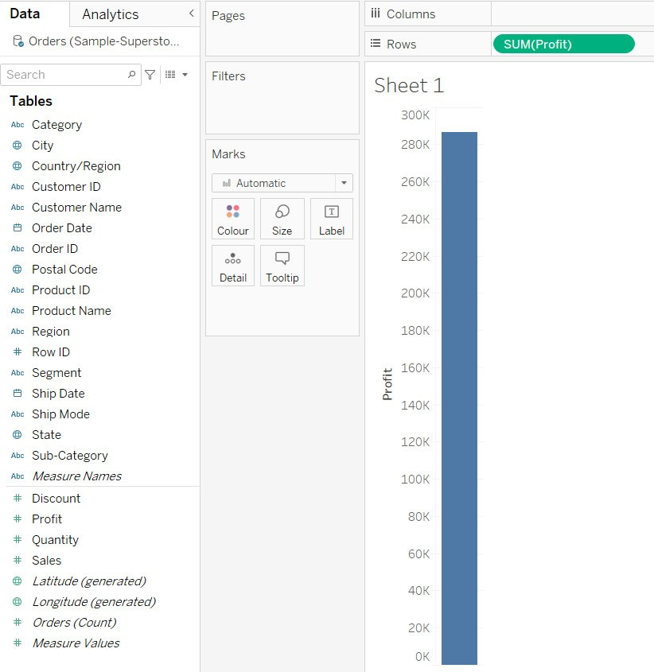
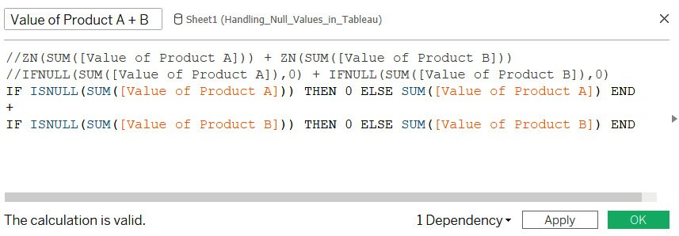
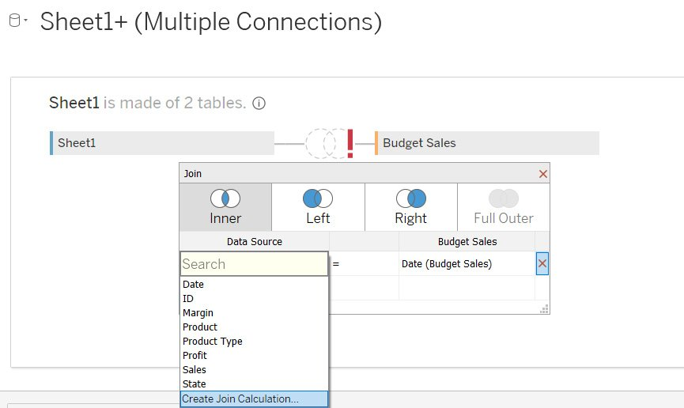

Lab 7: Data Analysis: Creating and Using Calculations 
=====================================================


Overview

In this lab, you will learn to create and use various types of
calculations, not just within an existing data source, but also across
data sources. This lab first describes the definitions and the
differences between Aggregate and Non-Aggregate values. Then, you will
learn about various types of calculations, such as numeric calculations,
string calculations, and date calculations, as well as how to write
logic statements in Tableau.

By the end of this lab, you will be able to create and use various
types of calculations in Tableau.


Introduction 
============


Typically, the first step when analyzing data is to start with some
questions or goals. It could be as simple as determining your most
profitable customers, or more complicated, such as investigating which
products are leading to losses despite high sales. After deciding on
questions or goals, you would audit your data. This means identifying
where data resides---whether the required fields are stored in a single
or in multiple data sources and whether all fields are readily available
for use. Then, you would check the integrity and validity of your data.
This means checking whether the data needs any modifications in terms of
cleaning, combining, or restructuring.

Once data is audited, the tools in Tableau Desktop allow you to explore
it visually for more streamlined analysis. This can mean building
charts, adding interactivity, separating data into groups, or creating
calculations to derive more meaningful insights. Once analysis is
complete, the insights you gather will be ready to share with others.
This lab aims to cover all aspects of the data analysis cycle.

In this lab, you will later learn how to create and use Tableau\'s
various types of calculation, which is an essential skill in data
analysis. Differentiating Between Aggregate and Non-Aggregate

To work effectively with Tableau, it is vital that you have a thorough
understanding of aggregation. When adding any data, Tableau quickly
classifies the data in the `Data` pane as
`Dimensions` and `Measures.` When a
`Measure` enters the view, Tableau aggregates it (typically,
using the `SUM` aggregation).

This can be demonstrated using the `Orders` data from
*Sample-Superstore.xlsx*, which can be found at
`Documents\My Tableau Repository\Datasources\` or downloaded
from this course\'s GitHub repository at the following link:
<https://github.com/fenago/tableau-advanced>.

Once you have access to the data, drag the `Profit` field from
the `Data` pane into the `Rows` shelf. Notice that
the properties of the field have changed to `SUM(Profit)` and
a vertical bar is generated. Refer to the following figure:





Figure 7.1: A screenshot showing SUM(Profit)

Look at the status bar at the bottom of the sheet. Notice there is only
`1 mark` and the `SUM(Profit)` is
`286,397`. This is the *total aggregated profit of the data*:


Figure 7.2: A screenshot showing SUM(Profit) in the status bar

Now, observe what happens when you disaggregate it. In order to
disaggregate the `Measure`, uncheck the
`Aggregate Measures` option, which is available in the
*toolbar* under `Analysis`:


Figure 7.3: A screenshot showing the Aggregate Measures option

The `SUM(Profit)` field, which was in the `Rows`
shelf, has now changed to show just `Profit`. Further, the bar
chart is now broken into multiple bubbles; some bubbles are on the
negative axis, and the status bar now shows `9994 marks`:


Figure 7.4: A screenshot showing disaggregated profit

When you uncheck the `Aggregate Measures` option, the
`Profit` value becomes non-aggregated, which in turn breaks
the aggregated profit bar showing the `Sum of Profit` in
bubbles that represent *every transactional profit value in the data*.
At any given point, you can right-click on a bubble to view the data and
see the full details of a transaction:


Figure 7.5: A screenshot showing the view data option

By default, the `Aggregate Measures` option is on, and all
`Measures` will be *aggregated by default* (unless you choose
to disaggregate them as explained above). Further, the default
aggregation of `Measures` is `SUM` and this can be
changed by right-clicking on a `Measure` in the
`Data` pane and changing `Aggregation` under
`Default Properties` from `Sum` to
`Average` or `Minimum` to `Maximum, etc.`:


Figure 7.6: A screenshot showing how to change aggregation

From the previous example, you can conclude that when you see
`SUM(Profit)` in the view, it means that Tableau is
aggregating all transactional values. When you see `Profit`
only, it means that Tableau is taking notice of the transactional values
without aggregating them. This particular distinction is important,
especially when creating calculated fields. You will further explore
this point when diving deeper into creating and using calculations.

In the previous example, you looked at aggregating and disaggregating
`Measures`. However, when dealing with `Dimensions`,
which includes all categorical data, there are additional
considerations. Specifically, you should be asking yourself:
*Which/Who?* and *How many?*.

Taking the `Sample-Superstore.xlsx` file as an example, when
analyzing `Sub-Category`, you might ask the following
questions: *Which sub-categories are profitable?* or *How many
sub-categories are profitable?* The first question is easy to answer as
you are only concerned with data members from the
`Sub-Category` field that are in profit. When you drag a
dimension into the view, you will get the list of all unique data
members of that field by default. So, dragging the
`Sub-Category` field into the `Rows` shelf will
result in the following view:


However, for the second question, you need to find the number of
sub-categories that have positive profit. This means finding the number
of data members for that dimension. This is achieved by clicking on the
dropdown of the `Sub-Category` field, and selecting the
`Count` or `Count(Distinct)` option, available under
`Measure`:


When selecting the `Count` or the `Count(Distinct)`
option, notice that the list of sub-categories changes into a bar
showing that there are a total of 17 sub-categories in the data. This
method will only make the count of sub-categories available in the
worksheet where they were created. However, if you need to show the same
information for other visualizations across your workbook, it makes
sense to have the count in your `Data` pane, so you can drag
it into the view as and when required. This can be achieved in two ways:

-   The first method is to change the `Sub-Category` dimension
    into a `Measure`, which will change the original
    `Dimensions` field from showing a list of data members
    into a `Measure` showing a distinct count of
    sub-categories:


-   The second way is to create a calculated field on the
    `Sub-Category` dimension. This will not only maintain the
    original dimension, but we will also have another field that can be
    used to get the desired output. You will learn more about creating a
    calculated field in the topics to come.


Creating and Using Ad hoc / Edit in Shelf Calculations 
======================================================


**Ad hoc / Edit in Shelf calculations** are the quickest and easiest way
to create a new calculated field in Tableau. Ad hoc calculations can be
created in the `Rows`, `Columns`, and
`Measure Values `shelves, as well as in the
`Marks cards`.

Simply double-click on the existing field in your shelf of choice, or,
alternatively you can use the `Edit in Shelf` option in the
drop-down list of that field, as shown in the following figure:


Figure 7.10: A screenshot showing how to create an ad hoc calculation

These ad hoc calculations are useful when creating quick, on-the-fly
calculations that you may or may not want to save and reuse. You will
explore this in the exercise below.


Exercise 7.01: Creating an Ad Hoc Calculation to Highlight Loss-Making Sub-Categories 
-------------------------------------------------------------------------------------

The aim of this exercise is to find out which sub-categories have
negative profit and which ones have positive profit. Those with negative
profit will be your loss-making sub-categories and will be color-coded
orange. You will use the `Orders` data from
`Sample-Superstore.xlsx` for this exercise.

Perform the following steps:

1.  Start by creating a bar chart showing `SUM(Sales)` by
    `Sub-Category` with `SUM(Profit)` in the
    `Color` shelf, as shown in the following screenshot.


The bars have a color palette of orange and blue, with shades of *orange
indicating negative profit*, and shades of *blue indicating positive
profit*. The shades indicate the intensity of `Profit`.
However, the task at hand is to highlight the bars that are loss-making,
which means those with a profit less than zero. The intensity of profit
is irrelevant for this task.

To address this, either double-click or use the
`Edit in Shelf` option in the dropdown of the
`SUM(Profit)` field in the `Color` shelf and type
the following formula:


```
SUM(Profit) < 0
```


1.  Hit *Enter* to see the new ad hoc calculation. It now shows two
    colors instead of the previously seen diverging colors. In this
    case, the orange bars indicate subcategories are loss-making and the
    blue bars indicate subcategories are profitable. Refer to the
    following screenshots:


Figure 7.12: Screenshots with an ad hoc calculation in the color shelf

Further, as mentioned previously, this ad hoc calculation is an
on-the-fly calculation that may be used only in this specific
visualization, in which case, there isn\'t any need to save this
calculation.

1.  So that you can reuse this in other visualizations, save the
    calculation in the `Data` pane by simply dragging and
    dropping, as shown in the following screenshots:


Figure 7.13: Screenshots showing how to save an ad hoc calculation


Creating and Using Different Types of Calculations 
==================================================


Tableau is a simple yet versatile tool, and the ability to create
calculations gives users the flexibility to perform powerful analysis,
which can help with decision-making. Most of the time, creating
calculations in Tableau is a fun experience, but sometimes it can be a
little frustrating as well, especially if you are coming from a
different platform to Tableau and are trying to replicate some
functionality. The way these tools are structured and designed is
different and trying to replicate the functionality from one tool in
another can make the experience frustrating. The best way to avoid
frustration while creating calculations in Tableau is to start small and
get acquainted with the functions that Tableau has to offer. While
writing a calculation in Tableau is easy, it is recommended that, if
possible, you should try to use the built-in native features first,
instead of creating a new calculated field. Some examples of these
features are as follows:

-   The `Split` or `Custom Split` function,
    available under the `Transform` option when right-clicking
    any `String Dimension` in the `Data` pane. This
    is used to split the string into smaller sub-strings. For example,
    splitting a customer name into, for example, the first name and last
    name.
-   The `Group` function, which is available under the
    `Create` option when right-clicking any dimension in the
    `Data` pane. This is used to group the data members of
    that dimension into higher categories, for example, grouping the
    data members of the geographic state field into, for example,
    regions.
-   The `Custom date` function, which is available under the
    `Create` option when right-clicking on a
    `Date Dimension` in the `Data` pane. This is
    used to truncate dates into different granularities such as month,
    month-year, etc.
-   The `Bins` function, which is available under the
    `Create` option when right-clicking on a
    `Measure` in the `Data` pane. This is used to
    group `Measure` values into different range buckets, for
    example, age bins that range from, for example \<10 years, 11-20
    years, 21-30 years, etc.
-   The `Combined Field` function, available under the
    `Create` option when selecting more than 1
    `String Dimension` in the `Data` pane, and then
    right-clicking any selected string dimension. This is useful when
    combining multiple string dimensions into one field.
-   The `Aliases` function, which is available upon
    right-clicking any dimension in the `Data` pane. This is
    useful when renaming the members of any dimension.

A point to note is that all objectives mentioned here can be achieved by
creating a calculated field from scratch, but since these native
functions are readily and easily available, it is best to avoid the
hassle and make use of them. Over the course of this lab and various
other labs in this course, you will explore these functions in a
little more detail.

To understand the process of creating calculations, you will first
create a basic calculation to find the distinct count of your order IDs.
You can do this in many ways. You could change the `Order ID`
dimension into a `Measure` or click the dropdown of the
`Order ID` field that is shown in your view, and then click
the `Measure` \| `Count (Distinct)` option.
Alternatively, you could even create an ad hoc calculation.

In an earlier topic, you saw how to save an ad hoc calculation in the
`Data` pane. However, inexplicably, when attempting this after
performing basic aggregations such as sum, average, or count, you\'ll
find that the ad hoc calculation does not save. From testing, the
drag-drop method appears to fix this issue. Try it with the
calculation below:


```
COUNTD([Order ID])*1 
```


You will now be creating a calculation in Tableau from scratch. To do
this, you will continue with the objective of getting the distinct count
of order IDs.

Right-click on the `Order ID` dimension in the
`Data` pane and select the `Create` \|
`Calculated Field` option. This will open a new type in the
box, as shown in the following screenshot:


Figure 7.14: A screenshot showing components of a calculation box

*Figure 7.14* shows the components of a calculation box. These are as
follows:

-   **1 -- Calculation name**: This is where you can define the name of
    a calculation. It is always recommended to give meaningful names to
    calculated fields.
-   **2 -- List of functions / types of functions**: This is the list of
    all functions available in Tableau. The functions are listed in
    alphabetical order, and are classified as `Number`,
    `String`, `Date`, `Type Conversion`,
    `Aggregate`, `Logical`, etc. When clicking any
    of these functions, Tableau presents the syntax of that function, an
    explanation of what the function does, and an example. Refer to the
    following screenshot:


Figure 7.15: A screenshot showing details of the selected function

-   **3 -- Calculation editor**: This is where you will type your
    formula.
-   **4 -- Syntax validator**: This will validate whether your formula
    and calculation are syntactically correct. If there are any issues,
    the text will read as `The calculation contains errors` in
    red font, and the calculation editor box will display a red squiggly
    line near the text with the error.

Ever since you right-clicked on the `Order ID` field to create
a calculation, Tableau has assumed you will be creating a calculation
for that field, and because of that, it has already fetched the field
into the calculation editor.

Start by typing the word `CountD` before `Order ID.`
As you type, Tableau starts recommending functions, as well as data
fields that share characters with what you type. Now, name the
calculation \'`Count of Orders'`. Your calculation box should
look like the following screenshot:


Figure 7.16: A screenshot showing the formula for calculating the
distinct count of Order ID

Once, you have valid calculation, you can click `OK` and
proceed to use it. Clicking `OK` will save your calculation in
the `Data` pane, as shown in the following screenshot:


Figure 7.17: A screenshot showing the newly created calculated field

Now, that you have your calculated field available in the
`Data` pane, you can start using it across the entire
workbook. There are, however, a few important points to note:

-   In the previous example, you right-clicked on `Order ID`
    and selected the `Create | Calculated Field` option, which
    opened the calculation editor box. This can also be made available
    by selecting the `Analysis | Create Calculated Field...`
    option in the toolbar, or by clicking on the dropdown in the
    `Data` pane and selecting
    `Create Calculated Field...`:


Figure 7.18: A screenshot showing other ways to create a calculated
field

-   Any field that is computed or calculated in Tableau will have
    `=` as a prefix, which indicates that the field was
    created in Tableau, and does not derive from the data itself. The =
    sign will be followed by either `Abc` or `#` (or
    something similar), which indicates the data type of that field. So,
    for example, `=Abc` is indicative of a computed field with
    a string output.
-   To add comments to a calculation, you need to make use of two
    forward slashes, that is,
    `//. Tableau will ignore anything that follows the //`.
    Refer to the following screenshot:


Figure 7.19: A screenshot showing how to add comments in a calculated
field

-   The functions (blue text in *Figure 7.19* in Tableau are not
    case-sensitive, but data fields (orange text in *Figure 7.19*) are,
    hence, you need to be extra careful about the case, as well as the
    spelling of the data field. If there are any issues, the syntax
    validator will give an error, and you will not be able to use the
    calculated field for further analysis. To overcome this, drag and
    drop the desired field from the `Data` pane into the
    calculation editor box instead of typing the text, as shown in the
    following screenshot:


Figure 7.20: A screenshot showing dragging and dropping fields into the
calculation editor

-   Tableau supports all standard operators, such as multiplication
    (\*), division (/), modulo (%), addition (+), subtraction (-), as
    well as all the comparisons, such as equal to (== or =), greater
    than (\>), greater than or equal to (\>=), less than (\<), less than
    or equal to (\<=), and not equal to (!= or \<\>). These operators
    must be typed and are not part of the list of functions in the
    calculation box.
-   Since Tableau is a read-only tool, the calculated fields you are
    computing will not be written back to the data, thus keeping the
    integrity of your data intact.
-   You can create a calculated field and use it in other calculated
    fields as well.

You will now work through examples of how some of these calculations can
be created and used.


Creating and Using Different Types of Calculations: Numeric Calculations 
------------------------------------------------------------------------

Numeric calculations are used when performing mathematical/arithmetic
functions on numeric data in order to return a numeric output. The
`Number` functions supported by Tableau at this point in time
(that is, in version 2020.1) are as follows:

-   **Basic math functions** such as the `ABS` function, which
    is used to return the absolute value of the number; the
    `ROUND` function, which is used to round the number to the
    specified number of decimal places; `SQRT`, which is used
    to return the square root of a number; and the `ZN`
    function, which returns zero if there are null values, or returns
    the value itself otherwise.
-   **Trigonometric functions** such as `ASIN`,
    `ACOS`, `ATAN`, `SIN`,
    `COS`, `TAN`, and others.
-   **Angular functions** such as `DEGREES` and
    `RADIANS`.
-   **Mapping functions** such as `HEXBINX` and
    `HEXBINY`.
-   **Logarithmic functions** such as `LN` and
    `LOG`.
-   **Exponential and Power functions** such as `EXP` and
    `POWER`, and others.

As mentioned earlier, when selecting any of these functions, you will
see the syntax of that function, an explanation of the purpose of that
function, along with an example. Further, with these numeric functions,
as well as the arithmetic operators above, you can create some immensely
powerful and useful calculations.

In the previous topic, you created a new calculated field called
`Count of Orders`, which gave the distinct count of your order
IDs. You will now use this computed field to create another calculated
field to find the average order value for your sub-categories.


Exercise 7.02: Creating a Numeric Calculation 
---------------------------------------------

The objective of this exercise is to create a numeric calculation to
find the average order value of each sub-category. You will continue
with the `Orders data` from the *Sample-Superstore.xlsx* file
and, using the `Sales` field and the previously created
`Count of Orders` field, create a new calculated field called
`Average Order Value (AOV)` for each `Sub-Category`
and display it in a bar chart.

1.  First, drag your `Sub-Category` field and drop it in the
    `Rows` shelf. Next, drag the Sales and the
    `Count of Orders` field into the `Columns`
    shelf. Now enable the labels for your bar charts by clicking on
    `Show Marks Label` in the toolbar. See the following
    screenshot:


Figure 7.21: A screenshot showing a bar chart with
Sales and Count of Orders across sub-categories

1.  Create a calculated field called
    `Average Order Value (AOV)` with the following formula:
    
    ```
    SUM([Sales])/[Count of Orders]Copy
    ```
    

You should see the following on your screen:


Figure 7.22: A screenshot showing the formula for the Average Order
Value (AOV) calculation

1.  Drag and drop the `Average Order Value (AOV)` next to the
    `Count of Orders` field in the `Columns` shelf.
    Refer to the following screenshot:


Figure 7.23: A screenshot showing the bar chart with the Average Order
Value (AOV) calculation

As you can see in *Figure 7.23*, the `Copiers` sub-category
has the **highest average order value** followed by
`Machines`.

Note that the prefix for `Average Order Value (AOV)` is
`AGG`, which stands for **Aggregate**. This is Tableau\'s way
of telling you that the calculation is pre-aggregated by the user (since
you are using `SUM()` for sales and the count of orders field
is using the `COUNTD()` function).

This exercise shows an example of creating and using a numeric
calculation. You have created a new calculation called
`Average Order Value (AOV)` using the `Sales` field
and the `Count of Orders` field. Since this
`Average Order Value (AOV)` field has a numeric output, the
calculation is called a numeric calculation.


Creating and Using Different Types of Calculations: Logic Statements 
--------------------------------------------------------------------

Logic statements are typically used for criteria-based or
condition-based evaluation. Some of the logical functions available in
Tableau are as follows:

-   Operators such as `AND`, `OR`, and
    `NOT`.
-   Functions such as `IF`, `ELSE`,
    `ELSEIF`, `CASE`, `IIF`,
    `IFNULL`, `ISNULL`, `ISDATE`, etc.

`IF…ELSE`, `IF…ELSEIF…ELSE`, and `CASE`
are the most commonly used logic functions and, typically, when using
these logic functions, the `THEN` function is used to specify
the value that needs to be displayed when the expression is true.

An important point to remember here is that when using the
`IF` statement or a `CASE` statement for logical
evaluation, you need to terminate your logical statement with the
`END` function.

You have already seen an example of a logic statement in the **Creating
and Using Ad Hoc / Edit in Shelf Calculations** section, where you found
out which sub-categories were profitable, and which were not. You
created a calculation to see whether `SUM(Profit)` was greater
than or less than zero. The output of this calculation was a Boolean
output, with the outcome being either `True` or
`False`. Boolean calculations are a quick and easy type of
logic statement. They get executed quickly and perform well compared to
the other types of logic statement.

Although Boolean calculations have many advantages, they could confuse
an end user if they are unaware of what `True` and
`False` stand for. The meaning of Booleans depends on the
criteria in your calculations. In the earlier example, the outcome
`True` indicates either positive or negative profit, depending
on what is specified in your calculation. If the end user is unfamiliar
with these criteria, the Boolean outcome will be unhelpful.

To avoid confusion, it is best to use a more elaborate logic statement
incorporating user-friendly tags. You will explore this by following the
steps in the following exercise.

Note

If you are using a version of Tableau later than 2020.1, you may need to
create Number of records to match the output of *Exercise 7.03*.


Exercise 7.03: Creating a Logic Calculation 
-------------------------------------------

In this exercise, you will create a logic calculation to find
unprofitable products. as well as to find out how many transactions for
each product are unprofitable. You will use the
`CoffeeChain Query` table from the
`Sample-Coffee Chain.mdb` dataset. This is a *Microsoft Access
Database*. The dataset can be downloaded from the following link:
<https://1drv.ms/u/s!Av5QCoyLTBpnmkPL8Yx_0_2KtrG4?e=rWpksB>.

First, you will connect to the `CoffeeChain Query` table from
the `Sample-Coffee Chain.mdb` dataset and create a bar chart
using the `Product` field and the
`Number of records` field. You will then create new calculated
fields, which will help find and highlight *unprofitable products*, and
find out *how many of the transactions in each product are
unprofitable*.

1.  Connect to the `CoffeeChain Query` table from
    `Sample-Coffee Chain.mdb`. Create a bar chart by dragging
    the `Product Name` field into the `Rows` shelf.
    Then, drag `Number of Records` into the
    `Columns` shelf and enable the labels for these bars.
    Refer to the following screenshot:


Figure 7.24: A screenshot showing the bar chart showing Number of
Records by Product

Now, you want to find the profitability of your products. However,
profitability (especially in this case) can be computed on two levels.

There is the overall profitability of a product, and there is how many
transactions for a product are profitable. Both these requirements are
useful to know. You will begin by finding the overall profitability of
your products.

Note

Please replace the quotes around `Profitable Product` and
`Unprofitable Product` after pasting the code in *Step 2*
below. This will ensure the output is error-free.

1.  Create a new calculated field called
    `Overall Profitability` using the
    `IF…THEN…ELSE…END` function. The formula will be as
    follows:
    
    ```
    IF SUM([Profit])>0 THEN "Profitable Product" 
    ELSE "Unprofitable Product"
    END Copy
    ```
    

Refer to the following screenshot:


Figure 7.25: A screenshot showing the formula for Overall Profitability

1.  Click `OK` and drag this new field into the
    `Color` shelf. Your view will update, as shown in the
    following screenshot:


Figure 7.26: A screenshot showing Overall Profitability using color

As you see from the color legend, the *blue bars* are the *profitable
products*, and the *orange bars* are the *unprofitable products*. In the
preceding screenshot, you can clearly see that green tea is the only
product that is unprofitable.

In the ad hoc calculation example (*Exercise 7.01, Creating an Ad Hoc
Calculation to Highlight Loss-Making Sub-Categories*), when you saved
the calculation in the `Data` pane, you had a Boolean output
with a prefix of =T\|F, whereas when you save this
`Overall Profitability` calculation by clicking
`OK`, you see that the output is a string with the prefix
`=Abc`. Refer to the following screenshot:


Figure 7.27: A screenshot showing the prefix for an ad hoc calculation
and Overall Profitability calculation

Now that you have found which of your products are profitable, it is
time to find out how many profitable transactions there are for each
product.

1.  **Duplicate** the `Overall Profitability` calculation and
    change the code.
2.  Use the `IF…THEN…ELSE…END` function. The formula and
    syntax should be similar to the `Overall Profitability`
    calculation, except for a change in the aggregation of the
    `Profit` field and the displayed output string. Name this
    calculated field `Transactional Profitability`. The
    formula will be as follows:
    
    ```
    IF [Profit]>0 THEN "Profitable transaction" 
    ELSE "Unprofitable transaction"
    END Copy
    ```
    

Refer to the following screenshot:


Figure 7.28: A screenshot showing the formula for Transactional
Profitability

1.  Click `OK` and drag this new field into the
    `Color` shelf. Your view will update, as shown in the
    following screenshot:


Figure 7.29: A screenshot showing Transactional Profitability in color

As you see from the color legend, the *blue bars* represent
`profitable transactions`, and the *orange bars* represent
`unprofitable transactions`. From this, you can find some
interesting outcomes. For example, it shows that all
`Decaf Espresso` transactions are profitable.

You have now successfully created and used logic statements to find the
profitability, and profitable transactions for each of your products


Creating and Using Different Types of Calculations: String Calculations 
-----------------------------------------------------------------------

In Tableau, string calculations can be performed on any data type.
Tableau converts and processes all such data types and yields a string
output. You can create string calculations on `Integer`
fields, as well as `Date` fields by first converting them into
a string. You can use the type conversion function `STR()` in
Tableau to achieve this. The various string functions supported by
Tableau (in version 2020.1) are as follows:

-   Functions such as `ASCII` and `CHAR` find the
    ASCII code of a character and the character based on the ASCII code,
    respectively.
-   Case functions such as `LOWER` and `UPPER`
    change the casing of strings to lowercase and uppercase,
    respectively.
-   Functions such as `CONTAINS`, `STARTSWITH`,
    `ENDSWITH`, and `ISDATE` check string or
    substring conditions.
-   Functions such as `TRIM`, `LTRIM`, and
    `RTRIM` remove blank spaces.
-   Functions such as `FIND` and `FINDNTH` find the
    position of a substring.
-   Functions such as `LEFT`, `RIGHT`, and
    `MID`, return the specified number of characters in a
    string.
-   Regular expressions such as `REGEXP_EXTRACT`,
    `REGEXP_EXTRACT_NTH`, `REGEXP_MATCH`, and
    `REGEXP_REPLACE` allow you to specify patterns to match,
    locate, and manage text.
-   Some other string functions available in Tableau are
    `LEN`, which returns the length of the string;
    `REPLACE`, which searches for a specified substring and
    replaces it with a replacement substring; `SPLIT`, which
    returns the substring from a string based on the specified
    delimiter; and `MIN` and `MAX`, which return
    either the alphabetically minimum or maximum value for a string.

In this section, you will further explore some of these functions.

You will now continue with the `Orders` data from
*Sample-Superstore.xlsx* and work with the `Customer Name`
field. Currently, this field is a combination of the first names and
last names of customers. First and last names are separated by a
*space*. For this example, you would separate the first and last names
of each customer, and then find the initial letters of the last names
for your customers.

After that, you create groups for names starting with letters *A to I*,
*J to R*, and *S to Z* to find out how many customers fall in each
group.

You begin by dragging the `Customer Name` field into the
`Rows` shelf. There should be 793 unique customers.

To find the last name, you have to create calculations on the
`Customer Name` field. Right-click on the
`Customer Name` field in the `Data` pane and choose
the `Split` or `Custom Split` option available under
`Transform`. Refer to the following screenshot:


Figure 7.30: A screenshot showing the Split and Custom Split options

When using the `Split` function, Tableau automatically creates
two calculated fields named `Customer Name – Split 1` and
`Customer Name – Split 2.` When you edit these calculated
fields, you will see the following syntax for `Split 1` and
`Split 2` respectively:


```
TRIM( SPLIT( [Customer Name], " ", 1 ) )
TRIM( SPLIT( [Customer Name], " ", 2 ) )
```


This auto split targeted *delimiter*, which in this case was *space*,
and on that basis, has split the field to give the *first column before
the space*, which is customer *first names* *second column after the
space*, which in this case is customer last names.

The `Custom Split` option allows for more control than the
auto split option. Here, for example, only the last name is needed. The
first name isn\'t of any use at this point. So, instead of using the
auto split option, you can use `Custom Split`, which brings up
the following screenshot:


Figure 7.31: A screenshot showing the Custom Split option

Here, you can specify the separator/delimiter. You can decide whether
you want the first column or the second column, and whether you want to
split the columns. To get only the last name, choose *space* as the
separator, and then `Split off` the `Last`
`1` column. You get one new calculated field called
`Customer Name - Split 2`. The syntax of this field is as
follows:


```
TRIM(SPLIT([Customer Name], " ", -1 ))
```


`Split` and `Custom Split` are shortcut options
provided by Tableau to split strings. However, you could get the same
result by creating new calculated fields from scratch using some of the
previously stated string functions. You will now explore this further.

First, parse the string to find the position of the space. Next, ask
Tableau to give the string that follows the space. To find the position
of the space, use the `FIND` function in Tableau. The syntax
of the calculated field should be as follows:


```
FIND([Customer Name]," ")
```


This gives the position of the space as a numeric value. However, you
need the string after the space. To identify this, use the
`MID` function. The syntax should be as follows:


```
MID([Customer Name],FIND([Customer Name]," "))
```


This formula gives you the string followed by the space, but this also
includes the leading space. To remove this leading space, either use the
`TRIM` function or the `LTRIM` function as follows:

1.  `TRIM`:
    
    ```
    TRIM(MID([Customer Name],FIND([Customer Name]," ")))Copy
    ```
    
2.  `LTRIM`:
    
    ```
    LTRIM(MID([Customer Name],FIND([Customer Name]," ")))Copy
    ```
    

Either of these two functions will remove the leading space and give
only the string followed by the space. However, if you don\'t want to
use the `TRIM` or `LTRIM` function, you could even
modify the calculation to tweak the `FIND` function, as
shown here:


```
MID([Customer Name],(FIND([Customer Name]," ")+1))
```


The `+1` in the preceding example finds the first position
after the space, and thus will work similarly to the `TRIM`
and `LTRIM` functions.

The point of discussing all these options is to show that many string
functions can be utilized differently to get the same output. Now,
choose any of the preceding formulae and save your calculated field as
`Last Name`. Refer to the following screenshot:


Figure 7.32: A screenshot showing the Last Name calculated field

Now, you have the `Last Name` of your customers, it is time to
find the initial letter of `Last Name`. Here, again, you can
use functions such as `LEFT` and `MID`. The syntax
for both these functions is as follows:


```
LEFT([Last Name],1)
MID([Last Name],1,1)
```


The `LEFT` function will return the *specified number of
characters (shown as* `1` *in the previous example)* from the
start of the given string.

The `MID` function will return the characters from the middle
of the string, giving a *starting position and a length (shown as*
`1,1` *in the previous example)*. So, both the
`LEFT` and the `MID` functions will give us the
first character of the string.

Here, you will continue with the `MID` function, as shown in
the following screenshot:


Figure 7.33: A screenshot showing the initial letter of the Last Name
calculated field

Finally, it is time for you to create your groups. You can use the
following formula:


```
IF [Starting alphabet of Last Name] <= "I" THEN "A-I"
ELSEIF [Starting alphabet of Last Name] >= "S" THEN "S-Z"
ELSE "J-R"
END
```


Name this calculation `Groups-Starting alphabet of Last Name`.
Refer to the following screenshot:


Figure 7.34: A screenshot showing the Groups-Starting alphabet of Last
Name calculated field

Change the `Customer Name` field in the `Rows` shelf
to show the distinct count of customers. Then, drop the new calculated
field into the `Columns` shelf. Refer to the following
screenshot:


Figure 7.35: A screenshot showing the bar chart of Groups-Starting
letter of Last Name

*Figure 7.35* shows that there are more than 350 customers whose last
name starts with a letter that is between `A` and
`I`.

Typically, when dealing with string data, the two main operations you
might perform are splitting a string into substrings or concatenating
two or more strings to make one long string. You have now learned how to
split strings. In the following exercise, you will be concatenating two
strings together.


Exercise 7.04: Creating a String Calculation 
--------------------------------------------

In this exercise, you will create a string calculation that will combine
`Product Type`, `Product`, and the aggregated
`Sales` value. You will continue using the
`CoffeeChain Query` data from the
`Sample-Coffee Chain.mdb` file. You will use the
`Product Type` and `Product` fields, along with
`SUM(Sales)`.

1.  Start by creating a bar chart using the `Product Type`,
    `Product`, and `SUM(Sales)` fields, as shown in
    the following screenshot:


Figure 7.36: A screenshot showing the bar chart of SUM(Sales) by Product
Type and Product

Once the bar chart is created, create a calculated field that is a
combination of the first three letters of `Product Type`
followed by the `Product` text and the `SUM(Sales)`
value. So, for example, if `Product Type` is,
`Coffee` and `Product` is `Colombian`, and
if the total sales for this `Product` are `$90,000`,
then the output should be `COF-Colombian: $90000`.

To achieve this, you must change the Product Type to upper case, then
pick only the first 3 characters. You must append the Product labels,
and the SUM(Sales) value, which needs to start with a \$ sign and must
be rounded off to show zero decimals. You also need to add some special
characters such as space, `-`, and `:`. These can be
inserted using either single quotes or double quotes. Follow along with
this exercise to learn how.

1.  Begin by creating a new calculated field called
    `Concatenated string` and type the following formula:
    
    ```
    LEFT(UPPER([Product Type]),3) + "-" + [Product] + " : "Copy
    ```
    

This gives you the first part of what the desired string should look
like. So, for example, if the desired output is
`COF-Colombian: $90000`, then the preceding calculation gives
an output of `COF-Colombian:`.

You are halfway there. Now, if you saved the calculation mid-way, you
will have to right-click on this new calculated field and edit it from
the `Dimensions` pane. However, if not, you can continue
working in the same calculation box.

1.  Now you must append the `SUM(Sales)` value, and this is
    where things start to get complicated. Firstly,
    `Product Type` and `Product` are *string
    values*, but `SUM(Sales)` is an *integer value*, so it is
    not possible to concatenate them, unless you convert
    `SUM(Sales)` to a *string value*. Further, you need the
    `SUM(Sales)` value to be *rounded off to zero decimal
    places* and it needs to have *\$ as a prefix*. Keeping this in mind,
    amend the existing calculation as follows:
    
    ```
    LEFT(UPPER([Product Type]),3) + "-" + [Product] + " : " + STR(ROUND(SUM([Sales]),0))Copy
    ```
    
2.  You will see that Tableau doesn\'t agree with this formula and gives
    an error indicator. Refer to the following screenshot:


Figure 7.37: A screenshot showing the error in the calculation of
Concatenated string

1.  Click the error dropdown. You should see an error that reads
    `Cannot mix aggregate and non-aggregate arguments with this function`.
    Refer to the following screenshot:


Figure 7.38: A screenshot showing the \"Cannot mix aggregate and
non-aggregate arguments...\" error

This is a *classic error* common in Tableau. It means that
`SUM(Sales)` is an *aggregated field* whereas the
`Product Type` and `Product` fields, being
`Dimensions`, are *not aggregated* and, logically, Tableau
can\'t work with aggregated and non-aggregated values in a calculation.
So, to overcome this, you must aggregate the `Product Type`
and `Product fields`. Since both the Product Type and Product
fields are dimensions, you can use any of the following functions:
`MIN`, `MAX`, or `ATTR`.

Save your existing calculation as it is and spend a little time
understanding these three functions before amending it.

When aggregating the dimension using the MIN function, you get the
*alphabetically minimum or lowest value*. The `MAX` function,
on the other hand, gives the *alphabetically maximum or highest value*.
The ATTR function gives the value of the field as is if it has a single
value for all rows; otherwise, it will return an asterisk.

1.  To demonstrate this, create a new sheet to show
    `Product Type` in the `Rows` shelf. Then, create
    a new calculated field called `Min of Product` with the
    following formula:
    
    ```
    MIN([Product]) Copy
    ```
    

Refer to the following screenshot:


Figure 7.39: A screenshot showing Min of Product calculation

Save the calculation. Notice that even though it has a string output, it
is now part of the `Measures` pane. This is because it is now
an aggregated field and, as discussed earlier, any aggregated field
becomes part of the `Measures` pane.

1.  Now, create another calculation called `Max of Product`
    with the following formula:
    
    ```
    MAX([Product]) Copy
    ```
    

Refer to the following screenshot:


Figure 7.40: A screenshot showing the Max of Product calculation

1.  This calculation should also be in the `Measures` pane.
2.  Finally, create a calculation called
    `Attribute of Product` with the following formula:
    
    ```
    ATTR([Product])Copy
    ```
    

Refer to the following screenshot:


Figure 7.41 -- A screenshot showing the Attribute of Product calculation

Now drop these three calculated fields into your sheet, right after the
`Product Type` field in the `Rows` shelf.

1.  First, drop the `Min of Product` field, followed by
    `Max of Product`, and finally
    `Attribute of Product`. You should notice that all three
    fields give different outputs. Refer to the following screenshot:


Figure 7.42: A screenshot showing the output of Min, Max, and Attribute
of Product calculations at the Product Type level

As you can see, `Min of Product` gives you
`Amaretto for Coffee`, `Caffe Latte for Espresso`,
`Chamomile for Herbal Tea`, and
`Darjeeling for Tea`. These are the *alphabetically minimum
values* of our `Product `field within that
`Product Type`. Similarly, `Max of Product` is
giving `Decaf Irish Cream for Coffee`,
`Regular Espresso for Espresso`,
`Mint for Herbal Tea`, and `Green Tea for Tea`.
These are the *alphabetically maximum values* of your
`Product` field within that `Product` Type. Further,
`Attribute of Product` is giving *neither the minimum nor the
maximum*; instead, it is giving an *asterisk*. This means there is more
than 1 `Product` under that `Product Type` and since
Tableau can\'t display all the values, it is showing the asterisk to
indicate there is more than 1 `Product` under each Product
Type.

1.  Now drag the `Product` field from the
    `Dimensions` pane and drop it after
    `Product Type` in the `Rows` shelf. Refer to the
    following screenshot:


Figure 7.43: A screenshot showing the output of Min, Max, and Attribute
of Product calculations at the Product level

As you see, when the `Product` field is in the view, all three
calculations give the same value. This is because the `Min` or
`Max` of a `Product` at the `Product`
level is the `Product` itself (that is, the *Min or Max for
Colombian will be Colombian itself*). Similarly, for the
`Attribute` function, since there is only one row of
`Product` under each `Product`, you get the output
as that `Product` itself, and not an *asterisk*. However, the
minute you remove the granularity of the `Product`, you start
getting different results. So, keep in mind that if the dimension being
aggregated is in the view, all three of these functions will give the
same output.

1.  Now you have seen the various options for aggregating dimensions,
    you will now go back and amend your `Concatenated string`
    calculation. Since you have two dimensions, namely,
    `Product Type` and `Product`, you must aggregate
    both. Since both dimensions are in the view, you can use any of the
    functions discussed. For this, use the `MIN` function.
    Your formula should update as follows:
    
    ```
    MIN(LEFT(UPPER([Product Type]),3)) + "-" + MIN([Product]) + " : $" + STR(ROUND(SUM([Sales]),0))Copy
    ```
    

Refer to the following screenshot:


Figure 7.44: A screenshot showing the error-free calculation of
Concatenated string

1.  Click `OK` and go back to the sheet where you created a
    bar chart showing `Product Type`, `Product`, and
    `SUM(Sales)`. Drop this new field, which is now found
    under the `Measures` pane, into the `Rows` shelf
    just after `Product`. Refer to the following screenshot:


Figure 7.45 -- A screenshot showing the output of the Concatenated
string calculation

You have now created and used string functions in Tableau. You created a
concatenated string using dimensions and aggregated
`Measures`. You saw how to typecast an integer of a float
value into a string, and how to aggregate a dimension using either the
`MIN`, `MAX`, or `ATTR` functions to get
rid of the `Cannot mix aggregate and non-aggregate arguments…`
error. Now you know how to manipulate string fields, it is time to
explore date functions.


Creating and Using Different Types of Calculations: Date Calculations 
---------------------------------------------------------------------

When manipulating `Date` fields, you can use the various
`Date` functions supported by Tableau. At this point in time
(that is, in version 2020.1), these are as follows:

-   `DATENAME`, `DATEPART`, `DATETRUNC`,
    `YEAR`, `QUARTER`, `MONTH`,
    `WEEK`, `DAY`, `ISOYEAR`,
    `ISOQUARTER`, `ISOWEEK`, and
    `ISOWEEKDAY`, which can be used to find the date part of
    the `Date` field.
-   `DATEDIFF` and `DATEADD`, used to find the
    difference between two dates or to generate a new `Date`
    field based on an incremental interval.
-   `TODAY` and `NOW`, which give the current date
    or date and time.
-   `ISDATE`, used to find out whether a given field is a
    `Date` field.

You will now use a `Date` calculation to find out how many
months it has been since your customers last made a
purchase.


Exercise 7.05: Creating a Date Calculation 
------------------------------------------

The objective of this exercise is to create a `Date`
calculation to find the number of months since the last purchase for
your customers. You will continue using your `Orders` data
from `Sample-Superstore.xlsx` and use the
`Customer Name` and the `Order Date` fields.

Perform the following steps:

1.  Start by dragging `Customer Name` into the Rows shelf.
    Then, right-click drag and drop the `Order Date` field
    into the `Rows` shelf, which should create a
    `Menu`. Select `MDY(Order Date)`. Refer to the
    following screenshot:


Figure 7.46: A screenshot showing the right-click drag-drop menu for
Order Date

Now you can see all order dates at the customer level. There is no point
looking at all transactional dates for every customer. You are only
interested in the last purchase date, and how many months it has been
since it occurred.

1.  To achieve this, first create a calculation called
    `Last purchase date` with the following formula:
    
    ```
    MAX([Order Date])Copy
    ```
    

Refer to the following screenshot:


Figure 7.47: A screenshot showing the Last purchase date calculation

1.  Since this calculation will be computed on the fly, the
    `Max` date is dependent on the dimensions in the view. If
    you drag and drop this new field into your `Rows` shelf,
    you should notice that the values are the same as for the
    `MDY(Order Date)`. This won\'t work for you; you want the
    Max date for each customer, and hence you must remove the
    `MDY(Order Date)` granularity. This will update your view,
    as shown in the following screenshot:


Figure 7.48: A screenshot showing the Last purchase date for each
customer

Now you have your `Last purchase date` field, it is time to
find out how many months it has been since the customers last made a
purchase. This can be achieved by finding the difference between two
dates, that is, `Last purchase date` and, ideally,
`Today`. However, since your data is not daily-updating, you
will consider the end date as December 31, 2019, which is the last date
in the data.

1.  Create a new calculated field called *Months since last purchase*
    and use the following formula:
    
    ```
    DATEDIFF('month', [Last purchase date], #2019-12-31#)Copy
    ```
    

Refer to the following screenshot:


Figure 7.49: A screenshot showing the Months since last purchase
calculation

1.  After you save this calculation, you can drag it into the
    `Text` shelf, and should get the desired output. This
    calculation finds the difference in months between
    `Last purchase date` and December 31, 2019. A point to
    remember is that when you need to enter a hardcoded date, it will
    start and end with a *hash* (`#`), as shown above.
    Further, if this data was daily-updating and you wanted to find the
    difference with respect to `Today`, that is, the current
    date, then you could use the `Today()` function, and the
    calculation would update as shown here:
    
    ```
    DATEDIFF('month', [Last purchase date], Today())Copy
    ```
    


Figure 7.50: A screenshot showing the final output of the Date
calculation

In this exercise, you used the `DATEDIFF()` function to find
how many months it has been since customers last made a purchase. In the
next section, you\'ll see what to do when the value of data for a
product is returned as null.


Handling Null Values while Creating and Using Calculations 
==========================================================


Often, you might deal with data containing null values. These could be
genuine entries in the data. For example, there may not be any
`Sales` value to report against a particular product---even
though it is part of the inventory, it may not have been sold yet. These
nulls could also be because of some data entry errors. Most likely, you
would identify and take care of these nulls at the data preparation
stage. However, that may not always be the case. At times, you may need
to tackle them within Tableau Desktop using calculations. Null values
tend to pose a problem when used in calculated fields, simply because
when doing arithmetic operations on fields, it may result in the output
being null in Tableau. Refer to the following screenshot:


Figure 7.51 -- A screenshot showing the Excel data and the output of the
calculation on fields with null values

The preceding screenshot is a quick mockup to show the Excel data on the
left and the Tableau display on the right. You can see that both fields
(that is, `Value of Product A` and
`Value of Product B`) have *null values* in certain months.
Now, when you want to find the total value in each month, you add the
values of product A and product B. However, since both of these fields
have null values in certain months, the calculated field only shows the
output for months with values in both columns. For months where either
of the values are missing, the calculated field gives null output. This
is simply because you can\'t do math on null values without getting a
null output.

To overcome this, you will use functions such as `ZN`,
`IFNULL`, and `ISNULL`.

The data for this section is available for download using this link:
<https://github.com/fenago/tableau-advanced>.

Refer to the `Handling Null Values in Tableau.xlsx` data file
for this section. Begin by connecting to this data in Tableau and
creating a quick tabular view showing `Month` and
`Value of Product A` and `Value of Product B`.
Create a calculated field called `Value of Product A + B`. The
formula is as follows:


```
SUM([Value of Product A]) + SUM([Value of Product B])
```


Add this calculated field to the view. It should update as shown in the
following screenshot:


Figure 7.52: A screenshot showing the output of calculation on fields
with null values

As you see, the calculated field needs some tweaking. The best way to
handle these null values when doing mathematical operations is to
*convert them to zero*. You will use either the `ZN`,
`IFNULL`, or `ISNULL` function.

First, try the `ZN` function. `ZN` stands for *Zero
if Null*, and that is exactly what this function does; it *replaces the
nulls with zero*. Since both fields contain null at some point, you need
to use the `ZN` function for both fields. Tweak your
calculation to use the following formula:


```
ZN(SUM([Value of Product A])) + ZN(SUM([Value of Product B]))
```


Once you update the calculation, your view will update as shown in the
following screenshot:


Figure 7.53: A screenshot showing the output of the calculated field
using the ZN function

You now get values for every single `Month`, despite the
*nulls* because Tableau is now *converting these nulls to zero* before
adding them up.

You will now look at the `IFNULL` function. Amend your
calculated field to *comment out* the formula using the `ZN`
function, and instead use the `IFNULL` formula as follows:


```
IFNULL(SUM([Value of Product A]),0) + IFNULL(SUM([Value of Product B]),0)
```


Refer to the following screenshot:


Figure 7.54: A screenshot showing the syntax of the IFNULL function

Once you click `OK`, you will see that you still get output
for each `Month`. The `IFNULL` function returns the
expression if it is not null; otherwise, it returns the alternate
expression that is defined: zero, in this case.

Now you understand the `ZN` and the `IFNULL`
functions, you will look at the `ISNULL` function. The
`ISNULL` function returns `True` if the expression
contains a null value; otherwise, it returns `False`. In other
words, the `ISNULL` function gives us a *Boolean output as
either True or False*. If you wish to specify some criteria for when a
null condition is `True`, you should use the
`ISNULL` function with either a `CASE` statement or
an `IF` statement. Edit your existing calculated field to
comment out the `IFNULL` formula and use the following
formula:


```
IF ISNULL(SUM([Value of Product A])) THEN 0 ELSE SUM([Value of Product A]) END
+
IF ISNULL(SUM([Value of Product B])) THEN 0 ELSE SUM([Value of Product B]) END 
```


Refer to the following screenshot:





Figure 7.55: A screenshot showing the syntax of the ISNULL function

Once you click `OK`, you see that you still get output for
each `Month`. The `ISNULL` function, when used in
the `IF` statement, will return
`Zero if it the Null condition is True`; otherwise, it returns
the
`False condition, which is the field that we have specified`.


Creating Calculations across Data Sources 
=========================================


In earlier sections of this lab, you have seen how to create and use
calculations, but all these calculations were done within the same data
source. Having all your data in one source would be an idealistic
scenario; however, that may not always be the case, and you may have to
deal with data coming from multiple sources. This means you may have to
compute calculations across data sources, too.

In this section, you will focus on how to create calculations across
data sources using data blending. You will also look at how to create
and use calculated fields to join data. You have already seen the data
blending and join functionality in previous labs, and you will use
that knowledge to create and use calculations across data sources.

You will use the `Modified CoffeeChain` data along with
`Budget Sales for CofeeChain.xlsx`. These can be downloaded at
the following links:

-   <https://github.com/fenago/tableau-advanced>.
-   <https://github.com/fenago/tableau-advanced>.

Once downloaded, load the files into Tableau Desktop. Use the
`Microsoft Access` option to connect to the *CoffeeChain
Query* table from the `Modified_CoffeeChain.mdb` data. Refer
to the following screenshot:


Figure 7.56: A screenshot showing the preview of the Modified
CoffeeChain data

Look at this data preview. Notice that the `Date` field is of
a `DATETIME` data type, even though the timestamp is 00:00:00.
Once you familiarize yourself with this dataset, you will try to get the
`Budget` data as well. To achieve this, click on the
`Add` button in the left-hand side section of this data
connection window and select the `Microsoft Excel` option to
select `Budget Sales for CoffeeChain.xlsx`. This should create
a cross-database join between the two. Refer to the
following screenshot:


Figure 7.57 -- A screenshot showing the preview of a cross-database join
of CoffeeChain data and Budget Sales

Something has gone wrong with the join, indicated by the *red
exclamation mark* and the lack of data to preview. This is because the
`Date` field in the `Access` database is a
`DATETIME` *field* whereas, the `Date` field in the
Excel data is a `DATE` *field*. To use the `Date`
field as a common linking field between both these datasets, it will
have to be of the same data type. So, change the `DATETIME`
field to a `DATE` field and then try to enable the join.
Changing the datatype could be done in many ways; however, here, you
will use the calculation method and will use this calculation to create
a join between the two data sources.

Begin by clicking the *red exclamation mark* and then clicking the
dropdown under the left column in the window where you are defining the
join criteria. Select the `Create Join Calculation...` option.
Refer to the following screenshot:





Figure 7.58: A screenshot showing the Create Join Calculation option

Type the following formula:


```
DATE([Date])
```


Refer to the following screenshot:


Figure 7.59: A screenshot showing the Create Join Calculation formula
for typecasting the Date field

Since the `Date` field in the Budget Sales data is already a
`DATE` *data type*, select the `Date (Budget Sale)`
field from the dropdown. Refer to the following screenshot:


Figure 7.60: A screenshot showing the Date field in the Budget Sales
data being used for joining

You should see that the `Join` condition is resolved, and your
dataset is now ready for use. The output of this join will be a single
combined dataset and you can then create other calculations using this
combined dataset.

You will now use a calculation across data sources using data blending,
where you first connect to these datasets independently and then combine
them on the fly as and when required.

So, you have the `Modified CoffeeChain` data and
`Budget Sales for CoffeeChain` data, and you want to use these
independently across your workbook. This won\'t present issues until you
need to get data from both these data sources in one single sheet. For
example, imagine you want to find the percentage of a target you have
achieved across months of a year. You have the `Sales` field
in the `Modified CoffeeChain` data and
`Budget Sales` in the `Budget Sales for CoffeeChain`
data; to find the percentage of the target achieved across those months,
you need to create a new calculated field. Name this new calculated
field `% Target Achieved`.

Begin by connecting to the `Modified CoffeeChain` data
independently and then connect to the
`Budget Sales for CoffeeChain` data. You should get two
separate data sources in your `Data` pane. Refer to the
following screenshot:


Figure 7.61: A screenshot showing Budget Sales and Modified CoffeChain
as separate and independent data sources

Once you have both these data sources within Tableau Desktop, drag the
`Date` field from the `Modified CoffeeChain` data
into the `Rows` shelf, then drop the `Product` field
from the same data source into the `Rows` shelf just after
`YEAR(Date)`. Next, double-click on `Sales` from the
`Measures` pane of the `Modified CoffeeChain` data.
Then click on the `Budget Sales for CoffeeChain` data in the
`Data` pane to enable the dimensions and `Measures`
for that data source. You should now notice the blending link enabled
for the `Date` field, as well as the `Product`
field. Keep these links as is, then double-click the
`Budget Sales` field from the `Measures` pane of the
`Budget Sales for CoffeeChain` data. The view updates, as
shown in the following screenshot:


Figure 7.62: A screenshot showing the results of data blending

Now, create a new calculated field called `% Target Achieved`
in your `Budget Sales for CoffeeChain` data. Drag the
`Sales` field from the `Modified CoffeeChain` data
into the calculation box and divide this by
`SUM([Budget Sales])`. The formula is as follows:


```
SUM([Sheet1 (Modified CoffeeChain)].[Sales]) 
/
SUM(Budget Sales [Budget Sales])
```


Refer to the following screenshot:


Figure 7.63: A screenshot showing the formula of the % Target Achieved
calculation

The field `Sales` is shown as
`[Sheet1 (Modified CoffeeChain)].[Sales]`, which shows that
the field is coming from the `Modified CoffeeChain` data.
Click `OK` and save this calculation. Change
`Default Properties` to format this new field to show
`Percentage with 2 decimals`. This can be done by using the
`Default Properties` \> `Number Format` option,
which is available when right-clicking on the field in the
`Measures` pane. Now, drop this new calculated field in the
view and your view should update, as shown in the following screenshot:


Figure 7.64: A screenshot showing the output of the % Target Achieved
calculation

As you see in the preceding screenshot, there are some products where
the `% Target Achieved` is less than 100%, and there are
certain products where the `% Target Achieved` is more than
100%. You have now learned to create calculations across data sources. A
point to remember here, is that when you do this, the fields you use
always need to be aggregated.

You will now try some activities based on what you have learned so far.

Note

Now, even though we have tried to cover a lot of the Tableau functions,
we still haven\'t been able to go through all the functions that Tableau
has to offer. If you wish to know more about all the functions that
Tableau has to offer, then you can look at the following links:

<https://help.tableau.com/current/pro/desktop/en-us/functions_all_categories.htm>

<https://help.tableau.com/current/pro/desktop/en-us/functions_all_alphabetical.htm>


Activity 7.01: Calculating the Profit Margin 
--------------------------------------------

As a data analyst, you may encounter a scenario where you are required
to compute profit margins using the `Profit and Sales` field
and filter this `Profit Margin` below a certain threshold. The
aim of this activity is to calculate the `Profit Margin`,
which is computed by dividing `Profit` by `Sales`.
Once you have the `Profit Margin` computed, you want to filter
products and only display the `Profit Margin` for the
`Xerox` product. Finally, you want to filter the
`Xerox` products, and only look at those where the
`Profit Margin` is more than 45%.

Steps for completion:

1.  For this activity, use the `Orders` data from the
    *Sample-Superstore.xlsx* file.
2.  Create a table/tabular view to show `Product Name`,
    `Profit`, and `Sales`.
3.  Create a calculated field on `Product Name` to identify
    the `Xerox` products and group the rest of the products as
    `Others`.
4.  Use this new calculated field to filter the table to show only the
    `Xerox` products.
5.  Then create another calculated field to compute the
    `Profit Margin`, which will be derived by dividing the
    `Profit` values by the `Sales` values.
6.  Add this new calculated field into the view and make sure to change
    the number format to show percentages with two decimals.
7.  Use this new calculated field to filter the view to show the
    `Profit Margin` above 45% and sort the final output in
    ascending order of `Profit Margin`. Refer to the following
    screenshot:


Activity 7.02: Calculating the Percentage Achievement with Respect to Budget Sales 
----------------------------------------------------------------------------------

As data analysts, you may often be required to compare actual sales with
budgeted sales, to determine performance. In this activity, you will
find out what percentage of budget sales targets have been achieved for
the year 2012. You will use the *CoffeeChain Query* table from the
`Sample-Coffee Chain.mdb` dataset. The data can be downloaded
from the following link for this activity:
<https://1drv.ms/u/s!Av5QCoyLTBpnmkPL8Yx_0_2KtrG4?e=TrYFWQ>.

1.  Use the `Sample-Coffee Chain.mdb` data.
2.  Create a bar chart to show `Sales` across
    `Products` for the year 2012.
3.  Create a calculated field to find out the percentage
    `Achievement of Actual Sales` with respect to the
    `Budget Sales` for all the `Products` displayed
    in the view.
4.  Color code the bars with respect to `% Achievement` in
    such a way that `Products` with less than 95%
    `Achievement` are called
    `<95% of Target achieved` (color-coded orange). Those with
    more than 100% `Achievement` are called
    `>100% Target achieved` (color-coded gray). Those between
    95% and 100% `Achievement` are called
    `Between 95% to 100% Target` achieved (color-coded blue).
    Refer to the following screenshot:


Summary 
=======


In this lab, you explored some important aspects involved in
creating and using calculations in Tableau and studied the difference
between aggregate and non-aggregate fields. You looked at numeric,
string, and date calculations, and learned to write logic statements and
handle null values. Finally, you looked at how to use these calculations
across data sources.

In upcoming labs, you will move on to more advanced table and level
of detail calculations, which will allow you to do even more with your
data.
