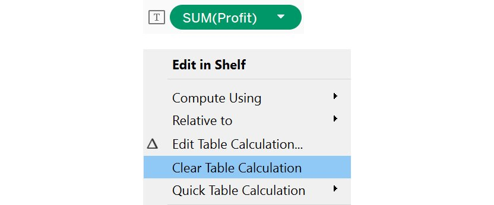

Lab 8: Data Analysis: Creating and Using Table Calculations 
===========================================================


Overview

In this lab, you will learn about the different types of table
calculations in Tableau, their benefits, and how to use them
effectively. The goal of this lab is to improve your analytical
skills using table calculations by looking at data through different
views to understand the underlying patterns. By the end of this lab,
you will be well positioned to perform complex analysis on the data in
your visualizations using table calculations.


Introduction 
============


In any visualization, a virtual table is created based on the dimensions
used in the view. This is added to the `Columns`,
`Rows`, and `Marks` shelves.


Figure 8.1: Virtual table in the view

The highlighted area in the preceding figure consisting of the
`Rows`, `Columns`, and `Marks` shelves
will make up your level of detail. The empty canvas outline for dropping
fields contains the virtual table that will be affected by table
calculations.

A table calculation is simply a calculation that computes results based
on the table segment in scope. You will learn about segments and scope
in detail in the following sections. For now, assume it is the entire
empty canvas area. All table calculations will only be computed within
the empty canvas outline or the virtual table.

In previous labs, you learned about visualization methods that
present data in a meaningful way. There may be times where you need to
analyze a table, such as when you want to find the most profitable
sub-category within a category. This is where table calculations come in
handy.

In this lab, you will learn about table calculations and their
applications through various exercises. You will also learn about the
functions that are a part of table calculations, and how to apply them.
You will use the `Sample - Superstore` dataset throughout the
exercises.


Quick Table Calculations 
========================


Quick table calculations, as the name suggests, allow you to quickly
apply frequently used table calculations to the view using the most
typical settings for that calculation type. They save you the effort of
using the column fields from data to create calculations. They have
inbuilt logic , so you can use them directly in the view. Some of the
most commonly used table calculations are as follows:

-   `Running Total`
-   `Difference`
-   `Percent of Total`
-   `Percent Difference`
-   `Percentile`
-   `Rank`
-   `Moving Average`

You will start by learning how to apply quick table calculations, using
the `Sample - Superstore` dataset. This file can be found by
following the `Documents` \| `My Tableau Repository`
\| `Data Sources` system path, and then opening the *Sample -
Superstore.xls* file.

To begin, create a view that shows `Category` against
`YEAR(Order Date)` and `SUM(Profit)`, as follows:


Table calculations only work with measures, so you need a measure to add
a calculation. To add a quick table calculation, first click on the
measure dropdown, which is `SUM(Profit)` in this case.


Navigate to the `Quick Table Calculation` menu.


You can see that there are numerous quick calculations available, such
as `Running Total`, `Percentile`, and
`Rank`. You will now go through each of these in detail.


Running Total 
-------------

`Running Total`, as the name suggests, is used to calculate
the cumulative total of a measure across a specific dimension or table
structure. It adds up the previous value with the current value to
display that result in the current value\'s place in the running total.
For example, consider that you are working on a project related to a car
manufacturer. A common use case for this calculation, would be to
calculate the month-by-month cumulative car sales for a year, to find
out the total sales for that year. You can also further calculate it on
a year-by-year basis to find out the overall car sales to date. The next
exercise looks at this in detail.


Exercise 8.01: Creating a Running Total Calculation 
---------------------------------------------------

In this exercise, you will calculate the cumulative profit earned across
different years for a particular category using the
`Running Total` calculation. This allows you to view all years
together for the profits earned, rather than individual years. The
following steps will help you complete this exercise:

1.  Load the `Sample – Superstore` dataset in your Tableau
    instance. In the `Connect` pane, click on
    `Microsoft Excel` and navigate to `Documents` \|
    `My Tableau Repository` \| `Data Sources`, and
    then open the `Sample - Superstore.xls` file.
2.  Create a view that shows `Category` against
    `YEAR(Order Date)` and `SUM(Profit)`, as
    follows:


1.  Add a `Running Total` quick calculation to the view by
    selecting the following highlighted options:


1.  The following view shows the final output:


As you can see, by comparing the previous figure (final view) with the
next one (initial view), the profit has been summed cumulatively by
taking the previous year\'s profit, as well as the current year\'s
profit. With `Furniture`, for example, the second value under
the running total is computed using the previous value and the current
value, that is, 5,458 + 3,015 = 8,473, and this is done similarly for
other values.


This view is helpful for calculating the cumulative profit earned, year
after year, for the different categories, as well as for identifying
which category has been performing well and which hasn\'t. These
insights can help you make important business decisions to understand
which products can be used to generate higher profits.

Next, you will learn about the `Difference` table calculation.


Exercise 8.02: Creating a Difference Calculation 
------------------------------------------------

In this exercise, you will calculate the profit difference across years
for a category. This will help you analyze whether that category is
profitable or not:

1.  Load the `Sample – Superstore` dataset in your Tableau
    instance.
2.  Create a view that shows `Category` against
    `YEAR(Order Date)` and `SUM(Profit)`, as
    follows:


Figure 8.9: Initial view

1.  Add the `Difference` quick calculation to the view, as
    shown in the following figure:


The final view will be as follows:


As you can see, the result is the difference between the current year\'s
profit and the previous year\'s profit; for example, for
`Furniture`, the second value under `Difference` is
computed using the previous value and the current value, that is, 3,015
-- 5,458 = -2443. This is done similarly for the other categories. One
thing to note here is the first year\'s value will always be blank, as
there is nothing to compute the difference from.

In the next section, you will learn about the
`Percent of Total` table calculation.


Percent of Total 
----------------

A `Percent of Total` calculation is used to calculate the
percent distribution of a measure across a specific dimension or table
structure. For example, if you are analyzing a project that operates in
multiple countries, you can calculate what percentage of the total
revenue each country generates. This in turn can highlight
underperforming countries, as well as the better-performing ones.

You will use this calculation in the next exercise.


Exercise 8.03: Creating a Percent of Total Calculation 
------------------------------------------------------

In this exercise, you will calculate the `Percent of Total`
profits earned in different years for a category. By doing so, you can
understand how each category has contributed to yearly profits. Perform
the following steps to complete this exercise:

1.  Load the `Sample – Superstore` dataset in your Tableau
    instance.
2.  Create a view that shows `Category` against
    `YEAR(Order Date)` and `SUM(Profit)`, as
    follows:


Figure 8.12: Initial view

1.  Add the `Percent of Total` quick calculation to the view


Figure 8.13: Accessing quick table calculation \| percent of total

The following view is the final output:


Figure 8.14: Final output

You can see that the profit has been converted to a percentage of the
total, from all the years\' profits. For example, for
`Furniture`, you can first compute the sum of all the years\'
profits, which comes to 18,451. Then, divide each year\'s profits with
this number. So, for 2016, you can compute it as 5,458 / 18,451, which
is 29.58%.

This view helps find out which year has been better for generating
profits for each category. The next step is to identify patterns
indicative of higher profits in those years, and to try to replicate the
patterns for the current year to generate similar or higher profits.

The next section looks at the `Percent Difference` table calculation.


Exercise 8.04: Creating a Percent Difference Calculation 
--------------------------------------------------------

In this exercise, you will be calculating `Percent Difference`
across the different years for a particular category. This will help you
analyze, in terms of percentage, the profit difference for the various
categories:

1.  Load the `Sample – Superstore` dataset in your Tableau
    instance.
2.  Create a view that shows `Category` against
    `YEAR(Order Date)` and `SUM(Profit)`, as
    follows:


Figure 8.15: Initial view

1.  Add the `Percent Difference` quick calculation to the
    view:


Figure 8.16: Accessing quick table calculation \| percent difference

The following figure shows the final output:


Figure 8.17: Final output

As you can see, the output shows the difference between the current
value and previous values, divided by the previous value; for
`Furniture`, the percent difference for 2016 is computed as
3,015 -- 5,458 / 5,458, which comes to `-44.8%`.

This view helps to compare the individual category profits in terms of
percent, and identifies how each category has performed compared to the
previous year. This can help you understand whether the category did
better (or not), compared to the previous year.You can further
investigate the reason for performance differences, and act on the
analysis accordingly.

Next, you will learn about the `Rank` and
`Percentile` table calculations.


Percentile and Rank 
-------------------

`Percentile`, as you may have guessed, is used to calculate
the percentile of a measure across a specific dimension or table
structure. Similarly, `Rank` will rank the measure across a
specific dimension or table structure. You will learn about these in
detail in the next exercise.


Exercise 8.05: Creating Percentile and Rank Calculations 
--------------------------------------------------------

In this exercise, you will calculate `Percentile` and
`Rank` across different years for a particular category. This
will help you understand how much profit various categories have
generated in different years. Follow these steps to complete this
exercise:

1.  Load the `Sample – Superstore` dataset in your Tableau
    instance.
2.  Create a view that shows `Category` against
    `YEAR(Order Date)` and `SUM(Profit)`.


Figure 8.18: Initial view

1.  Add the `Rank` quick calculation to the view, as shown in
    the following figure:


Figure 8.19: Accessing quick table calculation \| rank

The following view will be the final output for `Rank`. The
output is ranked based on the descending values of
`SUM(Profit)`:


Figure 8.20: Rank output on selecting the Rank quick table calculation

1.  Similarly, add the `Percentile` quick calculation to the
    view by selecting the `Percentile` quick table
    calculation. The following figure shows the final output for this:


Figure 8.21: Percentile output on selecting the Percentile quick table
calculation

With the `Rank` calculation, you ranked each year in a
particular category based on the sum of the profits. The preceding
figure shows the `Percentile` operation. For
`Furniture`, the profit for 2016 is at the 0th percentile,
which means that 0% of data is under \$3,015. Similarly, for 2017, the
profit is \$6,960 at the 100th percentile, meaning that the profit for
all other years is below this value. This view can help you do a
year-by-year comparison for individual category profits in terms of
percentile and rank, to identify how each category has performed
compared to the previous year.

Next, you will learn about the `Moving Average` quick table
calculation.


Moving Average 
--------------

`Moving Average` is used to calculate the average of a measure
across a specific dimension or table structure in a dynamic range,
rather than being static. The advantage of using a moving average is
that more importance is given to the values of recent history, rather
than using all historic data. Moving averages are commonly used for
identifying trends of share prices, where you can analyze a 20-day
moving average (last 20 days of share price), or a 50-day moving average
(last 50 days of share price), to understand how the share price is
moving. The next exercise looks at this in detail.


Exercise 8.06: Creating a Moving Average Calculation 
----------------------------------------------------

In this exercise, you will calculate the moving average of profit earned
across different years for a particular category. This will help you
understand whether the average value is higher or lower than the
previous year\'s profits:

1.  Load the `Sample – Superstore` dataset in your Tableau
    instance.
2.  Create a view that shows `Category` against
    `YEAR(Order Date)` and `SUM(Profit)`.


Figure 8.22: Initial view

1.  Add the `Moving Average` quick calculation, as shown in
    the following figure:


Figure 8.23: Accessing quick table calculation \| moving average

This view will be the final output:


Figure 8.24: Final output

As you see, the profit has been averaged across the total from all the
years\' profits. First, the sum of all the years\' profits is computed,
and then, this number is divided by the number of years. For example,
for 2017, the moving average comes to 8,473 / 2 = 4,236.


Table Calculation Application: Addressing and Partitioning 
==========================================================


In the previous section, you learned about quick table calculations. But
did you notice that all these calculations were working at the row
level? What if you need to apply calculations at the column level? This
is where the concept of addressing and partitioning comes into play.

Addressing means defining the direction of the calculation. A
calculation can compute horizontally or vertically, depending on the
option selected. Partitioning can be defined as the scope of the
calculation; for example, you can partition a view into various years
for different categories, or various categories for the same year.

In this section, you will learn about the following methods to address
and partition data:

-   `Table(across)`
-   `Table(down)`
-   `Table(across then down)`
-   `Table(down then across)`
-   `Pane(down)`
-   `Pane(across then down)`
-   `Pane(down then across)`
-   `Cell`
-   `Specific Dimensions`

You will continue working with the same example that you have been using
in the previous exercises. First, you will explore the various ways of
addressing data.


Table (across) 
--------------

`Table(across)` performs a calculation horizontally across a
table, and restarts after each row. For example, consider you have years
on the `Columns` shelf for various product names on the rows,
along with their sales. Here, `Table(across)` would perform
the calculation for all the years\' sales for an individual product, and
then restart for the next product. The next exercise looks at this in
detail.


Exercise 8.07: Creating a Table (across) Calculation 
----------------------------------------------------

Considering the example of car manufacturer sales, suppose you want to
compare the sales for the various years. In this exercise, you will use
a `Table(across)` calculation to find this. The following
steps will help you complete this exercise:

1.  Load the `Sample – Superstore` dataset in your Tableau
    instance.
2.  Create a view that shows `Category` against
    `YEAR(Order Date)` and `SUM(Profit)`.


Figure 8.25: Initial view

1.  Add the `Running Total` quick calculation to get the
    following view:


Figure 8.26: Running total for SUM(Profit)

1.  Now, select `Compute Using` and then
    `Table(across)`, as shown in the following figure


Figure 8.27: Selecting table (across)

The next figure shows the final view. You can see that the
`Profit` table calculation is done for every
`Category` (partitioning) across the different
`Order Date` years (addressing):


Figure 8.28: Final output

This view helps find the cumulative profit for the various categories
over the years. This can help youunderstand how each category has been
performing compared with other categories, over the years.

Next, you will learn about the `Table(down)` calculation.


Table (down) 
------------

`Table(down)` computes the calculation vertically down the
table, and restarts after each column. For example, consider that you
have the various years on the `Columns` shelf for the product
names (and their sales) on the rows. `Table(down)` would
compute the calculation for all of a product\'s sales for an individual
year, and then restart at the next product.


Exercise 8.08: Creating a Table (down) Calculation 
--------------------------------------------------

For this exercise, you will compare the sales for various years, using
the `Table(down)` calculation along years. This will help you
compare the profits for the years, and help you understand whether the
sales are improving or declining:

1.  Load the `Sample – Superstore` dataset in your Tableau
    instance.
2.  Create a view that shows `Category` against
    `YEAR(Order Date)` and `SUM(Profit)`.


Figure 8.29: Initial view

1.  Add the `Running Total` quick calculation to get the
    following view. This is the default, which is the across or
    horizontal direction:


Figure 8.30: Running total for SUM(Profit)

1.  Select `Compute Using` and then `Table(down)`,
    as follows:


Figure 8.31: Accessing compute using \| table (down)

1.  The following figure shows the final view. You can see that the
    `Profit` table calculation is computed for every
    `Order Date` year (partitioning) for the three
    `Category` values (addressing):


Figure 8.32: Final output

This view can help you answer how each category has been performing
based on profits across years. You could potentially make important
business decisions based off these results.

Next, you will learn about `Table(across then down)` and
`Table(down then across)` together. These are opposites.
`Table(across then down)` computes the calculation
horizontally across the table and adds the values at the end of each row
to the first value of the next row. `Table(down then across)`
performs the calculation vertically down the table, and adds the values
at the end of each column to the first value of the next column.

In the `Table(down)` and `Table(across)` exercises,
you treated the end totals for each column or row as separate values.
So, you got a comparison for the different addressing results. For
`Table(across then down)` and
`Table(down then across)`, a value for the current row/column
will be the result of the previous rows/columns along with the current
row/column.

Considering the previous example of car manufacturer sales, suppose you
perform `Table(down)` and then `Table(across)` for
sales; Tableau would first compute the sales for the current year for
all products, and then add that value to the next year\'s values. Hence,
for the current year, you would get cumulative values for the previous
years and the current year\'s sales.


Exercise 8.09: Creating Table (across then down) and Table (down then across) Calculations 
------------------------------------------------------------------------------------------

In this exercise, you will continue with the example used in the
previous exercises, and use `Table(across then down)` and
`Table(down then across)` calculations. The following steps
will help you complete this exercise:

1.  Load the `Sample – Superstore` dataset in your Tableau
    instance.
2.  Create a view that shows `Category` and
    `Sub-Category` against `YEAR(Order Date)` and
    `SUM(Profit)`, as follows. Filter on
    `Category: Technology` by placing `Category` on
    the `Filters` shelf:


Figure 8.33: Initial view for table (across then down)

1.  Add the `Running Total` quick calculation to get the
    following view. Here, you get the cumulative sum of profits for all
    the years for a sub-category. The default addressing would be
    `Table(across)`:


Figure 8.34: Running total for SUM(Profit)

1.  Select `Compute Using` and then
    `Table(across then down)`.


Figure 8.35: Accessing compute using \| table (across then down)

The following is the generated view. You can follow the lines shown in
the following figure to see how the computation is done:


Figure 8.36: The working of table (across then down)

First, `Table(across)` is performed for
`Accessories` (see the orange lines). Then, that total
(`$41,937`) is computed by `Table(down)` (green
line) with the profit of `Copiers` (`$2,913`) making
it `$44,850`. This process is repeated until the table ends.

1.  To change this to `Table(down then across)`, select
    `Compute Using` and then
    `Table(down then across)`, as follows:


Figure 8.37: Accessing compute using \| table (down then across)

This will be the generated view. Again, you can follow the lines to see
how the computation is done. This is exactly the opposite of how
`Table(across then down)` works:


Figure 8.38: The working of table (down then across)

As you see, first the profits are added in a downward direction, then
this sum is taken across to a different year. This process continues
until the final year. This view can help you understand how the
different sub-categories have been performing, based on profits summed
together over the previous years.

Next, you will learn about panes. Table calculations can work down or
across panes, depending on the calculation type. A pane can be defined
as a combination of cells made up of fields on the `Rows` and
`Columns` shelves, as in the following screenshot:


Figure 8.39: Panes

They can also be thought of as smaller tables within a bigger table.
Table calculations can be performed on panes similar to how you did at
the table level. The following is a list of the various pane-related
computations:

-   `Pane(across)`
-   `Pane(down)`
-   `Pane(across then down)`
-   `Pane(down then across)`

You will start with `Pane(across)`.


Exercise 8.10: Creating a Pane (across) Calculation 
---------------------------------------------------

`Pane(across)` computes the calculation horizontally across
the pane, and restarts at the next pane. Considering your previous
example of car manufacturer sales, suppose you want to compare the sales
for the various years, while also considering the different car
segments, such as hatchback, sedan, and SUV. In this exercise, you will
use the `Pane(across)` calculation to do this.

The following steps will help you complete this exercise:

1.  Load the `Sample – Superstore` dataset in your Tableau
    instance.
2.  Create a view that shows `Category` against
    `YEAR(Order Date)`, `QUARTER(Order Date)`, and
    `SUM(Profit)`, as follows:


Figure 8.40: Initial view with a running total for SUM(Profit)

1.  Filter on `YEAR(Order Date)` as `2016` and
    `2017`.


Figure 8.41: Adding a YEAR filter

1.  You now have two horizontal panes. For a pane table calculation to
    be activated, you need more than one dimension in the rows or the
    columns. A pane here will be one row, per `Category`,per
    year; so you\'ll have six panes in the view. The first pane looks
    like this:


Figure 8.42: Understanding pane (across)

1.  Add a Running Total of Sum(Profit) and then select the
    `Pane(across)` option by clicking again on
    `SUM(Profit)`.


Figure 8.43: Accessing compute using \| pane (across)

On selecting `Pane(across)`, you should see the following
output:


Figure 8.44: Final output

1.  To understand this better, add `Profit` to another view
    and compute the result.


Figure 8.45: The working of pane (across)

As you see, each of the highlighted blue boxes just adds profits
horizontally, and this restarts after each partition or pane
horizontally. You can also validate the sum of profit by referencing the
bottom table.


Figure 8.46: Final output analysis

This view can help you see how different categories have performed based
on profits summed together over all different quarters across the two
Order Date years. This can help you hone in on profits, to understand
which quarters generated the highest profits.

Next, you will learn about `Pane(down)`.
`Pane(down)` performs the calculation vertically down the
pane, and restarts at the next pane.


Exercise 8.11: Pane (down) Calculation 
--------------------------------------

Considering the example of car manufacturer sales, suppose you want to
analyze the sales of various car models sold per segment per year. Here,
you can use `Pane(down)` addressing on the segment
partitioning. The following steps will help you complete this exercise:

1.  Load the `Sample – Superstore` dataset in your Tableau
    instance.
2.  Create a view that shows `YEAR(Order Date)` and
    `Category` against `QUARTER(Order Date)` and the
    running total for `SUM(Profit)`, as follows:


Figure 8.47: Initial view with the running total for SUM(Profit)

1.  Filter on `YEAR(Order Date)` as `2016` and
    `2017`.


Figure 8.48: Adding a YEAR filter

1.  Now, you will have eight vertical panes -- four for `2016`
    and four for `2017` -- based on the four quarters and two
    years.


Figure 8.49: Understanding pane (down)

1.  Select the `Pane(down)` option by clicking again on
    `SUM(Profit)`, as follows:


Figure 8.50: Accessing compute using \| pane (down)

You will see the following output:


Figure 8.51: Final output

1.  To understand this better, add `Profit` to the view and
    see the result.


Figure 8.52: The working of pane (down)

As you see, the values in each blue pane (highlighted) are summed in a
downward direction, and this process restarts after every pane. Here,
you can compare quarterly profits. For example, for `Q1`
`2016`, the total profit is `$3,811` and similarly,
for `Q1` `2017`, it is `$9,265`, which is
approximately 2.5 times more profit. The same is cannot be said for
`Q2` profits. Based on this, you can try to analyze the
reasoning behind such differences, and use those insights to tweak
business strategy.

Next, you will learn about `Pane(across then down)` and
`Pane(down then across)`. `Pane(across then down)`
is a combination of `Pane(across)` and `Pane(down)`;
that is, it computes the calculation horizontally across the pane and
combines the result with the values in the next pane.
`Pane(down then across)` is the opposite of
`Pane(across then down)`, as it performs the calculation
vertically down the pane and combines the result with the values in the
next pane. The next exercise looks at this in detail.


Exercise 8.12: Creating a Pane-Level Calculation 
------------------------------------------------

This exercise continues with the example of car manufacturer sales.
Suppose you want the sales per segment per quarter for the different
years together. Here, you can use the option of
`Pane(across then down)` or
`Pane(down then across)`. The result combines all detailed
panes into a cumulative overall total. The following steps will help you
complete this exercise:

1.  Load the `Sample – Superstore` dataset in your Tableau
    instance.
2.  Before creating the view, you must first create a combined field for
    `Category` and `Sub-Category`. This is required
    for the `Pane(across then down)` calculation, else Tableau
    will merge the sub-categories. Select `Category` and
    `Sub-Category` together, then, right-click and select
    `Create` and then `Combined Field`, as follows:


Figure 8.53: Creating a combined field

1.  Create a view that shows `YEAR(Order Date)` and
    `QUARTER(Order Date)` against `Category`,
    `Sub-Category`, and the combined field. Also, add the
    running total for `SUM(Profit)`, as follows:


Figure 8.54: Initial view with the running total for SUM(Profit)

1.  Filter on `YEAR(Order Date)` as `2016` and
    `2017`. Also, filter on `Category` by selecting
    `Furniture` and `Technology`, as follows:


Figure 8.55: Adding category and YEAR filters

1.  You now have two horizontal `Year` panes and two vertical
    `Category` panes. Select the
    `Pane(across then down)` option by clicking again
    on `SUM(Profit)`.


Figure 8.56: Accessing compute using \| pane (across then down)

1.  On selecting `Pane(across then down)`, the output
    generated is as follows:


Figure 8.57: Final output for pane (across then down)

1.  To understand this better, add `Profit` to the view and
    calculate the result.


Figure 8.58: The working of pane (across then down)

Notice the blue arrows, which indicate the profits being summed from the
first to the last value in that row; the orange arrow indicates that the
last value of each row is added to the first value of the next row. This
process is repeated until the last row for each year. Once a year is
completed, the calculation restarts for the next year. You can validate
the numbers by looking at the `Sum(Profit)` values, as seen on
the right side.

1.  Change the calculation to `Pane(down then across)`, as
    shown in the following figure:


The output generated will be as follows:


1.  To understand this better, add `Profit` to the view and
    calculate the result for `2016`.


Observe the blue arrows, which indicate the profits being summed from
the first to the last value in the column. The orange arrow indicates
that the last value of each column is added to the first value of the
next column. This process is repeated until the last row for each year.
Once a year is completed, the calculation restarts for the next year.
Once again, you can validate the numbers by looking at the
`Sum(Profit)` values, as seen on the right side.


Cell 
----

`Cell` computes across the individual cells. The result is the
same as adding the measure to the shelf directly, as shown in the
following figure (the cell is highlighted using a box):


The values are the same in both tables. `Specific Dimensions`
computes using the dimensions you specify. You will learn about this in
more detail in the following section.


Creating, Editing, and Removing Table Calculations 
==================================================


Hopefully you now have a good understanding of quick table calculations,
but what if you need to use some other calculation, such as ranking the
rows in a table? Here, you can use the `Create` calculation
window. Tableau supports many table functions besides quick table
calculations. In this section, you will learn how to create, access,
edit, and remove a table calculation.


Creating a New Table Calculation 
--------------------------------

To create a table calculation, right-click on any measure value, and
then click on `Create` , then `Calculated Field...`,
as follows:


Figure 8.63: Creating a calculated field from Profit

Once you click on `Calculated Field...`, a calculation editor
window will open up, as follows:


Figure 8.64: Calculation editor

Now, you can click on the dropdown and select the
`Table Calculation` menu, as follows:


Figure 8.65: Accessing table calculation functions in the calculation
editor

Next, the list of all the table calculations supported by Tableau
appears, as follows:


Figure 8.66: Various table calculation functions

In Tableau, it\'s very easy to understand these table calculations. Each
calculation is defined by specifying the syntax for use, the expected
result from using the calculation, followed by an example.

You are already familiar with `RUNNING_TOTAL`, which is
similar to `RUNNING_SUM`. The same calculation type can be
used to do a variety of operations, such as sum, average, and finding
the minimum and maximum values, which can be referenced under the table
calculation menu.


Exercise 8.13: Creating a Table Calculation Using the Calculation Editor 
------------------------------------------------------------------------

In your projects, you might need to use one of the table calculation
functions in the view. An example of this is the index function, which
adds serial numbers to the rows in the view. You can do this by creating
a table calculation. In this exercise, you will calculate the rank of
`Sub-Category` based on `SUM(Profit)` across years.
The following steps will help you complete this exercise:

1.  Load the `Sample – Superstore` dataset in your Tableau
    instance. Use the combined field that you created earlier along with
    `YEAR(Order Date)`. Create a view as follows and also
    filter `Category` for `Furniture`:


Figure 8.67: Initial view with SUM(Profit)

1.  Now, create a `RANK` table calculation. Right-click on
    `Profit` in the data pane and select `Create` \|
    `Calculated Field…`. This will open up the
    calculation editor.


Figure 8.68: Creating a calculation using Profit

1.  Add the following expression to the calculation editor:
    
    ```
    RANK(SUM(Profit))Copy
    ```
    

This is shown in the following figure:


Figure 8.69: Profit\_Rank calculation

1.  Name it `Profit_Rank`.
2.  Drag this onto the view on `Text`, as follows:


Figure 8.70: Adding the Profit\_Rank calculation to the view

1.  Observe that the default is the `Table (across)`
    direction. Edit this and try to change the computation on specific
    dimensions in the view. Click on the `Profit_Rank`
    dropdown and select `Edit Table Calculation…` and then
    `Specific Dimensions`, as shown in the following figure:


Figure 8.71: Accessing edit table calculation

Using these options, you can control how the table calculation is
computed. It is important to understand the different options here:

-   `At the level`: This determines the level at which the
    calculation is computed. The level here implies the different
    dimensions in the view, such as `Category` and
    `Sub-Category`. `Deepest` is the default if
    multiple dimensions are selected, which means the computation will
    happen at the lowest level of granularity, which is
    `Sub-Category` in your view.


Figure 8.72: Various options under the At the level dropdown

-   `Restarting every`: This option can be used to restart the
    computation based on the field selected.


Figure 8.73: Various options under the Restarting every dropdown

-   `Show calculation assistance`: This option highlights how
    the computation will work based on your selections. As the following
    figure shows, based on the selections, `Profit_Rank` will
    work in the downward direction (highlighted):


Figure 8.74: Using Show calculation assistance

This view showed how you can perform table calculations at different
levels using the dimensions in the view.


Removing a Table Calculation 
----------------------------

Once you have added a table calculation, you should also be able to
remove it. This can be done by clicking on an existing quick table
calculation and selecting the `Clear Table Calculation`
option, as follows:





Figure 8.75: Selecting the Clear Table Calculation option


Activity 8.01: Managing Hospital Bed Allocations 
------------------------------------------------

There may be scenarios where you need to use the historic value of a
measure to compute its current value, for example, when finding the
cumulative sum of sales for all quarters in a year.This can, in turn,
help you visualize the entire year\'s sales, or the sales difference,
compared to previous quarters. In such cases, a table calculation can be
useful, as all logic is inbuilt, and you need only apply the calculation
to the measure value.

In this activity, you will apply table calculations to a hospital-based
project, to identify how many patients are currently admitted.You
willconsider factors such as new admissions, discharges, and routine
follow-ups, to check whether the threshold for beds is sufficient. By
doing this, you can ensure the hospital will not run out of beds in the
case of an emergency.

In the dataset, there is a date column indicating the current day, an
Open column indicating the number of patients admitted, Discharges
indicating the number of discharges, and Re-open indicating the number
of patients getting re-admitted or following up for a previous
admission. In addition, you also need to keep 100 of the total 900 beds
free in case of an emergency. If the number of patients exceeds 600, it
should be highlighted visually.

Note

The dataset used for this activity can be found and downloaded from
<https://github.com/fenago/tableau-advanced>.

The following steps will help you complete this activity:

1.  Open and connect the dataset for `Activity 1` in your
    Tableau instance.
2.  Create a calculation named `current_patients` to find the
    number of patients currently admitted. This can be calculated after
    considering the `Open`, `Discharges`, and
    `Re-open` columns.
3.  Once you have a bar chart view, display the date at the exact date
    level, along with the number of patients currently in the hospital,
    using the `current_patients` field created in the previous
    step. This view helps you view how many patients are admitted on a
    given day.
4.  Add a `running_sum` table calculation to the
    `current_patients` table calculation in the existing view.
    This view helps you visualize the number of patients admitted on a
    given day considering all the previous days as well.
5.  Create another calculation named Alert to indicate that the patient
    count is above 600. You need to use running\_sum to identify the
    number of patients on a given day.
6.  Now, you should be able to analyze the total number of patients
    admitted to the hospital, and see whether there are enough beds
    available.
7.  The initial view is as follows:


The final output is as follows:


Here, you can see that in 2009, there was a period when the number of
patients was more than the number of beds. Although such incidents are
rare, it is imperative that they are managed properly.

With this activity, you strengthened your knowledge of creating and
using table calculations. This activity helped you see how you can use
cumulative values to better analyze data, by highlighting anomalies or
events that may have a significant business impact.


Activity 8.02: Planning for a Healthy Population 
------------------------------------------------

In the previous activity, you created a visualization to indicate a
drastic increase in the number of patients. As an analyst, you should
also be able to use historic data, and identify patterns when the number
of patients go up.

In this activity, you will use a range window to identify when the
current admissions increase, and whether there is a specific observable
trend. In this way, the hospital can be better prepared for the future.
You will use the same hospital data used in the previous activity. The
following steps will help you complete this activity:

1.  Plot the window average of the `RUNNING_SUM` of
    `current_patients`, weekly. A window average takes the
    average of all values in the window, which in this case is the view.
2.  Remove the average for the last 10-week range to check whether the
    count of currently admitted patients goes up or down. Create a
    parameter that can be used as input for the range; you can name it
    `Range_input`.
3.  Use this `Range_input` parameter as the input for the
    `WINDOW_AVG` calculation named avg\_admitted. You need to
    calculate the average from the last 10 weeks to the current week.
4.  Use a dual-axis to show the `RUNNING_SUM` of
    current\_patients and `WINDOW_AVERAGE`. Recall that a
    dual-axis is used to show two measures side by side in the same
    view. Right-click on the axis to enable this option after adding
    both measures.
5.  Create an alert to compare the `RUNNING_SUM` of
    `current_patients` and `avg_admitted`. Highlight
    the weeks when the sum is more than the average.
6.  The initial view would look like this:


The final view should look like this:


You can now see when the current admitted patient count has gone higher
than the 10-week average. The range can be changed based on the
requirement by changing the input. An interesting observation is the
month of July, which had a higher-than-average number of patients for
the all of the previous 3 years, indicating thepossibility for a similar
occurance for next July.


Summary 
=======


In this lab, you learned about table calculations. You started by
performing some quick table calculations, used to quickly apply commonly
used table calculations in the view. Then, you explored ways to apply a
table calculation using addressing and partitioning -- how addressing
defines the direction of the calculation, while partitioning defines its
scope. Finally, you learned about creating a table calculation using the
calculation editor, and about ways to address the view using
specific dimensions.

In the next lab, you will learn about `Level of Detail`,
which is another powerful concept, used to control how views are
displayed.
