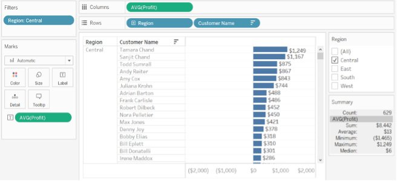

Lab 9: Data Analysis: Creating and Using Level of Details (LOD) Calculations 
============================================================================

Overview

This lab introduces the concept of **Level of Detail** (**LOD**)
calculations. You will learn about the different types of LOD
calculations and the benefits of using them. The goal of this lab is
to improve your analytical skills using LOD calculations by looking at
the data through different views to understand the underlying patterns.
By the end of this lab, you will be able to control the granularity
of your data visualizations and perform comparative analyses using LOD
calculations.

Introduction 
============

For any visualization, dimensions determine the level at which measures
are computed. As an example, consider the following view, in which the
sum of profits is calculated based on `Country` and
`Region`. These two dimensions form the details that are
combined to determine the value of `SUM(Profit)`. Now, suppose
you remove `Region` from the view. Then,
`SUM(Profit)` would be re-computed, and would only consider
`Country` in the view. Accordingly, the value of
`SUM(Profit)` changes as the level of the computation changes,
as can be seen from the following figure:

Figure 9.1: Understanding LOD

LOD calculations help you control the granularity of visualizations. You
can choose to view calculation results at a detailed level, or an
aggregated level, based on the LOD function you use, LOD calculations
require measures to be aggregated.

In this lab, you will work with LOD calculations in Tableau.

Throughout these exercises, you will be working with the
`Sample - Superstore` dataset, to learn about the different
concepts related to LOD calculations.

Exercise 9.01: Creating a LOD Calculation 
-----------------------------------------

You will now create an LOD calculation using the `Profit`
measure in the `Sample - Superstore` dataset. The following
steps will help you complete this exercise:

1.  Load the `Sample – Superstore` dataset in your Tableau
    instance. Navigate to
    `Documents | My Tableau Repository | Data Sources`, then
    open the `Sample - Superstore.xls` file.
2.  Once the data is loaded, in the data pane, right-click on
    `Profit` and select
    `Create | Calculated Field…`, as follows:

Figure 9.2: Creating a calculated field

1.  In the calculation editor, select `Aggregate` from the
    dropdown to access the LOD calculations:

Figure 9.3: Calculated field editor

LOD calculations fall under the `Aggregate` set of functions.
There are four LOD calculation types: `FIXED`,
`INCLUDE`, `EXCLUDE`, and `Table-Scoped`.
You will learn more about these as the lab progresses. For now,
hover over `FIXED`. Notice the calculation syntax, as can be
seen in the following figure:

Figure 9.4: Various LOD types in Tableau

1.  Click on `FIXED` and add it to the calculation editor. Add
    the `{FIXED : SUM([Profit])}` formula to the editor and
    click `OK`:

Figure 9.5: Creating a LOD calculation

LOD calculations require an aggregate measure. If you do not aggregate
the measure, Tableau will show an error. Aggregation here means to use
SUM, AVG, or similar types of calculation with a measure value, rather
than using the measure directly, as with the SUM function previously.

1.  For this calculation, compute `SUM(Profit)` at the highest
    level of granularity in the data, which is the `Country`
    level. Add this to the view, as follows:

Figure 9.6: Initial view with country

Notice that the measure value does not change, irrespective of how many
dimensions you add in the view:

Figure 9.7: Initial view with region

In this exercise, you created an LOD calculation, by comparing how the
`SUM(Fixed_Profit)` aggregation behaves, based on various
dimensions such as `Region`. You observed that the values of
the output measure do not change, irrespective of the other dimension in
the view, because you chose the `FIXED` LOD calculation.

Next, you will learn about the different types of LOD calculations.

Types of LOD Calculations 
=========================

In this section, you will learn about the various LOD calculations.
There are four LOD calculation types:

-   `FIXED`
-   `INCLUDE`
-   `EXCLUDE`
-   `Table-Scoped`

You will now learn about each of these LOD calculations in greater
depth. You will also learn their application in visualizations by
performing an exercise for each.

FIXED 
-----

`FIXED` LOD calculations compute an expression using specified
dimensions. An example would be identifying the top-performing product
categories per region per country. This can easily be done using
`FIXED` LOD calculations.

Exercise 9.02: Creating a FIXED LOD Calculation 
-----------------------------------------------

In this exercise, you will calculate `SUM(Profit)` fixed at a
`Country` level. Suppose, as a country-level manager, you are
only interested in the profits generated at country level, but
occasionally would like to hone in on the `Region` level of
that country. Now, you will compute a measure at a specific dimension
level, rather than making calculations using all dimensions in the view.

Note

If you are using the local copy of `Superstore` that comes
with Tableau, the field `Country` will have the label
`Country/Region` instead. This will not affect the
calculations.

Perform the following steps to complete this exercise:

1.  Load the `Sample – Superstore` dataset in your Tableau
    instance.
2.  Create a view that shows `Country` and `Region`
    along with `SUM(Profit)`. Currently, the view shows
    `SUM(Profit)` at the `Region` level, as follows:

Figure 9.8: Initial view with country and region

1.  Create a `FIXED` LOD calculation:

Figure 9.9: Calculation editor

1.  You can use any number of dimensions in the expression before the
    colon (`:`). Note the expression on the right side of the
    colon (`:`) has to be an aggregation, or else you will get
    a syntax error:

Figure 9.10: Understanding the syntax of LOD calculations

1.  Add this calculation to the view:

Figure 9.11: Comparing LOD and normal calculations

The second calculation in each row is the LOD calculation. Notice how
the value remains constant irrespective of the `Region`
dimension in the view.

In this exercise, you learned about the `FIXED` LOD
calculation type and its application. You also saw how computation works
when adding another dimension such as `Region` to the view.
Next, you will learn about the `INCLUDE` LOD calculation.

INCLUDE 
-------

`INCLUDE` LOD calculations are used to calculate values based
on the dimensions specified, along with those used in the view. This is
useful when wanting to know results at a detailed level, but also want
the view to be at a higher level. An example would be computing the
average literacy rate at district level, but viewing it at state level.
Here, instead of averaging it directly at state level, you would average
it at district level, and then re-aggregate the results at state level.
The next exercise covers this concept in detail.

Exercise 9.03: Creating an INCLUDE LOD Calculation 
--------------------------------------------------

In this exercise, you will calculate `AVG(Profit)` using the
`Customer` and `Region` dimensions. You will learn
how to compute the average profit at a customer level, and then group it
again by the `Region` dimension in the view. Perform the
following steps to complete this exercise:

1.  Load the `Sample – Superstore` dataset in your Tableau
    instance.
2.  Create a view that shows `Region` along with
    `AVG(Profit)`, as follows:

Figure 9.12: Initial view

1.  Currently, the view shows `AVG(Profit)` at the
    `Region` level. Create an `INCLUDE` LOD
    calculation, and write the formula as given in the following figure:

Figure 9.13: INCLUDE LOD calculation expression

1.  Use the average profit generated by a customer in that region to
    compute the overall average. Duplicate the preceding view, and add
    this calculation instead of `AVG(Profit)` to get the
    following:

Figure 9.14: Adding the LOD calculation to the initial view

1.  Check that the aggregation is set to average by clicking on the
    calculation dropdown and selecting the `Measure (Average)`
    option as `Average` on both the `Text` and
    `Columns` shelves:

Figure 9.15: Changing a calculation aggregation format

Notice that the numbers are different in both views, despite the
dimension being the same. You will now see how the computation is
happening within Tableau.

1.  At the `Region` level, to compute the average profit, add
    the profit across the region, and divide the sum by the total number
    of records , as follows:

Figure 9.16: Calculation logic explanation

1.  Now it is time to see how the customer-level computation works. Plot
    the average profit generated by each customer in
    `Central Region`. Once you have the average, sum all
    averages (\$8,442), and divide the result by `Count (630)`
    to get the value of \$13.42 per customer in that region. These
    values can be referred to in the `Summary` card, as
    follows:

Figure 9.17: Customer-level computations

This kind of calculation is useful when you want to see the aggregations
at different levels without using them in the view.

Note

You can perform a similar calculation at the `Segment`, ship
mode, or any other dimension to understand underlying trends in data.

In this exercise, you learned about the `INCLUDE` LOD
calculation type and how it can be applied to analyze trends at
different levels of dimensions. Next, you will learn about the
`EXCLUDE` LOD calculation.

EXCLUDE 
-------

An `EXCLUDE` LOD calculation declares dimensions to be omitted
from the view LOD. It is the opposite of the `INCLUDE` LOD. In
an `EXCLUDE` LOD, the calculation is computed excluding the
specified dimensions in the expression; that is, the specified
dimensions are ignored while computing the results. Continuing on with
the previous example, you can add both the customer and product
categories to the view, but can exclude the customer dimension when
computing sales, and just calculate sales at a product category level.
You will explore this in detail in the next exercise.

Exercise 9.04: Creating an EXCLUDE LOD Calculation 
--------------------------------------------------

In this exercise, you will calculate `AVG(Profit)` using the
`Customer` and `Region` dimensions, and will see how
the `EXCLUDE` LOD calculation can be applied. This will help
you learn how to compute the average profit only at the region level,
despite having customer information in the view:

1.  Load the `Sample – Superstore` dataset in your Tableau
    instance.
2.  Create a view that shows the `Region` and Customer
    dimensions along with `AVG(Profit)`, as follows:

Figure 9.18: Initial view

1.  Add a `Central` filter for `Region`. Here, you
    only view the `Customer` information for
    `Central Region`, along with the average profit.
2.  Create an `EXCLUDE` LOD calculation to exclude the
    customer and re-compute the average profit, as follows:

Figure 9.19: Exclude LOD expression

1.  Add this calculation to the view, and you will see the following:

Figure 9.20: Adding exclude LOD to the view

1.  Check that the aggregation is set to `Average`. Here, you
    have excluded the `Customer`-level profit, and have
    instead grouped it at a higher granular level of `Region`.
2.  At a `Region` level, to compute the average profit, you
    can simply add the profits across the region and divide the sum by
    the number of records, as follows:

Figure 9.21: Profit computation logic explanation

This kind of calculation comes in useful when wanting to see aggregation
at different levels without actually using them in the view. In this
exercise, you learned about the `EXCLUDE` LOD calculation
type, and how its application can help analyze trends at different
levels of dimension. Next, you will learn about the
`Table-Scoped` LOD calculation.

Table-Scoped 
------------

Tableau provides a way to define an expression without using LOD
functions such as `FIXED`, `INCLUDE`, and
`EXCLUDE`. The following expression returns the minimum profit
for the entire table:

Figure 9.22: Table-scoped syntax

The `Table-Scoped` calculation is equivalent to a
`FIXED` LOD calculation with no dimension declaration:

Figure 9.23: Comparison to the fixed LOD calculation type

Now you have learned about different LOD calculations, their syntax, and
their applications, you can now see how Tableau categorizes LOD
calculations and what canges are required in the worksheet view for the
LOD calculation to give the right output.

LOD Calculations: Dimensions or Measures? 
=========================================

In the previous exercises, when calculating LOD calculations, you have
always used a measure to give a numerical output. `FIXED` LOD
calculations can show results in measures or dimensions, depending on
the field used in the expression.

So, `MIN ([Order_Date])}` will be a dimension, because
`[Order_Date]` is a dimension, and
`{fixed Country: AVG([GDP])}` will be a measure, because
`[GDP]` is a measure. In contrast, `INCLUDE` and
`EXCLUDE` LOD calculations always show results in measures.

You will now learn how dimensions used in the view affect the LOD
calculation\'s computation.

Aggregation and LOD Calculations 
--------------------------------

In previous exercises, you computed `AVG(Profit)` per
`Customer` at a `Region` level, but did not include
`Customer` in the view. How did Tableau manage that?

Figure 9.24: Understanding aggregations

The answer lies in how Tableau handles the level of aggregation. In this
section, you will learn about the backend computation of LOD
calculations in comparison to the LOD in the view in the following
scenarios:

-   LOD calculation is coarser than the view LOD.
-   LOD calculation is finer than the view LOD.
-   Nested LOD calculations.

You will now explore each of these in detail.

### LOD Calculation Is Higher than the View LOD 

Compared to the view, an expression provides higher-level detail for
dimensions. For example, for a view that contains the `Region`
and `Customer` dimensions, you can build a LOD calculation
that uses only one of these dimensions:

`{FIXED [Region]: SUM([Profit])}`

Here, the expression provides a coarser LOD compared to the view. The
value of the expression is based on one dimension
(`[Region]`), whereas the view bases its view on two
dimensions (`[Region]` and `[Customer]`).

The result, is that using the LOD calculation in the view causes certain
values to be replicated,that is, to appear multiple times. Observe the
measure values of each customer. This is what you saw in the
`EXCLUDE` LOD exercise:

Figure 9.25: Similarity to the exclude LOD calculation output

### LOD Calculation Is Finer than the View LOD 

When referencing a superset of dimensions, an expression provides a
finer LOD compared to the view. When this is used, Tableau aggregates
results up to the view level. For example, the following LOD expression
references two dimensions:

`{FIXED [Region],[Customer]: AVG([Profit])}`

When this expression is used in a view that has only `Region`
as its LOD, the values must be aggregated. Here is what you would see if
you dragged that expression to a shelf:

`AVG([{FIXED [Region]], [Customer]] : AVG([Profit]])}])`

This is exactly what happened in the `INCLUDE` LOD calculation
exercise:

Figure 9.26: Comparing finer views with the include LOD output

When you calculated average profit at the customer level, and the view
only had `Region`, all profits were first averaged at the
customer level. The result of this was then averaged again at the
`Region` level, which was the final output, as shown in the
preceding figure.

### Nested LOD Calculations 

In a nested LOD calculation, a LOD expression is used within another LOD
expression, as follows:

Figure 9.27: Nested LOD syntax

Here, an `INCLUDE` LOD is performed; that is, average profits
are computed at the customer level, then this output is again averaged
at the `REGION` level in the outer `FIXED` LOD.

When using nested LODs, the inner expression inherits its dimension from
the outer expression. This means that you first calculate the average of
the inner LOD, but also keep the level `Fixed` for
`Region`. The output generated is as follows:

Figure 9.28: Nested LOD output

Can you identify which computation matches this result? It is the
`INCLUDE` LOD calculation.

Nested LODs currently have limited use in a worksheet (depending on the
complexity required), but are a powerful concept in Tableau.

Now you have familiarized yourself with the inner workings of LOD
calculations, it is time to learn how different components within a
workbook can affect the LOD calculation output. You will learn about
filter applications, and some limitations of LOD calculations.

Effects of Filters on LOD Calculations 
======================================

There are different kinds of filters in Tableau. Since LOD calculations
modify the aggregation levels based on the view, the filters applied in
the view are executed based on the kind of LOD calculation applied. The
following chart describes how filters are executed in the view:

Figure 9.29: Order of filter execution

These are defined in greater detail below:

-   **Extract Filters**: Extract filters are applied when you extract
    the data, as highlighted in the following figure:

Figure 9.30: Adding an extract filter

Extract filters are executed before LOD calculations.

-   **Data Source Filters**: These filters are applied when you add data
    in the Data Explorer tab, as highlighted in the following figure:

Figure 9.31: Adding a data source filter

Like extract filters, data source filters are applied before the LOD
calculations execute.

-   **Context filters**: A context filter is an independent filter type
    that dictates which values will be available in other filters in the
    view. It creates a data partition, that ensures the next filters are
    loaded with only the partitioned data, rather than the entire
    dataset\'s values. To add a filter on context, click the dropdown
    and select Add to Context, as follows:

Figure 9.32: Final filter to context

Context filters execute before LOD calculations. As good practice, to
ensure that the LOD calculations work properly, make sure you add all
filters to `Context`.

-   **Dimension filters**: Dimension filters are related to dimensions
    added to the Filters shelf. Fixed LOD calculations execute before
    dimension filters. INCLUDE/EXCLUDE LOD calculations execute after
    dimension filters.
-   **Measure and table calculation filters**: These two filters execute
    after all LOD calculations execute.

Now you have learned about the execution process of LOD calculations,
you will also learn about some limitations of them. These are some of
the major limitations of LOD calculations:

-   Some data sources such as Microsoft Access, Microsoft Jet-based
    connections (connectors for Microsoft Excel, Microsoft Access, and
    Cubes) might not support LOD calculations.
-   When using LOD calculations with data blending, the linking field
    from the primary data source must be available in the view before
    you can use LOD calculations from the secondary data source, or else
    it might not work.
-   LOD calculations are not shown on the Data Explorer tab. Hence, you
    won\'t be able to add filters to these LOD calculations.
-   When using a parameter inside a LOD calculation, you must reference
    it by the parameter name, and not by the value, else you may get an
    incorrect output.

Now you have learned about LOD calculations, it is time to work through
some activities that may come up in real-world situations.

Activity 9.01: Identifying the Top-Performing Sales Executives 
--------------------------------------------------------------

Imagine you are a data visualizer at the ABC Marketing company, and have
been tasked with identifying the top performers in a segment. You have
been provided with a dataset containing the details of all sales
executives\' names, the city and state they work in, and order details
for sales, including the order ID and order date.

Note

You can find the dataset used for this activity in the GitHub repository
for this lab at <https://github.com/fenago/tableau-advanced>.

To complete this activity, you must identify the sales representatives
who have the highest sales values in each city. This activity serves to
strengthen your knowledge of LOD calculations, and will give you the
chance to apply what you have learned to real-world use cases.

The following steps will help you complete this activity:

1.  Open the dataset in your Tableau instance.
2.  The data should consist of `Order ID`,
    `Order Date`, the name of the sales executives,
    `State`, `City`, and the number of sales. You
    need to identify the top sales executives in each city using a
    `FIXED` LOD calculation.
3.  Create a view consisting of `State`, `City`,
    `Sales Executive`, `Order ID`, and
    `SUM(Sales)`. Use the sorting option to sort this in
    descending order of `SUM(Sales)`. This view gives you an
    overall picture of the sales in different cities, along with order
    IDs, and the sales executive who sold that order.
4.  Identify the sales executives who sold the order with the highest
    sale amount. To do this, create a `FIXED` LOD calculation
    to identify orders with the maximum sales value per city and state.
5.  Once you have the maximum sales value, write another calculation to
    identify the sales executive who sold this order, using the
    preceding LOD calculation. Then, use this as a filter to show only
    the sales executives with the maximum sales value in the view. The
    final output should list all states and cities, along with the sales
    executive\'s name and sales amount.

The initial view will look like the following:

Figure 9.33: Activity 1 initial view

The final output will look like the following:

In this activity, you identified the top sales performers using a
`FIXED` LOD calculation. This activity emulates a real-world
application, where you are required to identify top-performing instances
in categories, such as top-selling products. By changing the dimensions
in the LOD expression, you can change the way the view gets computed,
thus reusing the same concept across various dimensions in the data.

Activity 9.02: Performing a Comparative Analysis 
------------------------------------------------

Another common use case in any data visualization project, is to show
comparisons based on parameters between different dimensions. For
example, in a fast-food chain, some products sell more than others. By
identifying such patterns, you can further analyze the reason for those
sales, and strategize accordingly. This could mean introducing new
products based on the best-selling ones, creating combo offers, etc. In
the following activity, you will work on the food item dataset. You will
perform a comparison between the cooking times for the various food
items.

This activity serves to strengthen your knowledge of LOD calculations
using comparative analysis. Before starting the activity, you must first
understand the data. The data contains information about the food items
such as name, diet (`veg` or `non-veg`),
`cook_time` , flavor type (which contains sweet, sour, spicy,
or bitter), and course type (such as starter, snack, main course, or
dessert).

Note

You can find the dataset to be used for this activity at
<https://github.com/fenago/tableau-advanced>.

Follow these steps to complete the activity:

1.  Open the dataset for this activity in your Tableau instance.
2.  The data consists of the food dish name, diet, cook time, flavor
    type, and course type. Here, you need to compare the cooking time
    for different dishes. For this activity, you will only compare the
    cooking time for the desserts.
3.  Create a view with the dish name and cooking time in a bar chart.
4.  Create a parameter selection containing dishes in the dessert
    category. First, you need to create a calculation to check whether
    the dish is a dessert. If it is, keep the dish, else it can be
    discarded. Then, use this calculation as the input to the parameter.
5.  Create an `EXCLUDE` LOD calculation to keep only the
    cooking time for the selected dish. If no dish is selected, the
    cooking time should be `0`. By doing this, you are
    creating a baseline with which to compare the other dishes\'
    cooking times.
6.  Create another calculation that gives the difference of cooking time
    of all other dishes compared to the selected dish. This calculation
    shows whether other dishes cook faster (or not) than the selected
    dish.
7.  Add this calculation to the initial view. Now you can easily compare
    the cooking times of the selected dish against all the other dishes
    in the dataset.

The initial view will look like the following:

Figure 9.35: Activity 2 initial view

The final output should look like the following:

In this activity, you compared the cooking time of various dishes using
the `EXCLUDE` LOD calculation. This activity acts as a
reference point to learn about real-world applications, where it is
required to compare categories based on the various measure values
associated with them.

Summary 
=======

In this lab, you learned about the different types of LOD
calculations. You learned how LOD calculations are executed internally,
and saw how different components used in the view, such as filters, are
executed, and how these affect the LOD calculation output.

The key benefit of LOD calculations is that they allow you to control
aggregation levels in data without adding or removing components in the
view. This can help identify trends at different levels of granularity
within your dataset.

LOD calculations greatly enhance data analysis, and allow analysts to
control the granularity of analysis or visualization. In the next
lab, you will combine all you have learned so far, and will begin to
create storyboards and dashboards in Tableau.
